# Changelog

Every version of [total-claude.vercel.app](https://total-claude.vercel.app) that has actually
reached production, newest first.

**Versioning: sequential release numbers — `r1`, `r2`, `r3`…** There is no published API here, so
semver's major/minor distinction would be an arbitrary judgement call on every deploy, and a pure
date would need a disambiguator on the days that ship twice (7 August 2026 shipped two). A monotone
integer says exactly one thing, which is the one thing that is true: how many times this has gone
to production.

Each entry records the commit that was deployed and the Vercel deployment that carried it. Those
are not taken on trust: every commit below through r5 was matched to its deployment by comparing the
SHA-1 of every tracked file in the commit against the file digests Vercel holds for that deployment
— r1 to r4 at 100% of tracked files, and r5 at 567 of 568 with zero digest mismatches, the one
absent file being `.gitignore`, which the CLI reads rather than uploads. `r4` through `r7` were
verified by rebuilding the commit in a pinned worktree and diffing the output against the bytes the
live site serves — for r6 and again for r7, `index.html` byte-identical and the bundle's SHA-256
matching exactly — and by booting all three maps against the live URL and confirming the simulation
clock advances on each. See
[`docs/RELEASING.md`](docs/RELEASING.md) for the procedure.

Every figure quoted here comes from a commit message, from `docs/HANDOFF.md`, or from a measurement
taken while writing this file. Where a claim was later found to be wrong, the corrected version is
what appears — with the correction shown, because on this project the corrections have usually been
more useful than the original findings.

**Every image on this page is our own render**, shot headlessly from the tree it illustrates, at
`--use-gl=angle --use-angle=metal` so it is a real GPU rasterisation and not a software one. The
interface is suppressed unless the entry is *about* the interface, in which case it is shown. Where
a caption says *before* and *after*, both frames are the same named camera on the same scenario with
one thing changed — and where that is not exactly true, the caption says so and says why. Where the frame carries particle VFX the two arms were additionally interleaved
in one session with the base arm re-shot last as a drift check, because two runs of this project at
identical configuration differ on 50-70% of their pixels — the dust reseeds, and a cross-session
pair of a dusty frame is not a comparison. **A caption says only what its picture shows.**
Several entries below carry no image because no honest one could be got, and they are better as
text than as a frame that half-supports them.

---

## r7 — the near half of every face was being culled, and the instrument could not have said so

**20 August 2026** · commit [`0d9960d`](https://github.com/eoinest/Total-Claude/commit/0d9960d) ·
deployment `total-claude-gnj0eowoy` · **live now**

A correctness release, and the one where the instruments were the bug. Almost everything below had
been sitting under a check that compared something against itself and therefore could never fail:
a mesh probe that asked whether the mesh's own normals agreed with winding it had derived from
those same normals; two determinism arms that compared a battle against a replay of itself; a
crossing counter that measured speed and reported passage; a wall prober casting its rays through
a ditch. Six features turn up here that had never once run in any build the project has shipped —
five of them fixed and the sixth recorded — and every one of them compiled, booted, and did
nothing.

**The single biggest one is the man's face.** `revolve` derives its normal from the profile
tangent, which points outward only while y descends the point list, and `skullProfile` was written
jaw-upward — so the winding pointed into the head and `FrontSide` removed the face. A camera in
front of a man saw *through* it to the inside of the back of his skull, with every helmet bowl,
hair dome and beard between the two winning the depth test. The isolated-model critic had scored
the face **0 of 4 for three rounds**, and what the graders converged on independently was *"no
nose volume, no brow ridge, no chin, no cheekbone; the silhouette against sky is a straight
vertical edge."* They were describing a hole.

Under that, three of the owner's own bug reports — filed months apart and closed by one predicate
— eight arches cut clean through Carthage's curtain with nothing hung in them, the cheapest lane
across the Rome battlefield running straight through the fortification, and a gate that finally
makes a sound when it breaks.

### New

- **The gate makes a sound when it goes.** Twenty-six blows arrive on the Porta Flaminia as
  `impact_wood`, and then the leaves used to give way in silence: `Siege` emitted a `cameraShake`
  for the collapse and there was no `gate_*` recipe in the bank at all. Four now — `gate_collapse`
  4.8 s (the split, the drawbar and pintles failing, two leaves falling six hundred milliseconds
  apart, a ragged settle), `wall_breach` 5.4 s in stone, `tower_dock`, `machine_wreck` — all built
  out of the `impact_wood` and `impact_stone` grains the ram has been hitting the gate with for
  four minutes, rather than out of anything new. The bank is 23.0 MB for 94 recipes, up 3.4 MB
  from 90.

  Two faults found by listening to it rather than by reading it. **The loudest instant in the
  collapse was the second leaf hitting the roadway** — a 50 ms envelope puts the peak at
  t = 1.206 s with the failure itself **7.4 dB below it**, so peak-normalising scaled the whole
  sound to the landing and the gate read as being dropped rather than as breaking; the peak is at
  t = 0.031 s now. And **a collapse that loses the voice race is retried rather than lost**: a
  heavy assault culls 14,579 one-shots against 6,251 started at 44.5 of 48 voices sustained, so
  "the mixer had no slot" is the ordinary case in this game — fine for a melee blow, fatal for a
  one-shot edge that never comes round again. Measured at the break: cues 1, culled 0.

- **The technical documentation is published**, at
  [total-claude-docs.vercel.app](https://total-claude-docs.vercel.app) — four new volumes on the
  simulation, the renderer, the siege and the tooling, beside the existing documents. Every figure
  in them was re-measured or re-read at the commit rather than copied forward, and the volumes
  found defects doing it: that there is no depth prepass and never was, that "the assault camera"
  names two different framings which is most of why four documents never reconciled, that motion
  blur was gated on a flag no shipped tier sets, and that the determinism rule had no automated
  enforcement of any kind. The site is a self-contained static build with its own `package.json`
  and its own `node_modules` — it does not touch `vite.config.ts`, the root build scripts or
  `dist/`, **so a release verified by bundle hash cannot be invalidated by adding a page to the
  documentation.** Its image rule is a build-time refusal rather than a convention: images are
  copied one at a time from `docs/images/` only, and the emitted HTML is then re-audited for
  anything outside it.

- **A determinism baseline that can catch yesterday.** `qa-determinism` and `qa-deploy`'s
  determinism arm both compare run A against run B *of the same tree*. They answer "does this
  battle replay" and cannot answer "is this the same battle as yesterday" — which is why both
  stayed green through a commit that quietly took Rome's ram from 26 blows to 24 and moved the
  pool hash at t+0, before a tick had run. The hash that would have caught it was already being
  computed, printed and thrown away. `tools/determinism-baseline.json` pins it for three battles —
  the field default, Rome's assault, Carthage's assault — and `--record` is what moves a pin.
  **It caught one inside the hour of existing**, and that one had also moved the ram again,
  unannounced, for the third time in two days.

  With it, the rule itself stops being enforced by memory. `npm run lint` is
  `tools/check-determinism.mjs`, ahead of `build`: no browser, no server, no dependency,
  milliseconds. It reads code rather than text — three comments that say *don't use
  `Math.random()`* are not violations, and a raw grep scores 15 where the answer is **12 raw hits,
  10 cleared, 2 allowlisted, 0 violations**. It pairs the profiling timers rather than
  pattern-matching them, which is load-bearing: run it over `src/ui` and it correctly reports a
  `performance.now()` whose value enters program state. **Its header documents what it cannot
  catch, at length, and it prints an abbreviated version of that list on every run including a
  pass** — identity-keyed iteration order, unstable sorts, the four `fixedUpdate` bodies outside
  the scanned directories. It would have caught none of the determinism bugs this project has
  actually had, and it claims nothing beyond converting the cheapest class of future mistake into
  a build failure.

- **Two more cuts of the trailer**, both re-edited after four notes came back on the first: two
  escalade beats is one too many, put Carthage in, put the elephants back, cut the Roman arch.
  The final social cut is 20.700 s, 621 frames at 1280×720, delivered as WebM (4,703,399 B) and as
  H.264 in an MP4 (4,691,477 B) for an uploader that will not take WebM. Nothing is re-simulated
  and nothing is re-captured; the tools choose windows into the same master frames and the same
  mixdown, and the MP4 reads the same cut and mix files as the WebM rather than transcoding it.
  **The edit was decided at 400 px, which is about how wide a video is in a phone feed, and twice
  that overturned the obvious choice**: the 8,144-man flank shot is the most impressive frame in
  the film on a desktop and a hazy green patchwork at feed size, and the wide ladder beat loses to
  the close parapet beat on all three measures — gradient 10.07 against 10.86, contrast 32.0
  against 59.4, motion 2.20 against 3.22. Both delivered files were decoded back and measured
  rather than trusted, which found the AAC track running 83 ms past the last picture frame and the
  sound arriving 44 ms late because a plain MP4 has no edit list to take the encoder delay off.

### Fixed

- **Three bug reports the owner filed months apart, and one predicate closes all three.** He
  asked whether that was possible rather than three patches; it was. `broken(u)` is now the one
  answer to "has this unit stopped being the siege's to steer", and the ram loop's hand-written
  copy of it is gone.

  **"Weird shuffling behaviour when the men line up for a ladder."** `musterOwned` deals an
  escalade party round-robin across its ladder bank, and the index it dealt on was a tally of the
  men waiting *that tick*. So the instant anybody was admitted to a rung or was shot, every man
  behind him decremented by one and changed which ladder he was queuing for — and the rails of a
  bank are planted 6.88 m apart, so this was not a nudge but the whole file picking itself up and
  walking to the next ladder, in lockstep, for as long as the escalade lasted. Forty men of one
  party over five seconds of per-tick trace at the storm of Rome: **rail changes 147 → 0, slot
  reassignments over 3 m 147 → 0, median reassignment 6.88 m → 0.90 m** — the rail pitch, against
  one row of closing up — worst 13.77 m → 0.90 m. **The men were walking a median of 5.98 m to
  make 1.15 m of headway; five sixths of all the walking done at the foot of a ladder was this.**
  The traces are unmistakable once printed: `111...000...222`, the party rotating one rail
  together each time a rung came free. It was also costing the assault its whole point, because a
  man walking sideways is not reaching the admission radius: **men over the parapet by t+40 go 47
  → 111, and the escalade completes at t+46 with 136 men where before it had not completed by
  t+60.** The tower column two branches up had the identical rotation at 0.9 m rather than 6.88,
  which is why it had never earned a report of its own.

  **"They stand in place at the base of the wall playing the routed animation."**
  `adoptBoarders` creates a garrison record the moment the *first* man of a party gets over the
  parapet, and the release in `releaseBrokenCrews` skipped anything with such a record — so when
  the party then broke, the men still at the foot of the ladders stayed owned, and `steerToSlots`
  went on driving each of them at a muster slot frozen at the last tick before they broke, at a
  walk, toward the wall. A release keyed on the unit while rout is keyed on the man. Same unit,
  same tick, both arms: **median speed over the ground 1.49 → 4.11 m/s** against a run speed of
  4.35, **man-ticks under 0.2 m/s 11.1% → 0%**, median distance fled in three seconds 4.26 →
  10.44 m. Left alone in the natural battle, seven men sat at the wall foot for twenty seconds —
  the count reading exactly 7 at every two-second sample from t+26 to t+46 — while the unit's
  strength fell from 19 to 9. They were not retreating slowly. They were being killed where they
  stood. Nobody on the stonework is dropped by the change: worst single-tick vertical step 0.049 m
  against 0.050 before, zero men off their support height, zero falls.

  **"The ram gets routed and the people flee yet it keeps moving forward."** Already fixed, by
  exactly this mechanism — the ram loop gates on ownership and deletes a broken crew — and the
  ladder path had the same fix written and then disabled for precisely the case that mattered.

- **Carthage's eight posterns were doorways with nothing hung in them.** The owner, looking at the
  curtain during an assault: *"in addition to the gate there are some straight up holes in the wall
  which don't seem like a great defensive strategy."* r5 was titled "Carthage's posterns become
  doors" and that is half true — before it they were arches painted on solid tufa, r5 cut the
  stone, and nothing was hung in the resulting hole. The record stayed `open: true`, which is the
  one word in a gate record the rest of the engine acts on: the curtain's obstacle box was split at
  each, each carriageway was cleared out of the occupancy raster, and the pathfinder punched each
  axis through the nav grid and locked routes onto it. **Driving a 32 m segment through the wall
  line every 2 m: 29 of 990 stations passable, in eight bands 4-6 m wide, one centred on each
  postern. Eight unguarded ways into Carthage, no ram needed.**

  A postern is a sally port, so it is shut and barred, and shut through the mechanism that already
  existed rather than a second one — twin leaves tagged to the postern exactly as the Porta
  Byrsae's leaves are, so opening one re-cuts the raster and the boxes *and* takes the leaves off
  the screen with no new call anywhere. **29/990 → 0/990 and eight bands → none; rays down a
  postern's own axis 0 of 35 stopped → 35 of 35, on its door.** Assault draw calls 180 → 188
  against a 220 cap. That the sally still works in both directions was then tested rather than
  asserted, because it was a claim about dead code. Rome is untouched: one gate, doored, and its
  three open bands are its unbuilt footing bays, which stay open by design — see below.

  Shooting it found two things no number could. **The leaf photographed as a black rectangle**:
  direct sun never enters this opening at any hour, measured at 08:30, 11:30, 14:00 and 18:00, so
  the door is read entirely by its own albedo against the sky, and the great gate's dark boards
  with light ledges came out indistinguishable from the hole they had replaced. Inverted — light
  boards, dark ledges. And the drawbar was `PAL.iron`, a neutral grey in a recess lit by nothing
  but sky, so it took the sky's colour and photographed as a bright blue stripe across the door,
  the only thing in the frame that drew the eye. A sally port's bar is timber now, which is what
  it would have been anyway.

  One behaviour changed silently with it and is kept deliberately rather than by inheritance: **a
  light ram will now resolve to a shut postern**, because a sally door is a door and a ram is what
  breaks doors. The trap is that the gate-pick radius is 55 m and one postern stands 52.6 m from
  the Porta Byrsae, so the cursor has to say which opening it means. Measured by hand with a real
  mouse rather than reasoned about: the crossover is at 27 m off the gate axis, and the cursor
  names the opening on both sides of it — *"Already at the Porta Byrsae"* at 26 m, *"Break the
  Postern 30 — 72 m, 2 min 18 s"* at 28 m. The margin is visible before the player commits, so it
  is a choice and not a silent mis-aim.

- **The horses were riding through the unfinished wall because it was the cheapest ground on the
  map.** The owner, playing Rome's assault: *"the horses can go around and through a half
  constructed / very low wall."* Three of the Aurelian circuit's fifty bays are at stage `footing`
  and they are **deliberately open** — the only way into Rome that needs no ladder, and the
  assault's whole win rate rides on them. What was not deliberate is that they emitted no blocker
  at all, and therefore no obstacle box, no occupancy cell and no nav stamp, so *no subsystem in
  the game knew there was anything on that ground.* Measured on the shipped grid: **the cell on the
  wall's own centreline at bay 29 cost 1.176, against 1.773 for the open grass seven metres in
  front of it and 1.152 for open field.** An uncapped Dijkstra over the live grid put the two
  cheapest ways into the city at bay 28 (662) and bay 29 (676) against 1,353 for the next. The
  cheapest lane across the battlefield ran through the fortification.

  The wall had two states, solid and absent, and needed a third: standing work that is crossed at
  a price. Each footing bay now publishes its footprint and the worst rise above the ground under
  it, derived from the same function the stone is cut from so the record cannot drift from the
  pour; the price is one function shared by the planner and the mover so the two cannot quote
  different numbers, and it invents no constant — it is the grid's own rule for sloping ground
  applied to the published rise over the published run. **The centreline cell goes 1.176 → 5.018.**
  Bay 28's gradient of 0.68 is over the terrain grid's own impassable bound of 0.62: *the same
  slope in ground would be refused outright, and it is charged instead*, because sealing these
  bays is not this change's decision to make. It is not lifted onto the crest either — the pour
  stands up to 3.5 m and the same-level test is 1.9, so raising a man to the top of it would make
  him unhittable for the whole crossing, which is the exact opposite of vulnerable.

  Costed, not sealed, and the cost is paid in time under fire: pooled over twenty-four seeds,
  **a horse takes 11.0 s to cross the half-built rampart against 4.5, and infantry crossings fall
  83%** — while rider crossings go *up*, because a horse is no longer through in one bound. No arm
  differs significantly from any other on outcomes; every pairwise Fisher p ≥ 0.24.

  On the record and unchanged, because where a garrison stands is a balance decision: **the
  garrison does not cover its own hole, at any of fifteen samples across 568 seconds.** Defenders
  within 60 m of each footing bay read zero every time, against sixty-odd per bay everywhere else,
  while between 8 and 138 attackers stood on the footings throughout. It is not that the cover is
  thin — there is none, and there is none by construction, because a footing bay is not
  garrisonable, so bays 27, 28 and 29 are a **106 m stretch of curtain with no station a defender
  can stand on**: the longest on the circuit, and precisely where every crossing happens. The
  nearest place a man can be posted to bay 28 is bay 30, 72 m away.

- **Six features that had never run in any build the game has shipped**, all found by one sweep.
  Subsystems find each other through a context lookup that returns a type with no members, so every
  consumer casts, and the honest way to cast is to write down the shape you intend to use — written
  by the *consumer*, against a provider that does not import it, through an `as unknown as`, which
  is not even a widening the compiler could object to. When the two disagree the consumer reads
  `undefined`, the `typeof x === 'function'` guard it is wrapped in passes anyway, and the feature
  is silently inert. It compiles, it boots, it does nothing.

  - **Fly-by arrow Doppler, dead since it was written.** The audio side declared seven fields;
    four of them are named something else on the projectile system. The cast was to a `Partial<>`,
    which makes every member optional and **erases even the arity check**, so a seven-clause
    battery that looked like the most careful test in the file failed on its first clause every
    time. Fixed with a real shared type declared by the provider, which also fixed a second bug the
    rename exposed: the pool is sparse and slots come off a free list, so the old loop would have
    hung whistles on spent shafts lying in the grass.
  - **The ambience has been weather-deaf since it was written.** It asked the sky for `windSpeed`,
    `rain` and `cloud`; the sky has none of the three — wind and rain live on the VFX system, and
    cloud is a sky preset field whose sense is inverted by its own documentation. All three guards
    failed and the bed ran on its literals, `cloud = 0.2` and `rain = 0`, for the life of the game.
  - **Water's soft-intersection fade has been compiled out of every shipped build.** Both of its
    seams agreed about every field name and were wrong about *when the field has a value*: the
    depth texture is read in `init`, terrain initialises at subsystem order −50 and PostFX
    allocates the texture at 900, so the read returns the field initialiser — `null` — on every
    boot without exception. The define was never added and the program cache key was pinned at
    `-nodepth`. Its sibling was a lifetime bug of the opposite kind: the sky's ambient colour was
    copied once at init and the sky mutates it in place, so the water carried the default hour's
    tint under whatever sky the player picked.
  - **The gatehouse never clipped a single garrison station**, which is the one r6 wrote up in its
    own corrections. The consumer asked for a half-width, a half-depth and a rotation; the provider
    publishes an along-run frame under six other names. `insideBlock` evaluated `Math.abs(…) <=
    undefined`, which is false for every point on the map, so the test answered *"not inside the
    gatehouse"* for the inside of the gatehouse. Now: **22 of Rome bay 19's 36 stations were inside
    the footprint and 0 were clipped; 22 are clipped.** They had been standing at a walk height of
    35.75 with the gatehouse crown 6.574 m over their heads and no stone under their feet. Garrison
    shots launched 5,431 → 5,245, **shots that died on their own masonry 682 of 5,431 (12.6%) → 440
    of 5,245 (8.4%)**, shots that hit a man 2,288 → 2,491, garrison kills 453 → 526. The aiming
    path's own count of shooters whose support height disagreed with the embrasure under them falls
    from 882 to 28.
  - **Camera motion blur has never run on any tier the game ships.** The pass was gated on a flag
    written in exactly one place — inside the TAA branch of the anti-aliasing step, where it means
    "there is a resolved history image to blend against" — and no quality preset selects TAA, for
    the reason documented on the ultra preset. So `motionBlur: true` at high and ultra, and all
    four adaptive rungs that turn it off, gated a pass that could not execute. It does not need a
    history image; it reprojects depth through the previous frame's view-projection, and that
    matrix is written at the end of every frame regardless of tier. The gate is now a flag that
    describes what the pass actually depends on.
  - **The leadership aura has never fired**, because **no entry in any roster declares
    `unitClass: 'general'`** — so the morale system's aura bonus has returned 0 for every unit of
    every battle in every shipped build, and the banner system has never seen the class either.
    **This one is recorded, not fixed:** building a general is a balance decision. No type can catch
    it, because the roster's array annotation widens the literal away; the runtime seam report now
    prints it every run as an *absent* value a branch is taken on.

  The mechanism is two halves that cover different things. `src/core/seams.ts` is one list of every
  cross-subsystem contract, checked against the live objects on every boot and not only in the
  harness — 20 seams, 0 faults on both maps — and it verifies the half the compiler cannot see,
  which is that *the value an accessor returns* carries the fields the consumer reads off it.
  `src/core/seamTypes.ts` is fifteen compile-time witnesses that fail the build. **The premise that
  had blocked the second one for the life of the project was false**: the stated import cycle does
  not exist for a type-only import, which this project's compiler settings erase entirely — a graph
  edge for TypeScript, where circularity between types is legal and ordinary, and no edge at all in
  the emitted bundle. A shared type was available for every one of these seams the whole time, at
  zero runtime cost, and the barrier was policy. One line would have stopped the gatehouse bug at
  the build the accessor landed in.

- **A garrison twelve metres overhead was reading as a garrison eleven metres away.** The owner
  reported Roman units routing *"within seconds of hitting the wall"* at Carthage, and the number
  is exact: on the build he played, six seeds and twenty-four escalade parties give a **median
  2.7 s** from arriving at the curtain to breaking, p75 4.1 s. It is not a morale fault — the
  per-tick trace over the last twenty seconds before each break refutes the obvious suspicion
  rather than arguing about it, with the flanked fraction averaging 0.05 against a deadband of
  0.28 and `surrounded` false in every sample. What is left is missile fire and real dead men.
  But establishing that turned up a genuine one next door: morale asks how near the enemy is in
  exactly two places, both applying only to a unit that has *already* broken — and in precisely
  that state both height filters are skipped, so what survives is the raw plan distance between
  formation anchors. Measured on a broken escalade party, the pursued term sat at exactly
  2.10 points per second for fifty seconds with morale pinned at zero and the reported enemy
  distance never rising above 20 m against a rally clearance of 95. **Twenty-four parties broke across six seeds and two trees; not
  one rallied.** The question is now asked the way the rest of the simulation already asks it: on
  open ground the filter excludes nothing and the answer is unchanged, and it differs only where
  one side is standing on masonry. Deliberately not a rebalance, and it measures as one — median
  rout 48.2 → 48.1 s, casualties at the break 19% → 19%.

- **The objective slot named the one condition that does not decide Rome's assault.** Played from
  the defending chair through the real menu, the top plaque at the moment the city was being taken
  read, in two adjacent sentences: *"40 of them hold a stretch of it — get back onto that bay"* and
  *"0 of 60 inside — hold"*, with the bar under it at zero. The phase note was right and the slot
  beside it was inert. Over twenty-four seeds, **9 of the 24 assaults of Rome are decided by the
  lodgement**, and the break-in count the slot printed peaks at 42-48 against its threshold of 60 —
  it is not close to firing and it is the only thing the slot has ever said. The phase note is not
  a substitute, because the phase resolver ranks *streets* above *wall* the instant one man is 14 m
  past the curtain, and on the Campus Martius somebody usually is: the riders come through the
  footing bay at bay 28 on every seed, and when that happens the lodgement is named nowhere on
  screen at all. The slot now leads with whichever condition is about to decide it and the bar
  follows the slot, because a lodgement is a countdown where a break-in count is not. Replayed on
  the same seed before and after: same lodgement at t+652, same verdict, and the slot reads
  **"40 men hold a stretch of ours — 12 s to clear it"**.

- **The ram's shed covered a gang 123 m away.** The cover multiplier that r6 added had no distance
  test and no size test — it was written onto whichever unit the machine named, wherever its men
  were standing and however many of them there were. Harmless while the crew is the thirty-two men
  who spawned with the machine, and exactly wrong the moment the ropes are handed to a body that is
  not there yet: on Rome the nearest gang the search can reach is a warband of **180 men at 123 m**,
  and all 180 would have taken a fifth of their missile damage for the whole fifty-second walk, in
  the open, under a roof they were nowhere near. Cover now asks two questions, because one predicate
  cannot say both: the men have to be inside the muster the machine lays out — read back off that
  layout rather than written down — and at least half of them have to be. A shed is 3.8 × 8.4 m of
  hides and green timber; a warband of 180 does not fit under one.

### The men, close up

- **The near half of every soldier's face was being culled.** `revolve` takes its normal from the
  profile tangent, which points outward only while y *descends* the point list. Every other lathe
  on the man — the hair, all five helmet bowls, the fur cap — is written crown-first and is
  correct. `skullProfile` was written from under the jaw upward, so its normals pointed into the
  head, the builder derived matching inward winding from them, and `FrontSide` removed the face.
  Measured: **the mean dot of the triangle winding with the outward radial was −0.324 over the face
  arc, 76 of 123 triangles inward.** Because the surviving surface was the *inside of the back* of
  the skull, the face was not merely dark — it sat behind the rest of the head in the depth buffer,
  and every helmet bowl, hair dome and beard between the two won the depth test. Reversing eight
  points fixes it, at not one triangle added: −0.324 → **+0.540**, and visible face pixels on the
  isolated-model plates go **580 → 157,649** on a Juthungi head and **744 → 84,782** on a
  legionary's.

  **An earlier "fix" had been a correction for it.** A previous round measured 0 face pixels at
  azimuth 0 and 121,407 at π with the face tile painted magenta, and added π to the camera. That
  magenta was only ever visible *from behind the man, through his own skull* — so turning the
  camera round pointed all ten model plates at his back for real, which is why every head plate
  since had photographed a neck guard and a nape band. With the lathe reversed the measurement
  inverts and strengthens: **466,141 face pixels at the front against 0 at the back.**

  Three more full-revolution head parts came out of the same audit, because a lathe is
  axisymmetric and a head is not. **The beard was a 360-degree hoop at the height of the mouth** —
  radius 72 mm over a jaw of 74, at y −0.030 where the face tile puts the mouth at −0.039 and the
  chin crease at −0.052. Every bearded man in the game had no mouth and no chin: **82% of Germanic
  warriors, 42% of Romans, 78% of Punic and Libyan foot.** The spangenhelm's brow band was a
  complete turn 36 mm proud across the mouth, with its "nasal" running chin to lip. And the fur cap
  was a full revolution of 26 mm of fur all round a skull of 82, so **a capped Juthungi measured
  zero face pixels.** Three more parts were merely in the way: all three Roman brow bands hung
  *below* the helmet rim, so the arc-cut bowl uncovered the face and the helmet's own trim covered
  it again.

- **And the probe could never have found it.** `probe-soldiermesh` asked whether each triangle's
  shading normal agreed with its own winding — and the mesh builder **derives the winding from the
  normal.** The two agree by construction. It was asking whether the builder had run, and it had
  reported 0 disagreements on this piece for as long as it had existed.

  Replaced with a check that compares against something outside the mesh's own opinion of itself:
  weld the vertices by position, split into connected components, and for each component take the
  area-weighted mean cosine between each triangle's **winding** normal and the direction from that
  component's own centroid out to it. The shading normals are never read. A shell wound outward
  scores positive, an inside-out one negative, a flat sheet zero — which is why the bar is −0.15
  and not 0. Components rather than pieces, because the head piece is head *and* arms *and* hands
  and a per-piece centroid sits in the man's chest, which is exactly why the old probe's two
  outward-facing columns were computed and gated nothing.

  **Run against `main` it failed seven components immediately**, and a static scan of every
  `revolve` literal in the file agreed with it exactly:

  | component | mean cosine | |
  |---|---|---|
  | coarse body — **the LOD2 skull** | **−0.964** | 29 of 30 triangles facing into the head |
  | sword pommel | −0.866 | |
  | pilum head | −0.608 | |
  | sword point | −0.572 | |
  | javelin heads (×3) | −0.513 | |
  | spear head | −0.444 | |

  **The LOD2 head is the same defect as the face, on the LOD most of the army is drawn with.** The
  far geometry is built by a different function, so reversing `skullProfile` never touched it, and
  it carries its own jaw-upward profile: LOD2 begins where LOD1 ends, so `FrontSide` had been
  culling the near half of nearly every head on the field. All six are the same one-line fix and
  all six are free — triangles at the merged tip are Rome 5,228 / 2,898 / 313 and Germanic 4,221 /
  2,338 / 313 across the three LODs, unchanged by the reversal. A rendered front-side/double-side
  differential was tried as the external check first and rejected, and the reason is written into
  the probe's header so the hour is not spent twice: flipping the side needs a material recompile,
  the lighting system re-patches on a sixteen-frame timer, and the **baseline** arm moved 213,300
  pixels of a head plate on a mesh the geometric gate passes clean.

- **A head is not a body of revolution, and until this release it was one.** The shipped skull
  lathe ran 0.082 m at the brow, 0.079 at the cheek and 0.072 at the jaw — ten millimetres over
  ninety, a six-degree taper — while *every other form on a head is a radius that depends on which
  way you are facing*, which a lathe cannot hold. `revolve` gains an opt-in warp and the head is
  built through it: an oval plan, a supraorbital ridge, eye sockets, a zygomatic arch, a sub-malar
  hollow, a chin, a jaw angle, an ear, a temple and an occiput, with four more rings in the profile
  because a bell 17 mm wide between rings 40 mm apart is invisible. The head now measures **152 mm
  across at the parietal, 143 at the cheekbones and 94 at the jaw**, on the anthropometric targets,
  and there are **four slope-sign changes down its lateral edge against one**. One is a taper; four
  is a temple, a zygomatic and a jaw angle.

  Two defects the same plate found on the way. **Every helmeted man in the game was wearing his
  hair on the outside of his helmet** — the Gallic bowl's apex stands at 0.118 and the crown of the
  head at 0.140, so 22 mm of skull and a whole hair dome stood above it, and the crest floated
  32 mm over one bowl and sat 40 mm inside another. And the hairline was a **meridian**, a straight
  line down the side of the head from crown to jaw, which made the visible skin on a bare head a
  rectangle; it is a curve over the temple and behind the ear now.

- **One BRDF served flesh, cloth and bronze.** The surface varying widens to carry a material class
  — free, because a three-component varying already occupies a four-component slot. Flesh gets a
  per-channel diffuse wrap that is exactly Lambert at head-on incidence and red-orange at the
  terminator, plus a grazing transmission term for ear rims and nostrils, with its specular left on
  the true geometric term. Cloth loses its microfacet lobe entirely for a sheen lobe that peaks
  where the old one is zero. **And the round-two metal treatment had been gated on the tint slot
  that means helmets and bosses**, so mail, squamata and segmentata — the largest metal surfaces on
  a man — got none of it; the gate is the material's own metalness now, and each plate, ring and
  lame takes its own hashed tilt so a hundred of them stop answering the sun together. The shield
  boss had the helmet's round-two bug in a new costume: an umbo lathed about the board's face normal
  is invariant under the only per-man rotation the shield arm applied, which was a roll about
  exactly that axis. Three axes, three independent hashes, and the boss is oval and hammered rather
  than spun, so the roll finally moves its highlight — measured at 6.11 → 7.41 on the cross-man
  difference over the specular decile, which is a real move and a modest one.

### Faster

- **A shadow cascade no longer receives soldier tiers it cannot reach.** A cascade is a slice of
  view depth; a soldier LOD tier is a radial shell around the camera. At ultra the slices are
  1.5-26 / 26-63 / 63-152 / 152-460 m, so a tier that lives between 113 and 245 m has nothing
  whatever to say to cascades 0 and 1 — and it was submitted to them anyway, because every tier
  mesh must disable frustum culling (its instance buffer is refilled against the camera frustum
  each frame and its geometry's bounding sphere describes nothing) and three.js reads exactly that
  flag before it reads any bound. Interleaved in one page load with the base arm re-shot last:

  | | draws | of which shadow | triangles |
  |---|---|---|---|
  | Rome, 2,241 men | 221 → **210** | 99 → 88 | 9.27M → **7.91M** |
  | Carthage, 2,856 men | 224 → **213** | 87 → 76 | 13.83M → **9.63M** (−30%) |

  **Carthage crosses back under the 220-draw cap it has been over since before this workstream.**
  **Zero pixels changed in either scene**, against a drift check that is also zero, with all eight
  of the deck's picture statistics identical to four decimals and the three Carthage frames
  hashing to one MD5 — the saving is entirely geometry that was being transformed and then
  clipped. Frame time moves −0.05 ms p50 at Carthage and is inside the noise at Rome; **the draws
  and the triangles are the claim, the milliseconds are not.** The band is measured off the
  instance buffer rather than derived from the tier's nominal distance, and that is load-bearing
  twice: a settled corpse is drawn one tier coarser than its distance gives, so the LOD1 buffer
  holds bodies at five metres and a derived band would have deleted a thousand corpses' shadows
  under the camera in the late battle; and cavalry past the billboard edge are held at LOD2. It is
  also proved under a *moving* camera, because the cascades are fitted before the rig moves and the
  bands are measured after it, so the two are one frame apart whenever the camera is panning — a
  frozen-camera A/B cannot see that.

- **The adaptive quality controller had two arms controlling to different frame rates.** The
  budget says the controller never asks for better than 60 Hz — a faster panel is headroom, not a
  new obligation — and three lines later the presented-frame arm demanded a present every refresh
  period, which on a 120 Hz display is 8.33 ms and on 144 Hz is 6.94. Two targets a factor of two
  apart in one function, and the presented arm always wins, because it is the only one that can
  say *drop*. Measured on the Carthage assault at 3,440 men where the loop is genuinely quantised:
  **before, pressure 1.00 and resolution scale 0.65 within nine seconds and held there** — five
  pressure changes, four drawing-buffer reallocations and four reversals in 35 s — **while its own
  CPU arm read p50 2.2 / p90 2.6 ms against a 10.2-12.7 ms band.** What the whole ladder bought was
  120 fps instead of 60, on a target of 60. After: pressure 0.00, scale 1.00, zero changes, zero
  reallocations, zero reversals, and the same presented frame at full resolution. On a 60 Hz
  display the two thresholds are equal and this is byte-for-byte what shipped.

- **Motion blur was blitting a full-resolution HDR copy of itself.** The pass averages seven taps
  along a screen-space velocity, and when the camera has not moved that velocity is identically
  zero — all seven taps land on the same texel and the pass writes back exactly what it read, at
  eight texture fetches a pixel. Nothing gated on it, so from the commit that first made the pass
  reachable it ran on **100% of frames at high and ultra**: every parked screenshot, and every
  second a player spends watching a battle without touching the mouse. The gate is on the smear
  *length* in device pixels rather than on camera velocity, because that is the quantity the shader
  spends — a dolly along the view axis moves the camera metres and the pixels barely at all, and a
  slow yaw at telephoto does the reverse. The bound reproduces the shader's own arithmetic on the
  CPU at 27 probe points, 3×3 across the frame at three depths, because reprojection is a
  projective map whose extremum need not lie at a frustum vertex.

- **The determinism gate spent its whole runtime drawing frames it never looked at.** It compares
  hashes and does not read a pixel, but the advance call rasterised every synthetic frame — the
  Rome arm alone submitted **24,000 frames at 8,632 men**, and the gate every agent is asked to run
  on every change did not finish inside forty minutes on a shared box. That is a tax on every
  change anyone makes here and none of it reached the result. With the submit skipped the Rome arm
  completes in **3 m 15 s** and produces the recorded baseline exactly. The equality is measured
  rather than argued — three independent loads of the Carthage assault, rendered and unrendered
  arms agreeing on every bit at five checkpoints — and the file now carries the warning that came
  out of the same experiment: **a coarser step size is not a free speed-up the way the submit is**,
  because two different step sizes hash differently and are therefore not fast-forwarding the same
  battle.

### Corrections to the record

- **"42 of 42" in r6's own notes was the wrong denominator.** A round of the blind A/B is 3 graders
  × 14 pairs = 42 calls, so round one is 42/42, round two is 42/42, and the two together are
  **84/84**. The halving came from the hand-over that supplied the figure, not from the graders. It
  is corrected in place in the r6 section above, with the original wording shown; the durable fix
  is that both rounds now have a citable home in `tools/ab-results.json`, which states the
  denominator rule in its own header, beside the manifests that produced them. Round two's numbers
  had previously lived nowhere in the tree at all, and two documentation volumes had correctly
  refused to cite them.

- **A third round ran under the protocol the instrument has been proposing for two rounds, and it
  still scored 14 of 14.** One pair per grader, isolated directories named by an unordered seeded
  token, the key held outside both, and no shared signature to carry from one pair to the next —
  which is the fix for the limitation that invalidated the first two rounds, because a fourteen-pair
  deck drawn from a single engine is one trial with thirteen confirmations rather than fourteen
  trials. Fourteen graders, fourteen correct calls, eleven at confidence 5 and three at 4, with no
  1s and no 2s. **The instrument was not the reason. We are genuinely that distinguishable.**
  *(That score is reported here from the round itself and is the one figure in this section without
  a home in the tree: `tools/ab-results.json` — added this release so that a grader result has a
  citable home — carries rounds one and two, and round three's returns are not in it. The deck is
  recorded: seed 307, ours as side A in 5 of 14, and all eight picture statistics.)*

  What the graders name has moved down the stack. On the round-three deck the edge statistic — the
  one round two closed by 82% — is now the **weakest** separator of the eight at 0.607 balanced
  accuracy, and mean luminance is the strongest at **0.786**: our frames are 21% brighter than the
  reference plates. Re-shooting two frames on the source puts this pass's own contribution to that
  gap at **+0.0058 and +0.0006**, which is 1.5% and 0.1% of it. It is an exposure and grade
  question, it predates this round, and with it the environment art it is the clearest target the
  next round has.

- **"The siege runs at about 0.1× real time" was the harness, not the game.** The reported symptom
  was that the 3,440-man Carthage storm took 35 minutes of wall clock to reach t+451 once about 200
  men were on the parapet. Measured on a real player's page with the frame loop untouched, the same
  battle reaches **t+466 in 465.8 s — 0.999× real time** — at p50 4.5 ms and p90 8.1 ms a frame,
  with the count on the parapet peaking at 210 and the frame time not moving when it did. The 35
  minutes were the harness's own advance call, which rasterises sixty frames per simulated second
  with nothing pacing them. That figure had justified a whole workstream, and the collapse was in
  an instrument that had been read as the game.

- **"The garrison is 16.1% more lethal" is real and is not a scalar.** It describes one specific
  commit pair — the gatehouse clip, whose garrison kills go 453 → 526 over 240 s — and it was being
  handed forward as a property of a different change entirely. Counted by faction on the escalade
  fix, the garrison is more lethal *earlier* and less lethal *later*: **+9.2% attacker dead at
  t+60, −6.5% at t+90.** What that fix does is start the fight on the parapet sooner and at greater
  weight — the garrison's own dead rise 50% by t+60 — and a wall fight that begins earlier also
  finishes earlier, which is why the last column reverses. Anyone re-baselining against a single
  multiplier would pick a direction and be wrong half the time depending on where they sampled.
  There is no scalar here; there is a schedule.

- **"191 crossings, and all of them cavalry" was a detector that could not see a slow body.** It
  differenced consecutive one-second samples and counted a man when he went from two metres outside
  the wall line to two metres inside it — which is not *he crossed*, it is *he covered four metres
  of curtain in a second*. A horse at 5 m/s does; the same horse at a quarter of that never
  registers. So it reported **zero** crossings for the change whose entire purpose was to make
  crossings slower, twice, and its own neighbours gave it away: the arms that reported 0 crossings
  also reported 41-53 storm men inside the curtain. Nought and fifty-three cannot both be true.
  Replaced with a latch — outside is set at +2 m and consumed at −2 m, so the man may take as long
  as he likes in between — **the same twelve seeds read 824.** The owner's *"I don't know if it's
  just horses"* was right to doubt it: pooled over twenty-four seeds the unslowed arm records 1,205
  cavalry crossings **and 306 infantry**.

- **"Twelve seeds is an arm" is false, and every twelve-seed figure this project has quoted sits
  inside the noise.** The same tree gave **8 of 12 and 4 of 12 on two seed sets** — a band of about
  ±20 points. The finding that stopped a correctness fix from shipping was measured inside it, and
  was wrong in both halves: the arm was run on a tree where the ladder-foot defect was still live
  and the attacker won 1 of 12 anyway, so the "0 of 12" it was compared against was zero against
  one, which is not an effect. Re-measured properly the change ships, and the twenty-four-seed
  distributions are reported with their per-seed rows rather than as a scalar: **Rome with the
  player defending, the storming side wins 9 of 24 at a median verdict of t+851; Carthage with the
  player storming, 15 of 24 at t+608.**

- **The dial that slows a horse crossing the footing bays is not monotonic, and that is the
  finding.** A little friction makes the attacker win **four times as often** and a lot of it stops
  him winning at all — 1/12 at no cost, 2/12 with the nav charge, 4/12 at a middle traverse cost,
  0/12 at the derived one. That is not noise around a trend, it is two mechanisms crossing over,
  and the explanation is visible in the baseline: the fifty light horse who ride through bay 28 at
  a gallop do not survive what they ride into, and their loss is what breaks the army's cohesion.
  Slow them a little and they arrive as a body; slow them a lot and they never arrive. Any number
  chosen for it is a balance decision with a non-obvious sign.

- **The ram's pinned 26-blow schedule is one seed's, and that seed's battle was already over.** The
  instrument the schedule was pinned from defaults to seed 4265438264, and on that seed the
  attacker wins the objective at **t+134** — so every figure after that is read off a tableau in
  which the arbiter has already put every standing attacking unit on Hold and the garrison is
  shooting a stationary machine. Measured over twelve seeds instead, the blows the machine lands
  are **0, 3, 3, 9, 19, 20, 21, 22, 23, 23, 25, 26**, median 20.5, and the gate opens on one seed
  of twelve. The count is the crew's rout time minus 100, over 4.4, to within one blow on every
  row: the machine arrives at t+100 and swings every 4.4 s until the gang breaks, so the whole
  mechanic is a stopwatch on the crew's life. **26 is the top of a distribution, not a schedule.**
  A one-line change to the shed's cover multiplier restores it, and was declined for that reason
  and for a second: **forcing the Porta Flaminia open at t+229 on two live seeds and leaving it
  open for the remaining 670 s moves not one number** — men ever inside 60 → 60 and 99 → 99, peak
  inside 42 → 42, same verdict, nine host units still holding at t+897. The prize is empty; the
  constants upstream of the gate are decoration until the host moves.

  **And 26 was never a property of the ram in the first place.** Bisecting the two blows the
  machine lost during this release lands on the gatehouse clip above, and it is a consequence
  rather than a defect: the 22 men that clip took out of the gatehouse and re-laid on real stone
  are men who can now shoot, and attributing damage at its source shows **one ballista unit putting
  933 → 1,694 points into the ram crew at the same 19-36 m** — 82% more, same unit, same range. So
  the cover multiplier was sized against a garrison in which a fifth of the gate bay was shooting
  into its own gatehouse. The 26 blows was the difference between two systems, one of which was
  wrong.

  **On Carthage the same machine takes zero damage and opens the Porta Byrsae on schedule every
  time**, so the multiplier multiplies nothing there and the question "does protecting the ram crew
  pay?" has no answer on that map: the nearest troops to it are levy at 29 m with a 30 m javelin,
  and the freedmen's 168 m slings stand at 113-158 m. Reversing the two words that order Carthage's
  wall plan does start the crew dying — 1,599 points and three men by t+100 — and loses the wall:
  over 24 seeds the storming player goes from **15 of 24 wins to 21**, and Carthage's own rout rate
  from **1 to 11**, because the towers and ladders are aimed at the same bays and now land on
  slingers instead of on the levy. Two jobs want different troops on the same bays, and a flat list
  fanned outward from the gate cannot say that.

- **A commit in this range turned a movement change on, wrote its five new hashes into its own
  message, and did not commit the baseline file** — so the gate built to stop unannounced movement
  had been failing on `main` from that commit until the release. It is recorded here deliberately
  rather than quietly re-pinned, with the note saying whose movement it is, because quietly
  re-pinning a baseline to whatever the code does today is exactly how the *previous* unannounced
  movement went unnoticed. Both determinism arms are bit-identical across the rest of the branch.

- **The instruments that photographed this release's work were wrong three times, and each was
  caught by something outside itself.** The escalade camera was cut looking down the length of the
  curtain — and the three rails of a ladder bank are planted 6.88 m apart *along* the wall, so that
  view stacked them one behind another and foreshortened the entire defect away; a camera that
  cannot show a defect is not evidence of its absence. The crossing camera resolved to the one hole
  nobody uses, twice, and reported success both times: it wanted the footing bay with the most
  mounted men within 45 m, and by the second the shot is timed for the squadron is already 60 m
  past the bay it came through, so nothing qualified and the fallback took the first bay on the
  circuit — the one the nav grid refuses on slope and no unit has crossed in 48 measured battles.
  And the wall prober had been **measuring the ditch**: once r6 actually cut it, the rays that
  start 12-16 m outside Carthage's wall start inside a trench whose bed is six metres down, so they
  flew clean under the plinth and out the far side. On `main`, before any of this branch existed,
  that probe was reporting **seventeen stretches of standing tufa as invisible wall**, and calling
  two gates mesh-clear at every height in the same run that had their obstacle boxes stopping a man
  at 11.25 m. It had been sitting green.

  Two more of the same shape, one in a gate suite and one in this project's own release procedure.
  Carthage's wall assertions had an arm that **was passing because it had nothing left to test** —
  it walks the gate list and skips anything shut, so with the eight posterns shut alongside the
  three gates there was no gate left for it to look at, and its population was empty by
  construction rather than by measurement. It prints the population it was taken over now, and says
  *"vacuous by construction"* when that is zero. And `docs/RELEASING.md`'s own live-boot step taught
  the bug that made all three maps report dead with zero page errors and zero console errors while
  cutting r6: it omitted `&menu=0`, so the page sits at the menu where `ready` never flips, and it
  read the simulation clock as a property when it is a function, which returns `undefined` and
  looks exactly like a dead app. Both are named in the step now.

- **Two counts in the grading tools disagreed with the code and with each other**, and both are now
  single-sourced. The picture-statistics helper opens with the word *six*, then lists eight names,
  then returns eight; the key list is exported and the header quotes its length. And the blind
  deck's leaks were *eight* in one file and *seven* in another — the seven are the **closed** ones,
  and the eighth, recovered past the JPEG pad, sorts a deck at 0.850 balanced accuracy and
  **cannot be closed by the harness**. The register now carries all eight with a status each: six
  refused by a gate, one mitigated by construction with no gate behind it, one open. That third
  status is the one prose kept losing.

- **A published list of nineteen broken tool call sites contained eight that were never broken.**
  The real count at the branch point is **nine**, counted two independent ways by two scanners
  sharing no code, and the eight non-bugs were passing three arguments correctly all along. A
  checker wrong in the safe direction is still a checker that is wrong, and a list of nineteen with
  eight non-bugs in it teaches the next reader to distrust the other eleven. The same pass found
  that a bare screenshot run had been shooting **32 frames, fourteen of which nobody asked for** —
  a prefix test on `ab-` does not exclude `ab2-`, because the third character is a digit — and that
  the guard written to stop *that* recurring would itself have refused the tree the moment two
  ordinary shots shared a topic prefix, killing every invocation of the harness before it did
  anything, including `--list`. Caught only by merging `main` before reporting.

- **`Engine.dispose()` still has no caller anywhere in `src` or `tools`**, because map switching
  goes through a page reload. Both of r6's dispose-leak fixes are therefore correctness in a method
  the application never reaches, and this entry exists because that is the larger finding and it
  has now survived two releases unacted on.

- **`shoot.mjs` labels a frame with `git rev-parse HEAD:src`**, so any frame taken with an
  uncommitted edit in the tree is stamped with the *previous* commit's hash. That is how a postern
  repaint looked as though it had not happened: the frames always held the repainted leaf and only
  their provenance said otherwise, settled by reading the colours off the baked chunk instead of
  the picture. Not fixed, deliberately — that field is what the blind-comparison tool matches
  passes on, and changing how it is computed would invalidate every stored report in every other
  agent's deck.

---

## r6 — the ram gets the roof it was drawn with, and the siege says what winning is

**19 August 2026** · commit [`6698e19`](https://github.com/eoinest/Total-Claude/commit/6698e19) ·
deployment `total-claude-hl505rhbj`

A siege release, in two halves that keep turning out to be the same half. The siege train can be
aimed now — the player picks the gate and the bay, the cursor names the order before the click, and
a refusal is a sentence rather than a dropped button — and the game finally says, in four places,
what taking a city means. Under both of those, a run of soldier-fidelity work from earlier in the
week that had never shipped: cloth with folds in it, a bow that is a bow, and a standard lit by the
same sun as the men carrying it.

**An unusual number of this release's defects have one shape: the thing was drawn and never
modelled.** The ram's shed, the gatehouse's merlons, Carthage's ditch and the standard's own
lighting were each fully present in the picture and entirely absent from the simulation. That is
not four unrelated bugs; it is the art running ahead of the simulation in a specific, repeatable
way, and the single most expensive defect in this release is one of them.

### New

- **You can aim the siege train.** The ram was pointed at `getGates()[0]` once, at spawn, and never
  again; a siege tower could not be redirected at all. Both now take an order. `resolveMachineOrder`
  is the one predicate — `machineOrderAt` draws the cursor from it and `applyMachineOrder` acts on
  it, because three features in this repo have shipped a preview computed one way and an action
  computed another and every one of them looked like it worked. The ram carries its own `gateId`,
  blows are counted per gate rather than as one total for the circuit, and the breach opens *that*
  gate and calls `setGateDoorBroken` on it so the leaves are wreckage rather than absent. Measured
  with a real mouse through the real menu on Carthage, whose gates are 560 m apart: the cursor reads
  *"Break the Porta Uticensis — 563 m, 17 min 10 s"*, the machine rolls **563 → 500 m in two
  minutes** — an order, not a teleport — a second click sends it back, and **the gate the player last
  clicked comes down at t+420 with 26 blows while the other two carry zero apiece.**

  The refusals are the other half of a choice and are now named: landed, committed inside twelve
  metres, another machine's berth, wrong machine for that target, *"Nothing to climb at bay 14 —
  bring a ladder or a tower"*, every file here is full. **The 590-second re-aim is not a bug and is
  quoted before the click** — 0.42 m/s is the speed a gang on levers moves fifteen tonnes of green
  timber, and the hint reads *"Roll the siege tower to bay 21 — 248 m, 9 min 50 s"*. Three faults
  found underneath it: a click three hundred metres out in open grass offered to send that timber to
  whichever bay happened to be nearest, because the fallback search had no distance cap; *"that bay
  is taken"* was tested in metres, so **a click meant for one tower's bay resolved 94 m along the
  wall and was accepted**, when a player pointing at a berth means a thirty-metre length of curtain;
  and a re-aimed ram solved its arrival bearing from wherever it happened to be standing rather than
  from the gate, which was only ever right because the scenario parks it on the gate's own axis.

- **The siege is on the screen.** It was winnable and undiscoverable. Sixty men fourteen metres past
  the curtain has been the win condition since the objective landed and was stated nowhere: a
  hands-off assault that put **~350 men on the parapet lost at t+286 with 41% casualties**, while
  **one cohort through the broken gate won at t+336**. Every order the interface encouraged was the
  first of those. It is now said in four places — the deployment plaque states the objective from
  the player's own side of the wall before a shot is fired, the top plaque runs siege phases off the
  wall itself, the advantage slot carries *"18 of 60 inside"* instead of judging a storm on a margin
  a garrison is *meant* to be losing, and the dispatch gains a block about the wall. The thresholds
  are published by `BattleFlowSystem` and read by one module, so a plaque cannot promise a rule the
  simulation does not enforce.

  

  The top plaque during a storm. Before this it read what a field battle reads: at t+982, with the
  gate broken and two siege towers docked, it said *"MISSILE EXCHANGE · Arrows and pila in the air ·
  Evenly matched"*.

  ![The end-of-battle dispatch card: VICTORY, "by rout — the enemy has quit the field", 11:52 on the field, with Rome and Juthungi columns of committed, surviving, fallen, units lost and destroyed outright; at the lower left a block headed THE WALL giving the gate as "Broken – 26 blows", breaches in the curtain 0, on the parapet at the end 28 storming and 568 holding, inside the walls 4 of 60 needed, and the line "The gate went down; the wall itself was never carried."; the roll of honour beside it lists five Roman units under a ROME heading with their kills and strength bars](docs/images/releases/r6-dispatch-wall.jpg)

  The dispatch after a defence of Rome. The closing sentence is read off *how* the battle ended
  rather than off who won it — a storm that kills the last of the garrison in the open has taken the
  city and never carried the wall. The roll of honour is now two groups under their own standards
  with the player's first; it used to be one `sort` across every unit on the field, so a defeat card
  led with the enemy's best cohorts and your own dead fell off the bottom.

- **A ditch in front of Carthage.** `carthageWall.ts` had built a 20 × 6 m dry ditch into its own
  arithmetic for four commits — the defensive belt is 34.1 m wide *because of it*, the section
  assertion checks it, `getDitch()` hands the record to anyone who asks — and published it with
  `built: false`, because cutting six metres of ground is a heightfield edit and the heightfield is
  not the city's to write. Nothing on the other side had ever answered. Measured on the shipped
  tree, the ground in front of the wall fell **0.16 m at its worst station and 0.00 m at four of
  sixteen** across the 60 m of glacis: the belt an assault actually crossed was 14.1 m of masonry
  while every consumer of the plan was told 34.1.

  | before — shot at r5 | after — r6 |
  |---|---|
  |  |  |
  | The glacis as r5 ships it. The ditch is in the plan, in the belt arithmetic and in the section assertion; it is not in the ground. | The same camera on this release. Ninety-two commits separate the two trees and **the terrain material and the grass changed in that span too**, so the after frame's ground is greener as well as cut — the ditch is the trench, not the colour. |

  Cut, over 88 stations: **relief median 0.00 → 6.00 m, stations cut 0/88 → 88/88**, none of it taken
  under the datum, because a dry ditch below sea level renders as water and a moat is a different
  fortification. The Porta Byrsae keeps its causeway — a ditch is bridged at its gate — and measures
  a 0.03 m fall across it. Two independent checks came with it. The field's mean height moved
  8.0594 → 8.0429 m against an arithmetic prediction of 0.017 m for the volume removed; and **it
  does not delete the battle** — the V's sides run at gradient 0.667, over the impassable bound, but
  the nav grid's cells are 7 m and its cost is central-differenced over 14, wider than the 9 m
  slope, so asked of the real grid rather than of a model of it there are **0 unstandable metres
  across the ditch at every station**, and the two stations that refuse a direct route refused it
  before as well. The wall's own census is identical to the digit across the change — 66 bays, 31
  towers, 65 garrisonable, sum `walkY` 1647.000, sum `groundY` 694.473 — which is the claim that
  matters, because the wall is founded on the ground the cut moved.

### Fixed

- **The ram landed 0 blows in 12 of 12 runs, and Rome's own artillery was killing the crew.** The
  gate was never touched; `gateHp` finished at 1.00 twelve times out of twelve; the crew was 32 men
  at t+0 and 6 by t+40. Not pathing, not targeting, and nothing in the tree had ever said who was
  killing them. Wrapping `BattleSystem.damage` and attributing every point of it to the unit that
  dealt it: **4,846 of the 4,846 points that killed the gang came from two units — `ballistarii#0`
  and `ballistarii#1` — shooting from 53-60 m.** Rome's garrison plan stands 216 hand-spanned
  crossbowmen on the curtain either side of the gate at 62 damage and 40 armour-piercing a bolt, and
  the ram is the nearest thing on the field, because it spawns 62 m out while the siege towers start
  at 74-101. The same instrument on Carthage, whose garrison carries a levy and slings, records the
  identical machine taking **zero** damage on the identical approach and battering its gate down on
  schedule.

  So it is not the ram. **A *testudo arietaria* is a shed on wheels whose entire purpose is keeping
  missiles off the men, and this one had its shed drawn and not modelled** — the gang worked the
  ropes in the open. Cover is now a per-unit missile multiplier applied to whichever gang is working
  a live ram and taken off them the tick it stops being theirs, because `recrew` reassigns crews
  mid-battle and it cannot be done at spawn. **0.12, against the `testudo` formation's own 0.16**: a
  roof of hides and green timber is better than a roof of shields held by tiring men. At 0.2 the
  crew broke at 21 blows with the gate still on 19% of its hit points, so the number is sized
  against the machine finishing its work rather than against a feeling.

  Rome now keeps the schedule Carthage's machine has always kept: **at the leaves at t+100, 26
  blows, the gate open at t+220**, withdrawing at t+220 and spent by t+260, crew **32 → 24 at the
  breach and 13 by t+260**, and the leaves drawn broken rather than absent. Over the same twelve
  seeded runs of the assault, **that one change moves the attacker from winning 2 of 12 to 6 of 12.**
  It moves Rome's determinism baseline deliberately — a battle in which the ram opens the gate is a
  different battle — and Carthage's not at all, because zero damage times any multiplier is zero;
  both circuits still replay bit-identically run against run.

  | | |
  |---|---|
  |  |  |
  | t+104, the first blow. The shed is the thing that was being drawn and not modelled; underneath it are the men Rome's ballistarii had been killing in forty seconds. | t+226, after the leaves went. Both frames are this release; there is no *before* worth publishing, because before this the machine never reached the gate. |

- **The siege opened looking at bare ground with the wall above the screen.** The deployment phase's
  whole job is arranging men on and against a wall, and on both maps it was conducted over empty
  barley. Measured off the render matrix at 1600×900: **Carthage's nearest crest projected at
  y −45 with 0 of 17 bays on screen; Rome's at y −91, with the eye 29 m up inside a pine.** Two
  independent faults in one four-line literal. The camera's offset came from the bay's outward
  normal while its yaw was the literal `0`, so it stood square to the wall and then looked past it
  by however far the curtain runs off the axis; and at that zoom the eye was 23 m up and 47 m behind
  its focus, so the crest sat 23.0 degrees above the optical axis against a 21.3-degree half-frame —
  the eye had to get *above* the crest, which means more zoom and a *smaller* offset, not a larger
  one. The offset is now solved against the rig's own orbit rather than written down, so the
  camera's pitch, radius and field-of-view curves are never copied into the shot.

  | before — shot at r5 | after — r6 |
  |---|---|
  |  | ![The same phase framed on the city: Carthage's curtain runs the full width of the frame with square towers and a shut gate at its centre, the paved road running from the gate towards the camera, four siege towers and blocks of infantry drawn up on the plain in front of it, and a second line on the deployment strip reading "To take the city: get 60 men 14 m past the curtain — through the gate or down off the parapet — or take a stretch of parapet and hold 24 men on it for 20 s with no defender left standing on that stretch. Killing the garrison alone will not do it."](docs/images/releases/r6-opening-carthage-after.jpg) |
  | 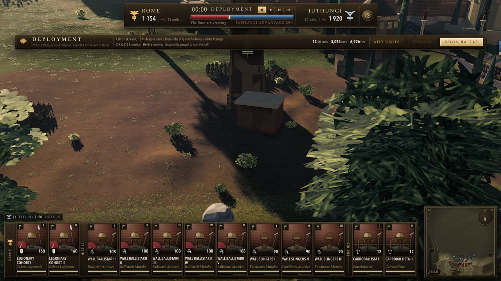 | ![The same phase framed on the Aurelian Wall: red brick curtain with merlons running the width of the frame, the twin drum towers of a gate at its centre with the road running out through it, gardens, cypresses, tombs and a rotunda inside the walls, unit banners standing along the parapet and on the ground, and the deployment strip reading "To hold the city: keep them under 60 men 14 m past the curtain, and never leave them a bay: 24 of them holding a stretch with nobody of ours standing on it for 20 s is the wall gone. A storm that makes no ground for 3 minutes is thrown back."](docs/images/releases/r6-opening-rome-after.jpg) |
  | The first frame of a siege as r5 opens it, on both maps. The *before* arm is a worktree pinned to r5's commit with this release's shooting instrument copied into it — same instrument, older source, which is the honest way round. | The same two frames on this release: nine bays legible on each, the gate bay's midpoint landing at **x 800.0 of 1600** on both maps, every on-screen crest below the plaque band, and the nearest solid to the eye 106 m and 110 m against 13.1 and 13.7 before. The objective on the second line is the other new thing in this release, seen from each side of the same wall. |

- **Three ways the cursor could not find men who were plainly on the screen**, all three found by
  playing the siege from the menu with a real mouse and none of them visible to a probe that clicks
  a unit's card. **Nothing on a parapet was clickable for the whole deployment phase** — the level a
  unit stands at is written only inside `fixedUpdate` and the paused deployment never runs one, so
  every unit read a stand height of zero, the elevated pick never armed, and **0 of 99 pixels
  selected a unit already on the wall, 0 of 18 a reserve cohort the player had just dropped onto bay
  21**. The ground pick then cost 5.4 m of depth at battle zoom, because a ray through a man's chest
  meets the terrain 1.75/tan 18° behind him — deeper than a tower party is: the fraction of a unit's
  own drawn crowd that selected it ran **0/77 for a tower party, 22/77 for a ram crew, 22/66 for a
  ladder party and 39/77 for a line cohort**. Both cases now test one plane at the men's own
  mid-body; where an order *goes* is untouched, which is the half an earlier attempt at this had to
  revert. And "on the wall" was a flag rather than a fact — a descent measured from the seat left
  **91 of 99 archers standing in the street with the flag still set**, so the next click read as a
  traverse and the hint said *"Along the wall"* over men in a city square.

- **A garrison was the one thing in the game you could not attack.** Over the levy's own men the
  cursor read *attack*, and the order that went out was *move*, to the parapet behind them. The wall
  order beating an attack is deliberate and stays; the cursor promising an attack the product was
  about to eat is not, so the enemy is yielded in the three cases where "the wall order" and "attack
  him" are not the same wish — his banner, Ctrl held, and both parties already on the same wall —
  and the drag hint names the override: *"Storm the wall here · Ctrl: attack Citizen Levy V"*.
  Pointing at a wall was barely better. Swept over one Carthage bay from a genuine field-side eye,
  **45 of 148 masonry pixels answered as a valid wall target — 30.4%**; the median field ray strikes
  0.42 m outside the band the simulation will answer for, which is why the storming branch was
  mostly unreachable. **133 of 148 now, 89.9%.** A click on a siege tower resolves to the bay it is
  leaning on, because from the field no camera can reach that masonry and the route the whole
  machine exists to provide could not be commanded by clicking the machine. The defender had the
  same defect from the other side: a cohort standing on Carthage's curtain and aiming two runs along
  hit a merlon at y 25.17 against a walk at 26.50, and got a plain move order for its trouble.

  

  A garrison cohort selected and offered a traverse along its own wall — the card at the left is the
  selection and the white lead and the ALONG THE WALL label are the order being previewed. The men
  crowding the walk in this frame are mostly Juthungi who have got up onto it; the claim here is the
  marker and the card, not the crowd.

- **`H` was the only order about a wall you could not take back, and it did nothing.** A traverse
  aimed two runs along the Aurelian Wall — across a construction gap no link bridges — had the
  cursor promising *"Along the wall"*, the order accepted, and **156 of 158 men stuck with the plan
  still open at age 3,657 ticks**. Nothing abandons a wall plan before its ten-minute timeout and
  garrison upkeep defers to a live plan, so the cohort could not even re-form where it stood. The
  two methods that countermand a wall plan were both public and neither had a caller anywhere in the
  tree; halt calls them now.

- **Four things handed over in the siege code, none of them polish.** A horse does not climb a
  ladder — enrolment asked whether a machine was within reach and never whether the unit could use
  one, and a hand run put **26 horsemen standing on the parapet**, with ballistae admitted too. A
  traverse accepted a run the wall does not reach: the runs are a chain, so a missing link anywhere
  between here and there is a gap the router refuses on every tick for every man, measured as **152
  of 152 men frozen with the plan open at age 3,656 and nothing said**. A descent stayed open for
  five minutes after it had finished — 152 ordered down, 143 on the terrain, 9 still on the stone,
  the plan open at **age 9,111** — and the unit stayed garrisoned throughout, so the next order read
  as a traverse and it could not be sent back up. **The obvious fix for that one is wrong and a probe
  said so in a line:** ending a stalled descent releases every man at once, which dropped the nine
  still on the parapet at **313 m/s** and cut a legitimate 106.8-second descent off at 20. So the
  question was fixed instead of the plan — "is this unit on the wall" is a question about its men,
  not about a record — and the descent probe went back to 13/13, 88 of 88 down, worst fall 2.27 m/s,
  with Carthage's determinism hash back at its recorded baseline exactly.

- **A siege tower was never spent.** `Spent` was declared and never assigned anywhere, so a machine
  went approach, docking, landing, boarding and stayed at boarding for the rest of the battle
  whether its file had crossed, died or never existed — four towers were reported frozen at boarding
  at t+904. The cost was not cosmetic: the gang that pushed it could never be given another order,
  the berth was never released, and escalade skips a spent tower but not a boarding one. A/B on an
  uncommanded assault: **four towers spent and four gangs freed by t+361, against four still
  boarding at t+962.** A storm order at a bay with nothing to climb was accepted and dropped in
  silence, and a storm order at a bay whose tower is still crossing the glacis *was* obeyed and
  looked dropped — the cohort walks out with the machine and stands in an open field for four
  minutes, which is correct and which nobody was telling the player. The cursor now reads *"Queue at
  the tower — it reaches bay 31 in 1 min 56 s"*.

- **The gatehouse carried merlons in stone and published a flat, solid block to the simulation.** A
  gate block had exactly one battlement field — the merlon *tops* — returned flat across its whole
  footprint, and both halves of that were wrong. The roof of the block and the cornice round it
  stand at the merlons' *feet*, so the surface a man is tested against over the gate stood **2.000 m
  too high on Rome and 2.100 m on Carthage** across 11 of the block's 11.9 m of depth, which is the
  merlon height exactly. And the merlon line came back solid: over the 24 m at the gate the
  collision model returned **one** distinct height where an ordinary 25 m of curtain twenty metres
  away returns two — while both builders lay a real crenellation on the crown in stone. There were
  no embrasures over the same ground either, on a plan-only test with no height term, which
  swallowed 22.25 m of Rome's *garrisonable* bay 19 and 22.5 m of Carthage's bay 32. Measured:
  embrasure-free run **36.25 → 11.00 m** on Rome and 40.25 → 10.25 on Carthage, the residual being a
  per-bay-boundary sliver that exists at every bay on the circuit, gate or not; **garrison stations
  within 40 m of the gate with no battlement over them 22/49 → 0 and 8/56 → 0**; and shots thrown
  away for want of a battlement **823 of 5,301 in four minutes → 0** on Rome, 72 → 30 on Carthage.
  Swept as station-to-station firing lines across the frontage, **Carthage's 2,832 straddling pairs
  stopped by the gatehouse go to 0** — its walk is continuous and the whole frontage opens. **Rome's
  1,512 do not move, and should not**: its walk steps 7.15 m across the gate, bay 19 at 35.75 against
  bay 21 at 42.90, so the ray passes six metres below the roof and is stopped by the gatehouse's own
  body, which is what a real gatehouse standing between two walks at different levels does. On
  Carthage's 180-second autoplay the garrison killed 253 against 239 and lost 922 shots to distant
  masonry against 1,171. The three crenellation literals in each builder are named constants now,
  read by both the stone and the record, so they cannot drift apart again. *The other half of this
  work — clipping the garrison's line of stations to real curtain — did not land; see the
  corrections below.*

- **Three things the siege told the player that were not true**, all found by playing it rather than
  by reading it. **The besieger's ADD UNITS palette was the defender's**: Rome plays both sides of an
  assault, and on Carthage the roster resolved through Rome's role on its *own* map, so an army with
  no wall was offered `ballistarii` and `wall-slingers` and none of the tower parties, ladder
  parties, ram crew, batteries or cavalry the pre-battle menu had just sold — and since the
  deployment refuses anything outside that list, **the entire siege train was unreachable in the one
  phase that exists to arrange it**. The deployment plaque told the attacker to "drop on the parapet
  to man the wall" when the only parapet in sight belongs to the enemy. And the defeat card was
  captioned in the winner's voice: a storm of Carthage that ended with fourteen of twenty Roman
  units broken and the army streaming off the field read *"Defeat — by rout, the enemy has quit the
  field"*. Four of the six end reasons name a side, and each now has a won, lost and drawn form.

- **The objective was on screen for one frame and then deleted itself**, because the deployment
  panel binds its refusal line to the first element of that class in document order and the new
  brief was emitted immediately above the real one. From outside it is indistinguishable from markup
  that was never written. Two smaller ones with it: the copy did not agree with its own counts — a
  live storm at t+103 read *"In the Streets · 1 of ours **are** past the curtain"*, and a siege
  spends real time at exactly one man through the breach and one blow on the gate — and a siege
  phase can legitimately go *backwards*, which the comment above the phase resolver denied. Measured
  on a defence of Rome, t+206 *"In the Streets"* and t+227 *"The Approach"*: the last man who had got
  inside was killed and the storm was re-forming. That is the right reading for a defender, who
  wants to know the city is clear again.

- **The dispatch card was 190 px down the screen and the plaque was too narrow for its own words.**
  Three faults at 1600×900, each measured off a real card rather than read off the markup. The roll
  of honour was below the fold — 992 px of content in a 610 px scroller with the honours beginning
  at y=553, so **one of ten rows was visible without scrolling**; the room the wall block needed was
  sideways, not downward, so the body is a wrapping row now and content falls to 795 px with **six of
  ten rows visible**. Four of the five siege phase headings wrapped to two lines, THE BREACH being
  the only one short enough to fit, which is why it read as one heading's problem: the centre column
  left the heading 141 px of its row against the 226 px the longest of them wants. And the card
  itself was off the bottom of the screen — its grid row was sized by the panel's unconstrained
  content at 1,228 px against a 900 px sheet, so a correctly clamped 846 px panel centred in 1,228
  put its top at y=190 and **its foot 136 px below the bottom of the screen, with the Dismiss button
  — deliberately kept outside the scroll so it can never be below the fold — off the screen
  entirely.**

  | before | after |
  |---|---|
  |  |  |
  | The same battle, same verdict, same figures — 09:06 on the field, 1 154 committed against 1 920. Everything below the fourth row of the wall block is off the screen. | The wall block and the roll of honour share one row, and Dismiss is on the screen. **This pair is not from the released commit:** both arms were shot from the interface workstream's own tree, after the fix they illustrate and before the siege-order branch merged, which is why the gate in both reads *Never struck*. They are our own render and a genuinely matched pair; the *before* arm cannot be re-derived without standing a third worktree up. |

### The men, close up

A run of soldier work from earlier in the week, none of which had shipped. Everything in this
section was graded on isolated model plates against a frequency probe, and **the pattern to look for
is the ratio falling while the mid bands rise** — that is added structure, and it is the one pattern
a blur cannot produce.

- **Cloth had no folds, no thread direction and no silhouette.** A tunic was a circular tube, so the
  outline of every man in the game was two straight lines. It now takes two harmonics of radial
  modulation with the true polar normal rather than the circular one, tapered along the sweep, on
  the tunic, the bracae and the loincloth — **at no vertex and no triangle**, with a Nyquist guard
  that drops the whole option below six segments so the crowd tier never sees it. The weave was
  `max(warp, weft)` in a height field, which differences to an isotropic normal: a weave that cannot
  tell you which way a thread runs is a *print* of a weave, and it is a slope now, each thread
  tilting the normal only across its own axis. And the creases were round blobs; they are 3:1 along
  the hang with a floored trough. Pooled ratio **1.393 → 1.311**, and on the one full-figure plate
  whose subject is mostly cloth, ratio −10.3% with the 4 px band up 2.0%.

- **The bow was a staircase of unrotated boxes, and it was strung backwards.** Each limb was three
  or five axis-aligned boxes stepped along a curve with **not one of them rotated to its own
  tangent**, so the stave was a flight of stairs with a corner at every joint and raising the step
  count could only make smaller stairs. Three more faults fell out of reading it against the pose it
  is socketed to: the recurve was dead code that fired exactly once at the finest tier and never at
  all below it; **the limbs bowed into the archer's face** rather than away, which is a braced bow
  the wrong way round; and the string floated **120 mm clear of both nocks** and was not even in the
  bow's plane, because the archery stance runs 26 degrees out of the man's facing. It is one
  continuous sweep now — a rigid riser, a working limb, and a straight 210 mm siyah, because a
  composite recurve is stiff-soft-stiff and the stiff parts are what make it recognisable. Costs 38
  triangles at the finest tier and **saves 126 vertices**, because ten boxes are 240 vertices and a
  swept stave is 96; the crowd tier is untouched and provably so, hashing bit-identical on all three
  factions.

- **A single 256-pixel tile was stretched over a whole shield board** — 379 texels per metre across
  a scutum and 236 along, the worst-sampled surface on the figure by a wide margin, which is what a
  round of critics had recorded as a black smear across a fifth of two plates. Both faces take
  integer repeats from the board's own size now, laid out so the seams land on duplicated vertex
  columns and **cost no triangle**. What had blocked it was that the hide tile painted two
  *board-scale* features into a *material* cell — a grip band across the middle and a stitched
  turn-over at all four edges — so tiling it twice grew a shield two grips and a seam. The grip is
  now a box that stands proud of the board and occludes, instead of a stripe that does not.

- **An 8 mm arrow shaft carried 250 texels of wood grain.** Texel density across one man ran
  **13.1×** — bare legs at 570 texels/m against a quiver at 7,470 — and almost all of the spread came
  from one primitive mapping a whole tile onto every face however small the face is. A box face now
  takes the share of the tile it physically covers, slid by a hash of its own position so five
  arrows in a quiver take five different pieces of the tile rather than five copies of its middle.
  Spread **13.1× → 7.3×**, quiver 7,470 → 347 texels/m, at **zero** cost in vertices or triangles.
  What is left is real material grain: a mail ring is 9 mm and an oak plank is 120.

- **Every man in the army had a hazard stripe round his soles.** A caliga sole took the *rope* tile,
  because rope is the palest cell in the sheet and a dark foot photographs as a blob — which worked
  only while one whole tile was crushed onto a 28 mm edge and averaged away by the mip ladder. The
  moment a box face took its physical share, rope's helical barber-pole came up at full contrast on
  every boot on the field. Sole to leather, wraps to wool. In the same pass the fold field came down
  from 3:1 to 2:1, because streaks running unbroken the whole length of a bracae leg photograph as
  varnished wood grain rather than as cloth.

- **Mail was eighteen identical rings on a perfect grid**, and scale armour fourteen identical
  plates on another. That is what printed mail looks like, and an exactly periodic lattice is also
  the one thing guaranteed to beat against the pixel grid into moiré at the range a cohort is
  legible from. A riveted hauberk is thousands of rings hammered shut one at a time: the gauges now
  run a tenth either way, the rows wander, some are galled bright where a scabbard rides and some
  are rusted, hashed off each cell's own coordinates modulo the lattice count so the tile still
  seams. No geometry, no draw, no vertex.

- **Skin was one hue times a value ramp, and the second-flattest cell in the sheet.** Mean
  tangent-space normal deflection **0.112**, behind only the animal hides and against mail's 0.792 —
  the pore field existed but arrived at strength 0.3, which is to say it arrived as nothing. Every
  texel of every man carried the identical chromaticity, where skin is translucent layers over blood
  that flush red where thin and go sallow where thick; and there was a hole in the octaves exactly
  where this deck's 2-8 px band sits. All three are fixed, with a Langer's-line crease network
  running along a limb rather than in every direction at once. Separately, twelve tiles had a region
  with **no roughness signal at all** — a flat clamp at 255 over 48.7% of the elephant hide, 43.0% of
  rope and 6.3% of the shield board — and every plateau measures 0.00% now.

- **The head had a nose and it was buried inside the skull.** Three blind graders independently
  reported flat facets with the features painted into the albedo. Half of that was the obvious
  reading — the nose was on the finest tier only — and the other half was that it did not read
  there either, because its depths had been measured against the origin rather than against the
  surface they stand on. The tip's absolute z was 25.8 mm, as the comment said; its *projection* past
  the skull's own revolve was **9.0 mm at the tip and −6.5 mm at the nasion**, so the bridge was
  inside the head and the nose emerged only over its bottom third with no dorsum to catch a
  terminator. Every ring moves out 10-12 mm. The face arc and the nose also drop a tier: **the
  middle tier begins at 45 m and a battle is watched from 45 m**, so "no face" was true of most of
  the army in most graded frames.

- **The standard was a second lighting rig, and it had drifted four ways.** Three graders named it
  the single most decisive tell in a blind round, in words that turn out to be literal rather than
  figurative: *"an emissive sticker in front of the frame rather than dyed wool under the same
  sun."* The cloth carried its own hand-written sun-plus-ambient term that nobody had updated when
  the real one changed. It **never received a shadow** — so a standard stood in full sun inside the
  shadow of the wall it was assaulting — **never cast one**, dropped the sun's *intensity* on the
  floor and was lit at full noon strength at every hour of the day, and took neither the environment
  nor aerial perspective. It is a standard material through a shader hook now and cannot drift
  again; what stays hand-written is what the standard model genuinely lacks, which is transmission
  through thin dyed wool and the fold field. The geometry was wrong in the way the graders described
  too — the whole top row was pinned, and no cloth hangs like that. A vexillum is tied to its bar at
  intervals and the fabric between the ties falls into a catenary, which is where a flag's vertical
  folds come from in the first place.

  | before — shot at r5 | after — r6 |
  |---|---|
  |  |  |
  | The vexillum as r5 draws it, at the hour and camera the after frame uses. | The same standard on this release. The two arms are ninety-two commits apart and the distant haze changed with them; **the claim is the cloth.** |

  One fault was caught by re-reading the diff rather than by looking at a frame, and it could not
  have been caught any other way: turning shadow casting on for the staff without a matching depth
  material would have been worse than leaving it off, because both factions' finials live in one
  geometry and only the *colour* shader collapses the one an instance is not — **every Roman aquila
  on the field would have laid a Germanic aurochs skull's shadow across its own signifer.**

- **The dead elephant read as a toppled table**, and every part of that was measured on the bones
  rather than on the animal. Its two upper legs finished 1.05 and 1.27 m in the air as rigid
  parallel columns while the right foreleg was 0.21 m and the whole right ear 0.35 m under the turf
  — none of it visible to the instrument the pose was authored against, because "the lowest bone
  sits at +0.009 m" is true and every leg in the rig is a half-metre cylinder *around* its bone.
  Skinning the real geometry over the clip reports the hide instead: lowest skinned vertex per limb
  **1.054 → 0.291**, 1.272 → 0.571, −0.213 → −0.005 and −0.345 → +0.077 m, and the worst point at any
  frame of the fall **−0.878 → −0.211 m**, which was the right hock ploughing through the ground
  while the pelvis was already a metre down. Three more with it: the caparison was five quads of
  ruled tent over a barrel that tapers, with two "girth ropes" that were flat plates 1.44 m wide
  driven straight through the animal, so all that was ever visible of a rope was the slivers where a
  flat plate leaves a round back; the chest bib was a rectangle, and a rectangle on an animal is a
  signboard; and the crew were thrown clear on a smoothstep, **which leaves the platform at zero
  velocity**, so for the first third of the throw a man hardly moved sideways while four tonnes
  rolled into him — deepest penetration **0.278 → 0.080 m**, against a measurement floor of 0.097 m,
  on the same arc to the same landing point on the same frame.

- Two smaller things a player will see. **Depth of field was reading a zoom scalar** rather than the
  orbit radius it is about, which is a faithful proxy for a player and not for anything else; and
  iron and bronze were too glossy to hold their own form — at the old roughness a bronze bowl's
  specular peak is 27 against a sun of 3, so the brightest pixels of a helmet clip to white, and a
  clipped pixel carries no form at all.

### Corrections to the record

- **I argued for scoping victory condition A, and I was wrong about it mattering.** The condition
  was genuinely unreachable by construction: it asked for `garrisonOnWall === 0`, and that is a sum
  over the whole circuit — 810 men in eight or nine blocks along **1,781 m** of Aurelian Wall, fifty
  bays of which forty-five are garrisonable. Across twelve seeded runs **the smallest it ever reached
  was 604**. Nothing came within six hundred men of a bar that reads as though it were about the
  fight in front of you, and one surviving Roman on a tower a mile away denied it for ever. Scoped to
  the ground the storm is actually standing on — a maximal block of consecutive wall runs, held when
  no defender is on it, and only counting if the garrison ever held it, so that leaning a ladder
  against a bay nobody was defending does not win a city — it is reachable, and demonstrated
  reachable at four wall units and below. **On the shipped order of battle it fires never**, because
  the storm's own runs never fall below 40 defenders and so no block is ever clear: across twelve
  seeds at 810 men the storm never cleared a bay. The outcome distribution is identical seed for
  seed, with end times matching to the second across all twelve runs. The ram was worth 2/12 → 6/12;
  the victory condition was worth nothing. It is still the right rule, and the honest ranking of the
  two is not the one I argued for.

- **The agent that fixed it caught its own version of the same bug**, which is the useful part. Its
  first cut also demanded the run *either side* of a lodgement be clear, on the sound-sounding
  reasoning that a run boundary is a fact about masonry rather than about the fight. That rule fired
  **nowhere** — not in the twelve seeded runs, and not in any of six garrisons swept from 810 men on
  the parapet down to 108, through configurations where the storm put 136, 141, 144, 161 and 203 men
  on the wall and won the battle four times by another route. The measurement that settled it:
  **Rome's garrison holds the bay it is given and does not counter-attack along the walkway.** The
  storm fights for bay 18 from t+251 with 25 men against 57, kills the last defender on it by t+297
  and then stands on it alone for fifty seconds — while **65 defenders on bay 19 hold at exactly 65
  and take not one casualty between t+251 and t+347.** "A defender within one bay" therefore
  measures nothing about contest; it demands the storm additionally destroy men who are not fighting
  it, which is annihilation again, and annihilation is precisely what was wrong with the original.

- **A phase heading in this release is effectively unreachable in normal play.** THE RAM AT THE GATE
  is returned only while nobody is inside, nobody is on the parapet, nobody is crossing, *and* the
  gate has taken a blow — and on both maps the escalade reaches the parapet long before the ram's
  first blow: **t+12 on Carthage and t+22 on Rome, against a first blow at t+104.** The plate above
  shows THE WALL REACHED with live counts because that is what a storm actually displays. The
  heading is correct and its ordering is deliberate — men on the parapet is further on than a ram
  having struck — but as a description of what a player will see, it is nearly dead.

- **The blind A/B against Rome II returned 84 of 84 across two rounds, and the instrument is the
  problem.** Three independent graders sorted all fourteen pairs correctly in round one, at
  confidence 5 on 41 of 42 calls, and named the same two faults with the deck itself, unprompted.
  *(This entry first said "42 of 42 across two rounds". A round is 3 graders × 14 pairs = 42 calls,
  so two rounds are 84. The wrong denominator came from the hand-over, not the graders.)*
  **A fourteen-pair deck drawn from a single engine is one trial, not fourteen**: a grader who cracks
  any pair gets the rest on palette and framing alone, so the accuracy reads 100% until the day it
  reads 50%, and nothing in between is information. Round two's render work — the standard, the
  nose, the cloth, the metals, the depth of field — measurably closed **six of eight of the deck's
  own statistics, the edge-hardness gap by 82%** — and moved the score not at all. Two of its fixes
  *were* confirmed blind by a grader told nothing about what had changed: aerial perspective and
  cloth. That is the result, and it should be read as a finding about the deck rather than as a
  verdict on the renderer.

  Three of the deck's leaks were closed on the way and are worth recording because none of them is
  about rendering. Summing PNG IDAT chunk lengths and picking the larger **identified our frame in
  11 of the 14 pairs** — compressed length measures pixel-scale detail and ours carries more of it —
  and because PNG is lossless, writing every frame at stored-block compression makes the stream's
  length a function of width and height alone: **3,457,311 bytes for every 1440×800 frame, ours and
  theirs, identical to the byte.** Three of the twenty-two official press plates turn out to be
  2.35:1 cinematic frames with hard black bars burned into a 16:9 file, and a deck containing one is
  sortable at a glance; the only reason that had never bitten is that none of the ten plates anyone
  had pointed the tool at happened to be one of the three. And the wordmark defence rested on a
  claim that one crop cleared every lockup on its own, which is false on the wider set in both
  directions — the invariant is the *conjunction* of the two crops, and it is now written down that
  way.

  One more, about our own camera rather than theirs. Round one's frames were high tactical grabs
  against ground-level press captures, and the cause was not that anyone chose a high camera: the
  rig derives boom, pitch and field of view from one zoom scalar, and then a ground-clearance guard
  refuses to let the eye sit closer to the ground than a curve that resolves to 7.2 m where the zoom
  asked for 2.8. True depression 25 degrees, against 3 to 8 on the reference plates. **A collision
  guard had been choosing our compositions**, for every plate this project has ever shot.

- **"1,180 idle warriors" is a figure I have quoted and it is wrong.** On the Rome assault it is
  **1,080 foot in six warbands** that are eligible to climb and never receive a storm order, through
  three independent structural locks and not one `canStorm` predicate. The 1,180 was the whole host
  minus the siege train; the extra hundred are riders, and cavalry is refused a ladder outright.

- **Rome's assault is winnable 2 of 12 and neither win was an assault.** Both came through men
  getting inside, and one fired at t+857 in a battle where nothing had stood on the parapet since
  t+219 and no ladder had been crossed since t+80. The census was suspected before the simulation
  was, and the census was right. Asked of the city's own movement test every 5 m along the whole
  circuit, **14 of the 356 samples do not block a 28 m segment driven straight through the wall
  line** — three bands, at x −550…−536, 372…390 and 404…426, which are bays 2, 28 and 29, whose build
  stage is *footing*. (That 356 is a count of five-metre samples and I have quoted it as a count of
  stations; the circuit carries **1,695** garrison stations.) The Aurelian circuit is a building site
  by design — **50 bays: 35 finished, 6 half-built, 5 with no parapet, 3 at footing and 1 gap, 45 of
  them garrisonable, with 41 tower passes and 9 stairs** — and a footing is a course of masonry at
  ground level, so the horse is not riding through stone. It is riding through the part that has not
  been built yet.
  That is a legitimate route into Rome, and it is the only one the AI ever finds.

- **Six of the code's own comments were found to be wrong while documenting the simulation**, and
  the one to know about is `Time.alpha`, documented as `[0,1)` and reaching exactly **5.0** whenever
  a frame's scaled delta exceeds the step ceiling — a 6 fps frame at 1× and a 41.7 ms frame at 4× —
  with no consumer clamping it, so soldiers are extrapolated five ticks ahead. Measured against the
  real clock over 5,000 frames per pacing. With it: the headcount comment says 3,784 Romans where it
  is 3,772, because the twelve-man scorpion battery is exempt from the unit-size multiplier; the
  crowd's hard cap is 4 where the comment beside it says three; a spatial-hash callback is promised
  a squared distance and passed a squared radius (inert — all nine call sites ignore it); the phase
  union listed its five phases in the opposite order to the one its own comment claimed; and the
  determinism report labels a divergence dump with the *first* diverging checkpoint while dumping it
  from pages advanced to the *last*.

- **An audit line that printed on every build could not have been true.** The harbour check reported
  a basin 97.7% clear of buildings with a quay freeboard of **−3.10 m**, which is not a freeboard, it
  is the bed: it sampled the middle of the basin, which the excavation digs to the bed by
  construction, three lines below a comment naming the landward quay belt as the right sample. The
  ground never moved. Only the instrument did.

- **The yaw was not why the wall ran off the side of the opening frame.** The previous pass fixed
  that shot correctly and explained it wrongly, which is the part somebody reads next time. There
  were two horizontal faults, they had opposite signs, and the one that got named was the smaller:
  correcting the yaw *on its own makes the framing worse*, by 55 px on Carthage and 38 on Rome. The
  frame was off by 211 px rather than 263 because the aim point and the yaw were quietly subtracting
  from one another.

- **The other half of the gatehouse work has never once run, and r6 does not fix it.** Rome's siege
  spine lays a garrison station every 0.86 m along every garrisonable bay, and **22 of bay 19's 36
  stations stand *inside* the gatehouse** — x 59.89 to 77.94, at a walk height of 35.75, which is
  6.574 m below the crown, on ground where the curtain was never built. Two workstreams split that
  cleanly between them: the city published the block's footprint, and the siege clipped its spine
  against it. Both commits are accurate about their own half and both landed. **The seam between
  them was never typed.** The siege declares the accessor as returning a half-width, a half-depth
  and a rotation; the city returns a normal, a half-run and a half-depth under different names — so
  the inside-the-block test reads `undefined` for every field it wants and answers *false* for every
  point on the circuit, and the accessor is reached through an `as unknown as`, which is precisely
  the cast that stops the compiler from saying so. Measured at the released commit: **22 stations
  inside the footprint, 0 clipped.** The commit that added the clip says it is "inert until that
  accessor lands"; the accessor had landed forty-eight minutes earlier, under other names. It is not
  a regression — it was inert before this release and is inert after it, and the battlement fix
  above is what stopped those men's shots being thrown away — but nothing in r6 clips them, and this
  entry exists so that nobody reads the two commit messages together and concludes otherwise.

- **Two dispose leaks were fixed in a method the application never calls.** The sky dome and the
  terrain mesh were each freed and left attached to the scene — eight init/dispose cycles grew the
  scene from 43 children to 50 while the renderer's geometry count *fell*, which is exactly the
  signature of a resource freed with its owner still in the graph — along with the fog and the
  environment map, the latter a live pointer to a destroyed GPU object. All of it is correct now and
  none of it was ever reachable: **`Engine.dispose()` has no caller anywhere in `src` or `tools`**,
  because map switching goes through a page reload. That the method is dead code is the larger
  finding, and it is recorded rather than acted on.

---

## r5 — the garrison stops shooting itself, and Carthage's posterns become doors

**18 August 2026** · commit [`850843a`](https://github.com/eoinest/Total-Claude/commit/850843a) ·
deployment `total-claude-dmr7bx7fq`

A correctness release, and the one in which several confident diagnoses turned out to be wrong.
Rome's garrison had been putting nearly a third of its shots into its own men and being credited
with more kills than the enemy had bodies. Carthage's posterns were arches painted on solid stone.
A middle-drag panned by however long the frame took rather than by how far the cursor moved. And
the war elephant, which stopped vanishing in r4, stopped pirouetting while it died.

### New

- **The model viewer draws the elephant.** The owner: *"the elephants do not render in the model
  viewer — instead it's just a horse rider."* That is literally what it did, and the readout
  underneath said so — *"soldier mesh + horse mesh"* — beside a comment claiming the fallback would
  stand "until an elephant mesh exists". It had existed for some time. `pushManOrRider` branched on
  `isCavalry`, which is true of `war-elephants` because the roster classes the unit
  **`heavy-cavalry`**: the *simulation* wants a four-tonne animal pushed, shoved and killed like a
  mount, and one entry in the soldier pool is one whole elephant — the beast, its mahout and the
  three men in the tower. `mountKind` is what decides the geometry, and `isElephantUnit` now asks
  it.

  | before — shot at r4 | after — shot at r5 |
  |---|---|
  |  |  |
  | `war-elephants` selected in r4: a man on a horse. | The same selection in r5. |

  The animal comes with **alive / mid-death / carcass** as one button each — the carcass is the
  death clip held at its last frame, which is the only elephant pose with an audience measured in
  minutes — its own six clips on its own playhead, the crew placed off the *animated* howdah and
  mahout tracks and thrown clear by the same recipe the game uses, and the 31-bone rig on the
  skeleton overlay. It is one tier: **one draw call, 2,993 triangles, no LOD chain and no
  impostor.** The forward axis was measured rather than assumed, which is the trap this project's
  plate framing has fallen into three times: the barding centroid sits at Z **+1.22 m** against the
  hide's +0.39 and the tower's +0.09, and a four-azimuth sweep of the soloed barding reads
  **53,984 px at azimuth 0 against 31,007 at π**.

- **The isolated-model deck can finally be lit by the lighting the game ships.** Measured off
  `gl.getShaderSource` over every program three had linked, per preset: `studio` 12 fragment
  programs, `field` 15, and **`tcShadowGeom` in none of them**; the new `battle` rig, 28 programs
  with **6**. So every isolated-model plate this project has ever graded — the deck that found the
  inside-out normals, the culled box faces and the reversed shield boss inside an hour — was lit by
  a hand-rolled directional key, a hemisphere and a warm bounce through a fixed 3×3 PCF from one
  non-cascaded sun, standing in for a battle that uses a blocker-search soft shadow across four
  cascades under a physically derived sky. `studio` and `field` are untouched and stay, because
  every archived plate was shot under one of them. An hour slider from 04:00 to 21:00 comes with
  the sky, which is the single most useful knob a lighting review can have and the deck has never
  had one.

- **A changelog, and the procedure that keeps it true.** The owner: *"can you start publishing a
  changelog each time you publish a new version to github."* This file, backfilled to r1, with each
  release matched to its deployment by recomputing the SHA-1 of every tracked file's bytes and
  comparing it against the digests Vercel holds — 434/434, 475/475, 504/504 and 520/520, each
  commit matching only its own deployment, the nearest neighbour scoring 96.2%. And
  [`docs/RELEASING.md`](docs/RELEASING.md), whose ordering is its whole point: pin to an explicit
  commit in a detached worktree, verify by bundle hash rather than status code — a failed Vercel
  build leaves the previous deployment live and still returns 200 — boot all three maps and confirm
  the simulation clock advances, and only then tag and publish. **This release is the first one cut
  by it.**

### Fixed

- **Rome's garrison was shooting itself in the back, and being paid for it.** The report was "73% of
  a garrison's hits are on its own men". That is one sentence and at least three separate faults,
  and the pooled figure is not the one to act on or even to quote: measured per battle, the friendly
  share of every hit on a man was **30.8% on the Rome assault, 63.9% on Carthage and 41.9% in the
  field**. What separates the three faults is the distance from the release point to the hit, so
  every shot now carries where it left from and every friendly casualty is binned by it. **89% of
  them happened within 0.9 m of the muzzle, 0.067 s into flight, on a man in the shooter's own
  rank** — the man standing next to him. The arming guard was `0.06` *seconds*, and a second is not
  a distance: for a ballista bolt at full draw that is 4.7 m, and for the same bolt after the
  parapet solve re-draws it to 6 m/s to clear a merlon at ten paces it is **0.20 m**.

  The ablation is the interesting part, because the obvious fix on its own makes the battle worse:

  | | friendly kills / 4 min | enemy killed |
  |---|---|---|
  | before | 155 | 221 |
  | arming distance alone (1.3 m) | **360** | — |
  | with the lane test fixed | **26** | **539** |

  Arming by distance removes the near-muzzle absorption, so the shaft flies on and takes the man in
  *front* at two metres — and a hit in the back is far more lethal than one in the shoulder
  (`sameUnitAhead` 26 → 701). The fix is the lane test: it stepped at 1.5 m over ranks 0.86 m apart,
  so a man could stand in two thirds of the lane and never be looked at; it ran *before* the
  ballistic solve, against a trajectory nothing flies; and it modelled the lane as a straight ray
  when the shots that hit their own front rank leave at 5-13 m/s and fall 0.38 m over the 1.44 m to
  the second rank. It is now one swept query on the parabola the shot is actually about to fly.
  A unit firing at will also stopped shooting over its own line into a melee — in one 30 s slice,
  **766 of 788 friendly hits were arrows arriving 12 m or more out on a *different* friendly unit**
  — and both halves of that condition are load-bearing, because refusing every melee-locked target
  cost 69 enemy dead to save 3 of our own. An ordered volley still goes in.

  And nobody is credited with shooting his own side any more. **Rome was credited 536 kills over
  four minutes in which its enemy lost 446** — more kills than there were bodies, which is how
  "132 kills while 13 attackers die" happens. After: 597 credited against 661 losses on Rome, 403
  against 403 on Carthage.

  | friendly / enemy kills per minute | before | after |
  |---|---|---|
  | Rome assault | 38.8 / 68.3 | **4.7 / 130.8** |
  | Carthage assault | 19.6 / 21.1 | **3.8 / 42.1** |
  | Campus Martius | 6.0 / 39.4 | **3.7 / 51.8** |

  Friendly share of every hit on a man: Rome **30.8 → 3.6%**, Carthage 63.9 → 19.3%, field
  41.9 → 21.9%. Missiles still hit friendlies, and are meant to.

  *No picture. Which side an arrow came from is not a property of any pixel, and a frame of a
  garrison shooting cannot distinguish the fixed case from the broken one.*

- **Carthage's posterns and gates were drawn, not cut.** r4 stopped the simulation walking columns
  of men through stone by refusing the passage; this release cuts the stone, which is what the wall
  was drawn as having all along. Eight posterns were published as already-open gates, so the city
  duly cut a carriageway through its collision surface for each — but the builder only set a pierced
  arch *panel* into each face and never touched the curtain's own body. Measured with a ray against
  the baked chunks, a postern stopped one at **8.03-8.10 m** — the cityward face — at every height
  from 0.8 to 2.4 m and every lateral offset, and the Porta Byrsae stopped one at **8.4 m** with the
  gate leaves excluded from the test. No man-tick counter in this repo could see it, because they
  all grade men against the obstacle set and the obstacle set agreed with itself.

  | before — shot at r4 | after — shot at r5 |
  |---|---|
  | ![Square on to a postern in the outer face of Carthage's main wall: coursed ashlar filling the frame with a square tower at the left, a chamfered plinth course along the bottom and a row of dark slots under the parapet at the top — and in the middle of the wall an arch about six metres wide drawn as a slightly raised ring with a straight jamb line dropping from each springing, with the wall's own coursing running straight through the middle of it, course for course, at the same brightness, and no opening, no shadow and no vault behind it](docs/images/releases/r4-postern-solid.jpg) |  |
  | The arch as r4 ships it: a relief on solid wall. Behind it the collision raster had a 6 m carriageway. | The same recipe on this release. The passage is stone that is actually gone. |

  The passage is now a single `WallCut` hung on the bay and read by the three things that have to
  agree about it — the stone the main bay lays, the mouth set into the hole, and the stretch of
  gallery that stands down beside it. Two faults were found underneath it and both are fixed:
  **posterns moved from `% 8 === 5` to `% 8 === 6`**, because every `% 8 === 5` bay is also
  `% 4 === 1`, which is the wall-walk ramp's own cadence, so five of them were opening their
  cityward mouth into the side of a 3.4 m masonry ramp; and **the two gate leaves stopped 30 mm
  short of the centreline apiece**, so a 60 mm slot ran down the middle of a shut gate and a ray
  went straight through it. `getUnpiercedGates()` is empty on both circuits and the assertion that
  used to guard this has retired itself. Measured on the deployed tree: **`probe-carthage-wall`
  46/46**, 69 rays cast through the mouths and the carriageway against the drawn stone, no solid
  mouths and no unpierced gates.

- **A middle-drag panned by the clock, not by the cursor.** The drag folded the pointer delta into
  the same accumulator as WASD and the screen edge, normalised that to unit length and then
  multiplied by the frame time — and at the default zoom the normalisation is reached at **1.2 px of
  travel per frame**, so every real drag saturated, the cursor delta was discarded outright, and the
  pan came out as *rate × elapsed time*. The same gesture moved the world by however long the frame
  happened to take, which the new adaptive-quality controller deliberately varies.

  | one 300 px drag over 12 frames, frame duration swept 144 fps → 15 fps | distance | s.d. | max/min |
  |---|---|---|---|
  | before | 16.67 … 160.07 m | 48.58 | 9.60 |
  | after | 19.22 m in every row | **0.00** | **1.00** |

  Held instead at a constant 400 ms of elapsed time with the frame rate swept 15-120, the old code
  returned **80.04 m in all six rows with a standard deviation of exactly 0** — which is the proof
  that it was integrating the clock and had stopped reading the cursor at all. The drag is now a
  difference of two ground points, which telescopes, so twelve frames of 25 px and forty-eight of
  6.25 px land in the same place. Cursor-to-ground tracking error over that 300 px, re-projecting
  the world point that was under the cursor when the drag began: horizontal **25.9 → 6.5 px**,
  vertical **142.2 → 8.9 px**. Two more things fell out of the same block: the vertical axis was
  inverted against the horizontal one, so the camera went backwards as the cursor came down; and the
  drag no longer takes the shift-key speed multiplier, because a 1:1 gesture that moves 2.4× the
  cursor is not 1:1. Keyboard and edge pan are rate gestures, keep the frame time and the diagonal
  normalisation that stops W+D covering `panRate × √2`, and measure **100.05 m and 78.61 m unchanged
  at every frame rate**, s.d. 0 in both arms.

  *No picture. A drag is a gesture over twelve frames; a still frame of the end of it looks the same
  whichever way it got there.*

- **A dying elephant pirouetted 180 degrees, and its crew were thrown under it.** r4 put the animal
  back in the instance buffer; what was left was that the thing now visible turned on the spot while
  it died. The renderer turns a man with no ragdoll pose toward his own death direction, because a
  man's death clip drops him one fixed way and something has to aim it — and an elephant is exempt
  from the ragdoll *by design*, which is the whole of the r4 fix, so it took that branch too. Killed
  from dead astern, the drawn heading **snapped a full 180 degrees on the frame of the killing
  blow**, jumped back to 45.6 degrees when the playhead was zeroed, and swung round to 180 again
  over 0.6 s. Four tonnes pirouetting while it collapses is a stumble, not a death.

  It was three faults rather than one, because three other things are derived from that heading: the
  fall direction is baked into the clip, so turning the animal turns which way it goes down; the
  capsule the living are pushed out of is built on the simulation's facing, which the render turn
  never touched, so the body men avoid was drawn at up to 180 degrees to the body they can see; and
  the crew's landing side is computed off the same heading and **was already backwards**, so the two
  errors cancelled — for a blow from dead ahead or astern, and only by accident. Which side the
  animal lies on is now a measurement rather than a reading of a comment: run the death clip's own
  forward kinematics and at the last frame the right ear, right foreshoulder and right back hip
  finish at y **0.30 / 0.20 / 0.41** against their left-side partners at **1.18 / 1.35 / 1.52**. It
  lies on its right, the tower goes down with it, and a man thrown out of the tower goes that way
  too — now landing at **−2.5 to −3.2 m** to the side, four of four, lying flat 0.13-0.16 m above the
  animal's own ground height. The settled root sink went 1.32 → **1.26 m** from the same kinematics,
  which puts the barrel at 0.94 against a 0.95 target and the lowest bone in the animal at
  **+0.009 m** — nothing under the ground at all.

- **An ala rode straight through a dead elephant.** The carcass pushes the living out of a
  4.7 × 2.6 m capsule, and photographed with a cavalry unit ordered over a body it did not work: the
  squadron settled with riders **1.816 m inside the animal**. Two independent causes, both
  structural. **A horse is not a man, and here that is a shape and not a mass** — the crowd solver
  carries no per-man radius at all, one diameter for everybody, with a rider distinguished only by
  an inverse mass; that is the right model for men shoving each other, where the question is who
  gives way, and the wrong one against a body on the ground, where the question is how wide the
  thing is. A cavalryman is a 2.4 m horse drawn around a point the solver treats as 0.42 m. And
  **the one immovable thing in the tick was served last**: the carcass pass ran at the end of crowd
  resolution and shared its separation budget, so a man in a dense block had already spent the whole
  0.22 m on his neighbours and the correction was dropped entirely — which is exactly the case of a
  formed squadron whose slots happen to lie on a body. A neighbour can be leaned on; a dead elephant
  cannot. Deepest overlap of a rider's own body with the animal's flank **1.816 → 0.224 m**, and of
  a foot soldier's **0.026 m**, with at most 11 of 320 touching at once.

  

  A squadron ordered straight over the body. What the frame shows is the block opening around the
  carcass and closing again past it. **The "before" here is a number and not a picture** — the
  1.816 m of overlap above was measured, and the frame that went with it was in a screenshot
  directory that no longer exists.

  The whole elephant tier costs **5 draw calls — 1 colour plus 4 shadow cascades — at every camera,
  whether the frame holds one animal or thirty-two and whether they are alive or dead**, so a
  carcass costs nothing. With 32 carcasses on the field at 8,428 men the whole fixed tick measures a
  best block of 3.37 ms against a 4 ms budget, and the carcass pass itself measures −0.035 to
  +0.067 ms, which is inside the noise on either side of zero.

- **A bow is not a weapon at four metres.** A cavalry-versus-archers matchup inverted when the
  friendly-fire fix above let the rear ranks' arrows through, and the diagnosis handed over was that
  the archers were overtuned behind a bug. They are not — see the corrections below. What actually
  happened is that **a hundred archers with a fifty-horse wedge standing in them are not fighting by
  either test the volley machine had**: the wedge presents a tip, five or six men have an opponent,
  the engaged fraction reads 0.05 and the contact lock never sets. So the unit volleyed on with the
  enemy at **1.7 m** — 55 hits and six dead riders in one second, from arrows the lofted solve draws
  to **4.6 m/s** over a two-metre gap and which do full listed damage, because damage is a roster
  number and not a function of speed. Before the friendly-fire fix those arrows were eaten by the
  archers' own front rank at the muzzle, which is why the case read right while being wrong.
  A formation now stops volleying inside **7 m** of an enemy front — not a new number, it is the one
  the pilum volley already used — measured on the front-rank segments, so shooting into the backs of
  a broken enemy is untouched and a garrison shooting down at besiegers is untouched. Leaving the
  volley machine now clears the aim *pose* as well, because the only way out used to be the contact
  lock, on the same tick melee starts, which left a hundred men playing a throw all the way through
  a charge. `cav-vs-archers` **timeout → B at 70 s**, horse losses **24% → 2%**.

- **A skirmisher gave ground to something that outranged him.** Skirmish mode is on by default on
  every skirmisher — the unit's own state summary says "the two toggles start engaged" — and the
  behaviour gave ground to *anything* inside 30 m. Numidian cavalry ordered to attack archers closed
  to 32.9 m, were pushed back to **44.7 m** — the fallback distance times 0.85, exactly — and stood
  there for sixty seconds losing **28 of 54** to a 165 m bow without a man reaching a man. Backing
  off from a swordsman is the whole trade; backing off from 165 m of reach buys him another
  half-minute of shooting. `numidian-vs-archers` **A 78 s → B 111 s**, horse losses **52% → 6%**.
  Nothing in the roster moved for either case.

- **`flyTo` was the last entry point still parking the camera focus at sea level.** Its sibling was
  fixed in r1; this one still set the focus to y = 0 and let the next frame re-derive it from the
  terrain. It is the smaller fault of the two — there is no swoop, only a window in which the focus
  reads as sea level — and it has **no caller anywhere in the source, the tools, the viewer or the
  documentation**, which is exactly why it was worth closing before one exists.

- **The viewer's copy of the tone-and-grade shader is gone, not merely corrected.** It carried a
  hand-copied mirror of the post chain's two shader bodies and the copy had drifted: of the five
  uniforms they shared, film grain read **0.006** in the shipping chain and **0.016** in the mirror
  — and 0.016 is the level measured to leave **0.00% of a plate reading as a smooth gradient**
  against a Rome II reference of 7.09%, which a blind grader named as its single strongest scalar
  without knowing what it was looking at. The numbers were corrected by hand in an earlier pass and
  the mirror was left in place, which is the wrong fix: a copy that can drift eventually does, and
  nothing in the type system was ever going to notice. The shipping chain now exports both shader
  bodies, two uniform factories and the sample count, and the viewer imports them. One divergence
  survives on purpose and is documented at both ends — exposure is pinned at 1 against the shipping
  chain's sky-driven 1.42-5.1 — and it needs a sky to close.

### Corrections to the record

- **No archer stat was ever wrong, and the horse was never losing men on the way in.** The handover
  said a cavalry-versus-archers inversion meant the *sagittarii* were overtuned. Sliced band by band
  over the ten metres the horse is crossing, the charge arrives having lost **2 of 50 — the 4% the
  case is documented to produce** — both before the friendly-fire fix and after it. Three hundred
  arrows over 150 m of open ground buy one dead rider. Everything the archers gained happens *after*
  contact, and a nerf would have been tuning the one number in the case that was already right.
- **The 43% javelin refusal on Carthage is not a height fault and is not 43%.** The range bound
  genuinely was a level-ground figure compared against a horizontal distance, and it is now the
  launch solve's own discriminant envelope asked at the real height — but **the fix is measured
  inert**: attempts and refusals are 3,107 and 550 on both arms, and **no shot in 6,400 leaves
  without a ballistic root**, because every weapon's roster range is far inside its physical reach
  even at the 14.7 m Carthage's garrison stands above the ditch. A 24 m/s javelin's ceiling is
  29.4 m against a 13.4 m parapet, so "the discriminant goes negative and it fires at 45 degrees
  into the wall" cannot happen here. Sliced into eight thirty-second windows the refusal rate runs
  40.5 / 47.1 / 21.5 / 31.4 / 5.4 / 1.1 / 0 / 0% and pools to **17.7%**; **448 of the 550 refusals
  are more than twelve metres *below* the muzzle**, with 279 inside 1.1× of the bound and 211 more
  inside 1.25×. They are the garrison throwing down at men just past a horizontal bound at the
  moment a unit acquires a formation whose centre is at the edge of its range, and a refused shot
  costs no ammunition. It is a hold, not a fault.
- **Melee has never credited a kill to the wrong side, and that is now measured rather than
  argued.** Wrapping the damage entry point in the page over the Rome assault, the Carthage assault
  and the Campus Martius — 662 seconds — records **2,781 lethal blows, 1,889 of them melee, and not
  one same-faction credit**; the only uncredited deaths are the 46 the missile path deliberately
  gives to nobody. Kills against bodies: Rome 618/699 and 589/612, Carthage 294/309 and 491/493.
  The refusal is enforced at source now, with a counter, so it stays checkable rather than folklore.
- **Never compare two whole-suite runs of the matchup harness.** Run case by case with the two arms
  alternating in one session, **20 of the 22 cases come back byte-identical** across a real change —
  same winner, same second, same losses, same melee peak and mean. Run as two whole suites an hour
  apart at different machine loads and **four cases flip winner on an unchanged tree**, all four
  near-even by construction, because the winner is whichever side breaks first and a few extra
  frames between round-trips decide it. The documented ±8% is not a tolerance band; it is that,
  arriving as a discrete outcome.
- **Every isolated-model plate this project has graded was lit by something the game does not
  ship** — see the battle rig above. The deck that found the inside-out normals, the culled box
  faces and the reversed shield boss was right about all three; the finding is that its *light* was
  never the product's, and shadow-, roughness- or metal-dependent calls made on that deck should be
  re-read with that in mind.
- **A unit class is a simulation fact and a render path is not derivable from it.** The horse the
  viewer drew where the elephant should be came straight from `isCavalry`, which is true of
  `war-elephants` for good simulation reasons. Anything else keyed off that predicate should be
  read again.
- Two entries in the working notes that said "still open" were not: the viewer had been given the
  real lighting system, and the mirrored shader had been deleted. A stale "still not done" is worse
  than no note, because the next person spends an hour re-deriving a map that has already been
  walked.

---

## r4 — the frame stops hitching, and there is a way through every tower

**7 August 2026** · commit [`0a42909`](https://github.com/eoinest/Total-Claude/commit/0a42909) ·
deployment `total-claude-ll0g412dr`

A performance and siege-traversal release. The stutter people were feeling turned out not to be the
game being slow, men can finally walk past a wall tower, and archers on the parapet stopped shooting
into their own battlements.

### New

- **A doorway through every tower.** The owner: *"soldiers cannot walk past the towers."* Around is
  not available and the arithmetic says so — Rome's tower is 7.6 m along the wall and 9.5 m deep on
  a 6.0 m curtain, Carthage's 11.0 m and 14.6 m deep, and both are flush with the inner face by
  construction. So the walk goes *through*, which is what a mural tower has a chamber for.
  **Carthage had no opening at all**: `buildPunicTower` took a `walkY` argument and ended
  `void walkY;` — one solid 20 m prism, thirty-one of them, clear lane **0.00 m at every single
  tower**. Rome's opening was a stale constant sized for a 3.5 m curtain that had been 6.0 m for two
  workstreams, and the path walked men along the cityward lip 1.36 m past the far jamb: inside
  masonry at 42 of Rome's 42 walkable towers and 31 of 31 on Carthage.

  | | before | after |
  |---|---|---|
  | Rome, clear lane | 1.59 m median | **3.22 m median, 2.40 m worst** |
  | Carthage, clear lane | 0.00 m at all 31 | **5.72 m median, 5.54 m worst** |
  | headroom over the path | — | 2.0 m (Rome) / 2.2 m (Carthage) |
  | path inside masonry | 42/42 and 31/31 | **0/25 and 0/31** |

  | before | after |
  |---|---|
  | 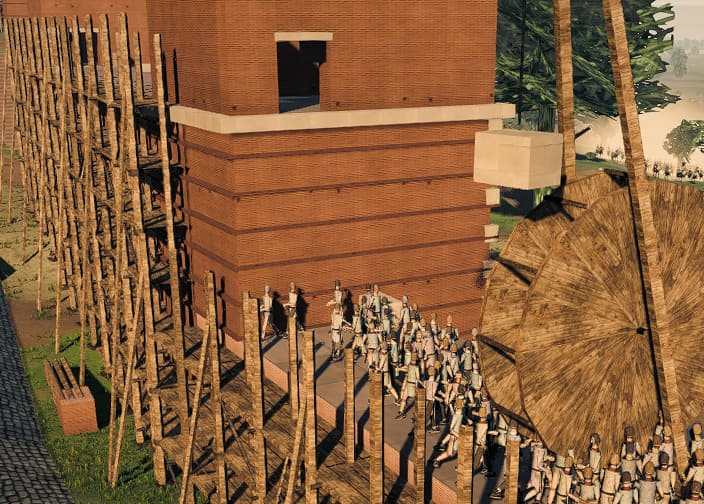 | 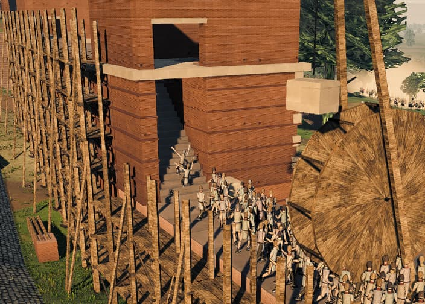 |
  | The same tower at the same camera, one arm without the cut. The face is unbroken and the file stops at it. | With the cut: the chamber is open at walk level and the men go into it. |

  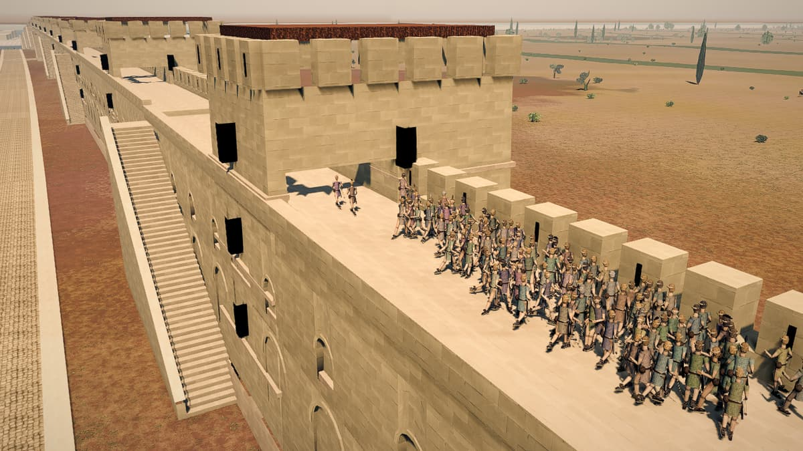

  Carthage's parapet after the cut — where `buildPunicTower` had ended `void walkY;` and all
  thirty-one towers were one solid prism.

- **Quality adapts to your machine, not to a guess about your machine.** The old system was four
  fixed presets whose only resolution lever was `min(devicePixelRatio, tier.maxPixelRatio)` — on a
  non-retina laptop that resolved to 1.0 at every tier and did nothing at all, and a machine that
  could not hold 60 fps simply never did. Now a 90-frame p90 of the render half of the frame moves
  one pressure scalar: pressure 0 is exactly the tier you picked, pressure 1 is that tier's floor.
  Ultra on a weak machine is a slow ultra, not a silent demotion to low.
- **Anyone may climb a ladder, and a siege tower goes where it is sent.** Ascent from the storming
  side did not exist — a right-click on an enemy parapet was read, understood and discarded — and
  only the party that raised a machine could climb it, so a cohort standing at the foot of a ladder
  its own army had planted could not set a boot on it.

### Fixed

- **The game hitched, and it was not because it was slow.** On an idle box Carthage at ultra runs at
  a median frame time of **2.60 ms** (p99 7.00). Over 2,299 frames of the heaviest scenario in the
  game, **exactly four frames missed the 16.7 ms budget, all four linked a shader program, and there
  were exactly four link frames** — no false positives, no misses. three.js links a program the
  first frame a material is actually drawn, and nothing in the tree called `compile` or
  `compileAsync`; on ANGLE-over-Metal that link is a synchronous 40-290 ms on the main thread. It is
  triggered by the camera bringing something into view for the first time rather than by the
  fighting getting heavy, and the program count was still climbing at t+88 s, so a player who panned
  somewhere new twenty minutes in still paid. It is also amplified: a 151 ms stall fills the
  fixed-timestep accumulator, so the next frame fires all five ticks and costs another 30-38 ms —
  one link is felt as two bad frames. Programs are now linked on the loading screen. Carthage, 24 s
  of hard panning per arm: **programs linked during play 22 → 5, worst frame of the session
  583.7 → 73.0 ms.** It costs 0.3-2.8 s of load, which is why the loader now shows a *shaders*
  step rather than appearing to hang at 100%. Rome gains much less (worst frame 588 → 553 ms)
  because it links 27 programs against Carthage's 44, and that is reported rather than explained.
- **A man on the wall now shoots through the embrasure instead of into his own merlon.** The player:
  *"the soldiers on the walls cannot throw spears / shoot over the edge of the wall. It gets stuck on
  the little pieces of cover facing the enemies."* He named the object. Rome's parapet is 1.7 m of
  merlon on 0.95 m of gap, so **64% of the run is tooth**, and a man loosing from wherever he
  happened to stand shot his own battlement about two thirds of the time — *inside* the stone, not
  grazing it. The front rank stands 1.32 m in from the outer face and releases 0.60 m below the
  crest, so even at the lofted angle the shaft is still under the merlon's top when it reaches the
  far side of the tooth; clearing it over the top would need 55 degrees, and elevation alone could
  never have fixed it. The front rank now looses from the mouth of a gap, which is what a wall has
  teeth for; a rear rank, who cannot reach one, gets an elevation floor that clears the merlon's
  inner top edge. Incoming fire still stops on the crest — the player ruled pass-through out, and
  every field battle is byte-identical because the floor is `-Infinity` for anyone not on a parapet.

  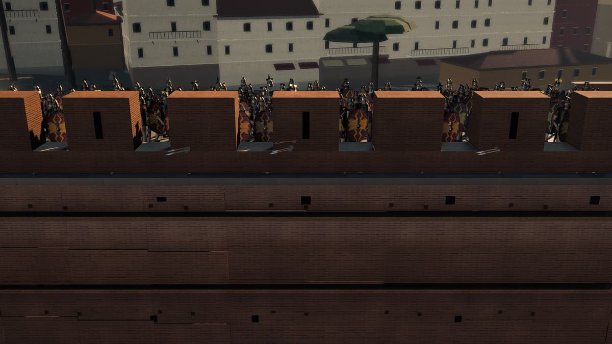

  The front rank in the mouths of the gaps, which is what a wall has teeth for.
- **The collision model's battlement was never the one that was built.** The model restated the
  crenellation as merlons on a fixed period starting at t = 0; the builder fits a whole number of
  merlons to the run and rescales, then centres each one in its own step. Rome's built step is
  2.7308 m against a nominal 2.65, with a half-gap lead-in, so the model drifted 0.08 m per period
  and was a whole merlon out of register by the far end of a bay — agreeing with the actual stone on
  **36% of Rome's parapet, worse than a random phase**. Arrows were stopping in mid-air over
  embrasures and passing through solid merlons.
- **The first tick of every battle deleted nine wall stairs from the collision set.** `Siege.armGate`
  deliberately toggles the gate open-then-shut on tick 1, and each toggle re-cut the wall obstacles —
  re-emitting only the boxes derived from the curtain, and silently dropping everything else marked
  as wall. The stairs are marked as wall. Rome went from 56 wall boxes and 9 stair boxes to 47 and
  **0**, Carthage from 160 and 13 to 147 and **0**, *before a man had moved* — nine flights on Rome
  and thirteen on Carthage, 14.2-20.4 m of masonry apiece and the longest solids in the city,
  non-solid for the rest of every battle. On Carthage it was worse than the stairs: the stair box was
  the only thing standing across seven of the eight postern gaps, so losing it opened seven 6.2 m
  holes in a wall that is drawn solid.
- **Eight posterns were holes in Carthage's collision surface and in nothing else.** The player:
  *"it appears that units can just pass through the walls."* Carthage publishes eight posterns as
  already-open gates, and the city cut a carriageway through the collision raster for each — but the
  builder only set a pierced arch *panel* into each face and never cut the wall's own skins. The
  passage is now refused where the stone is solid.

  

  Postern-29 as r4 ships it, in raking light. The arch is a relief on a solid wall — and the
  collision raster had a 6 m carriageway cut through it.
- **A war elephant left the instance buffer on the tick it died.** The owner: *"when they die they
  just disappear"* — and that is exactly what the buffer said. Elephant instances went 16 → 0 and the
  mesh invisible on the first frame after the killing blow, taking 64 soldier instances (four crew
  apiece) with them, with no recovery for the rest of the battle.

  | alive | t+260 s |
  |---|---|
  | 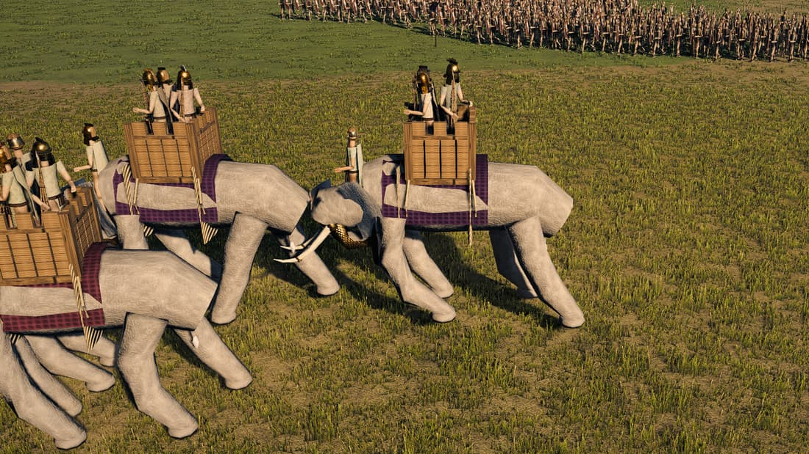 | 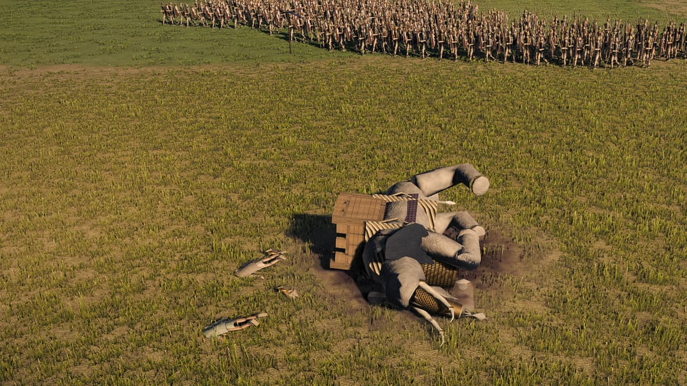 |
  | Four elephants under way, four crew apiece in the towers. | The same animal after the killing blow. It used to leave the instance buffer on that tick, crew and all. |
- **A broken party at the head of a ladder blocked everyone behind it.** The muster layout and the
  admission test used different rules about who belongs in a boarding file, so a routed escalade
  party went on holding the first fifteen rows at the foot of its own ladders while refusing to climb
  them, and the cohort the player had sent was laid out behind it — **14.6 m from a mouth with a
  1.6 m admission radius**, frozen there for the rest of the battle. Nearest man to the mouth
  14.6 → 0.4 m, peak on the parapet 0 → 26. This is the same defect that broke wall descent in r3,
  wearing different clothes: a place in a file handed to a man who is never going to use it.
- **A click on a defended parapet meant the wall, not the man behind it.** A garrison covers its own
  curtain, so from the field almost every pixel of an enemy wall has a defender behind it and almost
  every right-click on the masonry went out as an attack order. You cannot melee a man eight metres
  above you.
- **The performance readout said 111 fps through a stutter**, because it reported the median of a
  48-frame ring and discarded every frame over 333 ms rather than recording it. The one number the
  instrument could not show was the one the complaint was about. It now reports p99, worst frame and
  stall count: the same six seconds that displayed "9.0 ms/f 111 fps" reads 23.9 ms/f, 42 fps, p99
  85.3, worst 216.5, 2 stalls.
- **The first quality-tier switch crashed with a stack overflow**, through the event bus's deferred
  re-entrant drain rather than through the emit itself, so no re-entrancy flag could see it. Grass
  also read its density once at init and never again, so the largest lever on the frame never heard
  a tier change.

### Faster

- A tier switch **rebuilt nineteen render targets at identical dimensions** — the whole post chain
  plus six bloom mips, destroyed and recreated on a switch that changed neither the drawing buffer
  nor the sample count.
- The cursor asked the wall which side a unit was on **four times a frame** through a linear scan
  over every station on the circuit; the answer cannot change inside one frame.

### Melee

- **A gladius line was fighting at 56% of its own frontage cap while a spear line fought at 100%.**
  Two adjacent lines of code used two different conventions for the acquisition and keep radii. A
  legionary line against a Germanic line settles at rank 0 **0.69 m**, rank 1 **1.23 m**, rank 2
  **1.69 m** — so at an acquisition radius of 1.35 m a gladius covered all of rank 0, 52% of rank 1
  and none of rank 2. Frontage is supposed to be the thing that decides how many men fight; for a
  sword unit, geometry was binding first.

  | unit | engaged / cap | |
  |---|---|---|
  | urban cohort (spear, reach 2.4) | 49.9 / 50 | 100% |
  | legionary cohort (gladius, reach 1.1) | 19.5 / 35 | **56%** |

  After: kills per minute 81 → 94 and 79 → 93 in the two sword pairs, with the spear control
  unmoved, which is the point. What changes is *which* rank fights — rank 2 engagement 3.6 → 5.5
  and 7.3 → 10.9, rank 3 0 → 1.7. The value came from **Josh Kappler's PR #1**; the derivation and
  the measurement did not. **His stated case — that a gladius cannot touch the man it is shield to
  shield with — does not survive the arithmetic: that man is 0.84 m away and 1.35 m reached him
  fine. The real finding is the second and third ranks**, which is what a second rank is for.

### Corrections to the record

- **A reach change cannot move contact by 1.5×.** A proposed melee tempo multiplier was defended on
  the claim that the acquisition change above would move the number of men in contact enough to
  cancel it. Three instruments on pinned worktrees, both arms, say it does not: `peakFight` is
  *identical* on both arms in every real line engagement, because the per-unit frontage ceiling is
  hard and an acquisition radius cannot raise it — it only decides how much of the time a unit sits
  at its ceiling.
- **Two contradictory chokepoint readings were both right, about two different walls.** r1 recorded
  0.063 m/s of lateral drift at the gate and 188 man-ticks per mille inside masonry; a later agent
  read 0.203 and 350.8 and was disbelieved as a regression. Unmodified mainline reads 0.158 and
  372.9 — but the melee files are byte-identical across that span, so no melee code changed. The
  curtain went from 3.5 m to 6.0 m in between (r1), making the gate passage the probe measures
  through **71% longer**.

---

## r3 — a game you can play from the menu to the verdict

**7 August 2026** · commit [`6648aa8`](https://github.com/eoinest/Total-Claude/commit/6648aa8) ·
deployment `total-claude-khfh6dbxe`

The largest release of the cycle, and the one that closed the loop: deploy your army before the
fight, storm Carthage against actual Carthaginians, and be told who won. Sixty-three changes.

### New

- **A pre-battle deployment phase.** BEGIN BATTLE now hands you your army on the field with the
  clock stopped. Drag a unit to where it should stand and the drag sets its facing and its frontage;
  `Z X C V B` change formation; Delete takes a unit off; ADD UNITS opens the roster. **Drop a unit
  on the parapet and it mans the wall** — a 160-man cohort dropped on bay 15 stands at the bay's own
  published walk height with a worst vertical error of **0.000 m**, twelve metres above the terrain
  and nothing inside the masonry, in five ranks. Across all 45 garrisonable bays the clear standing
  band gives four to five ranks.

  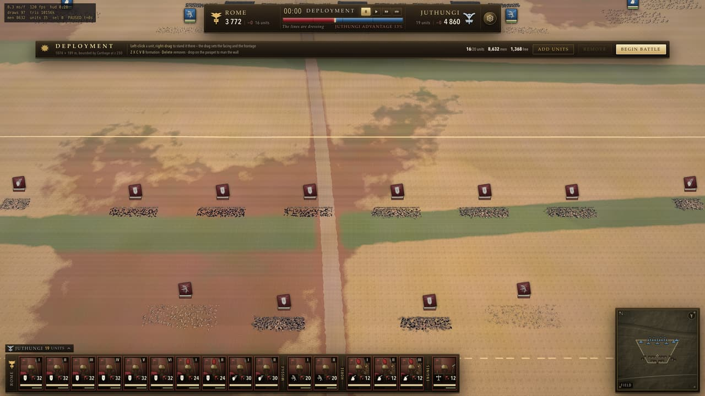

  Shown with the interface, because the interface is the feature.
- **Carthage is defended by Carthaginians.** An assault on Carthage used to deploy Roman
  *ballistarii* onto Carthage's wall and send Juthungi tribesmen up ladders at them: Rome 1,154 men,
  the Juthungi 1,920, Carthage **0**. There are now two Punic orders of battle. The 146 BC defence
  is the historical one — a citizen levy, freed slaves, engines re-framed out of temple timber and
  strung with the hair the women cut off, and nine hundred Roman deserters who could expect no mercy
  — because the 201 treaty forbade war elephants and the city surrendered its arms in 149. There is
  no moment in the Third Punic War with Carthaginian war elephants.

  

  Who is who is read off the unit table rather than off the picture: within 55 m of this focus the
  parapet holds `punic-levy` and `punic-freedmen` under faction 2, and the ladders and the ground
  hold `legio-escalade` and `equites` under faction 0. At 24 m a man is about 80 px, so what the
  frame shows is a Roman file on the ladder and a Punic crowd in the embrasures — not the kit.
- **An Enemy row in the menu**, and `?enemy=carthage` as a shareable link. The Punic *field* army —
  Sacred Band, Numidian horse, war elephants, seven bought contingents to one of citizens — had
  existed since Carthage was added and nothing anywhere set it, so every field battle drew the
  Juthungi and the Punic army could only be reached by hand-building a base64 battle token.

  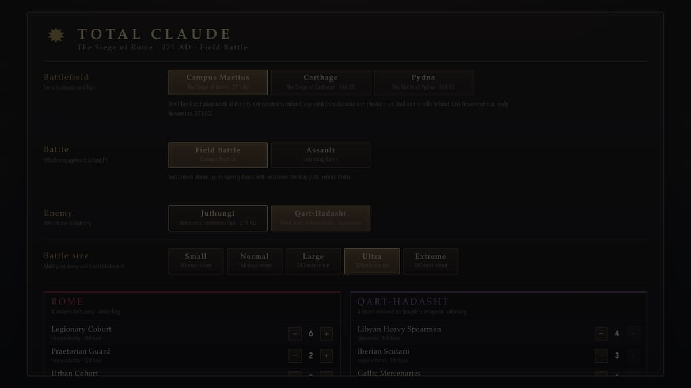
- **An army that takes a wall goes down into the city.** The player: *"the enemy AI when on the wall
  kinda hangs out."* The larger half of the fix was a deletion: the siege system read *any* move
  order given to a garrison as "come down off the wall", which is right for a right-click and
  catastrophic for the AI's own march orders. Measured on the storm of Carthage with both armies on
  the AI, eight of ten wall units were carrying a descend goal at t+87, and the Carthaginian garrison
  fell from 448 men on the parapet to 69 by t+250 with the storm having cleared no bay at all. It did
  not die on the walk. The AI walked it off.
- **Right-click a parapet and the men go up it, and the cursor says so first.**
- **A face** — eyes with whites, irises and pupils, brows, a projecting nose, a moustache and a mouth
  line, on the one criterion that had scored zero in every blind round. A critic's exact words on
  that plate the round before: *"no eye, no eyelid, no eyebrow, no nose, no nostril, no lip, no mouth
  line."*

  | before — shot at r2 | after — shot at r3 |
  |---|---|
  | 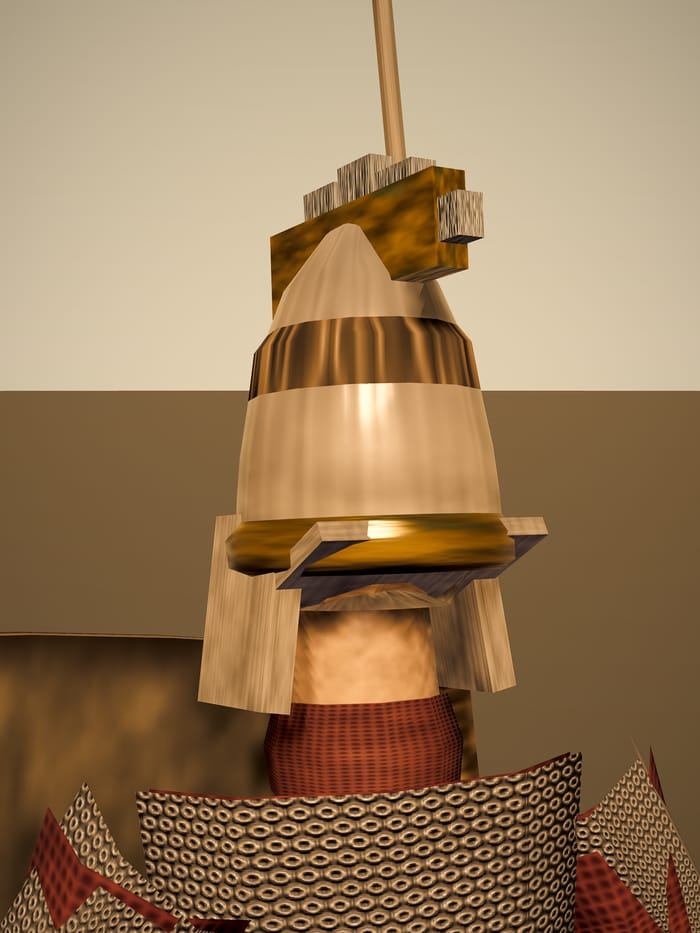 |  |
  | 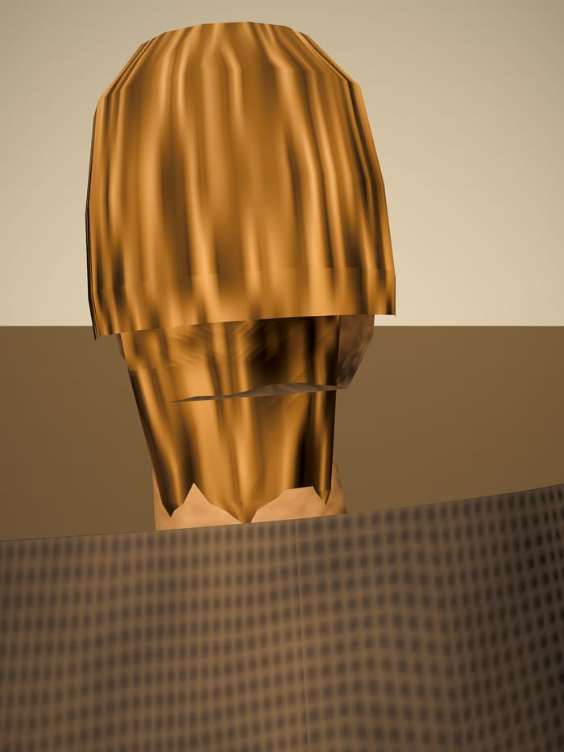 | 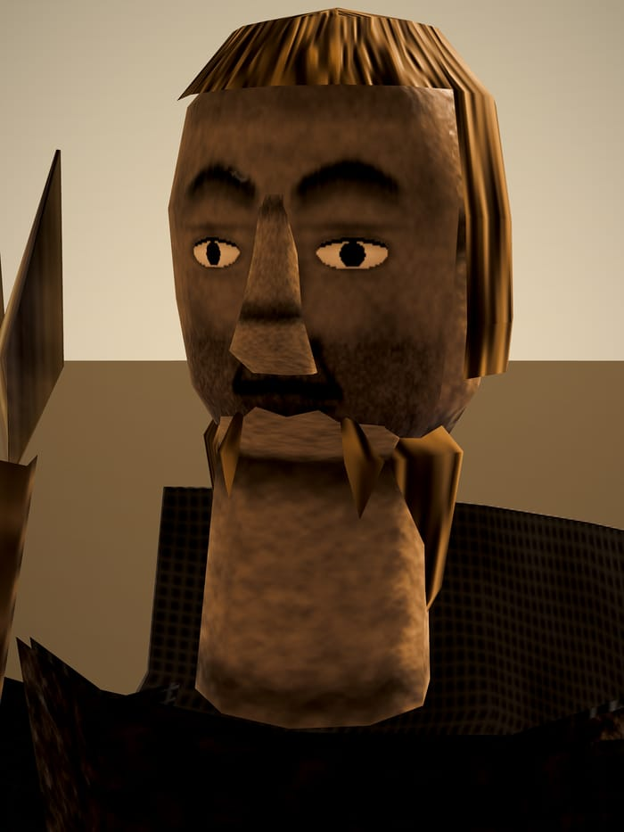 |
  | The critic's plate. The legionary's face opening is a blank oval and the Juthungi's face is sealed inside his own hair. | Both plates at each tree's own shipped framing. |

  Two honest notes on the pair. The **legionary** rows are the *same camera* — plate `legio-head`,
  az −0.6, el 0.06, fill 3.3, aimY 1.585 on both trees — but the pilum shaft and the *galea*'s two
  cheek pieces cover about a third of the r3 face, so it is a face you can read rather than a clean
  portrait. The **Juthungi** rows are not the same camera: r3 moved that plate from the man's
  right-front to his left-front (az −0.45 → +0.45) because with the azimuth convention finally
  correct his own javelin bundle stood between the lens and his nose. Both are three-quarter fronts
  of the same warrior; it is a mirror, not a turn.
- **Houses across Carthage.** Coverage 25.0 → **29.7%** of walled land and 36.6 → **51.5%** between
  street lines, with the dense city at 56.5% roof against the Punic cubit module's arithmetic ceiling
  of 60.9% — the fabric is at its ceiling, and raising the density knob would not move it.

  

  Plate 4 of 4, drawn from the *built* city — `getObstacles()`, `getLanes()`, `getCircuitSamples()`
  and `TerrainSystem.heightAt()` — rather than from the layout constants, so it can disagree with
  the design. The four plates are in [`plans/carthage-plan-v1/`](plans/carthage-plan-v1/).
- **One wall at Carthage, and a gate the ram can visibly break.** The landward belt was three
  parallel crenellated lines, only the innermost of which could be garrisoned or stormed, so a player
  could not tell which one his men would fight on. The 20 × 6 m ditch stays, moved back onto the main
  wall's own glacis — it is a cut in the heightfield, so zero triangles and zero draw calls, and
  nobody mistakes a hole in the ground for the wall behind it.

  

  One line, garrisoned along its whole length, with the ladders against it — and no second and third
  crenellated wall behind it for a player to wonder about.

### Fixed

- **Neither battle could be won, and the field froze for sixteen minutes.** Real fighting from t+100
  to t+1000 ground Rome from 3,772 men to 1,610 — and then nothing: identical numbers at t+1200,
  t+1300 and t+1500, 1,141 Romans against 3,951 Juthungi, not one man dying, until the 2,400-second
  clock fired. Sixteen and a half real minutes of a frozen scoreboard before the game admitted it was
  over. The collapse test only ever compared a side against *itself*, so 1,141 men — thirty per cent
  of Rome's own establishment — read as an army still in the fight with three and a half times as
  many stood opposite.
- **Eighteen units stopped attacking and the order book was sure it had told them.** The order book
  de-duplicates against what it last *said*, and the simulation writes a unit's order behind its
  back: an arriving move settles to Hold, a move that runs out of route settles to Hold, and an
  attack whose target dies is put on Hold at its own feet. None of those reached the book, so it went
  on believing the unit was moving and suppressed the identical instruction the behaviour layer kept
  issuing.
- **Wall descent, on the owner's fourth report.** *"The units on the walls are still stuck there."*
  The order was reaching the wall — a right-click 60 m into the city produced a descend goal on tick
  1, every time — but nobody could get to a stair. The queue layout was handed the unit's running
  count of **every man in motion** as a given man's place in *that* file: men already on a crossing,
  men queued at a *different* doorway, men bound for the far end of the curtain. So the head of a
  file stood back by however many of his mates were busy elsewhere, and it is self-reinforcing —
  every man who gets onto the path pushes the next one further out. Measured live on a 53-man cohort:
  twelve men crossed and the tally froze, after which the nearest waiting man of the remaining
  forty-one sat **2.26 m from a 2.00 m admission radius** and was still there ninety seconds later,
  with no plan timeout and nothing wrong with the geometry. The queue had been laid out beyond its
  own doorway. After the fix, at t+140 **43 of 44 living men are standing on the terrain inside the
  city**, 5.7 m below where they started; at the t+90 checkpoint, 10 men down before, 32 after.
- **Every soldier's face was inside out** — and the fix that went before it had pointed the camera at
  the back of his head. The lathe derives its outward normal only while y *descends* the point list.
  Every other lathe on the man is written crown-first; the skull profile was written **jaw-first**,
  so its normals pointed into the head, the winding followed, and front-face culling removed the near
  half of every man's face. A camera in front of a man saw *through* his face to the inside of the
  back of his skull, and every helmet bowl, hair dome and beard between the two won the depth test.
  Visible face pixels at the shipped framing: **580 → 157,649** on the Juthungi head plate and
  744 → 84,782 on the legionary. Three more full revolutions fell out of the same audit — the beard
  was a 360-degree hoop at mouth height, so 82% of Germanics and 42% of Romans had no mouth; the
  spangenhelm brow band was a complete turn, also at mouth height; and the fur cap was a full
  revolution, so a capped Juthungi measured exactly **0 face pixels**. The nose now projects 25.8 mm
  against a life-size 25, up from 14.
- **You could not click the men on the wall.** The pick was anchored to the ground *under* a unit
  rather than to the level its men are drawn on. With the camera on the field side, clicking the
  parapet crowd at its own screen position selected nothing, while clicking the same ground point —
  inside the masonry — selected it instantly.
- **The screen that announces the outcome could be seen through, and not dismissed.** The panel was
  never opaque, and no amount of opacity would have been enough, because the top bar, the minimap,
  the banners and the card bar are *siblings* in the same layer rather than things behind it.

  | before | after |
  |---|---|
  | 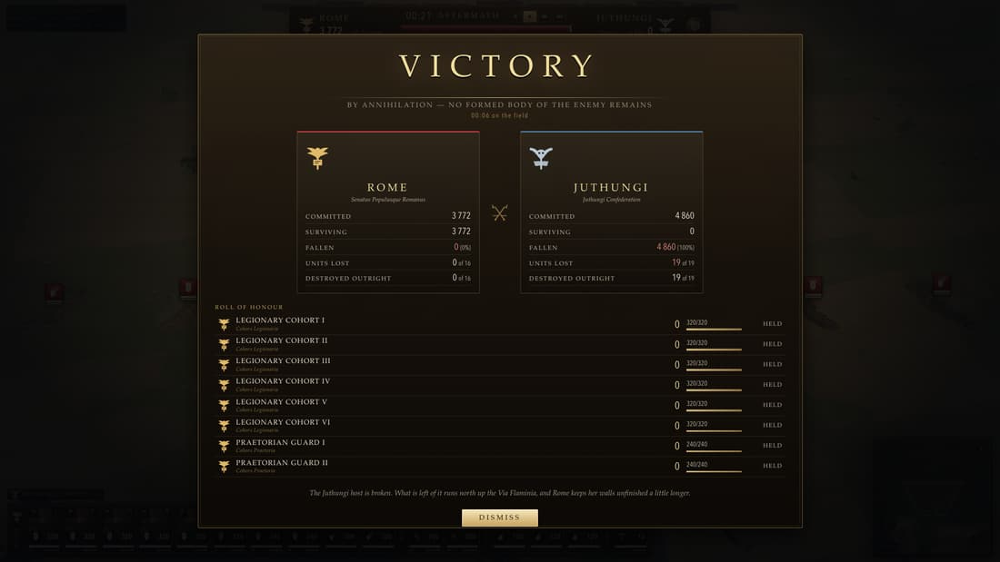 | 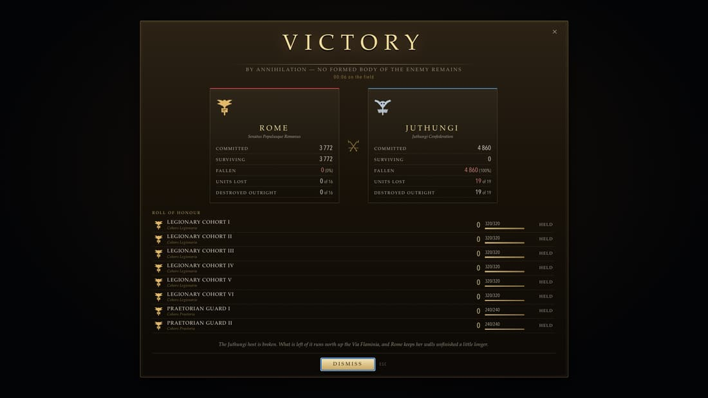 |
  | Before: the plaque, the banners and the card bar read straight through the panel. | After: opaque, with a way out of it. |
- **Nine dead cohorts kept their cards while the plaque said seven units** — two counts of the same
  army on one screen, disagreeing. Routed units keep their cards, because a broken cohort is still
  yours and can still be rallied.
- **Dust made things plain hard to see.** The owner: *"reduce the amount of dust kicked up, it is
  like making things just plain hard to see."* The emitter tapered against the *fraction* of the
  particle ring that was alive — but the ring is a memory decision, 5,000 slots at low and 22,000 at
  ultra, so **ultra drew 4.4× the dust it was tuned for**. Measured at the melee camera by hiding the
  particles at a paused instant and re-rendering the identical world: 58.1% of the frame had dust over
  it and soldier pixels were lifted 8.9/255, rising to 76.5% cover and +18.0/255 forty seconds later.

  | before | after |
  |---|---|
  | 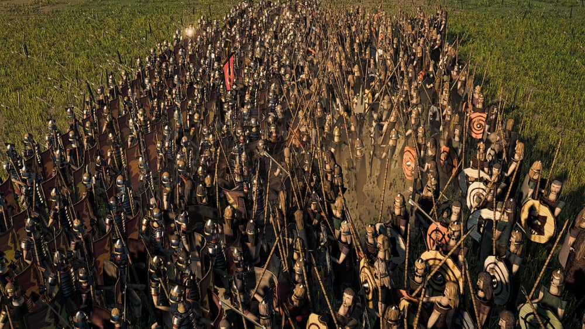 | 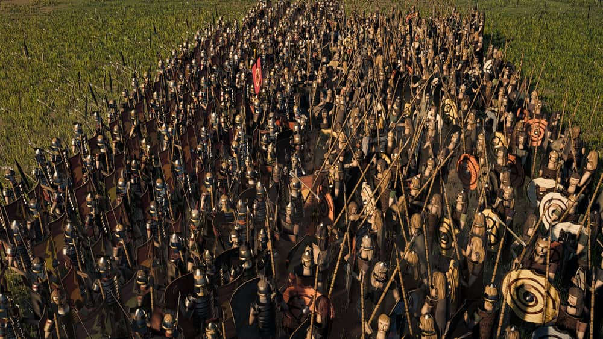 |
  | 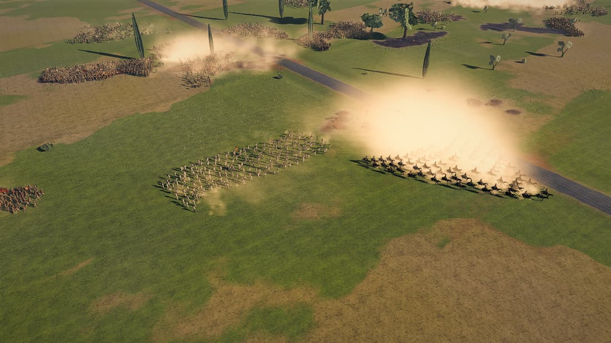 | 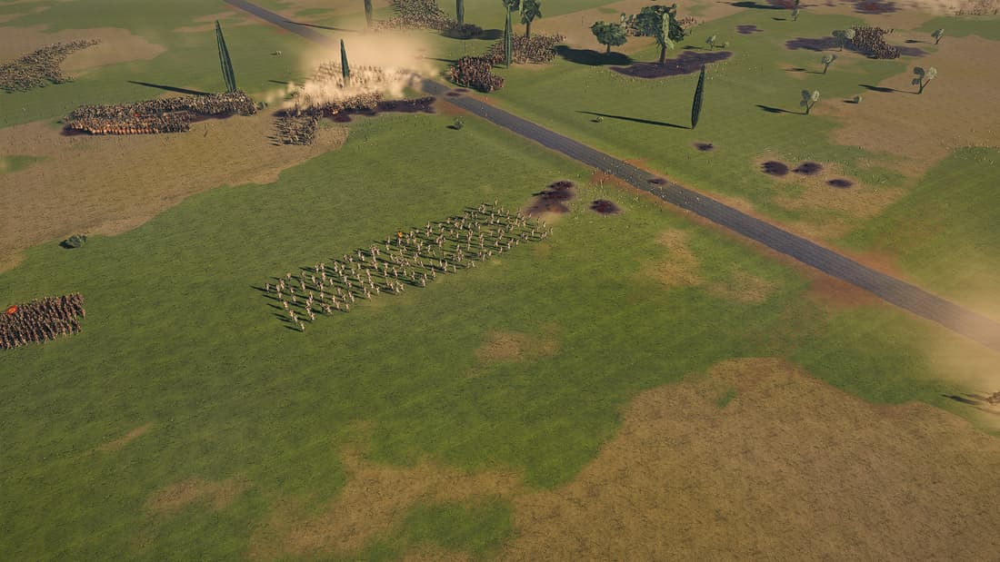 |
  | Before, at ultra, where the ring is 22,000 slots. In the lower pair there is a cavalry unit under the white. | After. Both arms interleaved in one session at the same camera, with the base arm re-shot last as a drift check. |
- A cohort marched out through its own city wall, and the wall let it climb. A warband walked down
  into Rome and climbed straight back up the stairs. The ram opened a gate named `porta-flaminia`,
  and Carthage has no such gate. The top plaque said JUTHUNGI over a Carthaginian army. Carthage
  ended every battle with Rome's story, and its army counted NaN. A unit swapped for another kept its
  card and lost its selection.
- Carthage's geography: the Tophet of Salammbô sat 410 m from its own surveyed position, the merchant
  basin measured 84% land because its quay sample was taken at the basin centre, 22 houses and a
  tower stood in the lagoon, and the pathfinder called 110 hectares of Carthage water because it was
  still using the Tiber's channel.

### Faster

- **The spatial hash was clearing 1.5 million cells a tick to bucket 8,632 men** — *from Josh
  Kappler's PR #1*. The rebuild cleared and prefix-summed the whole grid on every fixed step: at
  3.5 m cells over a 3 km field, **736k cells touched twice per tick**, several times the cost of
  bucketing the men themselves, and scaling with the size of the map rather than with the size of the
  army. Bound to the cell rectangle the armies actually occupy, the rebuild becomes proportional to
  the occupied region plus the headcount — and bit-identical to a whole-grid rebuild, verified hash
  for hash against five determinism checkpoints at 8,632 men. That is what pays for the cell size
  going **3.5 m → 2.0 m**: the separation pass asks for everything within 0.84 m once per man per
  tick, and at 3.5 m that scanned about 37 candidates to find 6.
- **Carthage's assault camera went 242 → 200 draw calls while gaining 262 buildings**, twenty spare
  against the 220 cap, by taking the fabric from 99 chunks to 21 on one world lattice.
- **Medium quality was paying 94% of 4× MSAA's price for half the samples.** Eight camera
  measurements over two interleaved sessions: 4× against no MSAA is a median **1.18 ms**; 4× against
  2× is **0.07 ms**. The cost is in having a multisampled target at all, not in the sample count, so
  2× is the worst cell in the table and is gone.
- The assault frame was 55% shadow pass, and the city was casting one silhouette in six pieces.

### Also from Josh Kappler's PR #1

- The minimap compass turns the view, and points the right way.
- A middle-drag jumped the camera by however far the mouse had already travelled before the drag was
  recognised.
- The pick slack collapsed to 13 cm at close zoom, so precise clicks near the camera missed.
- Grass position, bearing, size and tint were all drawn from the same random number.
- The landmark key list was a hand-kept copy of the material table; the base rank spacing was three
  unrelated literals; and a HUD test that asks what is under the cursor instead of assuming.

### Corrections to the record

- **The metal rewrite had shipped half-applied.** A long note in the material table argues that a
  conductor has no diffuse lobe and that its colour is its measured F0, and the albedos were duly
  raised — but the metalness values were never moved. That left every metal a soldier wears **half
  dielectric with a metal's albedo**, which is the one combination that same note warns is worse than
  either end, and it is exactly what a bronze *squamata* photographed as: one smooth extruded gold
  ribbon with no seam between one scale and the next. Moving one half of a two-variable change and
  leaving the other is not the conservative choice; it is the worst point in the space.
- **Every torso was tiled 1.8:1 stretched.** The mail body ran three tiles around a 0.87 m
  circumference and four along a 0.65 m length — one tile covering 291 × 164 mm, so a 9 mm riveted
  ring rendered as a **16 × 9 mm oval** on every mailed man in the game, which is why a coif
  photographed as a sheet of embossed lozenges. The segmentata torso comes out unchanged at
  453 × 449 mm, which is the check that the correction is not inventing itself.
- **"No normal map, no roughness map" — named by three independent critics — was a starved sampler,
  not an absent one.** Both maps have been present for months. At the isolated-model deck's
  magnification one atlas texel was smeared over 2.0 to 4.7 screen pixels, so every surface was being
  magnified and read as bilinear mush. A starved sampler and a missing map look identical to an eye.
- **The soldier-quality ratio the project had been steering by measures the reference pool's upscale,
  not our models.** The Rome II reference crops are cut at 285×380 to 570×760 native and upscaled to
  900×1200; our plates are shot at 1800×2400 and resampled *down* to the same grid — a three- to
  six-fold relative resolution difference. Putting our own unchanged plates through the reference
  pool's own chain, with no model change at all, moves two of three of them into the reference band.

---

## r2 — Carthage becomes a place, and the soldier turns out to be inside out

**6 August 2026** · commit [`b7d8aaf`](https://github.com/eoinest/Total-Claude/commit/b7d8aaf) ·
deployment `total-claude-93652cjg7`

A second city and a second wall to storm, and a run of geometry defects on the soldier that no
battle frame could ever have shown. Forty changes.

### New

- **Carthage, 146 BC.** The isthmus between the Lake of Tunis salt pan and the Gulf — Appian gives it
  as twenty-five stades, about 4.6 km, so on a 2.8 km field the sea is off the edge on both flanks,
  which is what Scipio saw too. Then the triple wall from Appian *Punica* 95 at Attic measure, hollow
  throughout, with every dimension carrying the ancient figure it came from and the constants that
  have no ancient figure saying so. It satisfies Rome's stair contract unchanged, so the chunk baker,
  the occupancy raster, the obstacle set and all four siege accessors are the same code for both
  cities. Inside the walls: the Byrsa, the harbours, and a street fabric laid out on the archaeology's
  own 30 × 60 Punic cubit module — 15.5 × 31 m — so a Carthaginian street front comes out by
  construction rather than by taste. The defensive belt is 74.1 m deep with an enterable lower vault.

  

  Three lines in depth, and the ashlar courses and individual merlons both resolve. What is *not*
  in the picture is the ditch: `carthageWall.ts` publishes it as a request to whoever owns the
  heightfield rather than as geometry, and nothing in this tree cuts it, so the belt here is the
  54.1 m of built masonry and the glacis in front of it is flat.

  

  The Byrsa, both harbours and the grid. Read this as the **plan** and not as the density: there is
  bare ground between the quarters, and r3 is the release that fills them.
- **The wall is terrain.** The owner, three times: *"walls are like interactive terrain… when a unit
  leaves the wall they will walk down the stairs. Enemies on the wall can also walk down the stairs."*
  A unit on or near a wall now carries a plan with one of five goals — Hold, Ascend, Traverse,
  Descend, Storm. **Descent is the half that did not exist**: nothing in the simulation had ever taken
  a unit that was on the walkway and walked it down, which is why an enemy who took the wall stood on
  it for the rest of the battle.
- **Water is a map's to declare.** The owner played the new Carthage map: *"I see the ocean but no
  lagoon, it's just the beach."* He was right, and the lagoon was not the half of it — water was a
  ribbon of geometry built along the Tiber's own meander line, so the Tiber was the only thing in the
  engine that could render as water, and Carthage's gulf, lagoon and harbours all shipped as terrain.
  A flat desaturated plate with no specular, no animation and no depth cue reads as wet sand, and
  under a 20-degree April sun it reads as wet sand very convincingly.

  

  The gulf, and **not** the lagoon: at r2 the Lake of Tunis is a 90 m channel between the shore
  scarp and the crown of the Taenia sand bar, and every framing of it photographs as a salt flat,
  because that is what most of it is.
- **A siege machine stops when its crew routs.** From a playtest: *"the ram gets routed and the people
  flee yet it keeps moving forward."* Fifteen tonnes of green timber is moved by a gang on levers and
  rollers; when the gang breaks it stops, and it stops in the open, which is the moment the defenders
  want. The siege tower had the identical hole.
- A belt, and a hand that is not a mitten. A `?map=` override, so a stored map choice is no longer
  inescapable.

### Fixed

- **56% of a soldier's triangles were shaded or wound inside-out.** The mesh builder wrote two
  independent descriptions of which way each surface faces — a per-vertex shading normal and a
  triangle order — and nothing tied them together: **2,347 of 4,175 triangles** on a legionary
  disagreed with themselves. The lathe emitted normals that were the exact negation of its own
  winding for every profile it was ever given, so every helmet bowl, the skull, the hair, all four
  shield bosses and every lathed weapon head drew correctly and then lit itself inside out — a bronze
  *galea* was sampling the ground hemisphere instead of the sky and rendering as a flat cream
  lampshade. The box primitive got a left-handed basis on four of six faces, so two of its sides were
  culled outright and a box drew as two facing panels with the world between them. Identical vertex
  and index counts after the fix, so it cost nothing.
- **The shield boss was modelled, tinted, paid for and drawn every frame — behind the board.** All
  four call sites passed a negative axial offset, so the scutum's umbo sat **219 mm behind** the face
  it should have stood proud of, the oval's 114 mm, the round's 56 mm. Sixty-four triangles a shield,
  invisible from every angle a player has. *"Flat discs, no boss geometry, no rim bevel"* was the cue
  both blind graders named first or second, and the one the cold grader said it could defend
  mechanically.
- **Every helmet was a closed dome over the eyes**, running below the brow and below both eye boxes,
  and the bare-headed men's hair was the same — every face sealed inside its own headgear. The Gallic
  shell was also radius 109 mm over a skull of 82 mm: **27 mm of padding all round**, against a real
  lining's eight or ten.

  

  Shot from this release's own tree. The helmet bowl runs down over both eye boxes and the head is
  sealed inside it — which is also why the *galea* photographs as a flat cream lampshade: at
  `envMapIntensity: 2.9` a crown wound inside out samples the ground hemisphere instead of the sky.
- **Every closed ring in the game ran one column of its texture backwards.** A per-vertex modulo does
  not wrap the surface between two vertices — it runs the whole tile backwards, compressed into one
  column. Because rings close by reusing vertex zero, this happened even at a repeat of 1; on the mail
  and scale torsos, three of ten columns did it.
- **Nine wall stairs that nothing collided with.** Ground units walked through 10.5-13.9 m of masonry
  apiece, nine times over. The flight is a ramp rather than a wall, so boxing it whole would have been
  worse than the bug: the solid now starts where the rake is 1.2 m above its own foot — mid-thigh,
  the height at which stone stops being something to step onto — leaving the foot and the queue point
  behind it walkable.
- **The great roads ran 73-91% of their length through solid masonry.** The monument overlap resolver
  moves buildings a mean of 45 m *after* the streets are projected, and nothing ever re-ran the
  streets. The Via Appia lay 90% of its length inside masonry, the Via Triumphalis 91%, the Via Sacra
  81%, the Via Lata 73%, at zero clearance — which is why a cohort could march the whole military road
  and never get into the city.
- **Every map opened with "The Siege of Rome, 271 AD · Campus Martius."**
- **A click that never reached the wall**, so nobody could be ordered off it. The order plainly ran
  and the target never moved a centimetre, which cannot both be true of a click 62 m away: a
  garrison's anchor is *inside the curtain's footprint*, so the "don't walk into a wall" guard
  computed a clear line of zero and pinned every order to the unit's own feet.
- **The scorpio's claw and trigger were 2% of its pixels**, which is why five successive rounds of
  critics reported them missing on parts that were modelled and correctly placed the whole time. The
  whole slider group — bed, groove ribs, claw, trigger — measured 1.27% to 2.99% of the machine's own
  pixels across six views, against 32-48% for the body.
- **Film grain at 0.016 left no smooth region anywhere in the frame** — the adversarial grader's
  single strongest scalar. Switching only that one uniform: 0.016 → **0.00%** of tiles reading as
  smooth, 0.006 → **2.21%**, 0 → 69.67%, against Rome II soldier crops at a mean of 7.09%. It ships
  at 0.006.
- The cloth weave sat at four screen pixels, which is the worst place for it. The *galea*'s cheek
  pieces stood 33 mm clear of the face.

### Corrections to the record

- **"Twenty-three rounds, twenty-three separations" was quoted in every workstream's brief, and it is
  not a defensible claim.** Audited frame by frame. The good news first: **the HUD did not corrupt the
  record** — a detector calibrated on a known HUD-bearing pass scores that pass at 0.837% of frame and
  all nineteen surviving decks at **0.000%**, so twenty decks are clean by measurement rather than by
  assertion. But the denominator is wrong in three ways and all three inflate it. Nine of the nineteen
  graded our renders against *photographs*, which separate on sensor noise and depth of field whatever
  the renderer does. Ten decks came from **seven distinct shot passes** — three of them are three
  seeds of the same eight frames, three more are three seeds of the same six — and reshuffling a deck
  measures grader consistency, not the renderer. And no ledger has ever existed: about nine deck
  directories were deleted by their owners under the screenshot-cleanup rule and cannot be audited at
  all, one of them a lighting deck independently known to be void. **The honest statement is seven or
  eight independent render-quality passes against the Rome II plates, every auditable one of which
  separated, plus one known void round and about nine rounds with no surviving evidence either way.**
  Still a real and consistent result — no workstream has reached parity — and a seventh of the weight
  the old number implied.
- **Every blind deck ever built was graded on a 1.25× upscale**, leaving a period-4.995 resampling
  comb an adversarial grader read straight out of the files. It never sorted a deck, because it was
  applied to both sides, but every round to date measured pixel-scale energy on interpolated pixels.
- **Rome is not short of roof, and "20.5% built" was an instrument reading its own streets as
  failure.** The city audit built its street keep-out from the twenty-two named viae, 11 km, and could
  not see the further **374 lanes and 38 km** the district generator cuts — so every vicus in the city
  was scored as unbuilt ground, 39 hectares of carriageway counted as a gap. With the lanes in, the
  same unchanged city reads **roof between street lines 53.9 → 68.7%**, inside the 60-70% the AGEA
  orthophoto gives for the historic core. The remaining difference from the orthophoto is grain, not
  coverage.
- **The 60 m pomerium was never violated; the probe was measuring past the end of the wall.** It
  sampled 30-54 m *beyond* the east end of the curtain against a frozen z-line with no masonry near
  it, and labelled the intrusions by nearest *centre* — the Castra Praetoria is 278 × 262 m, so its
  centre is 200 m from its own corner. Restricted to the wall's real span and labelled by containment:
  minimum **60.0 m** over 220 samples, zero intruders.

---

## r1 — two lines that actually fight, and a wall you can put an army on

**1 August 2026** · commit [`dd77a5f`](https://github.com/eoinest/Total-Claude/commit/dd77a5f) ·
deployment `total-claude-qmlvu94rh`

The first release in this changelog. Melee started working, the Aurelian Wall got wide enough to
garrison, and the renderer stopped taking one geometric sample per pixel.

*Four production deployments predate this one (30-31 July 2026). They were prebuilt uploads carrying
no source, so there is no way to tell which commit each contained, and no release has been cut for
them. See the note at the end of this file.*

### New

- **A 6 m curtain you can put an army on.** The player's four reports about the Aurelian Wall,
  measured rather than asserted. The curtain goes 3.5 → 6.0 m — the top of the Theodosian range, not
  an invention, and the width at which the *worst* bay still seats five ranks. The number that
  matters is the clear standing band: **1.57 m → 2.21-4.06 m**, which at the simulation's 0.72 m
  interlocking pitch is **four to six ranks instead of two**.
- **Stairs that run along the wall.** The old flight ran out of a tower's city face at right angles to
  the curtain, projecting into the pomerium — not a thing Roman engineers built, and it ejected men
  off the back. Nine masonry flights now climb *along* the inner face: 14.2-20.4 m along the wall
  against 3.28-3.79 m of projection, on 0.29 m risers and a 0.42 m going, with a 2.2 m landing at the
  head and a travertine apron at the foot. The cheek wall's coping rakes smoothly rather than stepping
  with the treads — three reviewers looking at three renders all reported "no parapet on the open
  side" while the builder was emitting 0.95 m of one, because a stepped pale line above a stepped rake
  reads as more treads. One unbroken diagonal is the whole cue.
- **Scaffolding on the inside.** Standards, ledgers, putlogs, plank lifts, ladders and the treadwheel
  crane are all on the city side now, and the crane's jib swings over the material yard instead of
  hanging its load out over the glacis. The scaffold used to be a free ladder for the Juthungi.

  

  The three entries above in one frame: the width of the walking surface, a flight that climbs
  *along* the wall rather than out of it, and the scaffold on the city side. The unbroken diagonal
  under the treads is the whole cue — three reviewers reported "no parapet on the open side" while
  the builder was emitting 0.95 m of one, because a stepped pale line above a stepped rake reads as
  more treads. There is nobody standing on the wall in this shot, so it shows the band and does not
  measure it.
- **The gate starts shut**, and is modelled shut: vertical oak boarding on iron straps, harr-posts in
  bronze-lined sockets, a drawbar across both leaves, and the lunette above them filled in brick. Four
  rays down the carriageway stop on one flat plane, and a ray restarted inside runs 25 m out the far
  side — so what the ram opens is a road and not a recess.

  

  Shut, boarded and strapped. **Two things the entry names are not in this picture and the caption
  will not claim them**: the drawbar is modelled on the *city* face of the leaves, so from outside
  it is behind 220 mm of oak, and the bricked lunette is behind the raised portcullis, so what reads
  above the leaves is iron and not brick. The face is dark at every hour — Campus Martius runs
  declination −14 at latitude 41.9 N, so the sun's azimuth never crosses north of the east-west line
  and this face is in shade all day. Shot at noon for maximum sky fill it is no brighter.
- A blind-comparison deck of **ten independent trials** instead of one battle photographed ten times:
  no two frames sharing a follow target, two maps, hours 07:30 to 16:24 against the single 17:00 every
  earlier frame shared, and one frame at high rather than ultra.

### Fixed

- **Two units standing 1.67 m apart landed zero blows in sixty seconds.** Nothing in the tick closed a
  front-to-front gap once both units' orders were satisfied, and four separate mechanisms that look
  like they should each stopped short. There was no auto-engage system at all — the name was dead in
  six tools and resolved to nothing — so a player's unit on Hold had nothing to rescue it. Why the
  warband twitched and the Romans never did: a horde's front slot carries a bulge, so its foremost man
  stands about 2 m ahead of his own anchor and fell just inside his own acquire radius while the
  Romans fell just outside theirs. That is the "little fighting animation but nothing happening".

  | anchor gap | real gap | blows in 60 s |
  |---|---|---|
  | 3.5 m | 1.23 m | 10 → **841** |
  | 4.0 m | 1.67 m | 0 → **708-772** |
  | 5.0 m | 2.65 m | 0 → **710-793** |
  | 5.5-7.0 m | — | 0 → 0, bounded by design |

  

  The two lines pressed together at t+89 s. The camera is over the crowd rather than in it, so what
  the frame shows is that the seam has closed — not the blows themselves, which are a counter and
  not a pixel.

- **The gate chokepoint.** Lateral drift per fighting man 0.202 → 0.063 m/s, rotation 3.86 → 2.41
  deg/s, wall crossings off the carriageway 28/158 → 2/179, unit spread at t+119 s
  43.9/43.7/135.7 → 12.2/17.2/25.6 m. *(These figures were taken against the 3.5 m curtain and do not
  compare with anything measured after the widening above — see r4.)*
- **Stragglers stranded behind the wall 94 → 30**, twenty-seven of them walking their unit's breadcrumb
  trail back; there was no such mechanism before.
- **`R` never made anyone run.** It flipped a UI latch that was only read at the *next* right-click, so
  a unit already marching ignored it entirely. It now issues a gait order: **1.55 → 3.383 m/s** with
  the destination preserved. (Run was never broken — measured run speed is 3.264 m/s against a nominal
  3.5, the shortfall being fatigue.)
- **Every camera jump started underground.** A jump parked the focus at sea level and then let it float
  up to terrain height at a damped rate, so on a 40 m ridge the eye was still 4 m low a quarter-second
  later and took about 0.8 s to settle. The battle opened on an upward swoop nobody asked for, and
  every graded screenshot in the project's history had been shot through a climbing camera.
- **Every siege engine fired a fletched arrow, twelve at a time.** The scene held exactly two
  projectile meshes over one geometry — a 19-triangle arrow — and every kind was instanced from it with
  only its length scaled, so a 26 kg onager stone was drawn as a 0.44 m fletched arrow and a lead sling
  bullet as a 0.10 m one. Now three geometries. Separately, the emitter fired once per *crewman* rather
  than once per machine: a scorpio battery of 12 crew serving 4 engines loosed twelve bolts.
- **The great roads ran through masonry** — see r2, where the same defect is described in full; the
  street deflection landed here.
- **The ground bounce had no colour and the sky fill was short a factor of π.** The Lambertian term
  that fills the lower hemisphere of the environment probe — half of everything a standing man's
  vertical surfaces are lit by — used a scalar ground albedo against a deliberately neutral sun, so the
  ground's own colour, the largest factor in a real bounce, was simply absent.
- **The warm/cool split was compared in the wrong colour space**, so the whole frame took the shadow
  tint.
- **Mainline had not booted for three commits.** A commit landed render code with four call sites
  against functions that were never staged alongside it, including an ESM binding error fatal at import
  — a white screen with no game object — and two further commits were then stacked on a tree that had
  never run. **The live site was never affected**: the Vercel build fails on an unresolved named import
  rather than shipping it. A typecheck is not proof of life.
- **The harness clock moved the battle far further than asked.** Two different clocks meant a
  microsecond step actually advanced the world about 0.13 s, so every probe that used a tiny step to
  hold the world still was differencing two frames five simulation ticks apart and calling the result a
  noise floor.

### Sharper

- **The world was rasterised at one sample per pixel.** Spears were staircased because nothing in the
  chain took more than one geometric sample: SMAA and FXAA are morphological and cannot recover a shaft
  thinner than a pixel, and neither does anything for an alpha-tested grass blade that either passes
  its test or vanishes. This adds MSAA on the scene target (0/2/4/4 by tier), alpha-to-coverage on the
  grass, **coverage-preserving mips** for the grass card, and anisotropy swept to the device maximum.
  The long-standing "grass draw-distance seam" — a hard straight line where the sward stopped — was a
  mip band, not the ring fade, which is why moving the ring fade never fixed it. Measured over ten
  graded frames at ultra: pixel-scale harshness 1.479 → 1.382, structural detail held, sub-pixel
  temporal instability down 4-10%, cost +1.1 ms.
- A helmet bowl at forty metres is a curved mirror a few pixels wide — specular filtering to match.

### Corrections to the record

- **"Soldiers render at 2-4% of display luminance" is retracted. It was a unit error, and it
  misdirected three rounds of work.** The instrument reports *display-linear* values, as its own header
  says: 0.0354 / 0.0316 / 0.0204 linear are **0.207 / 0.196 / 0.157 display**. A second independent
  instrument agrees at 0.1745 display for soldiers against 0.3126 for the ground — and that ~30% ground
  figure was display all along, so the original comparison was mixing two unit systems. Rome II plates
  measure 0.2957 display. **The true gap is about 1.4×, not 8-12×.** This is why three successive fixes
  each measured a real gain and each still felt like nothing: they were sized against a target eight
  times too far away, and a fix sized for 8× would wreck the frame. There *is* still something to fix —
  a quarter of soldier pixels sit below 0.059 display and the median is 0.125, genuinely bottom-heavy —
  but it should be sized for 1.4×. The colour space is now in the variable name.
- **The crowd is not short of variation, so "add more variation" was always the wrong fix.** Read
  straight off the uploaded instance buffers rather than recomputing what they ought to contain, one
  320-man cohort carries **57-59 distinct kit masks, 119 statures, 229 cadences, 314 of 320 distinct
  animation phases, 252 tunic colours and 248 metal values.** The variation is there and it does not
  reach the screen; that is a different defect.
- **Raising metalness *darkens* armour here** — verified twice. Under a sun-dominated rig with a weak
  probe, full metal trades a sunlit diffuse term for a dim blue sky reflection.
- The blind harness had been **writing the answer into the JPEG quantisation tables**, and could not
  tell a HUD-free deck from a careless one. It now refuses a deck rather than reminding people: three
  gates on provenance, overlay content and file invariants, any of which deletes the frames.

---

## Before r1

Four production deployments were made on 30 and 31 July 2026, before this changelog began. Each was a
prebuilt upload of the `dist/` directory carrying no source, so **there is no way to determine which
commit any of them contained** and no release has been cut for them. They are recorded here for
completeness:

| deployment | created |
|---|---|
| `total-claude-rf4mkbnh8` | 31 July 2026, 20:22 PDT |
| `total-claude-lic8kshpz` | 31 July 2026, 17:31 PDT |
| `total-claude-84yd2teh6` | 30 July 2026, 17:22 PDT |
| `total-claude-ervckl196` | 30 July 2026, 14:10 PDT |
