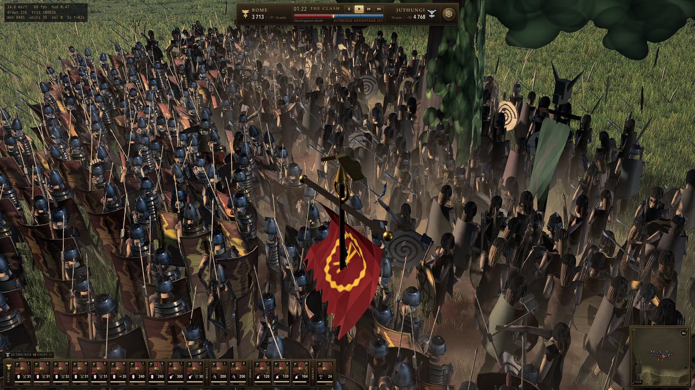
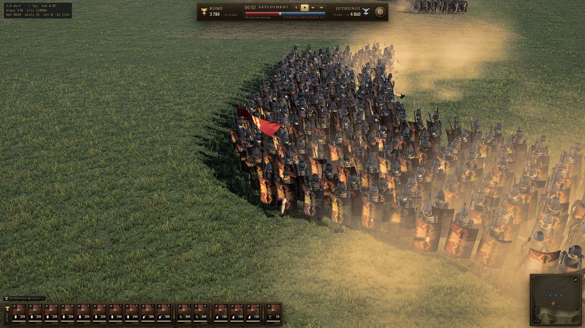
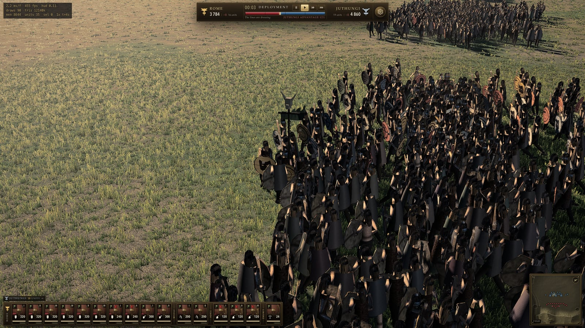
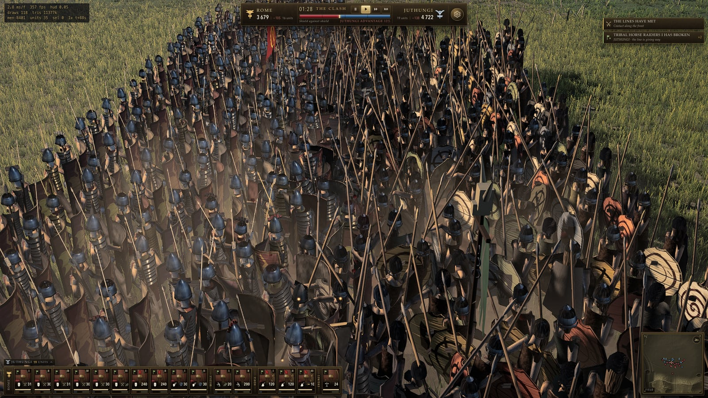
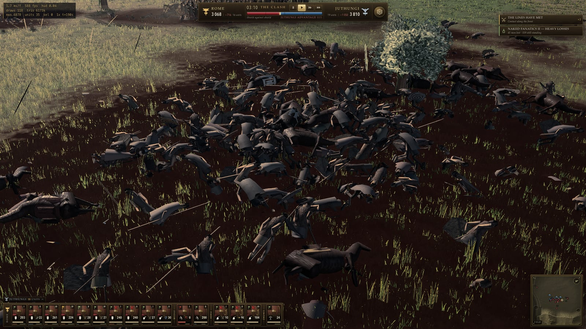
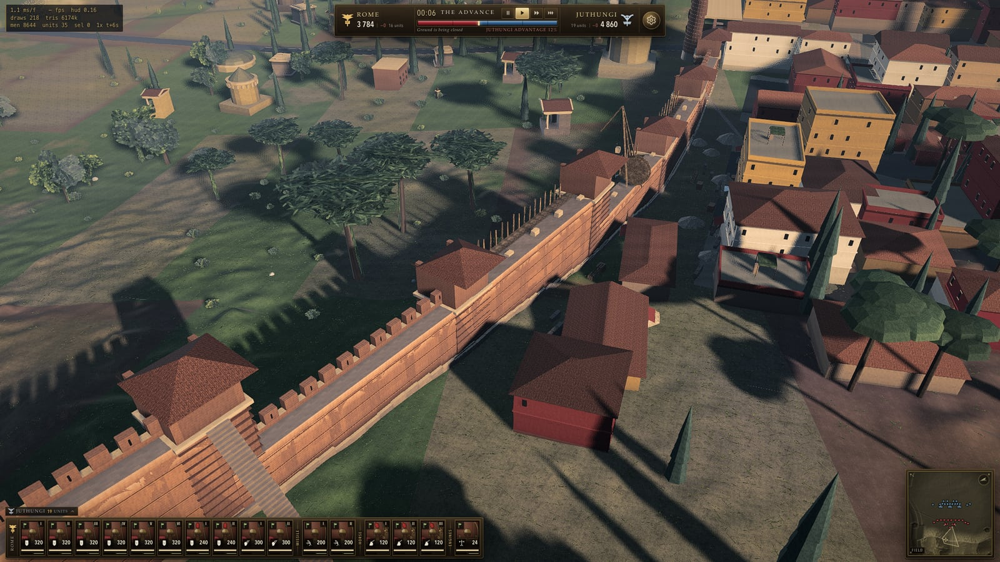
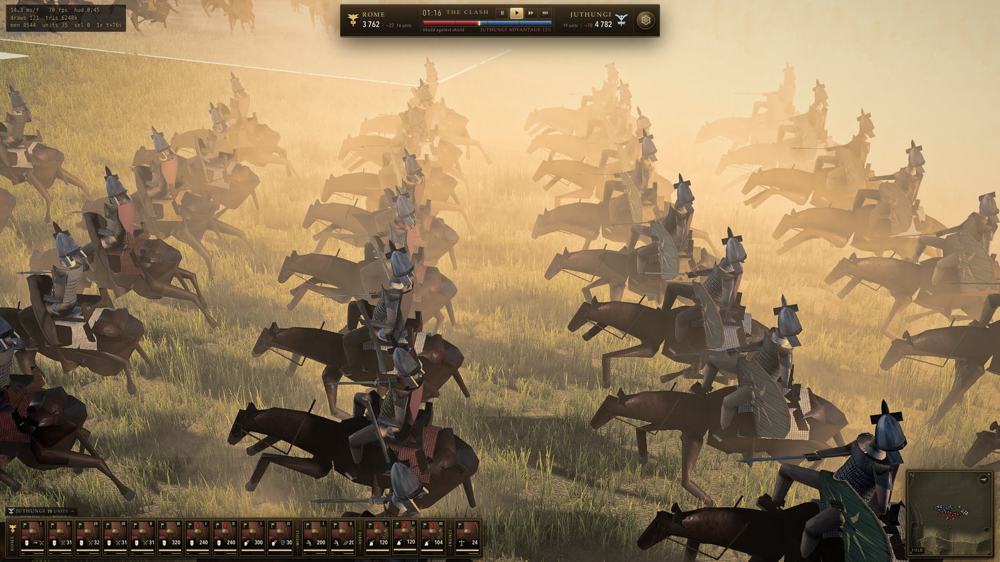
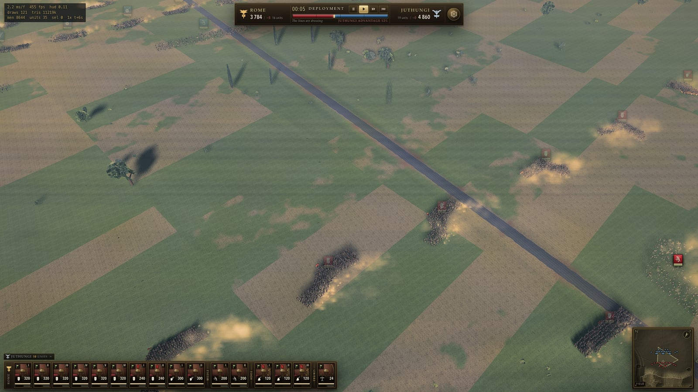
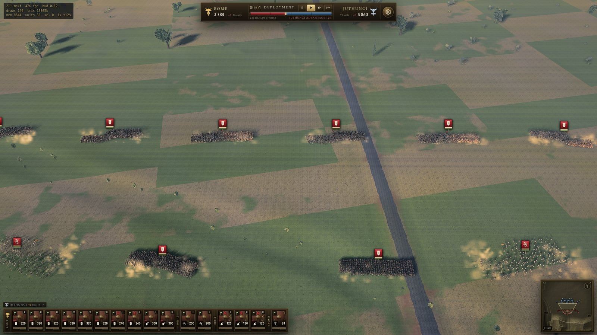

# TOTAL CLAUDE — The Siege of Rome, 271 AD

A real-time historical battle simulator in Three.js, built to stand comparison with
Total War: Rome II. Around **9,000 individually simulated soldiers** on a 2.8 km
battlefield: a Juthungi host coming down the Via Flaminia against a late-third-century
Roman field army drawn up in front of the unfinished Aurelian Wall.

Everything renders from code and CC0 assets — no game rips, no commercial content.

**Play it:** [total-claude.vercel.app](https://total-claude.vercel.app)



*Roman cohorts in shield wall on the left, a Juthungi warband on the right, dust rising from
the contact corridor between them. 8,561 men simulated, 109 draw calls.*

---

## More

<table>
<tr>
<td width="50%"></td>
<td width="50%"></td>
</tr>
<tr>
<td><b>Roman line.</b> Segmentata banding, ring mail, cheek-guarded <i>galea</i>, the painted
<i>scutum</i>, and the cohort's <i>vexillum</i>. Every man's shield colour, helmet variant,
crest, skin tone and kit wear is drawn from a stable per-soldier hash, so no two adjacent
men are the same.</td>
<td><b>Juthungi warband.</b> Round limewood shields in different colours with painted
spirals, sunwheels and wolf-heads — men who equipped themselves rather than a quartermaster
who equipped them.</td>
</tr>
<tr>
<td></td>
<td></td>
</tr>
<tr>
<td><b>The melee.</b> Only men who can actually reach an enemy fight; rear ranks press
forward and step into the gaps the dead leave. A quarter of engagements pair two soldiers
into a single shared animation, as Rome II's own <code>matched_combat_percentage</code> does.</td>
<td><b>Aftermath.</b> Blood soaked into the soil, earth churned along the whole contact line,
spent pila and arrows standing where they fell, dropped shields and helmets. Ground damage
accumulates into a persistent buffer and is never cleared.</td>
</tr>
<tr>
<td></td>
<td></td>
</tr>
<tr>
<td><b>The Aurelian Wall, 271 AD.</b> Brick-faced concrete on a travertine footing, square
towers at one Roman <i>actus</i> (35.5 m), a stair to the wall-walk, and behind it painted
insulae with terracotta roofs. In front, the Via Flaminia necropolis and its cypresses.</td>
<td><b>Cavalry.</b> The gallop's phase is owned by the horse and advanced at its own speed
divided by its measured 5.36 m stride, so hoof slip averages 0.000 m/s instead of the
2.7&ndash;4.1 m/s it started at &mdash; a third of ground speed.</td>
</tr>
<tr>
<td></td>
<td></td>
</tr>
<tr>
<td><b>Strategic view.</b> Centuriated fields on a 94&nbsp;m lattice &mdash; the layout is
georeferenced against Lanciani's <i>Forma Urbis Romae</i>, with per-landmark positional
error measured at a mean of 45&nbsp;m.</td>
<td><b>The order of battle.</b> Rome fields 3,784 against 4,860, out-fronted 248&nbsp;m to
334&nbsp;m. Do nothing and you lose: a passive Rome takes 37% casualties and ends the battle
with Juthungi wedges behind its line.</td>
</tr>
</table>

---

## The setting is real

The Juthungi and Alemanni broke into Italy in 270–271. Aurelian caught and beat them at
Placentia, Fano and Pavia, but the panic they caused in the capital is exactly why he
began the Aurelian Walls that same year. This is that campaign's *what if they had reached
the city* — which is why the wall in the background is **under construction**, with
half-built bays, scaffolding, a treadwheel crane, mortar pits and a gap hastily blocked
with palisade and rubble.

Kit is 271 AD, not the Augustan cliché: ring mail and the longer *spatha* are displacing
*segmentata* and the *gladius*, oval shields are replacing the rectangular *scutum*, and
ridge helmets are coming in. The Germanic side fights in deep wedges with *framea*
javelins, long ash spears and painted limewood shields.

---

## Running it

```bash
npm install
npm run dev          # http://127.0.0.1:5173
```

Assets are optional — with an empty `public/assets/` everything falls back to procedural
substitutes and the game still runs. To fetch the CC0 set (213 MB, integrity-checked
against pinned SHA-256s):

```bash
npm run assets
```

### Two players, two machines, one network

```bash
npm run host         # opens a room, prints a QR code, opens your browser on it
```

One command, both halves, and nothing to type on either side. It binds an address the machine
next door can reach rather than `127.0.0.1`, starts the relay, **asks it for a room**, and prints
the room code, the join URL and a scannable square:

```
      http://192.168.1.77:5958/?room=QXWYZ
```

Your own browser opens on that room. The other player points a camera at the square, or types
that line — 36 characters, the last five of which are the code — and is in the room with no form
to fill in and no Join to press. Say Allow if macOS asks about incoming connections. Both
machines must be on the same network; a guest network with client isolation will not work, and
nothing here can work round that.

`npm run host -- --no-open` keeps your browser shut, `--no-qr` prints the URL without the
square, and `--relay-port=` moves the relay.

**The deployed site cannot host this and never will.** A page served from the internet is not
allowed to open a connection into a private network — the socket is refused before a packet
leaves, which is a browser rule and not a limitation of the relay. Its multiplayer screen says so
and links to a copy you can run yourself. `docs/MULTIPLAYER.md` §12.6 has the measurement, and
§12.5 says why an address packed into a longer room code would not help.

### Setting up a battle

The game opens on a Total War-style custom-battle screen before anything loads, so a small
battle never waits for a big one's assets.

- **Battle size** — Small / Normal / Large / Ultra / Extreme, Total War's own ladder. It
  multiplies every unit's establishment, so a legionary cohort is 80 men at Small and 480 at
  Extreme. Artillery crews do not scale; a scorpion needs two men whatever the setting.
- **Army composition** — a row per unit type per side with steppers, capped at **20 units a
  side** (Total War's limit, and past it the card bar stops fitting on screen) and 12 of any
  one type. Live totals show units, men and metres of battle line for each army.
- **Conditions** — time of day, difficulty, graphics tier, and the seed. Same seed and same
  composition replays identically **at every graphics tier**: the tier buys resolution, shadows,
  post-effects and LOD distance, and it does not change the battle. It used to — it sized the
  soldier pool, which sized both armies — and that is fixed and gated.

Two things it tells you rather than deciding for you. If the chosen size needs more men than the
engine's soldier pool holds, every unit is scaled down to fit — all units stay present — and it
says by how much. And past about 9,000 men it warns that a heavy frame drops
under 60 fps, with the measured numbers, because it does: on an M4 Max at 1920×1080 a rout
frame costs 13.4 ms at 8,644 men, 16.1 ms at 9,584 and 19.2 ms at 11,255.

"Historical order of battle" restores the 271 AD deployment. "Copy link to this battle" puts
the whole setup in the URL so it can be shared or replayed.

### Replays

When a battle ends, the dispatch offers **Copy replay link** and **Save replay**. Both carry
the same thing: the seed, the setup, and every order you gave, each stamped with the exact
simulation tick it executed on. A 200-second battle is about **1.2 kB** — small enough that the
link *is* the file — and the `.tcr` can be dropped back onto the window to watch it.

Watching a record is `?replay=<token>`. Adding `&from=<seconds>` plays it up to that moment and
then hands you the army: **take command from here**, which is not a separate feature so much as
what happens when the rest of the order log is withheld. The battle you take over records
itself from there, so it can be saved and shared in turn.

A record is refused rather than approximated. A build of the game whose armies differ before a
tick has run is refused by name, because `fittedUnitScale` would otherwise happily fit a
different battle and call it the recorded one. The refusal used to fire on the *graphics tier*
too — `low` fielded 1,515 men where `high` recorded 8,632 — and it no longer can: the soldier
pool is one number at every tier, so a record plays identically whatever the watcher's graphics
are set to. A graphics setting does not change the battle.

`tools/qa-replay.mjs` is the gate: it boots through the real menu with a real mouse, records
what that produces, and replays it in a fresh page on a deliberately different frame schedule,
demanding bit-equality of the soldier pool, both unit-state hashes and the verdict. Three of
its seven arms break the battle on purpose — an order applied one tick late, an order that
skipped the recorder, a field written from outside a tick — and are failures if they *pass*.

The setup screen is the *second* screen. The menu opens on a front door with three
destinations — **Battle**, which is the setup screen above; **Technical documentation**, the
four volumes at [total-claude-docs.vercel.app](https://total-claude-docs.vercel.app); and the
**Model viewer** at `/viewer.html`, which turns any unit in the roster in the light. Battle is
the only one that stays in this tab; everything else opens a new one, so nothing you have set
up can be lost to a mis-aimed click. Escape, or the arrow in the setup screen's header, goes
back to the door with the army exactly as you left it.

`?menu=0` skips the menu entirely. `?menu=battle` opens it on the setup screen instead of the
door, and so does any link that already names a battle — `?battle=`, `?map=`, `?scenario=` or
`?enemy=`.

### Deployment

Begin Battle does not start the fight. It hands you your army on the field with the clock
stopped and a plaque across the top of the screen, the way Total War's deployment phase does,
and the fight starts when you say so.

- **Drag a unit to where it should stand.** Left-click to select, right-drag to place: the
  drag line sets the frontage and the direction it faces, and a ghost formation previews the
  result before the button comes up. **Z X C V B** change formation. It is the same gesture
  that gives a move order in play, so there is nothing new to learn — it just puts the men
  there instead of marching them.
- **Add and remove units.** ADD UNITS opens the same roster the setup screen offers, with the
  same steppers and the same caps: 20 units a side, 12 of one type. **Delete** takes the
  selection off the field. Past 9,000 men it warns, exactly as the setup screen does.
- **Man the wall.** Drop a unit on the parapet and it deploys *on the stone*, in as many ranks
  as that bay's walkway will take. On the Aurelian circuit the clear standing band runs 2.21
  to 4.06 m, which is four to five ranks at the simulation's 0.72 m rank pitch.
- **The zone** is drawn on the ground in gold: a solid line at the front edge you may not
  cross, dashes elsewhere. It is measured from the two armies and from whatever the map puts
  behind you — your own city wall, an enemy city, or the edge of the field.

Nothing moves while you are deploying and the AI is not planning: the clock is stopped, and a
stopped clock is what stops the simulation tick the AI runs in. Space and the speed controls
are held until you commit. **Enter** or BEGIN BATTLE starts the battle; `?deploy=0` skips the
phase entirely and `?deploy=1` forces it on where the setup screen was skipped.

### Controls

| | |
|---|---|
| **W A S D** / arrows / screen edge | pan |
| **Q E** or right-drag | rotate |
| wheel | zoom (drives pitch and FOV together, as Total War's does) |
| **left-click** / drag | select unit / marquee select |
| **double-click** | select all of that type |
| **right-click** | move, or attack the unit under the cursor |
| **right-click-drag** | set frontage and facing (drag length = line width) |
| **shift** + order | queue a waypoint |
| **1 2 3** / **space** | speed 1× / 2× / 4× / pause |
| **F3** | AI debug overlay |
| **L** | performance overlay |

During deployment only:

| | |
|---|---|
| **right-click** / drag | stand the selection here, at this frontage, facing this way |
| **right-click** on the parapet | man the wall |
| **Delete** | take the selection off the field |
| **Enter** | begin the battle |

---

## The model viewer

A second page, served by the same dev server, for looking at the character models on their
own. Every model in this project is generated in code — nothing is loaded from disk — so the
viewer builds the same atlas, the same bone texture and the same geometry the battle builds,
and shows you what the battle would draw.

```bash
npm run dev          # then open http://127.0.0.1:5173/viewer.html
npm run viewer       # same server, opens the viewer page directly
```

It is built as a second Vite entry, so `npm run build` produces `dist/viewer.html` alongside
the game and both share one chunk of common code.

### What it shows

| View | |
|---|---|
| **Single** | one man, orbit / zoom / pan, at whichever LOD tier you pick |
| **LOD** | all four tiers side by side in the same pose, labelled with measured triangle counts and the distance each takes over at |
| **Rank** | 24 men of one unit type, each with his own hash — this is where kit variance is legible, because variance is a property of a crowd |
| **Engine** | a scorpio or onager with its crew, scrubbable through the whole loading cycle |

Every unit type in the roster is in the dropdown, grouped by faction, **enumerated at
runtime** — a unit added to `src/units/roster.ts` appears without anyone editing the viewer.
Cavalry are drawn on their horses; artillery is drawn as machines with crews at their
stations. All 44 packed animation clips are selectable by name, with frame count, duration
and the authored contact frame; the playhead scrubs, steps a frame at a time, and jumps to the
hit frame.

### The instruments

The things that are actually hard to see, and what the viewer does about them.

- **Shading modes** (`p` cycles) —
  **Piece IDs** paints a flat colour per piece id, for the soldiers *and* the siege engines. A
  dark object inside a dark frame and a missing object look identical when lit; painted
  magenta they do not. It exists because a part view of the scorpio settled in one frame a
  question five rounds of written critique could not. The Pieces list is its legend — the
  swatch beside each name is that piece's colour on the model.
  **Bone IDs** colours by primary bone, showing how the mesh is partitioned across the
  skeleton. **Weights** is a second-influence heatmap: black is one bone, hot is a 50/50
  blend. Every joint that deforms rather than hinging must show a band; a knee that is flat
  black will crease like cardboard, and no amount of staring at a lit render shows it.
- **Skeleton** (`k`) — joints and bones for the exact frame on screen, drawn through the mesh.
  The CPU has no idea where any joint is — bone transforms live in a half-float texture and
  are resolved in the vertex shader — so the overlay runs the same forward kinematics
  `bakeAnimTexture` bakes from. These are the joints the shader is skinning to, not an
  approximation of them.
- **Piece solo** — click any piece in the list to isolate it; the camera moves onto it.
  Critically, the readout then states whether that piece is *in this man's mask*: if it is and
  the frame is empty, the geometry is missing; if it is not, an empty frame is correct and you
  should reroll the hash. That distinction is the whole point.
- **Seat probe** — marks the animated saddle point (blue) and the rider's pelvis (gold), and
  reports the saddle's *travel through the gait*: 10.1 cm over a gallop, 3.5 cm over a walk.
  That is the number worth printing. The 7 cm clearance between the two markers is fixed **by
  construction** — the solve subtracts the rider's own clip-mean pelvis from the animated
  saddle height — so the readout says so rather than dressing an identity up as a PASS that
  could never fail. What the probe proves is that the rider tracks all of that travel; a rider
  pinned to a rest-pose offset would not, and one whose *boots* were placed on the saddle
  floats a metre in the air, which is a bug this project has actually had.
- **2 m rule** — a 100 mm-ticked measuring stick with a band at 1.75 m, placed in the
  subject's own depth plane so perspective cannot flatter it.
- **Distance buttons** — 31 m / 88 m / 440 m put the camera exactly where the game changes
  tier at the `high` preset. LOD2 is 313 triangles and is meant to be seen from 88 metres;
  judging it from two metres tells you nothing useful.
- **Studio / Field light** — studio is a neutral room probe for judging the model. Field is
  the battle's own rig (sun 3.0, hemisphere `0x9dbcdc`/`0x6b5a3e` at 0.42, probe trimmed to
  0.6) for judging whether it still reads under the game's light. They answer different
  questions and a viewer with only the first will tell you a mesh is fine while it renders as
  a black lump on the field.
- **Long lens** — a 6° near-orthographic lens pulled back to the same framing, for judging
  proportion and silhouette without perspective convergence.
- **Wireframe**, **melee-vs-missile kit**, **turntable**, **rider on/off**, **shadows**.

### It prints numbers, not impressions

The readout distinguishes three triangle counts that are routinely conflated, because
conflating them is how a viewer lies to you:

| | |
|---|---|
| **union** | the whole faction geometry — shared by every man of that faction, since the mesh is the union of every kit piece and the shader collapses the ones he is not wearing |
| **drawn** | what *this man's* mask actually rasterises. A legionary with a scutum and an archer with neither shield nor armour share one buffer and cost very different amounts |
| **scene rasterised** | the exact total for everything on screen, accumulated from the masks as the instances are pushed |
| **scene submitted** | `renderer.info` — every pass, so for an instanced kit-union mesh it is *union × instances × passes*, plus the floor. For a 24-man rank that overstates the real load by about 3×. A load proxy, never an asset cost |

`renderer.info` cannot answer the rasterised question and never could: an instanced draw
submits the whole index buffer whatever the mask says, and the pieces a man is not wearing are
collapsed to zero-area triangles in the *vertex* shader — counted, then thrown away at the
rasteriser. So the viewer counts them itself.

Alongside them: **stature in metres**, both standing and on the current frame, measured by
baking the highest head-bound vertex through the same kinematics as the bone texture (a crest
is not part of a man's height, and a man mid-lunge is not 1.75 m); **bone count and max skin
influences**; **screen coverage in pixels** at each LOD switch distance, because a switch
distance in metres is not a judgement you can make without it; **frame time in milliseconds**
as well as fps, because fps is pinned to the display refresh; the **soloed piece's own
triangle count** and a per-piece triangle cost against every row of the piece list; an
**exact hash field** you can type into, so a man you were looking at can be reproduced; and
for cavalry, **pelvis-over-saddle clearance in centimetres with the drift across the whole
gait and a pass/fail against a 5 mm limit**.

Keys: `space` play/pause, `←`/`→` step one frame, `1`-`4` LOD tier, `r` reroll hash,
`f` frame the subject, `p` cycle shading mode, `k` skeleton.

**Copy report** puts every number on screen on the clipboard, followed by the exact state that
produced it as a block of `__viewer` calls — unit, tier, clip, gait, hash, playhead, shading
mode, light, solo, and the camera. Paste it into the console and you are back at that frame,
camera included, which is the part everyone forgets to write down. A finding you cannot hand
to someone is a finding you have to find twice.

`window.__viewer` exposes the same kind of contract the game's `window.__game` does —
`setUnit`, `setMode`, `setLod`, `setClipByName`, `setPhase`, `setHash`, `solo`, `camera`,
`report()`, `stats()` — so a plate is reproducible from a script rather than taken by hand.
`tools/scratch/viewer-shots.mjs` drives it and writes a labelled set with a `report.json`.

### Findings it has already produced

Worth recording, because they are defects in the models rather than in the viewer, and the
viewer is how they became visible:

- The **impostor tier renders about 37% darker than LOD2**. Measured offline off the LOD
  ladder plate with `sharp`, not in the app: the three mesh tiers agree within 1.7% of each
  other (mean luminance 133–135 of 255) and the billboard sits at 85. It also casts no shadow,
  having no depth material. Both will pop at the 440 m switch. The viewer flags the defect and
  says the number is not its own.
- **War Elephants are drawn as a man on a horse.** The roster classes them `heavy-cavalry` so
  the simulation pushes and kills them like a mount, and until an elephant mesh exists the
  renderer takes that literally. The `drawn as` line says so rather than letting the frame
  imply an elephant is modelled.
- The LOD ladder is **unevenly shaped**: 4,135 → 2,314 → 313 → 2. LOD1 saves only 44% and then
  LOD2 drops 86% in one step, with nothing between 313 triangles and a billboard.

---

## Deploying

Static build; no server needed.

```bash
npm run build        # lint → typecheck → vite build → asset optimisation
npm run preview      # check the production build locally
```

**Live at [total-claude.vercel.app](https://total-claude.vercel.app).**

**Vercel:** import the repo and accept the defaults — `vercel.json` is committed.

Note that the CLI cannot deploy to a *personal* Vercel account non-interactively: it
demands an explicit `--scope` and rejects a personal account there outright, offering only
your teams. `tools/deploy-vercel.mjs` goes via the REST API instead, uploading `dist/` as a
prebuilt static deployment:

```bash
npm run build && node tools/deploy-vercel.mjs --name total-claude
```

The build step cuts the deployed payload from **213 MB to 24 MB**:

- Ground textures are resized to the resolution the shaders already consume (the terrain
  halves everything to 1024/512 at load anyway, so shipping 2K downloaded four times the
  pixels and discarded three quarters) and re-encoded to WebP: 164.9 MB → 4.6 MB.
- HDRIs are copied verbatim. Re-encoding Radiance to any 8-bit format destroys the >1.0
  radiance values that make them usable as a light source rather than a picture.
- The 30 MB of Quaternius models is omitted, because nothing in `src/` constructs an
  `FBXLoader` or `GLTFLoader` — both the terrain and unit pipelines ended up fully
  procedural. They stay in the repo for provenance; `npm run build:full` includes them.

---

## How it works

`docs/ARCHITECTURE.md` is the full contract. In brief:

**Engine.** Fixed 30 Hz deterministic simulation, variable-rate render that interpolates
between ticks. Subsystems never reference each other directly — they resolve dependencies
by name and communicate over a typed event bus. Four quality tiers.

**Simulation.** Soldiers live in a structure-of-arrays pool of typed arrays with a
uniform-grid spatial hash rebuilt every tick. At 9,000 men an array-of-objects layout
spends most of its time chasing pointers. Nothing in a fixed step touches `Math.random()`;
every stochastic decision draws from a seeded stream, so a battle replays identically —
verified by hashing every soldier's state across independent runs, and, since the replay
record, by recording a battle driven by a real mouse and playing it back tick for tick.

**Combat** resolves per soldier: only men who can actually reach an enemy fight, rear ranks
press forward and step into gaps, blows land on the animation's weapon-contact frame, and
shields only defend the arc they actually face — so flanking genuinely bypasses them.

**Morale** decides battles, not casualties. Attrition, flanking, encirclement, fatigue,
cavalry shock, witnessed routs, the general's aura and army-wide collapse all feed a
pressure model; routs spread by contagion, and a broken unit that gets clear can rally and
re-form. A typical battle is decided by a cascading collapse in about two minutes.

**Rendering.** Soldiers are GPU-skinned instances: bone transforms are baked into a
quaternion+translation texture (360 KB for all 35 clips, shared by every LOD, faction and
kit variant) and blended in the vertex shader, so a whole army draws in **≤ 12 calls**
across three mesh LODs and a billboard tier. Terrain is a geo-clipmap in **one draw call**
over a 2049² eroded heightfield, splat-blended by *height* rather than linear interpolation
so gravel sits in the hollows of grass. Sky is a Rayleigh/Mie/ozone scattering integral
baked to a cube that feeds both the visible sky and the IBL, so the lighting cannot
disagree with what the player is looking at.

**Audio** is entirely synthesised at runtime — 89 sounds, zero audio files shipped,
including the Germanic *barritus* that Tacitus and Ammianus both describe.

---

## Verification

Quality is graded from rendered frames, not from source.

```bash
npm run shoot                    # the graded field shots → screenshots/
npm run shoot -- --list          # every shot, and the sets and families they belong to
npm run trace                    # battle state over time: does it advance, clash, resolve?
npm run perfdiff -- a.json b.json
npm run lint                     # the two static checks, in milliseconds and no browser
```

The harness boots the game in headless Chromium on a real GPU, fast-forwards the
simulation, auto-frames the combat shots on the live engagement centroid, and measures
true frame cost behind a `readPixels` barrier. `docs/VISUAL-RUBRIC.md` is the 40-criterion
standard used to judge the output.

`npm run lint` is the exception: two static checks with no browser at all. `check-determinism`
enforces *"no `Math.random()` or `Date.now()` in `fixedUpdate`"*, which until recently was
enforced by people remembering it, and prints on every run the list of things it **cannot**
see. `check-tool-args` catches an options object passed in Playwright's argument slot, where
it is silently ignored and a 180-second wait becomes a 30-second one.

---

## Assets and licensing

Every shipped asset is CC0. `ASSETS.md` records name, creator, source URL, licence and
SHA-256 for all 172 files, plus what was deliberately skipped and why.

- **Poly Haven** (CC0) — sky HDRIs and PBR ground/material textures.
- **Quaternius** (CC0) — models and rigged characters used as animation and proportion
  references during development.
- Everything else — soldier and horse meshes, all texture atlases, the entire city, all
  vegetation, every sound — is generated in code.

Nothing is derived from Total War, Rome II, or any other commercial game. Sketchfab models
were skipped entirely: downloads are account-gated, so licences could not be verified
against the actual files, and the site is a known home for game rips.

`reference/` is gitignored and holds no project content.
