# Rome from inside it — the ground judge, pass 1

> **This file now holds two passes by two independent occupants of the same seat.** §0–§9 are
> pass one, on `58bc584` and `bc2e0f2`. **§10–§14 are pass two**, on `e/city/rome-landmarks` at
> `6c975e8`, written by a second agent after the first one's session ended and building on its
> work rather than redoing it. Where a camera is reused the rail numbers are unchanged, so the
> frames are directly comparable. Pass two re-scores Rome from **0.8** to **1.5** and amends
> `VISUAL-RUBRIC.md` H8; it also adjudicates the four `probe-fabric` checks the landmark builder
> declined to rule on itself (§11). **Read §10.0 first if you only read one thing.**

**Independent grading. No source code was changed by this pass.** Written on
`e/judge/rome-ground`, based at `bc2e0f2`. Frames were shot from two trees and both are named
against every finding: **`58bc584`** (`main`, `KZ` = 0.222 — the tree the owner looked at) and
**`bc2e0f2`** (the three builders' shared base, `KZ` = 0.35 — phase 1 landed).

**The standard, verbatim from the owner:** *"we want the city to literally be like as realistic
as possible."* **The lens of this document is the city as experienced, not the city as
surveyed.** A separate judge is grading plan fidelity from above — positions, footprints,
bearings, the river against the plates. Nothing here touches that. The question here is: *at the
height of a man, does this read as a city that people lived in, and does it read as Rome?*

---

## 0. Verdict, in four sentences

1. **Rome's architecture is better than Carthage's and Rome's urbanism is far worse, and it is
   the urbanism the owner is reacting to.** Rome has painted stucco, tiled roofs, brick, windows,
   balconies, porticoes and four good monuments; Carthage has untextured windowless prisms. But
   Carthage's prisms are laid in continuous blocks on one grain along a kerbed axis that runs to
   a terminus, and Rome's good buildings stand apart in grass. §3.
2. **The Via Lata is solid.** A man walking straight in from the Porta Flaminia on the gate's own
   axis is **inside masonry for 34 % of the first 700 metres** — three named monuments and three
   insulae — and 29 % of all ranked street length has a monument in the carriageway. §4.1.
3. **Rome has no streets.** The median gap between the two nearest frontages on the way in is
   **68 m** and the median `H/W` is **0.19**. The narrowest long corridor in the whole walled
   city is 5 m wide, floored with turf, and stops after 15 m. Carthage's equivalent is 4 m wide,
   paved, kerbed, and runs unbroken for 266 m. §4.2.
4. **The strongest argument for the landmark rework is not the one the brief expected.** Rome's
   monuments do not read *small*. They read **too tall for their width** — every masonry monument
   is drawn at 0.65 of its real plan at 100 % of its real height, which multiplies the
   height-to-width ratio of every monument in the city by **1.54**. The fix is not "raise the
   footprint floor"; it is "**scale plan and height by the same number**". §4.4, and this is the
   one finding in this document that contradicts its own brief.

Scored against the new `VISUAL-RUBRIC.md` §H: **Rome 0.8 / 4, Carthage 2.0 / 4. Both FAIL.**
§6.

---

## 1. Method, and what makes each number external

The recurring failure on this project is a check that compares something with itself, so here is
what each instrument compares against.

| instrument | what it reads | why the reference is outside the thing graded |
|---|---|---|
| `tools/shots/judge-city-eye.shot.mjs`, `…-eye2.shot.mjs` | 42 distinct eye-level cameras, three frames each, 1920 × 1080, eye at 1.75 m, lens within 15° of level | The camera is the player's own: `RTSCamera.place` floors the eye at 1.70 m at zoom 0, which is why `--set=eyeline` exists. **Every Rome shot has a Carthage twin with identical rail numbers** — same eye, same aim, same standoff, same lens, same standoff from the gate. |
| `tools/scratch/judge-fabric.mjs` | the walk in from the gate, enclosure, density | Solids come from **`CitySystem.getObstacles()`** — the oriented boxes the simulation collides with — and heights and distances from a **`THREE.Raycaster` fired at the built scene graph**. Nothing is imported from `src/city/**`, so it cannot agree with a stale copy of the generator. |
| `src/city/shoot-city.mjs --shots=plan` | built footprint against real published plan | The real dimensions come from `ROME-FABRIC.md` §4.1's cited sources (Platner & Ashby, the Severan Plan, Packer, Humphrey), not from the code. |
| `city.stats()` | ranked-way samples inside a monument | The city's own published count, quoted rather than re-derived, and it **agrees with `MAP-METHOD.md` §3's independent phase-1 measurement to the sample** (302/1,040 and 98/956). Two instruments, same numbers. |

**Two hours, deliberately.** Pass one held the sun at 10.0 on both maps so palette could be
compared and every Rome interior came back flared out: the assault comes from the north, so
`yaw: 'in'` at Rome looks **south**, into the sun's own half of the sky at 41.9 N, and Carthage's
interior faces east and has the same problem in the morning. Pass two gives each map the hour the
project's own graded shots give it — Rome 8.2, Carthage 15.4. **So the pairs are evidence about
form and not about light.** Grain, enclosure, density, street width, whether a monument blocks
the way: comparable. Palette, contrast, haze: not, and they are graded per map on its own frame.

**What I could not measure and am therefore not claiming.** Absolute monument heights. Three
methods gave three answers for the Flavian Amphitheatre — 9.2 m (a ray dropped on the centre,
which falls through the arena and reports the sand), 89 m (a ring at 0.72 of the half-extent with
the datum re-sampled under each ray), and 55.2 m (an 11 × 11 grid inside the footprint with one
datum at the centre). The third is the closest to defensible and still exceeds the real 48.5 m.
**No absolute height is quoted anywhere below.** What the measurement *does* establish, and all
§4.4 needs, is that the height is nowhere near `0.65 × 48.5 = 31.5 m`, so heights are not plan-scaled
— which is also what `layout.ts:139` says in as many words.

---

## 2. Where the cameras were

So a builder can stand in the same place. `stand` is metres out along the gate bay's own outward
normal; a negative `stand` walks into the city. **The eye sits `dist` metres outboard of the
focus**, so an eye `s` metres inside the wall needs `stand = -(s + dist)` — pass one got this
wrong and four of its twelve interior frames came back with the camera inside masonry, which is
recorded here because it is a trap and because those four frames turned out to be the finding.

| frame | tree | camera |
|---|---|---|
| `pair-approach.jpg` | 58bc584 | gate, `stand 100`, eye 1.75, aim 1.5, dist 10, fov 42, `yaw in` — eye 110 m out |
| `pair-parapet-in.jpg` | 58bc584 | bay k = 4, `lift walk`, `stand -6`, eye 1.70, aim 1.45, dist 6, fov 46, `yaw in` |
| `rome-vialata-20m.jpg`, `carth-avenue-20m.jpg` | 58bc584 | gate, `stand -30`, eye 1.75, aim 1.55, dist 10, fov 42, `yaw in` — eye 20 m in |
| `pair-30m-inside.jpg`, `rome-vialata-30m.jpg` | 58bc584 | gate, `stand -40` — eye 30 m in |
| `rome-portico-30m.jpg` | 58bc584 | as above, `yawAdd 1.5708` |
| `pair-narrowest-lane.jpg` | 58bc584 | world (−219, 784) Rome and (−141, 701) Carthage, eye 1.75, aim 1.60, dist 8, fov 46, yaw 0 |
| `rome-mausoleum.jpg` | 58bc584 | world (79, 651), eye 1.75, aim 22, dist 60, fov 50, yaw 0 |
| `rome-pantheon.jpg` | 58bc584 | world (102, 843), eye 1.75, aim 14, dist 60, fov 50, yaw 0 |
| `rome-colosseum.jpg` | 58bc584 | world (671, 1042), eye 1.75, aim 22, dist 90, fov 50, yaw 0 |
| `rome-capitol.jpg` | 58bc584 | world (362, 940), eye 1.75, aim 20, dist 80, fov 50, yaw 1.5708 |
| `rome-axis-inside-mausoleum.jpg` | 58bc584 | gate, `stand -130` — **eye 120 m in, which is inside the Mausoleum of Augustus** |
| `rome-axis-inside-pompey.jpg` | 58bc584 | gate, `stand -360` — eye 350 m in, 5 m off the Theatre of Pompey's wall |
| `pair-kz-before-after.jpg` | 58bc584 \| bc2e0f2 | gate, `stand -40`, identical on both trees |
| `kz35-gate-from-inside.jpg` | bc2e0f2 | gate, `stand -40`, eye 1.75, aim 8, dist 40, fov 42, **`yaw out`** — eye 80 m in, looking back at the gate |
| `kz35-axis-180m.jpg` | bc2e0f2 | gate, `stand -240`, eye 1.75, aim 10, dist 60, fov 42, `yaw in` — eye 180 m in |
| `kz35-campus-martius.jpg` | bc2e0f2 | world (309, 951), eye 55, aim 12, dist 150, fov 42, yaw 0 — **the one frame here that is not at eye level**, shot to verify §5.1's third finding |
| `kz35-baths-nero.jpg` | bc2e0f2 | world (309, 951), eye 1.75, aim 18, dist 110, fov 45, yaw 0 |

---

## 3. The control: what Carthage does that Rome does not — and what Rome does that Carthage does not

The owner thinks Carthage came out well and Rome did not. **He is right about the reading and the
reason is not the one it looks like.** Shot from the same eye at the same standoffs, here is the
split.


*Left, Rome: from the wall-walk of bay 4, looking into the city. Right, Carthage, identical
camera. This is the single most useful frame in this document.* Rome is green fields with three
painted blocks standing separately in them and a line of umbrella pines; Carthage is a mat of
fabric running unbroken to a citadel on a hill. Rome's blocks are better objects. Carthage is a
city.

**What Carthage has and Rome has not:**

| | Carthage | Rome |
|---|---|---|
| ranked-way samples with a monument in the carriageway | **10 / 1,717 = 0.6 %** | **302 / 1,040 = 29.0 %** |
| the narrowest long lane in the city | 4 m wide, paved, kerbed, **266 m unbroken** | 5 m wide, **turf**, blocked at 15 m |
| block grain | `CITY_BEARING = 0` — one grain everywhere | median **9.17°** departure between neighbours; 17 % over 15° in 40 m (the fabric gate) |
| what the main axis terminates on | the Byrsa, visible from the gate | nothing; the axis dies in the Theatre of Pompey |
| frontage heights on the walk in | consistently 11–24 m | 0.6, 1.0, 1.2, 1.5, 1.8, 3.0, 3.6 m — most of Rome's "frontages" are garden walls |
| lane widths | quantise to the declared module: 4 m `vicus`, 7 m local | quantise to nothing: 0, 2, 4, 5, 6, 7, 8, 9, 12, 13 m |

**What Rome has and Carthage has not** — and this list matters as much as the one above, because
the obvious wrong conclusion from the table is "make Rome look like Carthage":

- **Painted stucco.** Ochre, oxblood, cream, with tiled roofs. Carthage is one beige from the
  gate to the shore. `VISUAL-RUBRIC.md` D2 explicitly wants Romans to have painted their
  buildings, and Rome does; Carthage scores 1 there and Rome 3.
- **Openings.** Rome's insulae have windows, some have balconies, and the generator models
  arched *tabernae* (`fabric.ts:1200`). Carthage's blocks are prisms with no aperture of any kind
  anywhere, at any range.
- **Monuments that are buildings.** The Colosseum's four arcaded storeys, the Mausoleum's three
  drums with cypresses on the terraces, the Pantheon's drum and octastyle portico. Carthage's
  control monument is a rectangular platform.

  

  *Four storeys of arcading with engaged orders, from ninety metres at 1.75 m. This is the best
  single piece of architecture on either map and nothing in this document asks for it to change.*
- **The wall.** From the attacker's eye Rome's circuit beats Carthage's decisively — round towers,
  brick courses, a real arched gate, statues, a tomb frontage, cypresses. Carthage's is a single
  ashlar tone with slit windows and merlons, unweathered.


*Left, the Porta Flaminia from 110 m out at a man's height. Right, Carthage's gate from the same
camera. **This one Rome wins, and it is not close.*** (Both walls' outer faces are in shade —
Rome's faces north and is shaded at every hour; Carthage's faces west and is shaded at 10.0.
Neither frame is evidence about lighting.)

> **The conclusion the rebuild should take from this section, stated once so it is not
> misread: take Carthage's *urbanism* — one grain, continuous frontage, a legible axis, a
> declared lane module, a terminus — and keep Rome's *architecture*. Copying Carthage's fabric
> wholesale would be a downgrade in everything except the arrangement.**

---

## 4. Findings, ranked by how much they hurt in play

Ranked by *visibility to the player at the camera the player actually uses in the second act of
the siege*, which is a low camera behind the breach. A wrong thing nobody can see is worth less
than a wrong thing in his face.

### G1 — The road the assault arrives on is solid for a third of its length. **Severity: highest.**

`tools/scratch/judge-fabric.mjs`, walking the Porta Flaminia's own outward normal inward in 5 m
steps and testing a standing man against `getObstacles()`:

```
  standing inside a solid       48/141  (34%)      [58bc584]
     95–145 m in   monument  Mausoleum of Augustus      (79, 651)
    220–240 m in   monument  Baths of Nero              (32, 801)
    360–465 m in   monument  Theatre of Pompey          (43, 944)   ← 105 m of it
    580–600 m in   building                             (95, 1120)
    670–675 m in   building                            (110, 1202)
    690–700 m in   building                            (102, 1225)
```

And city-wide, from `city.stats()`: **302 of 1,040 ranked-way centreline samples are inside a
monument — 29.0 %.**


*The camera is at eye height on the gate's own axis, 120 m in. It is inside the Mausoleum of
Augustus. The horizontal bands are the drum's courses seen from within.*

**Why it is first.** This is the ground the player fights the second act on. He breaches the
Porta Flaminia, orders a cohort down the Via Lata and it walks into the Mausoleum at 95 m, the
Baths of Nero at 220 and a hundred and five metres of the Theatre of Pompey at 360. The owner's
report — *"there are some buildings literally in the middle of the road"* — is an understatement:
**the road is a suggestion drawn over a solid quarter.**

**At `bc2e0f2` this is 18 % and 98/956 = 10.3 %.** A 2.8× improvement from the projection change
alone, with no fabric work. Still five times `ROME-FABRIC.md` §5's own Phase 3 acceptance of
≤ 2 %. §5.

### G2 — Rome has no streets, it has gaps between objects. **Severity: highest.**

At every clear station on the same walk, a ray left and right to the first solid, then a ray
dropped on what it hit to get that frontage's height:

| | Rome `58bc584` | Carthage | a real ancient street |
|---|---|---|---|
| stations with a frontage on **both** sides | 61 / 141 | 22 / 141 | — |
| gap between frontages, p25 / median / p75 | 32 / **68** / 105 m | 121 / 261 / 319 m | 4–12 m |
| `H/W`, p25 / median / p75 | 0.09 / **0.19** / 0.30 | 0.05 / 0.06 / 0.10 | **1.0–3.0** |

**Read the Carthage column carefully: on the gate axis Carthage measures *worse* than Rome**,
because its avenue is a 260 m-wide apron with the blocks set right back. Carthage's advantage is
not that its main axis is enclosed. It is that its *lanes* are, and Rome's are not:


*Left, Rome's: 5 m wide at (−219, 784), floored with turf, blank on both sides, and it stops
against a wall in about fifteen metres. Right, Carthage's: 4 m wide at (−141, 701) — exactly
`PUNIC_WAY_WIDTH.vicus` — paved, kerbed on both sides, and running unbroken for 266 m. `H/W` about
3.5. Same eye, same lens, same standoff.*

The tell in the numbers is the module. Sampling 300 random open points in each city and taking
the narrower of the two opposed gaps, Carthage's answers pile up on **4** — its declared lane
width — while Rome's are 0, 2, 4, 5, 6, 7, 8, 9, 12, 13, with no repeated value. **Rome's gaps
are not streets that came out narrow. They are the leftovers between blocks that were placed
without reference to each other**, which is `MAP-METHOD.md` §1 rule 9 seen from the ground.

### G3 — Behind the gate is a park, not a quarter. **Severity: high.**


*Left, Rome, 30 m inside the gate on the Via Lata. Right, Carthage, identical camera.*

Rome measures, at 20–50 m inside the wall: **nothing at all within 250 m on the left**, and on
the right a frontage 84–97 m away that is **1.2 to 1.8 m high** — a garden wall. A random open
point in the walled city is a median 7 m from the nearest built thing but **48 m at p90** — so
this is not uniformly a low-density city; it is a city whose density is in the wrong places, and
the quarter behind the gate the battle is fought through is the emptiest part of it. That is
`ROME.md` §6.2's *"via-lata planned only 17 buildings from 593 frontages"* seen from the ground.

**At `bc2e0f2` the p90 distance to the nearest built thing falls from 48 m to 25 m** and the
building count rises 789 → 1,150. The frame changes visibly:


*Left `58bc584`, right `bc2e0f2`. Same shot script, same seed, same hour. The portico on the left
now has a continuous ochre frontage behind it instead of grass, and the Mausoleum is at a
plausible distance from the gate instead of a compressed one. **This is real progress and it
should be said so.*** It does not fix G1 or G2 — see §5.

### G4 — Every monument is 1.54× too tall for its width. **Severity: high, and this is the finding the landmark rework needs.**

`layout.ts:157–158` scales every masonry monument's footprint by `PLAN_SCALE = 0.65`, and
`layout.ts:139` states in as many words that *"heights are **not** scaled, only the plan"*. The
plan diagnostic confirms it row by row: **every one of the 31 masonry monuments is built at
0.695 of its real plan** (0.65 masonry × `PRECINCT` 1.07 on the reserved box), and the three
`soft` landscape items at 1.07. The ratio is identical to three decimals for all 31, so this is
one global scalar and not a per-monument decision.

A plan compression not applied to height multiplies every monument's height-to-width ratio by
`1 / 0.65 = 1.538`. Using only monuments for which `ROME-FABRIC.md` §4.1 publishes **both** a plan
and a height:

| monument | real plan | real height | real h/w | built plan | built h/w |
|---|---|---:|---:|---|---:|
| Flavian Amphitheatre | 189 × 156 m | 48.5 m | **0.257** | 122.9 × 101.4 | **0.395** |
| Mausoleum of Augustus | 87 m diameter | c. 45 m | **0.517** | 56.6 m | **0.795** |
| Theatre of Marcellus | 129.8 m diameter | 32.6 m façade | **0.251** | 84.4 m | **0.386** |
| Mausoleum of Hadrian, drum | 64 m diameter | 21 m | **0.328** | 41.6 m | **0.505** |


**The brief expected this section to argue for pushing the footprint floor up, and the evidence
does not say that.** At eye level Rome's monuments do not read small. The Mausoleum at 0.65 is
still an overwhelming object from sixty metres; the Colosseum's four arcaded storeys fill a
50° lens at ninety. What reads wrong is the **proportion**: a 45 m tumulus 57 m across is a
tower, and the eye reads proportion long before it reads size, because it has no ruler for size
and a very good one for shape.

**So the recommendation is not "raise the floor". It is "make the scale isotropic".** Wherever
`ROME-FABRIC.md` §4.5's per-monument authored footprint shrinks a building, it must shrink the
height by the same number and the survey row must carry **one** scale, not a plan scale and a
silent height of 1.0. A Colosseum at a uniform 0.8 — 151 × 125 × 38.8 m — still stands six times
the curtain beside it and still reads as the Flavian Amphitheatre. A Colosseum at 0.65 in plan
and 1.0 in height reads as a drum, and no footprint floor fixes that.

**The cost, stated, because `MAP-METHOD.md` §3 already priced it and it is real.** The
`--absorb` run recorded there reaches zero intersections at frozen positions *"only at a 0.36
floor and a 68 m Colosseum"*. Under isotropy a 0.36 Colosseum is also **17.5 m tall** — under
three times the curtain beside it, and no longer the object that ends the skyline. **I cannot
defend isotropy at 0.36 and I am not going to pretend otherwise.** What the eye-level evidence
does support is a hierarchy:

1. **Between "the same monument, smaller" and "a different monument, squashed", take smaller.**
   A person has no ruler for absolute size and an excellent one for proportion, especially with
   no familiar object beside it. A uniform 0.8 Colosseum reads as the Colosseum from ninety
   metres; a 0.65-plan / 1.0-height one reads as a drum. That much is safe down to roughly
   0.6–0.7 and it is where most of the survey already sits.
2. **Below about 0.6, stop shrinking and move something else.** A monument that has to go to 0.36
   to let a street past is not a scale problem, it is a placement problem, and `ROME-FABRIC.md`
   §4.5's five merges are the right instrument for it.
3. **And where nothing else will move, bend the street rather than squeeze the building** — see
   §4.5 below, which is the one place I would argue with the rebuild plan.

This is `MAP-METHOD.md` §1 rule 4 (*"positions compress, cross-sections do not"*) with the case
rule 4 does not cover: **a building's own plan is not a position.** Proposed as rule 14 in §8.

### G4b — the one place I would argue with `ROME-FABRIC.md`

§4.2 sets the rule: *"If a way runs through a monument, **the way wins and the monument's
authored footprint is the thing that changes** — because the way is a line the city was organised
around and the monument's footprint is a number in a table."* Read from the ground that is right
about `deflect()` and wrong about the general case, and the distinction is *when*:

- **Deflecting a street at build time around a solver-moved monument is indefensible** and
  deleting it is correct. That is today's `deflect()` and it is why 29 % of ranked way is inside
  masonry: the road is drawn against a position that is itself a fiction.
- **Authoring a street at survey time along the line it actually ran, around the building it
  actually ran around, is not deflection. It is drawing the street.** The Via Recta did not go
  through the Theatre of Pompey; nothing did. A hand-authored polyline in survey metres that
  bends where the real street bent is *more* faithful than a straight line plus a shrunken
  theatre, and at eye level a street that curves round a mass reads as an old city while a
  straight street through a shrunken one reads as a plan.

So: keep §4.2's rule for the *ranked* armature, where the line is the constraint — the Via Lata
from the Porta Flaminia to the Capitol is a straight line and the history says so. But for the
`local` and `vicus` ranks, let the survey polyline bend, and spend the monument's scale only when
the plate says the street really did run straight through where the building now stands.

### G5 — The porticoes are stage flats, and from any distance they read as slabs in the sky. **Severity: high — raised from medium-high after §5.1.**


Freestanding rows of columns standing in grass, carrying a bare architrave, with **nothing behind
them** — you see through to open ground and then to the inner face of the curtain. Column spacing
measures roughly 12–15 m against a real intercolumniation of 3–4 m, the columns have no capitals
beyond a plain abacus and no bases beyond a flat plinth, and there is no roof. The Via Lata's
porticoes were the *fronts of continuous shop ranges*; drawn like this they are scenery.
This is the most conspicuous single object in the first frame the player sees after a breach.
And §5.1 found the second half of it: at any distance over about forty metres the thin, widely
spaced supports stop resolving and **the portico roof reads as a flat slab hanging in the air**.
One fix — more columns, closer together — answers both.

### G6 — Grass grows down the middle of the Via Flaminia. **Severity: medium-high, and the cheapest fix on this list.**


*The Via Lata, twenty metres inside the gate, with a legionary cohort at the left to size it.
The Mausoleum of Augustus closes the view; the painted insulae on the right are the only fabric
in frame; the left half of the picture is open ground.*

Visible here and in `pair-approach.jpg`, `rome-vialata-30m.jpg` and
`rome-portico-30m.jpg`: thick tufts through the entire carriageway of the busiest road in the
empire, at a gate under siege, plus bare dirt patches mid-road and two paving materials meeting
on a straight line with no kerb or gutter between them. The read is **abandoned**, and it fights
everything else in the frame. Grass in the cracks at the edges is right; grass down the crown of
a consular road is not. Carthage has the same fault on its avenue and in its lanes.

### G7 — Three insula faces in four are blank by construction. **Severity: medium.**

At 30–80 m from the eye no frontage in any Rome frame carries a door, a shopfront or a threshold.
Two reasons, both in the generator: `plot.frontSide` is `1 | -1`, so *tabernae* and balconies go
on **one** side of each insula only and the sides get `front = 0` (`fabric.ts:1061`,
`fabric.ts:1201`); and `detail === 0` returns a plain box (`fabric.ts:1025`). In a real Roman
block every face that met a street had shops on it. Per `VISUAL-RUBRIC.md` critic rule 5 this
scores on what is in the frame, and what is in the frame is painted blank wall — but the fix is
cheap and specific: give a plot a `front` per bounding street rather than one, which falls out of
`ROME-FABRIC.md` §4.3's "blocks are faces of the road graph" for free, since a face knows all its
edges.

### G8 — Nobody lives here. **Severity: medium, and the cheapest of all.**

Across the twenty-five eye-level frames I inspected, of two cities, there is not one cart,
stall, awning, amphora, altar, fountain, tethered animal, washing line or piece of rubbish. A city of a million people with
nothing in its streets reads as a model of a city. This is scatter geometry on a keep-out mask —
the same machinery the *horti* in `ROME-FABRIC.md` §5 Phase 6 already need — and it would do more for
"this is a place" per draw call than any other item on this list.

### G9 — Props and trees intersect masonry. **Severity: medium.**

- Cypresses pass through the Mausoleum of Augustus's drum faces and its cornice
  (`rome-mausoleum.jpg`, centre and right of centre).
- An umbrella pine stands on the Pantheon's portico steps, in front of the columns:

  

  *The drum, the dome and an octastyle portico all read, and the brick-and-travertine palette is
  right. The tree is standing on the steps. The dome has none of the seven stepped rings at its
  base, the tympanum is empty, and the drum carries neither of its two heavy cornices — so the
  building is recognisable in mass and not in silhouette, which is `VISUAL-RUBRIC.md` D3.*
- A shrub is embedded in a blank wall face at Carthage (`pair-narrowest-lane.jpg`, right half,
  upper left of the lane).
- In several Rome frames cypress canopies read as **floating**, with no trunk and no ground under
  them. Some are genuinely planted on the Mausoleum's terraces and the parapet hides the trunk,
  which is correct; from the ground the two cases are indistinguishable and both read as trees
  hanging in the air. Worth twenty minutes to make legible either way.

### G10 — The Temple of Jupiter Optimus Maximus reads as a warehouse with a gable. **Severity: medium-low — it is 500 m behind the gate.**


The cella is a plain prism; the flank colonnade is a short row of five columns that stops
half-way along it; there is no peristyle, no cornice, no roof tiles, no acroteria, no tympanum
sculpture and no cult group. The Tabularium's ashlar substructure below it is the best thing in
the frame. The most important temple in the Roman world is the least finished monument on the
map, and the same is true of the Pantheon's dome, which is a smooth shell with none of the seven
stepped rings that make it recognisable in silhouette.

---

## 5. Re-grading `bc2e0f2` — phase 1, measured from the ground

Same instrument, same camera, the builders' shared base.

| | `58bc584` | `bc2e0f2` | target |
|---|---:|---:|---|
| building solids | 789 | **1,150** | — |
| ranked-way samples in a monument | 302 / 1,040 = 29.0 % | **98 / 956 = 10.3 %** | ≤ 2 % (`ROME-FABRIC.md` §5 Phase 3) |
| gate axis inside a solid, first 700 m | 48 / 141 = 34 % | **26 / 141 = 18 %** | — |
| longest solid run on the axis | 105 m (Theatre of Pompey) | **105 m** at 215–320 m in | — |
| gap between frontages, p25 / median | 32 / 68 m | **9 / 52 m** | — |
| `H/W` median | 0.19 | **0.14** | 1.0–3.0 |
| distance to the nearest built thing, median / p90 | 7 / 48 m | **6 / 25 m** | — |

**Verdict on phase 1 from the ground: a real, visible improvement, and it does not touch the two
findings that matter most.** Density is up and the empty band behind the gate is gone —
`pair-kz-before-after.jpg` shows it without a table. But the axis still has 105 unbroken metres of
monument across it, ranked way inside a monument is still five times its own acceptance figure,
and the median `H/W` **fell**, because more buildings in the same space narrowed the p25 gap
without giving anything a taller frontage. Enclosure is not a by-product of density; it is a
by-product of blocks that address a line, and that is Phase 4.

**This is not a sign-off.** Per the brief: better than before is not the bar.

### 5.1 Four things visible only on `bc2e0f2`, from the same eye

Shot from the tree this document is committed on (`74e0841`, whose `src/` is `bc2e0f2`'s),
`hour` 8.2, cameras named in §2 of the shot script `tools/shots/judge-city-eye3.shot.mjs` and
`tools/shots/judge-float-verify.shot.mjs`.


**First, credit where it is due: the right half of this frame is a city.** Three to five storeys,
painted, tiled, windowed, in continuous rows, with an aqueduct running out through it. Nothing on
`main` looks like this. The projection change bought it and it should be said plainly.

**Second, the grain fault is now the most visible thing in the frame** and it was not, before,
because there was not enough fabric to see it in. Follow any row of roofs from the middle of the
right-hand quarter outward and it turns — twice — with no street, contour or river at the turn.
`MAP-METHOD.md` §1 rule 9 from the air; §4.2's `H/W` is the same fault from the ground.

**Third — and this is the finding I nearly published wrong — the porticoes read as floating
slabs.** In `kz35-axis-180m.jpg` below, a row of flat roof plates hangs in the air over the
Campus Martius with nothing visibly under them, and my first reading was "a monument is
levitating". It is not: they are portico roofs whose columns are thin enough and far enough apart
(12–15 m against a real 3–4 m) that at any distance over about forty metres **the supports stop
resolving and the roof reads as a slab in the sky.** Verified with two extra cameras before
writing it down, which is the only reason this paragraph says what it says. G5 is therefore worse
than pass two graded it: the porticoes fail at eye level *and* from the air, and the fix —
more columns, closer together — is the same one.


*Grass has swallowed the carriageway; the paving survives as ribbons in it. The slabs at
mid-right are portico roofs, not floating buildings.*

**Fourth, two material faults on the two biggest objects in the Campus Martius.**


- **The domes are surfaced in a mottled grey-green speckle** that reads as lichen or granite
  chippings, on the largest curved surfaces on the map. A Roman dome of this date is tiled, or
  gilt bronze, or rendered *opus signinum*. This is the single most conspicuous material error at
  `bc2e0f2` and it is one texture.
- **The precinct wall is twenty metres of unarticulated brick across the whole frame** — no
  pilasters, no blind arcading, no cornice, no string course. The Aurelian Wall's *inner* face in
  `kz35-gate-from-inside.jpg` has blind arcading and looks far better for it; the same treatment
  on the bath precincts is nearly free.


*The frame the player is looking at while the ram works, at `bc2e0f2`. The inner face of the
circuit and the aqueduct both carry real mass and this is the best interior frame either tree
produced. The aqueduct's piers have no imposts and its arches no mouldings, so it reads as a
concrete flyover rather than an Aqua; and the ground inside the gate is a shapeless apron of
grass and cobble with no kerb and no carriageway, which is G6 again.*

### 5.2 The landmark rework, graded before it lands — because the timing matters

> **Superseded by §10, and left standing because it was right.** The branch committed at
> `6c975e8` and took the field this section asked for: `RomeMonument.drawY` exists and defaults
> to `draw`. Every provisional number below is superseded by a measurement in §10 — the floor
> came out at 0.339 rather than 0.445, the Pantheon at 0.704 rather than 0.445 — and the one
> judgement is upheld: §10.3 shows the Colosseum at 27 m beside the 48 m one from the same
> camera. **The camera coordinates in this section are also wrong for the tree it shot**: they
> are `58bc584`'s, and at `KZ` = 0.35 they are not on the monuments they name. §10.2 lists the
> corrected ones.

**Nothing on `e/city/rome-landmarks` is committed yet.** So this section is not a re-grade of
landed work; it is a read of that branch's *uncommitted* diff, applied to a scratch checkout at
`bc2e0f2` and shot from the same eye, **so that one finding reaches the builder before the
survey rows are written rather than after.** Treat every judgement here as provisional: the tree
is mid-edit and everything in it may change, and one thing I saw in it (grey conical mounds with
paving draped over them, near the old Pantheon coordinates) I could not diagnose and am not
calling a fault.

**First, and it is the biggest single visible improvement of the day:**


*Left `bc2e0f2`, right the landmark branch uncommitted. Same camera, same seed, same hour.* The
Via Lata now runs as a broad basalt carriageway **dead straight to a terminus**, porticoed both
sides, with painted insulae behind. That is H4 going from 1 to 3 in one branch, and it is the
frame the player sees first after a breach.


*And the quarter behind it is now three to five storeys of painted, tiled, windowed insulae in
continuous rows, with an aqueduct through them. This is the best picture of Rome's fabric this
project has produced.*

**Second — and this is the reason this section exists — the rework is about to make G4 worse for
the monuments that matter most, and it is one field away from fixing it instead.**

`PLAN_SCALE` is abolished, which `ROME-FABRIC.md` §4.5 asked for and which is right. In its place
`place()` reads `drawScaleOf(m) = m.draw ?? 1`, and 22 of the survey's rows now carry a `draw`.
**But the rule that heights are unscaled is not merely preserved, it is restated in the new
comment**: *"Monuments are authored at true scale and compressed **in plan only** by the
placement matrix: heights pass through at 1:1, so the Colosseum keeps its 48 m attic."* So the
anisotropy stops being one global constant and becomes twenty-two of them, each authored by hand
into a survey row — which is exactly the form that is hardest to reverse later.

The numbers, read off the branch's own `survey.ts` comments:

| monument | new `draw` | drawn plan | real height | h/w real | h/w drawn | anisotropy |
|---|---:|---|---:|---:|---:|---:|
| **Pantheon** | **0.445** | 37 × 26 m | c. 43 m | 0.74 | **1.65** | **2.25×** |
| **Temple of Jupiter OM** | **0.445** | 28 × 24 m | — | — | — | **2.25×** |
| **Theatre of Marcellus** | **0.445** | 58 × 51 m | 32.6 m façade | 0.25 | **0.56** | **2.25×** |
| Flavian Amphitheatre | 0.548 | 104 × 85 m | 48.5 m | 0.26 | **0.47** | 1.82× |
| Baths of Nero | 0.445 | 85 × 62 m | — | — | — | 2.25× |
| Trajan's Column | 0.445 | 8 × 8 m base | c. 30 m | — | — | 2.25× |
| **Mausoleum of Augustus** | *(none — 1.0)* | 87 × 87 m | c. 45 m | 0.52 | **0.52** | **1.00× ✓** |

Read the last two rows together, because they are the whole argument. **The Mausoleum, which no
longer carries a scale at all, is now drawn at true plan and true height and is therefore
*correct* — the rework has already fixed G4 for every monument it did not have to shrink.** The
twelve-odd rows with no `draw` are a real win and nobody should undo them. It is the twenty-two
with one that are the problem, and the floor has fallen from the old global 0.65 to **0.445**, so
for those the proportion error has gone from 1.54× to **2.25×**.

A 26-metre Pantheon at its full height is 1.65 times as tall as it is wide. The building whose
defining property is that its interior is a sphere becomes a chimney, and it is one of the three
silhouettes a person uses to recognise Rome without a caption (`VISUAL-RUBRIC.md` D3).

**The change I am asking for is one field and one multiply**, and it can be made before the
branch commits:

- add `drawY` alongside `draw` in `RomeMonument`, **defaulting to `draw` rather than to 1**, so
  that isotropy is what you get unless a row says otherwise;
- apply it in `buildLandmark`'s placement matrix, which already takes a non-uniform scale safely
  (its own comment says so — normals are recomputed from transformed edges in
  `GeoStream.prepare`);
- and where a row wants its full height anyway, it writes `drawY: 1` **with the reason beside
  it**, which is the same discipline the `draw` column already has and the reason that column is
  an improvement on `PLAN_SCALE`.

At `draw: 0.445` the Pantheon would then stand 19 m to its crown instead of 43. That is a real
loss and it is smaller than the one being taken: a 19 m Pantheon still reads as the Pantheon, and
a 26 m one at 43 m does not read as anything. **If a monument cannot survive its own scale in
three axes, the honest answer is that it should not be shrunk that far — which is a placement
question, and §4.5's merges and §G4b's bendable streets are where it should be answered.**

---

## 6. Scores, against `VISUAL-RUBRIC.md` §H

Harsh, as instructed. 0 = absent, 1 = attempted but wrong, 2 = acceptable, 3 = matches Rome II,
4 = exceeds it.

| | criterion | Rome `58bc584` | Carthage | note |
|---|---|:--:|:--:|---|
| H1 | Enclosure | **1** | **2** | Rome median `H/W` 0.19; Carthage 0.06 on the avenue but ~3.5 in its lanes, and it *has* lanes |
| H2 | Continuous frontage | **1** | **3** | Rome: free-standing blocks with grass on four sides. Carthage: a continuous mat |
| H3 | Nothing in the carriageway | **0** | **3** | 29.0 % against 0.6 % |
| H4 | The way goes somewhere | **1** | **3** | Rome's axis dies in three monuments; Carthage's runs to the Byrsa |
| H5 | One grain, locally | **1** | **3** | 9.17° median departure against 0.00°; Carthage's single global grain is its own error, hence 3 not 4 |
| H6 | Verticality | **1** | **3** | Rome's measured frontages are mostly 1–4 m; Carthage's 11–24 m |
| H7 | The ground floor is inhabited | **0** | **0** | Rome: three faces in four blank by construction. Carthage: no aperture anywhere |
| H8 | A man is the ruler | **1** | **1** | Rome: every monument 1.54× too tall for its width. Carthage: no plan scale at all, hand-typed half-extents, unfalsifiable |
| H9 | The floor of the city | **2** | **2** | Both: real paving with kerbs, both with grass down the crown and raw dirt patches |
| H10 | Somebody lives here | **0** | **0** | Zero props in 42 frames across both maps |
| | **mean** | **0.8** | **2.0** | |

**Rome: FAIL, mean 0.8, with H3, H7 and H10 at zero and six more below 2.**
**Carthage: FAIL, mean 2.0, with H7 and H10 at zero.**

The categories where Rome beats Carthage are all in `VISUAL-RUBRIC.md` D, not H: D2 material
honesty (Rome 3, Carthage 1), D1 mass and thickness at the wall (Rome 3, Carthage 2), D3 silhouette
recognition (Rome 3, Carthage 2). **Rome's problem is entirely in H and that is why five probes
and a plan diagnostic passed it.**

---

## 7. What would change my mind

Named so the findings are falsifiable rather than merely argued.

- **If the player never gets below about 20 m in practice**, the whole lens is mis-set and
  G5–G9 drop two ranks each. *The measurement that decides it:* instrument `RTSCamera.zoom` over
  a real played siege and publish the distribution of eye height. The evidence I have says the
  low camera is used — `--set=eyeline` exists precisely because the owner reported walking at a
  soldier's eye line — but I have not measured how long he spends there. **This is the single
  measurement that would most change the priority order of this document.**
- **If the frontage heights in G2 are an artefact of my raycast** — if the ray is hitting 1.2 m
  garden walls and calling them frontages while a four-storey insula stands ten metres behind —
  then H1 and H6 are wrong. I record what each ray hit and its height, and the low numbers are
  the finding rather than an error, but a builder who can show those are enclosure walls in front
  of real frontage has refuted G2. *The measurement:* re-cast ignoring solids under 4 m and see
  whether the gap distribution collapses.
- **If heights *are* plan-scaled somewhere I did not find**, G4 collapses entirely. Two
  independent things say they are not: `layout.ts:139`'s own words, and a measured Colosseum
  silhouette of 55.2 m against a plan-scaled 31.5 m. A single counter-example in
  `monuments.ts` where `planScale` reaches a y coordinate would settle it the other way.
- **If `PLAN_SCALE` is raised isotropically and the Campus Martius then cannot be laid out**,
  G4's recommendation is unaffordable and the right answer becomes "shrink isotropically to
  whatever fits, and accept a smaller Rome" rather than "keep the height". `ROME-FABRIC.md`
  §4.5's own table already prices this and the answer is not obviously bad: at a uniform 0.65 the
  monuments are *the same footprint they are today*, so the change costs nothing in ground and
  buys back every monument's proportion. **I can see no argument against it and I would like one.**
- **If the owner's objection is actually about the aerial read and not the ground read**, then
  §3's conclusion — keep Rome's architecture, take Carthage's urbanism — is the wrong emphasis
  and the fabric should simply be rebuilt on Carthage's lines. I do not think so: the fabric gate
  already measured the aerial grain and the owner looked at a *render*, not a plan.

---

## 8. Proposed additions to `MAP-METHOD.md` §1

Two rules, each traceable to this pass, written for whoever next edits that file. Appended to §3
as an entry in the same commit.

> **14. Compress a *position* anisotropically if you must; compress a *building* isotropically or
> not at all.** Rule 4 covers positions against cross-sections and does not cover the case that
> bit Rome: a building's own plan scaled without its own height. `PLAN_SCALE = 0.65` on the plan
> with height left at 1.0 multiplies the height-to-width ratio of all 31 masonry monuments by
> **1.54**, turning a 45 m tumulus 87 m across into a 45 m tower 57 m across. The eye has no ruler
> for size and an excellent one for shape, so this is the *first* thing wrong with a monument at
> eye level and the last thing a plan view can show. Hold one scale per monument, applied to all
> three axes, recorded in the survey row beside the real dimension it departs from.

> **15. Grade a map from 1.75 m before grading it from 150 m.** Every visual instrument this
> project had photographed the city from a tactical camera, and at that altitude a monument
> shrunk to fit, a street with a building standing in it and a quarter with no street at all all
> look acceptable. One shot script and one scene probe, at a standing man's eye, scored the
> shipped Rome **0.8 / 4** on maps that `probe-fabric`, the plan diagnostic,
> `assertNoFootprintOverlaps` and `assertNoFabricOverlaps` had all passed. **The altitude of the
> camera is part of the instrument, and nobody had written it down.**

---

## 9. What I would do next, in order

Not a plan — the builders own the plan — but the order the *ground* argues for, which is not the
same as the order the survey argues for.

1. **Phase 3 (roads before blocks) is worth more than Phase 2 (landmarks), from the ground.**
   G1 and G2 are the two highest-severity findings and both are road faults. Phase 2 fixes
   displacement, which the player cannot see; Phase 3 fixes what he walks into.
2. **Make the monument scale isotropic in Phase 2 anyway** — it is a one-line change to
   `place()` plus a survey column, and **at today's 0.65 it costs no ground at all**, because the
   footprints do not move: only the heights come down to match them. That single change fixes G4
   for all 31 monuments in one edit, and it can be done before anyone decides what the
   per-monument floors should be. If it turns out that a 0.65-height Colosseum is unacceptable —
   31.5 m against a 6.5 m curtain, still five times it — then the answer is to raise *both*
   numbers for that row, which is the conversation the survey column exists to have.
3. **Give a block a `front` per bounding street** when blocks become faces of the graph in
   Phase 4. That is G7 for free.
4. **Turn the grass off in the carriageway and put carts in it.** G6 and G8 are the two cheapest
   items on the list, neither needs the rebuild, and between them they are most of the difference
   between "a model of a city" and "a city".

---
---

# Pass two — the landmark rework, graded on committed work

**A second, independent occupant of this seat.** The pass above (§0–§9) was written by another
agent whose session ended; its work is committed and this builds on it rather than redoing it.
Same rubric (`VISUAL-RUBRIC.md` §H), same instruments, same eye height, and where a camera is
reused the rail numbers are unchanged so the frames are directly comparable. **No source code
was changed by this pass either.**

What is graded here is **`e/city/rome-landmarks` at `6c975e8`**, based on `bc2e0f2`.
`resolveOverlaps` is deleted, `RomeMonument.drawY` defaults to `draw`, and fourteen survey rows
moved to plate controls. §5.2 above graded that branch's *uncommitted* diff and asked for one
field; the field exists. This is the re-score.

---

## 10. Verdict on the landmark rework, in six sentences

1. **The isotropy trade reads better from 1.75 m, decisively, and for a reason neither the
   branch nor §5.2 gave.** At the previous pass's own rail — 90 m out, eye 1.75, `fov` 50 — a
   48 m Colosseum *does not fit in the frame*: `rome-colosseum.jpg` is a wall of arcading with
   no top, no ends and no silhouette. At 27 m the whole ellipse fits, the attic reads, and it is
   unmistakably the Flavian Amphitheatre. **The eye recognises a monument by its silhouette, and
   a silhouette is only available if the object fits in the lens.** That is a stronger argument
   for isotropy than "the ratio is right", and it is only visible from the ground. §10.3.
2. **And the city-wide gain is real and large: the median monument's height-to-width error falls
   2.41 → 1.42, a 41 % reduction, 22 of 25 rows improving.** That number cost this pass its only
   retraction. **The first draft of §10.4.1 reported 2.37 → 2.22 and built a mechanism on nine
   rows getting worse; it was an artefact of the raycast the measurement inherited from pass
   one.** A second method — the vertex maximum, no rays — agrees with the first to 3 % on the nine
   largest monuments and disagrees by up to **3.3×** on the small ones, because an 11 × 11 grid
   over a 30 m box hits whatever leans over it. What is left is not anisotropy but **per-builder
   height fidelity**, median **1.42**, which §10.4.1's last column now measures with no projection
   in it. §10.4.1.
3. **The road the assault arrives on went backwards, from 18 % to 32 % solid**, and it is the
   single most consequential thing in this report. Deleting the resolver put the Mausoleum of
   Augustus back at its surveyed position with its full 87 m published plan — **85 unbroken
   metres of it across the Via Lata's own axis**, plus the Pantheon at 450 m, the Baths of
   Agrippa at 515 and the Porticus Octaviae at 665. `main` was 34 %. Phase 1 halved it. Phase 2
   gave the halving back. §10.5.
4. **Both flagged claims check out; one headline does not.** The Colosseum is entirely on the
   heightfield — box `zMax` 1393.3, drawn stone 1394.5, against `HALF_EXTENT` 1400 — and the
   Theatre of Marcellus is in the water, worse than reported: its centre datum is **1.52 m
   against `WATER_LEVEL` 5.0** and **three of its four corners are submerged**. But *"the shipped
   map draws the Colosseum 12 m past the edge of the ground"* is **false of every tree that has
   ever been built**: at `bc2e0f2` its drawn stone stops 29.3 m *inside* the edge, because the
   resolver the branch deleted was pushing it 33 m north. §10.6.
5. **A new relation is broken that nothing counts.** The branch's headline is *"0 of 860 spatial
   relations inverted"*. Ask the same question about the other thing a person reads off two
   buildings in one frame — which is bigger — and the answer is **56 of 345 pairs inverted,
   16.2 %, against 0 of 345 under the global scale it replaced.** Restricted to pairs close
   enough to share a frame it is a steady **10 %**. The Castra Praetoria is drawn smaller than
   the Mausoleum of Augustus it is 4.6× the length of. §10.4.
6. **Scored against `VISUAL-RUBRIC.md` §H: Rome 1.4 / 4, up from 0.8. Still FAIL, and it is now
   losing points in different places than it was.** §12.

**Overall: proceed, do not revert, and do not treat this as a sign-off.** The isotropy change is
right and should stand. Three things must be fixed before phase 3 and one of them was introduced
by this branch. §10.9.

---

## 10.1 What is new since pass one, and what each instrument compares against

| instrument | new? | what it reads | why the reference is outside the thing graded |
|---|---|---|---|
| `tools/shots/judge-lm2.shot.mjs`, `-lm2b`, `-lm2c` | new | 25 frames, 1920 × 1080, eye 1.75 except three named exceptions | Every monument rail is **the previous pass's rail, unchanged** — `dist` 90 / `aim` 22 / `fov` 50 for the Colosseum, `dist` 60 / `fov` 50 for the Pantheon and the Mausoleum. Only the focus moved, because the monuments did. Camera coordinates are computed offline by `jg2-positions.py` from the frame's own two anchors, so a builder can stand in the same place without booting. |
| `tools/scratch/judge-fabric.mjs` | inherited, byte-identical | the walk in, enclosure, density, monument heights | Solids from `CitySystem.getObstacles()`; heights and distances from a raycast against the built scene. Checked out from `e/judge/rome-ground` unmodified, so the 32 % below and the 18 % in §5 are the same instrument. |
| `tools/scratch/judge-monuments.mjs` | new | per-monument box, drawn height, +Z reach, water, and every monument pair's clearance tagged by declared `complex` | Boxes from `getObstacles()`, heights from a raycast, water from `terrain.heightAt` against `terrain.waterLevel`, published dimensions **typed into the file** from `ROME-FABRIC.md` §4.1's cited sources. `LANDMARKS` is imported for names, `complex`, `planScale` and `heightScale` **only** — the declared values, which are the defendant. |
| `tools/probe-fabric.mjs` | inherited, byte-identical | the 21-gate verdict | Run here to reproduce the branch's own report rather than to take it on trust. **It reproduces exactly: 5/21.** |
| `tools/scratch/jg2-*.py` | new | the survey's own declared numbers, re-derived | Arithmetic on `survey.ts` and on the frame's two anchors, with no browser. Used for the size-relation count, the +Z edge and the pair table. |

**One instrument of mine was wrong and I am recording it because the branch predicted it.**
`judge-monuments.mjs` built each oriented box as `u = (hw·cos, −hw·sin)` where the convention in
use is `u = (hw·cos, +hw·sin)`. That mirrors every *rotated* box about its own centre and is
invisible on an axis-aligned one. It reported the Basilica Ulpia and Trajan's Column
interpenetrating by **13.6 m**; the city's own `assertNoFootprintOverlaps` reported two abutments
at 1.0 m. `ROME-FABRIC.md` §8.8 warns about this exact sign error in this exact place, having
made it itself. `jg2-pairs.py` recomputes the population from the recorded boxes using
`probe-fabric`'s own `obPoly`, and then **agrees with the city's own assertion to 0.05 m** — two
independent computations, one convention, and the disagreement was mine. Every pair figure below
is the corrected one.

---

## 10.2 Where the cameras were

`x = 292.171 + 0.443·e`, `z = 1245.496 − 0.35·n`, from `GATE_X` 72.0 and `GATE_Z` 529.7456 as
`tools/scratch/rome-frame.mjs` re-derives them. `yaw` 0 puts the eye **north** of the focus — the
attacker's side; π puts it south.

| frame | camera |
|---|---|
| `lm2-colosseum.jpg` | world (664, 1333), eye 1.75, aim 22, dist 90, fov 50, yaw 0 — **the previous pass's `rome-colosseum.jpg` rail exactly** |
| `lm2-colosseum-200m.jpg` | world (664, 1333), eye 1.75, aim 18, dist 200, fov 46, yaw 0 |
| `lm2-colosseum-valley.jpg` | world (706, 1300), eye 1.75, aim 16, dist 150, fov 50, yaw 0 |
| `lm2-pantheon.jpg` | world (94, 1008), eye 1.75, aim 12, dist 115, fov 46, yaw 0 |
| `lm2-castra-praetoria.jpg` | world (1228, 726), eye 1.75, aim 8, dist 110, fov 50, yaw 0 |
| `lm2-trajans-forum.jpg` | world (377, 1129), eye 1.75, aim 12, dist 70, fov 50, yaw 0 |
| `lm2-marcellus-water.jpg` | world (181, 1277), eye 1.75, aim 10, dist 45, fov 55, yaw 0.7854 |
| `lm2-marcellus-air.jpg` | world (181, 1277), **eye 70**, aim 10, dist 120, fov 50, yaw 0 |
| `lm2-floating-grove.jpg` | world (−27, 1142), eye 1.75, aim 16, dist 100, fov 50, yaw 0 |
| `lm2-in-30.jpg` | gate, stand −40, eye 1.75, aim 1.55, dist 10, fov 42, `yaw in` — **twin of `pair-30m-inside.jpg` and `pair-landmarks-wip.jpg`** |
| `lm2-axis-180.jpg` | gate, stand −240, eye 1.75, aim 10, dist 60, fov 42, `yaw in` — **twin of `kz35-axis-180m.jpg`** |
| `lm2-campus-martius.jpg` | world (309, 951), **eye 55**, aim 12, dist 150, fov 42, yaw 0 — twin of `kz35-campus-martius.jpg` and `lm-wip-campus-martius.jpg` |
| `lm2-southedge.jpg` | world (664, 1340), **eye 120**, aim 20, dist 460, fov 46, yaw 0 |

`hour` 8.2 on all of them, which is the hour §1 settled on for Rome. **Three cameras missed and
the misses are findings.** `world (181, 1277), dist 90, yaw 0` — ninety metres north of the
Theatre of Marcellus at a man's height — came back as a photograph of the **inside of the
Porticus Octaviae**, whose box runs z 1177–1271. `dist 62, yaw π` behind the Colosseum came back
**inside its arena**, which at least establishes that the cavea, the arena floor and the
hypogeum trenches are all modelled. Both are recorded here because a reader who stands in the
same place will get the same result.

---

## 10.3 The isotropy trade, from 1.75 m: better, and for a reason nobody gave

`ROME-FABRIC.md` §8.5b names the frame that would change its mind: *"a render from the Porta
Flaminia showing the Colosseum reading as a drum rather than an amphitheatre at 27 m."* Here is
the frame, from the previous pass's own camera.

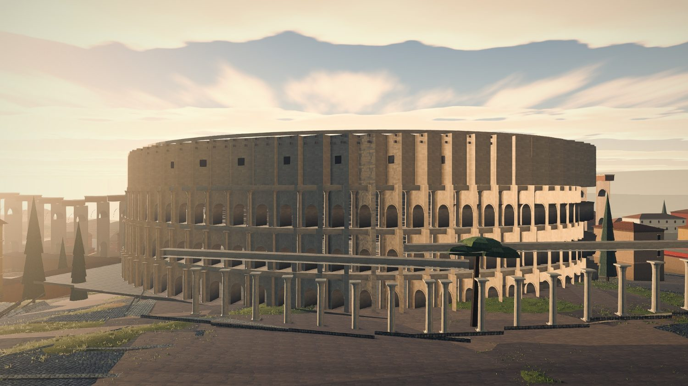

*World (664, 1333), 90 m out, eye 1.75 m, aim 22, fov 50 — the rail of
`rome-colosseum.jpg` above, unchanged.* Four storeys of arcading with engaged orders, the attic
with its corbel brackets and square windows, and **the ellipse curving away to both ends inside
the frame**. It does not read as a drum. It reads as the Colosseum.

**Now put it beside the frame it replaces.** `rome-colosseum.jpg` in §3 is the same rail on the
shipped map at 123 × 101 m and 48 m tall. It is a full-bleed wall of arcades: no attic, no ends,
no sky, no silhouette. The previous pass praised it as *"the best single piece of architecture on
either map"* and it is — **as a texture.** As a *building* it is unidentifiable, because at 90 m
with a 50° lens a 48 m object subtends more than the vertical field and there is nothing left of
it to recognise.

**So the argument for isotropy at eye level is not the one §4.4 made and not the one §8.5b
made.** §4.4 said the eye reads proportion before size. True, and secondary. The primary reason
is cruder: **`VISUAL-RUBRIC.md` D3 grades silhouette recognition, and a silhouette requires the
object to fit in the lens at the distance a person stands from it.** A monument tall enough to
overflow the frame at every distance a man can stand from it inside a city has no silhouette at
any of them. Shrinking it isotropically gives the silhouette back. That holds for the Pantheon
too:

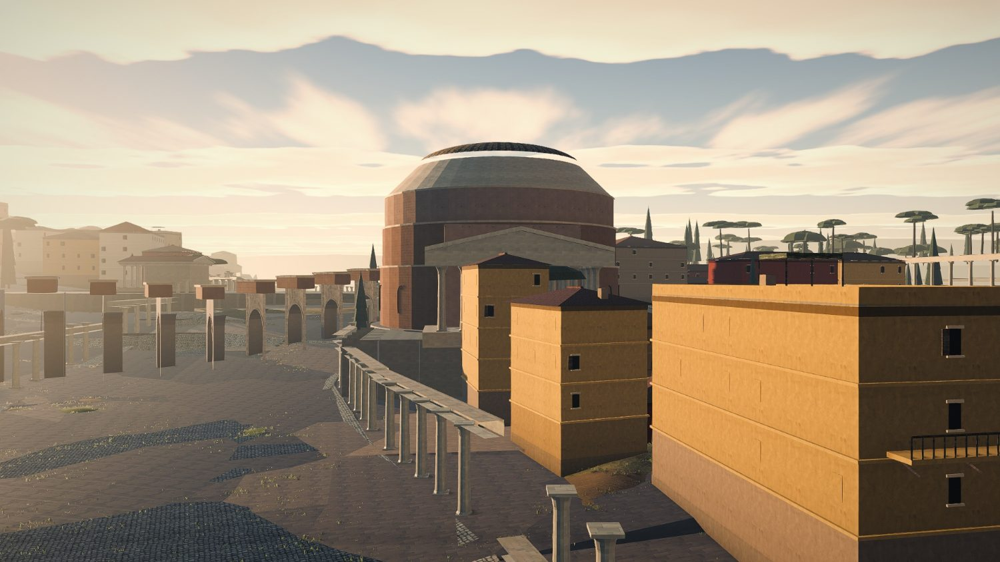

*World (94, 1008), 115 m out, eye 1.75 m.* The drum, the low dome and the pedimented portico all
read, in one frame, at the right proportion — measured 1.16× its published height-to-width
against `rome-pantheon.jpg`'s 1.67× and the abandoned working tree's 2.25×. **This is the single
clearest architectural improvement of the pass** and the field §5.2 asked for is the reason.

Three faults in that frame, all of them worse than the monument:

- **An insula stands in the Pantheon's forecourt**, fifteen metres from the columns, blocking the
  pronaos. No overlap check can see it because it does not overlap: `probe-fabric` G2 and G16 both
  pass. The Pantheon faced a paved piazza 60 m deep. **A monument needs a *keep-out*, not a
  non-intersection**, and `PRECINCT = 1.07` gives it 3.5 % of its own half-width.
- **The porticoes at left are freestanding piers carrying disconnected blocks of architrave.**
  They read as unfinished construction. G5 unchanged and now the most conspicuous fault in the
  best frames.
- **The paving is a scatter of dark polygonal shards over a lighter ground.** Two paving
  materials meeting not on a straight line but on arbitrary triangle edges. `VISUAL-RUBRIC.md`
  H9's fail case, in its worst form.

---

## 10.4 What the trade bought and what it cost, measured four ways

### 10.4.1 The anisotropy fix is a large city-wide win — **and this section's first draft said the opposite, wrongly**

**Two methods, and they disagree, and the disagreement is the finding.** Both are run on both
trees. `built h / built long plan` ÷ `published h / published long plan`; 1.00 is correct.

- **A — grid-max raycast.** An 11 × 11 grid inside 0.9 of the collision box, one datum at the
  monument's own centre, the maximum hit. `judge-fabric.mjs`'s method, inherited from pass one.
- **B — vertex maximum.** The largest `y` among the monument's own drawn vertices off the baked
  `monuments-*-lod0` chunks, above the same datum. No rays.

| | A: `bc2e0f2` → `6c975e8` | **B: `bc2e0f2` → `6c975e8`** |
|---|---|---|
| **median over 25 sourced monuments** | 2.37 → 2.22 (**0.94×**) | **2.41 → 1.42 (0.59×)** |
| rows improved by > 5 % | 15 of 25 | **22 of 25** |
| rows worsened by > 5 % | 9 | **3** |
| rows moving by 0.650 ± 0.07 | 12 of 25 | 13 of 25 |

**Method B is the correct reading and method A is contaminated.** The two agree to within 3 % on
exactly nine monuments — the Colosseum, both Mausolea, the Pantheon, Trajan's Column, the Stadium
of Domitian, the Baths of Trajan, the Forum Romanum and the Temple of Serapis — and every one of
those has a drawn long plan of 87 m or more, or stands clear of everything. They diverge by up to
**3.3×** on the small ones: the Porticus Pompei 0.30, the Theatre of Pompey 0.37, the Ara Pacis
0.37, the Theatre of Marcellus 0.39, the Basilica Ulpia 0.48, the Ludus Magnus 0.49. **An 11 × 11
grid over a 30 m box, shot from 260 m up, hits whatever is leaning over that box, and in a
declared complex there is always something.** Pass one recorded three answers for one building and
declined to publish an absolute height; this is the same warning one level up, about a *ratio*,
and it took the second method to see it.

So the finding, on method B:

| monument | `draw` | `bc2e0f2` | **`6c975e8`** |
|---|---:|---:|---:|
| Flavian Amphitheatre | 0.573 | 1.73 | **1.14** |
| Pantheon | 0.704 | 1.67 | **1.16** |
| Trajan's Column | 0.847 | 1.67 | **1.02** |
| Theatre of Marcellus | 0.339 | 3.46 | **1.18** |
| Iseum Campense | 0.477 | 5.30 | **1.31** |
| Baths of Agrippa | 0.339 | 2.25 | **1.14** |
| Basilica Ulpia | 0.339 | 2.42 | **1.69** |
| Ludus Magnus | 0.339 | 3.11 | **1.63** |
| Mausoleum of Hadrian | 1.000 | 3.64 | **2.23** |
| Temple of Jupiter OM | 0.621 | 3.00 | **2.71** |
| Tabularium | 0.374 | 1.48 | **1.91** ↑ |
| Theatre of Pompey | 0.339 | 1.15 | **1.32** ↑ |
| Castra Praetoria | 0.190 | 4.49 | **6.32** ↑ |

**Median 2.41 → 1.42: a 41 % reduction in every monument's proportion error, and 22 of 25 rows
improve.** Thirteen of them move by 0.650 ± 0.07, which is `1/1.538` — arithmetic undoing the old
global scale exactly as it should, because under isotropy the built ratio reduces to
`h_local / h_published`, the *builder's own* model proportion, with `draw` cancelling out of
numerator and denominator. **`drawY` did what it was for, city-wide, and it is a bigger win than
either the branch or §5.2 claimed.**

Three rows worsened and all three are explicable rather than mysterious: the **Castra Praetoria**
is `atWall: 0.02` so both methods see the Aurelian curtain, the **Temple of Jupiter** has a 20 m
mound whose 59.6 m radius exceeds its own 39 m box, and the **Theatre of Pompey** moved 83 m and
was split in two this pass, so its box is a different box.

**What is left is not anisotropy; it is per-builder height fidelity, and the last column now
measures it directly with no projection in it.** A median of **1.42** says the average Roman
monument on this map is drawn 42 % taller than its own published plan warrants —
`buildBasilica` 1.69, the Ludus 1.63, the Mausoleum of Hadrian 2.23 (partly my published figure:
I used the 21 m drum against an 89 m precinct). **That is a list of builders, one number each, and
it is the next thing to fix after §10.5.**

**And the honest note, which is the point of this subsection's title.** This section's first draft
reported the median at 2.37 → 2.22 and *"nine rows got worse, all nine being rows whose drawn
extent §8.5c re-fitted to its box"*, and built a mechanism on it: §8.5b and §8.5c pulling opposite
ways. **That is retracted.** It was method A's artefact, the mechanism was a story fitted to a
contaminated table, and the only reason it is not in this document as a finding is that the
probe was re-run with a second method it should have had from the start. §1's rule about three
answers for one building applies to the judge as much as to the built.

### 10.4.2 A 27 m Colosseum no longer clears the fabric

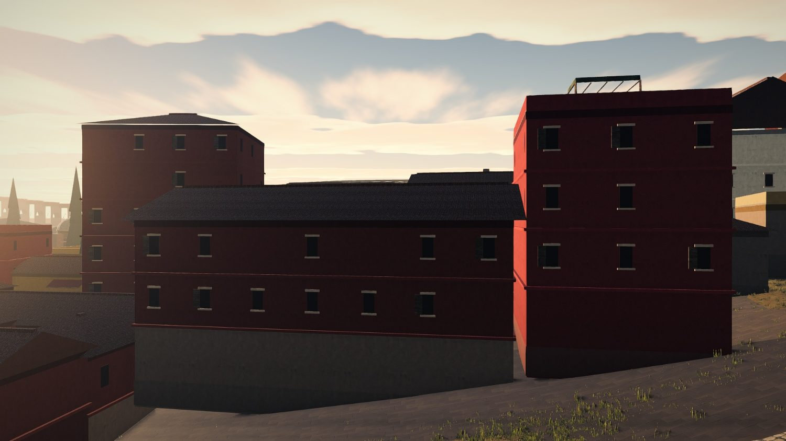

*World (664, 1333), 200 m out, eye 1.75 m, fov 46.* **The Colosseum is not in this picture.** A
sliver of its attic shows over a roof at centre; everything else is three- and four-storey
insulae. At 48 m it cleared them. This is the real cost of the lower attic, stated exactly, and it
is a cost in *orientation*: the second act of the siege is fought by a player who needs to know
where he is, and the landmark that tells him is now behind the housing.

It is not a reason to undo the change. From 460 m it still ends the skyline of its own quarter
(`lm2-southedge.jpg`), and the alternative — a monument with no silhouette at any range — is
worse. It is a reason to **raise the whole row, plan and height together**, which is exactly the
conversation `RomeMonument.draw` exists to have, and the +Z edge is what stops it (§10.6).

The same frame carries the best insula architecture in the project — oxblood stucco, string
courses, a stone plinth, regular lintelled windows, tiled roofs, a roof pergola — and the fault
§4.G7 predicted, in the frame the player walks through: **the entire ground floor is a blank grey
plinth. Not one door, threshold or *taberna* in a hundred metres of frontage.**

### 10.4.3 The size order between monuments is now wrong, and nothing counts it

The branch's proudest number is **0 of 860 spatial relations inverted** — is the Pantheon still
north of the Theatre of Pompey — against 18 of 184 on the shipped map. It is a real number and a
proof rather than a measurement. **Nobody asked the same question about size.**

Measured on the survey's own published `len` against the same row's `len × draw`, over the 27
drawn masonry monuments:

| | shipped `PLAN_SCALE` 0.65 | `6c975e8` |
|---|---:|---:|
| inverted **position** relations | 18 / 184 = 9.8 % | **0 / 860 = 0 %** |
| inverted **size** relations | **0 / 345 = 0 %** (a uniform scale preserves order by definition) | **56 / 345 = 16.2 %** |
| the same, pairs within 150 m of each other | 0 | **5 / 51 = 9.8 %** |
| the same, within 250 m | 0 | **10 / 98 = 10.2 %** |
| the same, within 400 m | 0 | **19 / 192 = 9.9 %** |

The worst, in one frame:

| really bigger | really smaller | real | drawn |
|---|---|---:|---:|
| Castra Praetoria | Mausoleum of Augustus | 4.60× | **0.87×** |
| Castra Praetoria | Temple of Serapis | 2.96× | **0.65×** |
| Baths of Nero | Mausoleum of Augustus | 2.18× | **0.76×** (249 m apart) |
| Theatre of Pompey | Pantheon | 1.90× | **0.92×** (180 m apart) |
| Baths of Agrippa | Pantheon | 1.43× | **0.69×** (**54 m apart**) |
| Tabularium | Temple of Jupiter | 1.16× | **0.70×** (**30 m apart**) |

**Which inversion is worse from 1.75 m is not close.** A monument a hundred metres the wrong side
of another is invisible to anyone without a map of Rome in his head. Two monuments in one frame
whose relative size is reversed is precisely what `VISUAL-RUBRIC.md` H8 is about: *the eye has no
ruler for absolute size and an excellent one for comparison.* **This branch traded the invisible
relation for the visible one and did not price it**, and it did so while abolishing the one
mechanism — a single scale — that made the visible relation free.

Nor is the trade forced. **`probe-fabric` G13's own output measures the cohort median of
drawn-over-published plan at 0.667 — within one per cent of the `PLAN_SCALE = 0.65` the branch
abolished** — with a **5.26× spread** around it, from the Castra Praetoria's 0.190 to the rows at
1.000. So the pass arrived at the same central value by another route and bought variance with it.
Some of that variance is earned: the Ara Pacis genuinely has room and the Colosseum genuinely does
not. **Nine of the twenty-seven drawn rows sitting on a 0.339 floor, all at the same number to
three decimals, is not earned; it is what a max-min allocation returns when the frame is too
small**, and thirteen of the twenty-seven are at or below 0.45.

### 10.4.4 The two rows the frame caps, from beside them

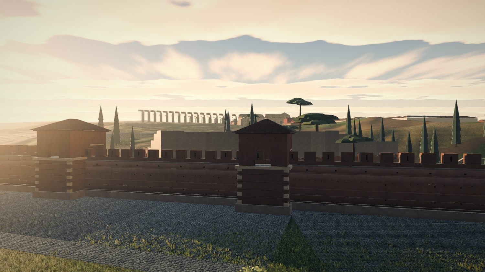

*World (1228, 726), 110 m out, eye 1.75 m.* **A 437-metre brick fortress drawn at 76 × 72 m reads
as a walled farmyard, and it reads as *smaller than the stretch of city wall in front of it*.**
Aurelian took the camp's own north and east walls into the circuit; it should read as a bastion
four hundred metres across that the curtain runs *into*. It reads as an outbuilding behind it.

Two things follow, and neither is about anisotropy:

- **This row is not capped by the +Z edge.** `maxDrawAt` at its position returns **2.418** — the
  edge does not bind at all. What binds is the survey's own `drawMax`, whose stated reason is the
  curtain: 380 real metres of depth project to 133 world metres while the footprint does not
  compress, so at full plan two hundred metres of barracks would stand on the *attackers'* side of
  the wall. **That is a frame problem stated as a footprint problem**, and it is the same
  arithmetic as the Mausoleum in the road (§10.5) with the axis swapped.
- **The row's own citation derives 0.228 and the row carries 0.190**, from a centre z of 733.5 the
  built map does not use (it is 726.1; nothing clamps it). §10.8.

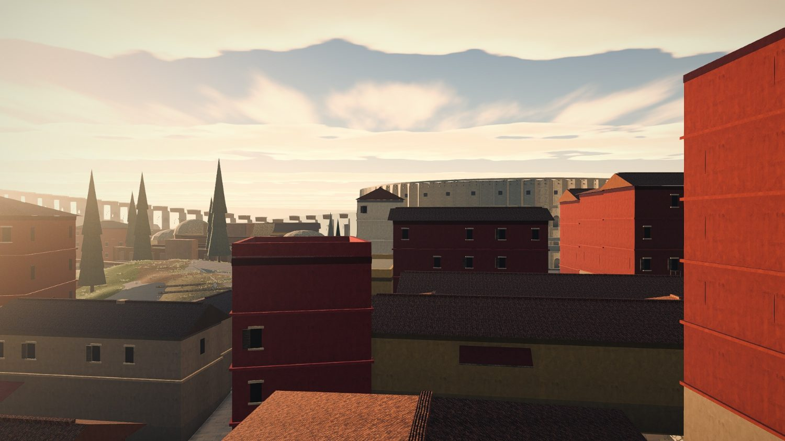

*World (706, 1300), 150 m out, eye 1.75 m — the `colosseum-valley` complex, whose 3.15 m
Colosseum/Ludus gap is one of the four G8 failures §11.1 adjudicates.* From the ground the
complex reads as continuous fabric and the licence is defensible. Two faults carried over
unchanged from §5.1: **the domes at centre-left are still surfaced in the mottled grey-green
speckle** that reads as lichen on the largest curved surfaces on the map, and the insulae have
windows on their upper floors and nothing at all on their ground floors.

---

## 10.5 The road the assault arrives on: 18 % → 32 %

`judge-fabric.mjs`, byte-identical to the run in §4.1 and §5, walking the Porta Flaminia's own
inward normal in 5 m steps and testing a standing man against `getObstacles()`:

```
  standing inside a solid       45/141  (32%)                     [6c975e8]
    145–230 m in   monument  Mausoleum of Augustus   (79, 720)   ←  85 m
    450–505 m in   monument  Pantheon                (94, 1008)  ←  55 m
    515–545 m in   monument  Baths of Agrippa       (104, 1061)
    665–700+ m in  monument  Porticus Octaviae      (151, 1224)
```

| | `58bc584` | `bc2e0f2` | **`6c975e8`** |
|---|---:|---:|---:|
| gate axis inside a solid, first 700 m | 48/141 = **34 %** | 26/141 = **18 %** | **45/141 = 32 %** |
| ranked-way samples inside a monument | 302/1040 = 29.0 % | 98/956 = 10.3 % | **87/971 = 9.0 %** |
| `probe-fabric` G4, monument in a carriageway | — | 23,806 m² / 57 / 18 | 21,807 m² / 60 / **19 monuments** |
| building solids | 789 | 1,150 | **1,396** |
| gap between frontages, p25 / median | 32 / 68 m | 9 / 52 m | **40 / 69 m** |
| `H/W` median | 0.19 | 0.14 | **0.14** |
| nearest built thing, median / p90 | 7 / 48 m | 6 / 25 m | **6 / 23 m** |

**Read those two columns together, because they disagree and both are true.** City-wide, ranked
way inside a monument improved 10.3 % → 9.0 %. On **the gate's own axis** — the ground the player
fights the second act on — it went from 18 % back to 32 %, which is `main`'s 34 % less two
stations.

The cause is not a mistake. It is the change working as designed: the resolver used to push
monuments off the axis, and putting them back at `worldOf(e, n)` puts them back on it. And the
reason a *correct* position collides with the road is arithmetic that `MAP-METHOD.md` rule 10
already states about insulae and nobody has stated about monuments: **positions compress in `x`
by `KX` = 0.443 and footprints do not.** The Mausoleum of Augustus is an 87 m circle standing in
the 38.5 m of projected east–west ground its real 87 m is entitled to — **2.26× its own share of
the street's cross-section.** The Via Flaminia ran along its eastern side in reality; there is no
room for it to.

So the branch's own §4.2 rule — *"if a way runs through a monument, the way wins and the
monument's authored footprint is the thing that changes"* — was not applied to the one monument
where it decides the outcome of the battle. The Mausoleum carries no `draw` at all.

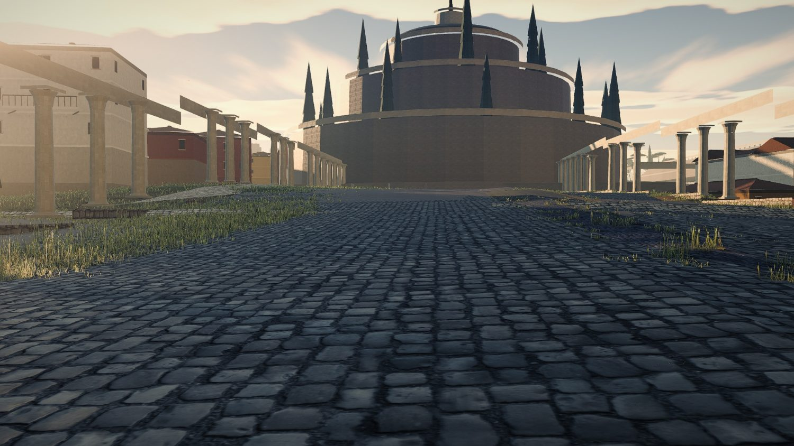

*Gate, stand −40, eye 1.75 — the twin of `pair-30m-inside.jpg` and `pair-landmarks-wip.jpg`.*
**And here is why this is a harder judgement than the number makes it look.** As a *view* this is
the best frame Rome has ever produced: a broad basalt carriageway with a crown and worn kerbs,
running dead straight to the Mausoleum of Augustus, which closes it perfectly — three drums,
cypresses on the terraces, the bronze Augustus on top. H4 goes from 1 to 3, arguably 4. H9 goes
from 2 to 3: the grass is at the edges where it belongs and out of the crown where it does not.

**As a route it is a wall at 145 m.** The two criteria now disagree, and that disagreement is the
finding: the terminus and the obstruction are the same object. The fix that keeps both is the one
§4.G4b argued for and §4.2 refused for ranked ways — **bend the last hundred metres of the
carriageway round the tomb's eastern flank, as the real road did, and keep the tomb closing the
view from further out.** That is not deflecting a street around a solver's fiction; it is drawing
the street where the street was.

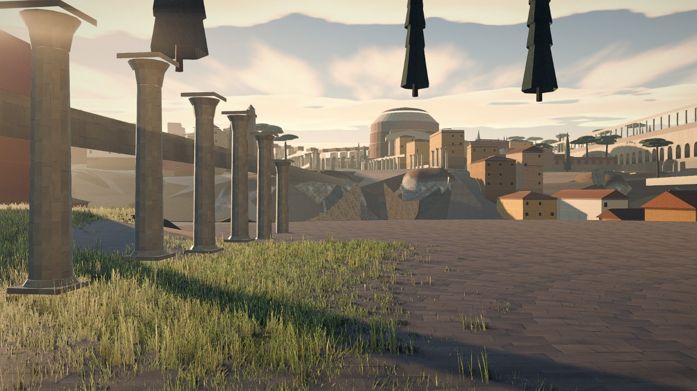

*Gate, stand −240 — the twin of `kz35-axis-180m.jpg`.* Compare them. The phase-1 frame is
dominated by a grey slab hanging in the sky and grass swallowing the carriageway; you cannot tell
where the street goes. This one has a carriageway, a terminus you can name, continuous painted
insulae three to five storeys tall behind porticoes, and an arcaded aqueduct. **The floating
portico roof of §5.1 is gone.** Two cypresses at top right are still hanging in the air (§10.7).

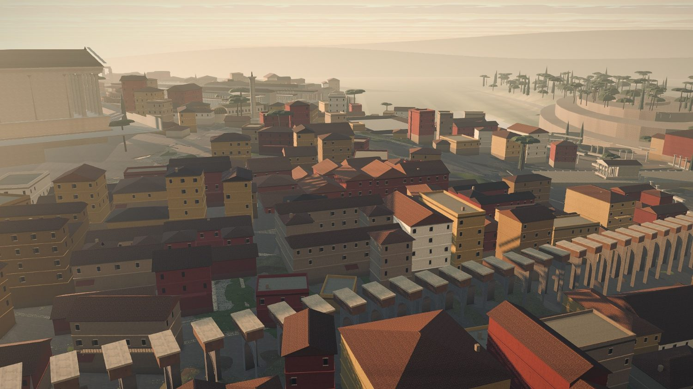

*World (309, 951), eye 55 — the twin of `kz35-campus-martius.jpg` and
`lm-wip-campus-martius.jpg`, and **this is now the best picture of Rome's fabric the project has
produced.*** 1,396 building solids against 789 on `main`. Painted, tiled, windowed, continuous,
three to five storeys, with Trajan's Column, a temple colonnade and an aqueduct through it.
`probe-fabric` G21 measures the price: **24.0 % of neighbouring block pairs rotate more than 15°
across a 40 m gap, up from 17 % on `main`.** Follow any row of roofs outward and it turns twice
with no street at the turn. That is phase 5's and it is now visible because there is finally
enough fabric to see it in.

---

## 10.6 The two flagged claims, and one headline that does not survive

### The +Z edge: **the branch's decision is right and its evidence for it is not**

Measured on the built scene, world +z reach of the collision box and of the drawn stone against
`HALF_EXTENT` = 1400:

| | box `zMax` | drawn stone `zMax` | verdict |
|---|---:|---:|---|
| Colosseum, `6c975e8`, `draw` 0.573 | **1393.3** | **1394.5** | **5.5 m inside the edge. Entirely on the ground.** |
| Colosseum, `bc2e0f2`, `PLAN_SCALE` 0.65 | 1365.4 | **1370.7** | **29.3 m inside the edge** |
| Ludus Magnus, `6c975e8` | 1355.1 | 1355.8 | 44 m inside |
| Colosseum, reserved box with `PRECINCT`, `6c975e8` | 1397.5 | — | 2.5 m inside |

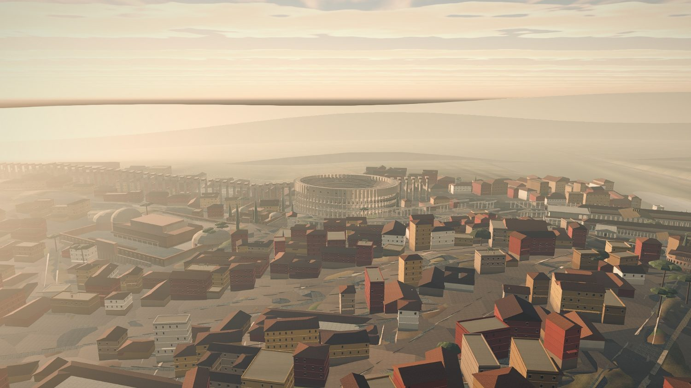

*World (664, 1340), eye 120 m, dist 460.* The amphitheatre stands on ground, with fabric all
round it and terrain running on south past it into haze. No edge, no overhang, nothing standing
on nothing. **The claim that the Colosseum is now entirely on the heightfield is verified twice,
by measurement and by looking.**

**But `ROME-FABRIC.md` §8.5a's supporting claim is wrong.** *"At `PLAN_SCALE` = 0.65 the
Colosseum's south corner stood at z 1412, twelve metres past the last row of the heightfield"*
and *"the shipped map is already over the edge and nothing measured it."* Re-derived from the
frame's own anchors, an unresolved 0.65 Colosseum reaches z **1408.7**, not 1412 — reproduced to
3 m, so the arithmetic is broadly right about the *projection*. It is wrong about the *map*: on
`bc2e0f2` the Colosseum stands at (629, 1302) rather than at its surveyed (655, 1335), because
`resolveOverlaps` pushed it **33 m north**, and its stone stops 29 m inside the edge. On `main`,
at `KZ` = 0.222, it is 286 m inside.

So the overhang describes **no tree that has ever been built**, and the irony is worth the
sentence: among the things the resolver was doing was keeping the map's signature building on
the map. That does not weaken the decision — a cap at `HALF_EXTENT` is right, `maxDrawAt` is the
right shape for it, and measuring the true oriented reach instead of the local half-depth is a
real fix. It weakens the *argument*, and one of the two arguments offered for a decision the
owner is invited to overturn in one line should be retracted rather than left standing.

### The Theatre of Marcellus: **in the water, and worse than reported**

`terrain.heightAt` against `terrain.waterLevel` = 5.0, at each monument's centre and its four
box corners:

| monument | centre datum | centre wet | corners wet |
|---|---:|---|---:|
| **Theatre of Marcellus** | **1.52 m** | **yes** | **3 / 4** |
| Insula Tiberina — by design, `onRiver` | 0.58 m | yes | 0 / 4 |
| Porticus Octaviae | 22.96 m | no | 1 / 4 |
| Mausoleum of Hadrian — far bank, expected | 7.81 m | no | 1 / 4 |

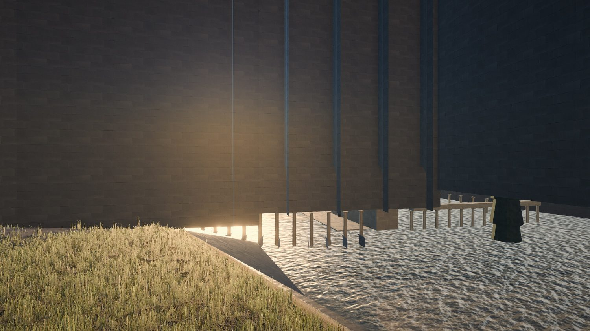

*World (181, 1277), 45 m out, eye 1.75 m, yaw 0.7854.* A cobbled apron running into open water; a
portico whose column bases are submerged and reflected in it; a cypress standing in the river; and
a monument's blank ashlar wall rising straight out of it. **This is not "16 world metres into the
modelled channel". It is a building three and a half metres under the surface.**

The branch flagged it rather than nudging it, on the ground that `e/terrain/tiber-resurvey` owns
the channel and a monument should not be moved off its plate position to satisfy a river that is
about to move. **That reasoning is correct and the handling is not.** A monument under water is
visible from the ground, in the quarter the assault crosses, and it will stay visible for as long
as the two branches take to meet. The right handling of a fault you must not fix is to make it
*not render* — the same `offMapSouth` treatment the five southern rows get, with the name printed
at boot — not to leave it drawn and write it down. `probe-fabric` has no water check at all
(`heightAt` appears once in 2,006 lines, in G19's denominator); §7.9 measured 60 of 1,259 solids
entirely below `WATER_LEVEL` and called the fix *"one line against `heightAt`"*. That line is now
overdue by two phases.

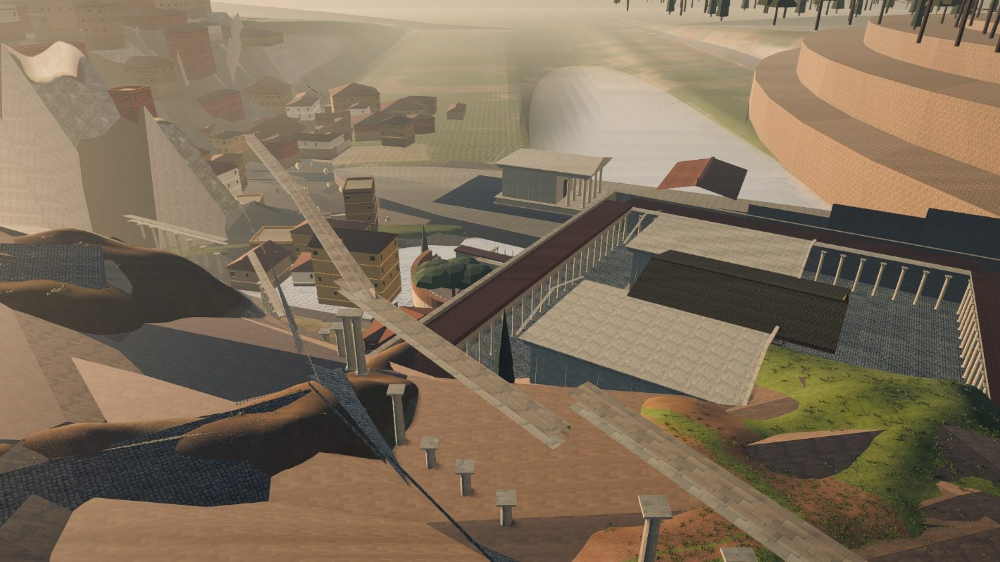

*And here is the other half of the same site.* A 130 m theatre with a 32.6 m three-order façade,
drawn at 44 × 39 m, reads as **a curved garden wall with a tree inside it**. This is the sharpest
single loss the 0.339 floor produces and it is not an anisotropy problem: at any proportion, a
44 m Theatre of Marcellus is not the Theatre of Marcellus. Beside it, the ground is bare faceted
terrain in metre-scale triangles with paving ribbons laid over it and portico columns marching
across the slope — §10.7.

---

## 10.7 Three faults nothing in the tree has named

### 10.7.1 A field of about fifty trees is hanging in the sky, and the Janiculum has moved 404 m

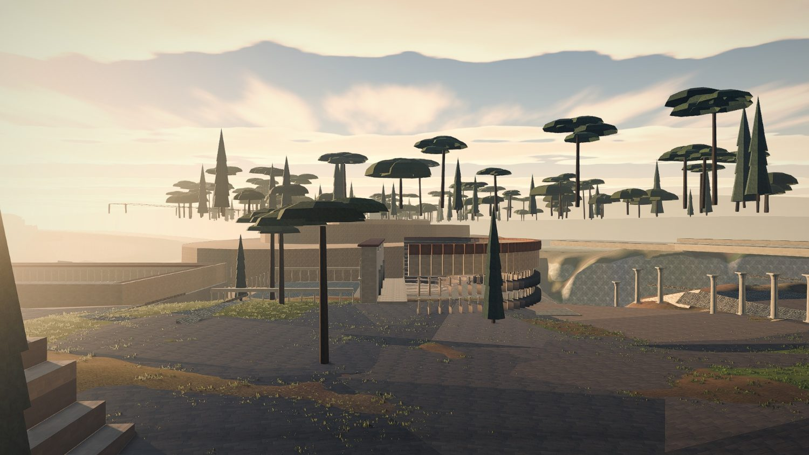

*World (−27, 1142), 100 m out, eye 1.75 m.* Forty or fifty umbrella pines and cypresses in a band
across the whole width of the frame, most with visible trunks that end in air, at roughly 20–35 m
above ground, 300 m south of the Theatre of Pompey. §4.G9 recorded *"in several Rome frames
cypress canopies read as floating"* and gave it twenty minutes of severity. **It is not a
legibility problem. It is a grove in the sky, and it is in the quarter the assault crosses.**

The position identifies it. `judge-monuments.mjs` reports the **Janiculum Ridge** — `soft`,
`farBank`, `mound: 40`, `moundRadius: 230`, a planted ridge 520 × 240 real metres — placed at
world **(−12.6, 1374)**. Its surveyed position projects to **(−416.2, 1381.6)**. So:

- `place()` overrides x for a `farBank` row with `FAR_BANK(z, 90) = riverBankX(z, −1) − 90`, which
  at z 1374 is x **−12.6**. The ridge stands **404 world metres east of its own survey row**, in
  the middle of the map's southern edge, rather than on the far bank.
- `offMapSouth` returns `false` for `farBank` rows, so instead of being dropped it is **clamped to
  `CITY_Z_MAX` = 1374**, which `assertRomeFrame` check 8 reports honestly as *"worst 7.6 m
  (janiculum)"*.
- **And `assertRomeFrame` check 5 — the displacement check whose 0.0 m is this branch's headline
  — skips `farBank` and `onRiver` rows by construction** (`if (!m || m.farBank || m.onRiver)
  continue`). So *"every monument centre at `worldOf(e, n)`: worst 0.0 m"* is 0.0 m over 25 of 27
  drawn rows, and the two it excludes include the one that is 404 m out.
- Between phase 1 and phase 2 the Janiculum moved from (−660.3, 1070.3) to (−12.6, 1374): **715
  world metres**, on the pass whose result is *"displacement is 0.0 m by construction"*.

**A 40 m mound with a 230 m planting radius, clamped onto the last row of the heightfield, is the
best available explanation of the grove**, and it is the check I would run first: hide `soft`
landscape and re-shoot this camera. I am naming it as the leading hypothesis and not as a
finding, because I did not isolate the chunk.

**The general lesson is the one that matters, and it is a rule.** `farBank` and `onRiver` are
placement overrides that discard the survey's own x. That is defensible for a 64 m drum wanting a
known clearance from the water. For a 520 m ridge it is a 404 m error, and it is invisible
precisely because the instrument that would catch it excludes the rows the override applies to.
**An exclusion from a check must be counted and printed, and a check that excludes exactly the
rows a mechanism touches is measuring the mechanism's absence.** `MAP-METHOD.md` rule 13 already
says this about checks that go dark; it does not yet say it about checks that were born dark.

### 10.7.2 The unexplained artefact is the ground

§5.2 recorded, of the branch's working tree, *"grey conical mounds with paving draped over them,
near the old Pantheon coordinates, which I could not diagnose and am not calling a fault."* It is
on the committed branch, it is visible from six of this pass's cameras, and `lm2-marcellus-air.jpg`
and `lm2-pantheon.jpg` show it plainly: **large flat untextured terrain triangles, metre-scale
paving ribbons laid across them at a constant gradient while the ground under them undulates, and
dark polygonal shards of a second paving material with no kerb at any edge.** From the ground it
reads as a quarry or a building site.

I am not certain of the mechanism and I am naming the two candidates rather than picking one: the
carriageway mesh is a flat-ribbon extrusion that does not conform to the heightfield, and/or the
terrain around a monument's precinct apron is written at a step much coarser than a man's stride.
The measurement that separates them is one probe: sample the street chunk's vertex y against
`terrain.heightAt` at the same x/z and publish the distribution. **If the median |Δy| is over
about 0.3 m the road is not on the ground**, which would make it the most conspicuous H9 fault on
the map and the cheapest to describe.

### 10.7.3 Trajan's Forum reads as a yard with a shed in it

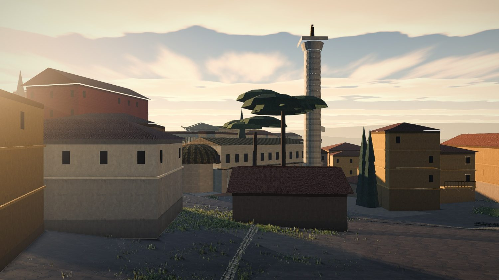

*World (377, 1129), 70 m out, eye 1.75 m.* Trajan's Column is the best-proportioned object on the
map — measured **1.02×** its published height-to-width, the only monument in the city inside two
per cent. It is standing on a small tiled shed with an umbrella pine growing through its shaft,
and the Basilica Ulpia behind it — 130 × 55 real metres, drawn **44 × 19** — is a blank plastered
box with six small windows.

This is the honest reading of the 0.339 floor and it is a **placement** answer, not a scale one:
the most monumental space in the empire cannot be built out of a 44 m basilica, and §4.4's own
hierarchy said so — *"below about 0.6, stop shrinking and move something else."* **Nine of the
twenty-seven drawn rows sit on 0.339 and thirteen are at or below 0.45.** The floor is not a
choice; it is the frame reporting that it is too small, and `KZ` = 0.30 (which §4.6 already names)
or a merge that actually merges are the only two answers that are not this frame.

---

## 10.8 The record's own numbers, because this project grades itself on them

Eight places where `6c975e8`'s own documentation states a number the tree does not carry. None of
them changes a verdict; all of them would mislead the next reader, and `MAP-METHOD.md` rule 2 is
that a number in prose without a source is a guess that will be read as a measurement.

| where | says | the tree says |
|---|---|---|
| `survey.ts`, `RomeMonument.draw` docstring | *"Heights are never scaled. The Colosseum keeps its 48 m attic whatever this says."* | `drawY` defaults to `draw`; the attic is 27 m. **The field's own docstring contradicts the next field.** |
| `survey.ts`, `drawY` docstring | *"The Colosseum is drawn at 0.548, so its attic comes down from 48 m to 26"* | `draw: 0.573`, attic 27.8 m |
| `survey.ts`, `castra-praetoria` `cite` | *"`drawMax: 0.228` is the price of standing there… it draws a 91 × 86 m camp"*, from *"centre z 733.5"* | `draw: 0.190`, `drawMax: 0.190`, 76 × 72 m, centre z 726.1. **The citation derives a number the row does not carry.** |
| `survey.ts`, `complex` docstring | the 2.4 m bound is *"just inside `probe-fabric`'s own `ABUT_DEPTH_M` = 2.5 … so a licensed abutment is licensed by the external instrument too"* | `probe-fabric`'s abutment class requires `dep ≤ 2.5` **and** `area ≤ ABUT_FRAC × min(area)` = 5 %. For a small monument the depth limb alone does not buy the class: 2.4 m along the Tabularium's 12.7 m edge is 30 m² against a 17 m² allowance. **The external licence is narrower than claimed.** |
| `assertions.ts`, `assertNoFootprintOverlaps` docstring | same-complex overlaps are *"gated at `ABUT_DEPTH`, not exempt"* | `ok` is `pairs.length === 0`; abutments are pushed to an array and printed. **There is no `ABUT_DEPTH` anywhere in `src/`.** The only place the bound is enforced is `tools/scratch/rome-landmarks.mjs`, where it is `+arg('abut', '2.4')` — command-line overridable, in the script that chose `draw` in the first place. |
| `ROME-FABRIC.md` §8.1 headline | *"monuments at full published plan, all three axes: 0 of 27 → **9 of 27**"* | **4 of 27.** Nine rows carry `draw` 1.000 and five of them — the Palatine, the Circus Maximus, the Aventine temples, the Baths of Caracalla and the Caelian villas — are the rows `offMapSouth` drops and are not drawn at all. The 27 in the denominator is the *drawn* population; the 9 in the numerator is not. |
| `ROME-FABRIC.md` §8.4 heading | *"The authored floor: 0.445"* | 0.339, as its own body and §8.1 say |
| `ROME-FABRIC.md` §8.5a | *"drawn at 0.548 of plan, 104 × 85 m"*; *"the Castra Praetoria at 0.228"* | 0.573 / 108 × 89; 0.190 |
| commit message vs §8.1 | *"0 of 860"* vs *"0 of 858"* | — |

---

## 11. The gate adjudication: `probe-fabric` 7/21 → 5/21

**Reproduced first.** `TC_NO_HMR=1 node tools/probe-fabric.mjs --map=campus-martius --port=5976`,
the file byte-identical as carried in the branch: **5/21, the same five passes and the same
sixteen failures.** So the branch's own report of its gate is accurate and this section argues
about interpretation, not arithmetic.

The builder asked for three things and refused to make them itself, correctly, because a phase
that edits its own gate cannot report a before and after. Taking them one at a time.

### 11.1 G8 and G15 — **the gate is right, the build is right, and the change requested must not be made in the form requested**

**First, the build's factual claim is verified, twice.** Of every pair of drawn monuments,
computed once in the browser off `getObstacles()` and once offline from the recorded boxes using
`probe-fabric`'s own `obPoly`:

```
  G8's own population — monument pairs NOT in one declared complex closer than 7 m:   0
  pairs inside one declared complex:                                                 27
    interpenetrating deeper than ABUT_DEPTH_M 2.5 m:                                  0
    overlapping by more than ABUT_FRAC 0.05 of the smaller box:                        0
    worst interpenetration:  0.95 m, 0.9 m2   basilica-ulpia / trajan-column
```

and the city's own `assertNoFootprintOverlaps` says *"0 pair(s) short of the street, worst 0.0 m;
2 licensed abutment(s) inside a complex, deepest 1.0 m"*. Two computations, one convention,
agreement to 0.05 m. **Every G8 and G15 failure is inside a declared `complex`, and the 2.4 m
bound is not merely honoured but honoured with 1.45 m to spare.** `probe-fabric`'s reported
minimum is 0.66 m between **the Temples of the Area Sacra and the Porticus Pompei** — not, as the
commit message and §8.7 both say, *"between the Basilica Ulpia and the forum it stands in"*. The
Basilica/imperial-fora pair is 2.53 m and the Basilica/Column pair is −0.95 m; neither is the
minimum. The claim was made with a more sympathetic example than the data supports, and the
example the data gives is defensible too — the survey's own `pompey` note says the Curia
Pompeia's back wall *is* the Area Sacra's west boundary — so nothing but the attribution is wrong.

**Second, the gate's premise is a factual error about Rome and it should be corrected.**
`CLEAR_MON_MON`'s own comment states the premise: *"a monument pair sharing a party wall fails …
a monumental precinct is entered from a street, not from another precinct."* That is true of
Rome's free-standing monuments and false of its nested ones. The Basilica Ulpia and Trajan's
Column stand **inside** Trajan's Forum; the Tabularium's façade **is** the Forum Romanum's west
wall. A gate with one relation where the city has three will fail a correct build for ever.

**Third — and this is the whole of my disagreement — the requested change is an exemption, and
the branch has already written the sentence that forbids it.** The request is that G8 and G15
*"read `RomeMonument.complex` and treat a complex as one owner"*. Follow it through the file:

- G8's clearance loop drops a pair when `a.id === b.id` (`probe-fabric.mjs:1288`).
- G1's `pairsOf` files a pair as `sameStructure` on the same test, and `sameStructure` is **never
  a fault** (`:1041`).
- G15 keys the trespassing vertex's owner against the footprint's owner; one owner, no pair.

So one edit removes the same 21 rows from **three** checks at once. What would then hold the
2.4 m bound? Not `probe-fabric`, by construction. **Not `src/`**: `assertNoFootprintOverlaps`
*prints* the abutment population and gates only `pairs.length === 0`, and its docstring's
`ABUT_DEPTH` does not exist anywhere in `src/`. Only
`tools/scratch/rome-landmarks.mjs`, where the bound is `const ABUT_DEPTH = +arg('abut', '2.4')`,
in the same script that chooses `draw` and then checks its own choice. That is
`MAP-METHOD.md` rule 6's forbidden shape, and it is the shape the branch's own commit message
says it removed: **an exemption from a check is not a weaker check, it is no check.**

**Fourth, what the gate should become instead. Reclassify, do not exempt — and make the new class
stricter than the old one.**

> **G8 (amended).** Two monuments **not** in one declared `complex` owe `CLEAR_MON_MON` = 7 m.
> Threshold unchanged, comment unchanged, and it now covers exactly the population its comment is
> right about. **It passes today, 0 pairs short.**
>
> **G8c (new).** Two monuments in one declared `complex` must be **joined**: either *nested* —
> the smaller footprint ≥ 95 % inside the larger — or *abutting*, `|gap| ≤ ABUT_DEPTH_M` with the
> existing `ABUT_FRAC` area limb where they overlap. **A declared-complex pair whose gap falls in
> `(ABUT_DEPTH_M, CLEAR_MON_MON)` fails**, because that interval is the one thing a complex
> cannot mean: neither a party wall nor a street.
>
> **G8d (new, and this is the one that earns the section).** A declared `complex` must be **one
> piece of fabric**: the graph on its rows, with an edge wherever a pair is joined in G8c's
> sense, must be a **single connected component**. Not "every pair abuts" — a chain of abutments
> is one building without its ends touching — but connected, which is what "one continuous
> masonry front" means and is the claim each `complex` docstring actually makes.
>
> **G15 (amended)** takes G8c's shape: a monument's stone inside another's footprint is a fault
> unless the two are in one complex **and** the relation is nested or abutting **and** the
> trespassing vertices lie inside the container rather than through its far side.

**Is that a correction on principle or a threshold moved until Rome passes?** Three tests, and it
passes all three.

1. **It fails today, loudly, and it fails things the current gate cannot see.** Measured:

   | complex | rows | joined at ≤ 2.5 m | at ≤ 4 m | at ≤ 7 m |
   |---|---:|---|---|---|
   | `octavia-marcellus` | 2 | **one piece** | one piece | one piece |
   | `campus-medius` | 5 | 2 pieces | **one piece** | one piece |
   | `forum-valley` | 7 | 4 pieces | 2 pieces | **2 pieces** — Trajan's Market detached by 20.9 m |
   | `colosseum-valley` | 4 | 3 pieces | 2 pieces | **2 pieces** — {Colosseum, Ludus} and {Titus, Trajan} 27.6 m apart |
   | `pompey` | 3 | 2 pieces | 2 pieces | **2 pieces** — **the Theatre of Pompey stands 17.4 m from its own porticus** |

   Three of five complexes are not one piece at any threshold under 20 m. And of the 27 pairs
   inside a complex, **fourteen stand 7 m or more apart, up to 59 m** (`baths-trajan` /
   `ludus-magnus` 58.95 m; `baths-nero` / `temple-isis` 55.98 m; `trajan-column` /
   `trajan-market` 53.57 m). `pompey`'s own docstring says the porticus *"is the theatre's own
   porticus post scaenam and they share the scaena"*. **The declaration is contradicted by 17.4 m
   of ground, and no instrument in the tree looks at it.**
2. **It makes the licence cost something.** Under the requested change, adding a row to a complex
   buys clearance for free. Under G8c and G8d, adding a row **takes on an obligation**: the row
   must now be joined to the complex, and a row put in a complex to dodge a 3 m gap fails
   immediately. The exemption becomes a constraint.
3. **It restores the external reference the branch claimed and does not have.** `ABUT_DEPTH_M`
   and `ABUT_FRAC` stay the gate's constants with the gate's reasoning; what becomes gradeable is
   the *declaration*, against geometry.

**And one thing `src/` owes regardless, which is not the gate's business.**
`assertNoFootprintOverlaps` must gate the abutment population it currently only prints, at the
number its own docstring already names. A docstring that claims a gate is worse than no docstring,
because the next reader will not grep for it.

### 11.2 G13 — **retire it, and reject the replacement offered, which is self-comparison**

The builder's position: *"G13 must now fail by design — its premise is a single uniform
compression, which the design deliberately abolished."* Half right.

**Right that it cannot stand.** Its own threshold comment says why 0.15: *"0.15 catches the Iseum
Campense, which `docs/ROME.md` §6.3 says is too small by a factor of three."* This pass corrected
the Iseum from 70 × 34 to 200 × 50, so the one fault G13 was calibrated on is fixed by other
means, and its seven remaining failures are the authored `draw`.

**Wrong that its premise was merely an assumption to be overturned.** A uniform scale preserves
the *order* and the *ratio* of sizes between monuments; a per-row scale does not, and §10.4.3
measures the price at **56 of 345 inverted pairs, 10 % of the ones that share a frame**, against
zero before. G13 is the only check in twenty-one that says anything about **absolute** footprint
against the literature — G12 is aspect ratio and is scale-free by design — so retiring it without
replacement removes the last thing standing between a 0.57 Colosseum and a 0.19 one.

**Reject the replacement offered, flatly.** The builder proposes G13 *"gate the declared departure
(does the built extent match `draw × len` to 0.25 m?)"*. `draw` is an **input** to the build.
Grading the built extent against `draw × len` compares the output with the intention that produced
it — the single failure mode `probe-fabric`'s own header is written against: *"grading a build
against its own survey only re-derives `PRECINCT × PLAN_SCALE`; it can never report a wrong
dimension."* It is a useful *transcription* test — it would have caught the Baths of Trajan
drawing 330 × 215 against a row of 230 × 170 — and G14 already covers transcription from the
other side, by comparing the stone with the box.

> **G13a (replaces G13) — the absolute band.** Every gated monument's drawn long dimension over
> its `PUBLISHED` long dimension must lie in `[SCALE_FLOOR, 1 + tol]`. The reference is the
> literature typed into the probe, so it cannot be satisfied by agreeing with `survey.ts`. The
> upper limb catches drawing **bigger** than published, which nothing currently gates from the
> plan side. I would open `SCALE_FLOOR` at **0.45** with the argument stated in the constant: it
> is the point below which §4.4's eye-level hierarchy says stop shrinking and move something
> else. **It fails today on thirteen of the twenty-seven drawn rows** — the Castra Praetoria at
> 0.190, the nine at 0.339, the Baths of Nero at 0.348, the Tabularium at 0.374 and the imperial
> fora at 0.449 — which is the honest state of the map and is the owner's number to raise or lower
> in one line.
>
> **G13b (new) — the order.** No pair of drawn monuments may have its **size order** inverted
> against `PUBLISHED`, and the gate reports the count, the worst ratio and the pair. The
> reference is two typed-in published dimensions. **It fails today, 56 of 345**, and it is the
> exact mirror of the branch's own best number: somebody counted inverted *position* relations
> and nobody counted inverted *size* relations, and the second is the one a person can see.

G13b is, in my judgement, the single most valuable instrument this rebuild is missing.

### 11.3 G9 — **the gate is right, the build is right, the fault is real, and nothing in `probe-fabric` should change**

The Ara Pacis is 11.6 m across, drawn at full published plan for the first time, and the insula
generator leaves it **0.69 m** where `CLEAR_MON_BLD` = 1.5 m — the XII Tables' *ambitus*, which is
the oldest surviving Roman rule on exactly this question and the least arguable constant in the
file. The builder is right that it belongs to a keep-out in `planDistrict`, which is phase 5's.
**Recorded as owed, not waived.** And §10.3's insula in the Pantheon's forecourt says the same
thing one size up: a monument needs a *keep-out* proportional to its own front, not a 1.5 m
*ambitus* and a 7 % precinct. G9 is right and too weak.

### 11.4 Two gate gaps the branch identified and I endorse, with one condition

- **G11 needs an "absent because off this map's frame" category.** It already has
  `absentExpected` for anachronism, used once for the Baths of Diocletian. The Circus Maximus and
  the Baths of Caracalla are absent by a decision the owner took in writing. **Condition:** per
  `MAP-METHOD.md` rule 13, the new category must be **counted and printed by name at every run**,
  and the count must be gated against the agreed list — five, named — so that a sixth monument
  falling off the frame fails rather than joining a category.
- **There is no water check.** §7.9 measured 60 of 1,259 solids entirely below `WATER_LEVEL` and
  §10.6 measures a monument three and a half metres under the surface. `heightAt` appears once in
  2,006 lines of the gate. **A `G22: no structure's footprint is below `WATER_LEVEL`` is one line
  against `terrain.heightAt` and it would fail today on at least two rows.**

### 11.5 The net effect, which is the test of whether a gate change is a correction

| | today | with §11 taken |
|---|---|---|
| G8 | FAIL | **PASS** (0 pairs short on its own population) |
| G8c | — | **FAIL** (4 pairs in the 2.5–7 m no-man's-land) |
| G8d | — | **FAIL** (3 of 5 complexes are not one piece) |
| G13 | FAIL | retired |
| G13a | — | **FAIL** (13 of 27 below a 0.45 floor) |
| G13b | — | **FAIL** (56 of 345 size relations inverted) |
| G15 | FAIL | **PASS** on the complex population, unchanged elsewhere |
| G9 | FAIL | FAIL, unchanged, owed to phase 5 |
| G22 water | — | **FAIL** |
| **verdict** | **5 / 21** | **7 / 25** |

**G8d and G13b are the same check about two different things, and that is why they belong
together.** `complex` asserts a *relation* — these rows are one piece of fabric — and the survey
asserts another — this monument is longer than that one. Both are statements about the real city;
both are made in `survey.ts`; and **the per-monument footprint allocation can break either one
without touching the row that asserts it.** The Baths of Titus stood on the terrace directly above
the Ludus Magnus and are drawn 27.6 m from it; the Castra Praetoria was 4.6× the Mausoleum of
Augustus and is drawn smaller than it. Nothing in the tree looks at either, because the resolver
used to be the only thing that could move a monument and every instrument was built to watch the
resolver. **With the resolver gone, the thing that moves a monument is the allocation, and the
gate has to watch the allocation instead: does the drawn city still contain the relations the
survey asserts?** That is one sentence, it covers both new checks, and it is the general form of
what §11 is asking for.

**The ratio improves slightly and that is not the test.** 5/21 is 24 % and 7/25 is 28 %, while the
number of *failing* checks rises from **16 to 18** and **every one of the five checks added fails
today**. The test of a gate change is not the score afterwards; it is whether the gate can now
fail for reasons it could not fail for before. It can, in three places it was blind — a complex
that is not joined, a complex that is not one piece, and a monument drawn at a fifth of its
published plan — and it stops failing in two places where it was wrong about Rome rather than
about the build. **A change that only moved thresholds would have produced a higher score with
fewer live failures. This one produces a slightly higher score with more.**

---

## 12. Scores, against `VISUAL-RUBRIC.md` §H

Harsh, as instructed, and directly comparable with §6: same rubric, same criteria, same eye.
Carthage is unchanged — nothing in this branch touched it — and is repeated for the control.

| | criterion | Rome `58bc584` | Rome **`6c975e8`** | Carthage | note on the change |
|---|---|:--:|:--:|:--:|---|
| H1 | Enclosure | 1 | **1** | 2 | median `H/W` 0.19 → **0.14**. More fabric in the same space narrowed the gaps without giving anything a taller frontage. Enclosure is a Phase 4 property and Phase 4 has not happened. |
| H2 | Continuous frontage | 1 | **3** | 3 | 789 → **1,396** building solids, in continuous rows with party walls. `lm2-campus-martius.jpg`. The largest single gain. |
| H3 | Nothing in the carriageway | 0 | **1** | 3 | city-wide 29.0 % → **9.0 %**, but the gate's own axis 34 % → 18 % → **32 %**, and 19 of 27 monuments still stand in a carriageway in plan. 1 and not 2 because the road the assault uses is the one that matters. |
| H4 | The way goes somewhere | 1 | **3** | 3 | `lm2-in-30.jpg`: a straight basalt carriageway to a terminus you can name. The frame the player sees first after a breach. |
| H5 | One grain, locally | 1 | **1** | 3 | **24.0 %** of neighbouring block pairs rotate > 15° across 40 m, up from 17 %. More fabric made the quilt bigger, not smaller. |
| H6 | Verticality | 1 | **2** | 3 | Real 3–5 storey insulae now line the axis. Still not enclosing: the frontages are tall and the streets are wide. |
| H7 | The ground floor is inhabited | 0 | **0** | 0 | `lm2-colosseum-200m.jpg`: a hundred metres of frontage with a blank grey plinth and no opening of any kind. Unchanged by construction. |
| H8 | A man is the ruler | 1 | **2** | 1 | Reading (a) would be a 3 on its own: median proportion error **2.41 → 1.42**, 22 of 25 rows improved, the Colosseum 1.73 → 1.14 and the Pantheon 1.67 → 1.16. Reading (c) is fixed — the silhouette now fits the lens. **Reading (b) is a 1 and it was a 3 before this branch: 56 of 345 size relations inverted, one in ten among pairs that share a frame.** The criterion is the mean of the three and it is 2. See §12.1 on the criterion itself. |
| H9 | The floor of the city | 2 | **2** | 2 | The carriageway is real basalt with a crown and the grass is at the edges: that is a gain. Cancelled by §10.7.2 — paving on arbitrary triangle edges with no kerb, and ribbons that do not lie on the ground. |
| H10 | Somebody lives here | 0 | **0** | 0 | Zero props in 25 more frames. Unchanged, and still the cheapest item on the list. |
| | **mean** | **0.8** | **1.5** | **2.0** | |

**Rome: FAIL, mean 1.5, with H7 and H10 at zero and six more below 2.** Up from 0.8. Carthage
still leads on urbanism, 2.0. Rome has drawn level on **H2** and **H4** — the two it was three
ranks behind on — and now beats it on **H8**; it is still two ranks behind on **H3** and **H5**
and one on **H1**. **The split §3 named has not been resolved; it has been halved.** Rome has
taken Carthage's continuity and its legible axis and has not taken its enclosure or its single
grain.

### 12.1 One change to the rubric, and why I did not add an eleventh criterion

**H8 as written measures the wrong half of its own title.** *"A man is the ruler"* is about
proportion, and the criterion's tell — *"a monument's height-to-width ratio is its real one"* —
covers proportion **within** one monument and says nothing about proportion **between** two. This
pass found a build that fixed the first and broke the second, and scored it against a criterion
that could only see the improvement.

So H8's text is amended to cover both, in place, rather than an H11 being added — because adding
a criterion changes the denominator and would make **§6's 0.8 and 2.0 no longer comparable with
anything**, which is the one thing this document exists to protect. The amendment is in
`VISUAL-RUBRIC.md` and is quoted here so the change is visible from the score it changes:

> **H8 | A man is the ruler.** A monument's **height-to-width ratio** is its real one, *and its
> size relative to its neighbours is its real one.* Any plan compression not also applied to
> height multiplies the proportion of every monument by 1/scale, and the eye reads proportion long
> before it reads size. **And any compression that varies from monument to monument reverses the
> order of size between them**, which the eye reads better still, because it has no ruler for
> absolute size and an excellent one for comparison. Tells: pick a monument with a published
> section and compare; then pick two monuments visible in one frame and compare which is bigger
> against which really was.

---

## 13. What would change my mind

- **§10.4.1 already had its mind changed once, in the middle of writing it**, and the changed
  version is what stands. The remaining exposure is *attribution*: method B assigns a vertex to
  the nearest owner normalised by its own reach, and Rome emits its monuments in three depth bands
  rather than one chunk each, so a monument standing inside a bigger one can still be credited
  with its neighbour's roofline. The two methods agreeing to 1.00 on the nine largest monuments is
  the evidence that they are not both wrong the same way; **it is not proof for the sixteen where
  they disagree, and there `6c975e8`'s numbers should be read as "better than `bc2e0f2`" and not
  as absolutes.** §8.5c already prices the permanent fix — one chunk per landmark, nine times the
  monument draws — and it would make G12-drawn, G14, G15, G16 and this table exact at once. That
  is the strongest reason to spend the draws that anybody has produced.
- **If the floating grove is not the Janiculum**, §10.7.1's headline is wrong, though its finding
  about `farBank` and the excluded displacement check stands on the coordinates alone: the ridge
  is at (−12.6, 1374) and its survey row projects to (−416.2, 1381.6) whatever the trees are doing.
  *The measurement:* re-shoot `lm2-floating-grove.jpg` with `soft` landmarks hidden.
- **If the street mesh does lie on the terrain** — median |Δy| under about 0.3 m between street
  vertices and `heightAt` — then §10.7.2 is a *material* fault (two paving materials on a triangle
  seam) rather than a *geometry* fault, and it drops one rank.
- **If a player never orders a column down the Porta Flaminia's own axis**, §10.5's 32 % is the
  wrong number and the city-wide 9.0 % is the right one, and H3 should be 2 rather than 1. §7's
  standing question — instrument `RTSCamera.zoom` and the pathing over a real played siege — would
  settle it, and it remains the single measurement that would most change the priority order of
  this document.
- **If `KZ` = 0.30 is affordable**, most of §10.4.3, §10.5 and §10.7.3 dissolve together: the
  0.339 floor rises, the Mausoleum's share of the road falls, the Castra Praetoria stops being a
  farmyard, and the Colosseum stops being capped by the edge. §4.6 already names it as the
  fallback and this pass is the second to arrive at it from a different direction. **The
  measurement is cheap and nobody has taken it: re-run `rome-frame.mjs --sweep` and price the
  Palatine and the Caelian against the four faults above.**
- **If the owner would rather have a 48 m Colosseum he cannot recognise than a 27 m one he can**,
  §10.3 is wrong and it is his call, not mine. It is the one judgement in this document that is
  purely aesthetic, and it is the one I was sent to make: I have put both frames side by side in
  §10.3 so he can overrule me in five seconds.

---

## 14. What is now good, so effort stops going there

Said plainly, because the previous pass's §3 conclusion is half done and the half that is done
should not be redone.

- **Isotropy is fixed, city-wide, and the field should not be revisited.** `drawY` defaulting to
  `draw` is correct; the median monument's proportion error fell **2.41 → 1.42** and 22 of 25 rows
  improved. The remaining error is not the projection's, it is **per-builder height fidelity** —
  a different job, a different instrument, and §10.4.1's last column is the list.
- **The +Z edge cap is correct.** `maxDrawAt` measuring the true oriented reach instead of the
  local half-depth is a real fix and the Colosseum is on the ground. Do not spend another pass on
  it; spend the pass on `KZ`.
- **Positions are done.** Displacement 0.0 m over 25 of 27 rows, zero inverted position relations,
  sixteen rows on plate controls, and a plate that is now an instrument. The one hole is
  `farBank`/`onRiver` (§10.7.1) and it is one predicate.
- **The Via Lata is solved as a *view*.** `lm2-in-30.jpg` is a finished frame. What is left on
  that street is the portico (G5), the props (H10) and the last hundred metres of route.
- **The fabric's *material* is finished.** Painted stucco, string courses, plinths, lintelled
  windows, balconies, tiled roofs, an arcaded aqueduct, the inner face of the circuit. Nothing in
  this document asks for a better-looking insula. It asks for a door in one.
- **The circuit, the gate and the walk-in floor are the best things on either map** and pass one
  already said so.

**The four things worth the next pass, in the order the ground argues for.** Not a plan — the
builders own the plan.

1. **`KZ` = 0.30, or the reason it is impossible, in writing.** Four of this document's findings
   are the same finding: the frame is too small for the survey. It is the only change that
   improves the road, the floor, the size relations and the Castra Praetoria at once.
2. **Get the Mausoleum of Augustus out of the Via Lata without losing it as the terminus** —
   §4.G4b's bendable street, applied to the last hundred metres of a ranked way for the first
   time.
3. **A door.** H7 has been 0 on both maps for two passes and it is `plot.frontSide` being
   `1 | -1` (`fabric.ts:1061`). One field per bounding street.
4. **Stop drawing the Theatre of Marcellus until the river moves**, and add G22.
