# Rome from inside it — the ground judge, pass 1

**Independent grading. No source code was changed by this pass.** Written on
`e/judge/rome-ground`, based at `bc2e0f2`. Frames were shot from two trees and both are named
against every finding: **`58bc584`** (`main`, `KZ` = 0.222 — the tree the owner looked at) and
**`bc2e0f2`** (the three builders' shared base, `KZ` = 0.35 — phase 1 landed).

**The standard, verbatim from the owner:** *"we want the city to literally be like as realistic
as possible."* **The lens of this document is the city as experienced, not the city as
surveyed.** A separate judge is grading plan fidelity from above — positions, footprints,
bearings, the river against the plates. Nothing here touches that. The question here is: *at the
height of a man, does this read as a city that people lived in, and does it read as Rome?*

---

## 0. Verdict, in four sentences

1. **Rome's architecture is better than Carthage's and Rome's urbanism is far worse, and it is
   the urbanism the owner is reacting to.** Rome has painted stucco, tiled roofs, brick, windows,
   balconies, porticoes and four good monuments; Carthage has untextured windowless prisms. But
   Carthage's prisms are laid in continuous blocks on one grain along a kerbed axis that runs to
   a terminus, and Rome's good buildings stand apart in grass. §3.
2. **The Via Lata is solid.** A man walking straight in from the Porta Flaminia on the gate's own
   axis is **inside masonry for 34 % of the first 700 metres** — three named monuments and three
   insulae — and 29 % of all ranked street length has a monument in the carriageway. §4.1.
3. **Rome has no streets.** The median gap between the two nearest frontages on the way in is
   **68 m** and the median `H/W` is **0.19**. The narrowest long corridor in the whole walled
   city is 5 m wide, floored with turf, and stops after 15 m. Carthage's equivalent is 4 m wide,
   paved, kerbed, and runs unbroken for 266 m. §4.2.
4. **The strongest argument for the landmark rework is not the one the brief expected.** Rome's
   monuments do not read *small*. They read **too tall for their width** — every masonry monument
   is drawn at 0.65 of its real plan at 100 % of its real height, which multiplies the
   height-to-width ratio of every monument in the city by **1.54**. The fix is not "raise the
   footprint floor"; it is "**scale plan and height by the same number**". §4.4, and this is the
   one finding in this document that contradicts its own brief.

Scored against the new `VISUAL-RUBRIC.md` §H: **Rome 0.8 / 4, Carthage 2.0 / 4. Both FAIL.**
§6.

---

## 1. Method, and what makes each number external

The recurring failure on this project is a check that compares something with itself, so here is
what each instrument compares against.

| instrument | what it reads | why the reference is outside the thing graded |
|---|---|---|
| `tools/shots/judge-city-eye.shot.mjs`, `…-eye2.shot.mjs` | 42 distinct eye-level cameras, three frames each, 1920 × 1080, eye at 1.75 m, lens within 15° of level | The camera is the player's own: `RTSCamera.place` floors the eye at 1.70 m at zoom 0, which is why `--set=eyeline` exists. **Every Rome shot has a Carthage twin with identical rail numbers** — same eye, same aim, same standoff, same lens, same standoff from the gate. |
| `tools/scratch/judge-fabric.mjs` | the walk in from the gate, enclosure, density | Solids come from **`CitySystem.getObstacles()`** — the oriented boxes the simulation collides with — and heights and distances from a **`THREE.Raycaster` fired at the built scene graph**. Nothing is imported from `src/city/**`, so it cannot agree with a stale copy of the generator. |
| `src/city/shoot-city.mjs --shots=plan` | built footprint against real published plan | The real dimensions come from `ROME-FABRIC.md` §4.1's cited sources (Platner & Ashby, the Severan Plan, Packer, Humphrey), not from the code. |
| `city.stats()` | ranked-way samples inside a monument | The city's own published count, quoted rather than re-derived, and it **agrees with `MAP-METHOD.md` §3's independent phase-1 measurement to the sample** (302/1,040 and 98/956). Two instruments, same numbers. |

**Two hours, deliberately.** Pass one held the sun at 10.0 on both maps so palette could be
compared and every Rome interior came back flared out: the assault comes from the north, so
`yaw: 'in'` at Rome looks **south**, into the sun's own half of the sky at 41.9 N, and Carthage's
interior faces east and has the same problem in the morning. Pass two gives each map the hour the
project's own graded shots give it — Rome 8.2, Carthage 15.4. **So the pairs are evidence about
form and not about light.** Grain, enclosure, density, street width, whether a monument blocks
the way: comparable. Palette, contrast, haze: not, and they are graded per map on its own frame.

**What I could not measure and am therefore not claiming.** Absolute monument heights. Three
methods gave three answers for the Flavian Amphitheatre — 9.2 m (a ray dropped on the centre,
which falls through the arena and reports the sand), 89 m (a ring at 0.72 of the half-extent with
the datum re-sampled under each ray), and 55.2 m (an 11 × 11 grid inside the footprint with one
datum at the centre). The third is the closest to defensible and still exceeds the real 48.5 m.
**No absolute height is quoted anywhere below.** What the measurement *does* establish, and all
§4.4 needs, is that the height is nowhere near `0.65 × 48.5 = 31.5 m`, so heights are not plan-scaled
— which is also what `layout.ts:139` says in as many words.

---

## 2. Where the cameras were

So a builder can stand in the same place. `stand` is metres out along the gate bay's own outward
normal; a negative `stand` walks into the city. **The eye sits `dist` metres outboard of the
focus**, so an eye `s` metres inside the wall needs `stand = -(s + dist)` — pass one got this
wrong and four of its twelve interior frames came back with the camera inside masonry, which is
recorded here because it is a trap and because those four frames turned out to be the finding.

| frame | tree | camera |
|---|---|---|
| `pair-approach.jpg` | 58bc584 | gate, `stand 100`, eye 1.75, aim 1.5, dist 10, fov 42, `yaw in` — eye 110 m out |
| `pair-parapet-in.jpg` | 58bc584 | bay k = 4, `lift walk`, `stand -6`, eye 1.70, aim 1.45, dist 6, fov 46, `yaw in` |
| `rome-vialata-20m.jpg`, `carth-avenue-20m.jpg` | 58bc584 | gate, `stand -30`, eye 1.75, aim 1.55, dist 10, fov 42, `yaw in` — eye 20 m in |
| `pair-30m-inside.jpg`, `rome-vialata-30m.jpg` | 58bc584 | gate, `stand -40` — eye 30 m in |
| `rome-portico-30m.jpg` | 58bc584 | as above, `yawAdd 1.5708` |
| `pair-narrowest-lane.jpg` | 58bc584 | world (−219, 784) Rome and (−141, 701) Carthage, eye 1.75, aim 1.60, dist 8, fov 46, yaw 0 |
| `rome-mausoleum.jpg` | 58bc584 | world (79, 651), eye 1.75, aim 22, dist 60, fov 50, yaw 0 |
| `rome-pantheon.jpg` | 58bc584 | world (102, 843), eye 1.75, aim 14, dist 60, fov 50, yaw 0 |
| `rome-colosseum.jpg` | 58bc584 | world (671, 1042), eye 1.75, aim 22, dist 90, fov 50, yaw 0 |
| `rome-capitol.jpg` | 58bc584 | world (362, 940), eye 1.75, aim 20, dist 80, fov 50, yaw 1.5708 |
| `rome-axis-inside-mausoleum.jpg` | 58bc584 | gate, `stand -130` — **eye 120 m in, which is inside the Mausoleum of Augustus** |
| `rome-axis-inside-pompey.jpg` | 58bc584 | gate, `stand -360` — eye 350 m in, 5 m off the Theatre of Pompey's wall |
| `pair-kz-before-after.jpg` | 58bc584 \| bc2e0f2 | gate, `stand -40`, identical on both trees |
| `kz35-gate-from-inside.jpg` | bc2e0f2 | gate, `stand -40`, eye 1.75, aim 8, dist 40, fov 42, **`yaw out`** — eye 80 m in, looking back at the gate |
| `kz35-axis-180m.jpg` | bc2e0f2 | gate, `stand -240`, eye 1.75, aim 10, dist 60, fov 42, `yaw in` — eye 180 m in |
| `kz35-campus-martius.jpg` | bc2e0f2 | world (309, 951), eye 55, aim 12, dist 150, fov 42, yaw 0 — **the one frame here that is not at eye level**, shot to verify §5.1's third finding |
| `kz35-baths-nero.jpg` | bc2e0f2 | world (309, 951), eye 1.75, aim 18, dist 110, fov 45, yaw 0 |

---

## 3. The control: what Carthage does that Rome does not — and what Rome does that Carthage does not

The owner thinks Carthage came out well and Rome did not. **He is right about the reading and the
reason is not the one it looks like.** Shot from the same eye at the same standoffs, here is the
split.

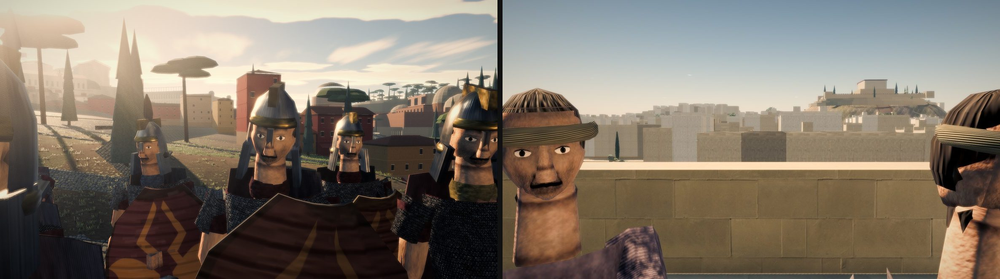

*Left, Rome: from the wall-walk of bay 4, looking into the city. Right, Carthage, identical
camera. This is the single most useful frame in this document.* Rome is green fields with three
painted blocks standing separately in them and a line of umbrella pines; Carthage is a mat of
fabric running unbroken to a citadel on a hill. Rome's blocks are better objects. Carthage is a
city.

**What Carthage has and Rome has not:**

| | Carthage | Rome |
|---|---|---|
| ranked-way samples with a monument in the carriageway | **10 / 1,717 = 0.6 %** | **302 / 1,040 = 29.0 %** |
| the narrowest long lane in the city | 4 m wide, paved, kerbed, **266 m unbroken** | 5 m wide, **turf**, blocked at 15 m |
| block grain | `CITY_BEARING = 0` — one grain everywhere | median **9.17°** departure between neighbours; 17 % over 15° in 40 m (the fabric gate) |
| what the main axis terminates on | the Byrsa, visible from the gate | nothing; the axis dies in the Theatre of Pompey |
| frontage heights on the walk in | consistently 11–24 m | 0.6, 1.0, 1.2, 1.5, 1.8, 3.0, 3.6 m — most of Rome's "frontages" are garden walls |
| lane widths | quantise to the declared module: 4 m `vicus`, 7 m local | quantise to nothing: 0, 2, 4, 5, 6, 7, 8, 9, 12, 13 m |

**What Rome has and Carthage has not** — and this list matters as much as the one above, because
the obvious wrong conclusion from the table is "make Rome look like Carthage":

- **Painted stucco.** Ochre, oxblood, cream, with tiled roofs. Carthage is one beige from the
  gate to the shore. `VISUAL-RUBRIC.md` D2 explicitly wants Romans to have painted their
  buildings, and Rome does; Carthage scores 1 there and Rome 3.
- **Openings.** Rome's insulae have windows, some have balconies, and the generator models
  arched *tabernae* (`fabric.ts:1200`). Carthage's blocks are prisms with no aperture of any kind
  anywhere, at any range.
- **Monuments that are buildings.** The Colosseum's four arcaded storeys, the Mausoleum's three
  drums with cypresses on the terraces, the Pantheon's drum and octastyle portico. Carthage's
  control monument is a rectangular platform.

  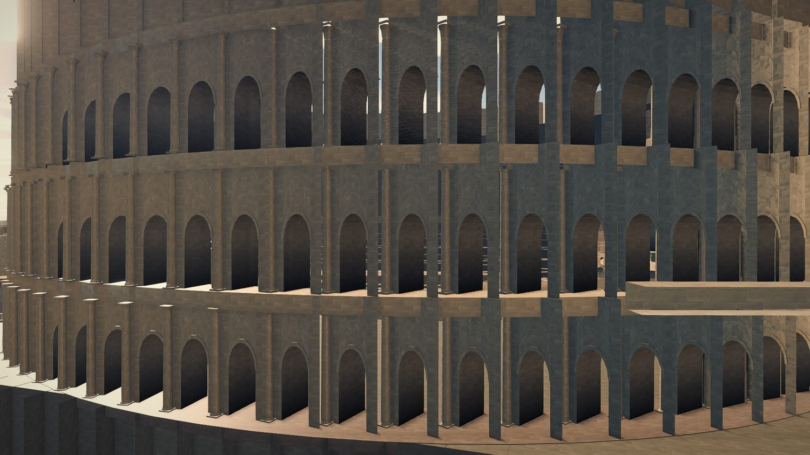

  *Four storeys of arcading with engaged orders, from ninety metres at 1.75 m. This is the best
  single piece of architecture on either map and nothing in this document asks for it to change.*
- **The wall.** From the attacker's eye Rome's circuit beats Carthage's decisively — round towers,
  brick courses, a real arched gate, statues, a tomb frontage, cypresses. Carthage's is a single
  ashlar tone with slit windows and merlons, unweathered.

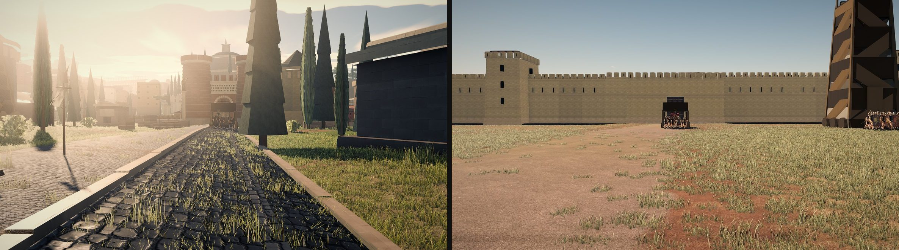

*Left, the Porta Flaminia from 110 m out at a man's height. Right, Carthage's gate from the same
camera. **This one Rome wins, and it is not close.*** (Both walls' outer faces are in shade —
Rome's faces north and is shaded at every hour; Carthage's faces west and is shaded at 10.0.
Neither frame is evidence about lighting.)

> **The conclusion the rebuild should take from this section, stated once so it is not
> misread: take Carthage's *urbanism* — one grain, continuous frontage, a legible axis, a
> declared lane module, a terminus — and keep Rome's *architecture*. Copying Carthage's fabric
> wholesale would be a downgrade in everything except the arrangement.**

---

## 4. Findings, ranked by how much they hurt in play

Ranked by *visibility to the player at the camera the player actually uses in the second act of
the siege*, which is a low camera behind the breach. A wrong thing nobody can see is worth less
than a wrong thing in his face.

### G1 — The road the assault arrives on is solid for a third of its length. **Severity: highest.**

`tools/scratch/judge-fabric.mjs`, walking the Porta Flaminia's own outward normal inward in 5 m
steps and testing a standing man against `getObstacles()`:

```
  standing inside a solid       48/141  (34%)      [58bc584]
     95–145 m in   monument  Mausoleum of Augustus      (79, 651)
    220–240 m in   monument  Baths of Nero              (32, 801)
    360–465 m in   monument  Theatre of Pompey          (43, 944)   ← 105 m of it
    580–600 m in   building                             (95, 1120)
    670–675 m in   building                            (110, 1202)
    690–700 m in   building                            (102, 1225)
```

And city-wide, from `city.stats()`: **302 of 1,040 ranked-way centreline samples are inside a
monument — 29.0 %.**

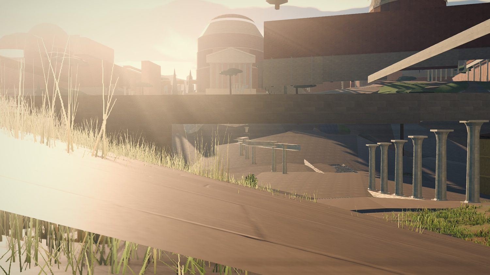

*The camera is at eye height on the gate's own axis, 120 m in. It is inside the Mausoleum of
Augustus. The horizontal bands are the drum's courses seen from within.*

**Why it is first.** This is the ground the player fights the second act on. He breaches the
Porta Flaminia, orders a cohort down the Via Lata and it walks into the Mausoleum at 95 m, the
Baths of Nero at 220 and a hundred and five metres of the Theatre of Pompey at 360. The owner's
report — *"there are some buildings literally in the middle of the road"* — is an understatement:
**the road is a suggestion drawn over a solid quarter.**

**At `bc2e0f2` this is 18 % and 98/956 = 10.3 %.** A 2.8× improvement from the projection change
alone, with no fabric work. Still five times `ROME-FABRIC.md` §5's own Phase 3 acceptance of
≤ 2 %. §5.

### G2 — Rome has no streets, it has gaps between objects. **Severity: highest.**

At every clear station on the same walk, a ray left and right to the first solid, then a ray
dropped on what it hit to get that frontage's height:

| | Rome `58bc584` | Carthage | a real ancient street |
|---|---|---|---|
| stations with a frontage on **both** sides | 61 / 141 | 22 / 141 | — |
| gap between frontages, p25 / median / p75 | 32 / **68** / 105 m | 121 / 261 / 319 m | 4–12 m |
| `H/W`, p25 / median / p75 | 0.09 / **0.19** / 0.30 | 0.05 / 0.06 / 0.10 | **1.0–3.0** |

**Read the Carthage column carefully: on the gate axis Carthage measures *worse* than Rome**,
because its avenue is a 260 m-wide apron with the blocks set right back. Carthage's advantage is
not that its main axis is enclosed. It is that its *lanes* are, and Rome's are not:

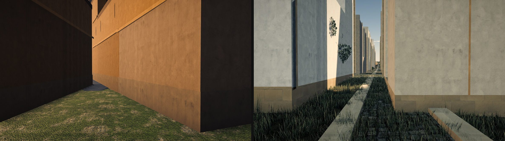

*Left, Rome's: 5 m wide at (−219, 784), floored with turf, blank on both sides, and it stops
against a wall in about fifteen metres. Right, Carthage's: 4 m wide at (−141, 701) — exactly
`PUNIC_WAY_WIDTH.vicus` — paved, kerbed on both sides, and running unbroken for 266 m. `H/W` about
3.5. Same eye, same lens, same standoff.*

The tell in the numbers is the module. Sampling 300 random open points in each city and taking
the narrower of the two opposed gaps, Carthage's answers pile up on **4** — its declared lane
width — while Rome's are 0, 2, 4, 5, 6, 7, 8, 9, 12, 13, with no repeated value. **Rome's gaps
are not streets that came out narrow. They are the leftovers between blocks that were placed
without reference to each other**, which is `MAP-METHOD.md` §1 rule 9 seen from the ground.

### G3 — Behind the gate is a park, not a quarter. **Severity: high.**

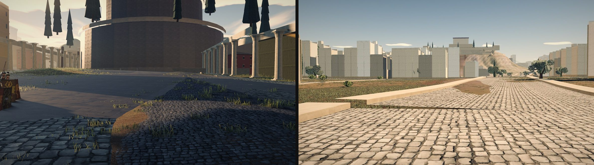

*Left, Rome, 30 m inside the gate on the Via Lata. Right, Carthage, identical camera.*

Rome measures, at 20–50 m inside the wall: **nothing at all within 250 m on the left**, and on
the right a frontage 84–97 m away that is **1.2 to 1.8 m high** — a garden wall. A random open
point in the walled city is a median 7 m from the nearest built thing but **48 m at p90** — so
this is not uniformly a low-density city; it is a city whose density is in the wrong places, and
the quarter behind the gate the battle is fought through is the emptiest part of it. That is
`ROME.md` §6.2's *"via-lata planned only 17 buildings from 593 frontages"* seen from the ground.

**At `bc2e0f2` the p90 distance to the nearest built thing falls from 48 m to 25 m** and the
building count rises 789 → 1,150. The frame changes visibly:

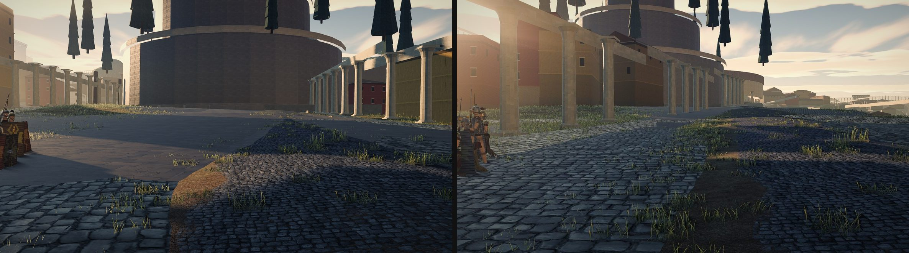

*Left `58bc584`, right `bc2e0f2`. Same shot script, same seed, same hour. The portico on the left
now has a continuous ochre frontage behind it instead of grass, and the Mausoleum is at a
plausible distance from the gate instead of a compressed one. **This is real progress and it
should be said so.*** It does not fix G1 or G2 — see §5.

### G4 — Every monument is 1.54× too tall for its width. **Severity: high, and this is the finding the landmark rework needs.**

`layout.ts:157–158` scales every masonry monument's footprint by `PLAN_SCALE = 0.65`, and
`layout.ts:139` states in as many words that *"heights are **not** scaled, only the plan"*. The
plan diagnostic confirms it row by row: **every one of the 31 masonry monuments is built at
0.695 of its real plan** (0.65 masonry × `PRECINCT` 1.07 on the reserved box), and the three
`soft` landscape items at 1.07. The ratio is identical to three decimals for all 31, so this is
one global scalar and not a per-monument decision.

A plan compression not applied to height multiplies every monument's height-to-width ratio by
`1 / 0.65 = 1.538`. Using only monuments for which `ROME-FABRIC.md` §4.1 publishes **both** a plan
and a height:

| monument | real plan | real height | real h/w | built plan | built h/w |
|---|---|---:|---:|---|---:|
| Flavian Amphitheatre | 189 × 156 m | 48.5 m | **0.257** | 122.9 × 101.4 | **0.395** |
| Mausoleum of Augustus | 87 m diameter | c. 45 m | **0.517** | 56.6 m | **0.795** |
| Theatre of Marcellus | 129.8 m diameter | 32.6 m façade | **0.251** | 84.4 m | **0.386** |
| Mausoleum of Hadrian, drum | 64 m diameter | 21 m | **0.328** | 41.6 m | **0.505** |

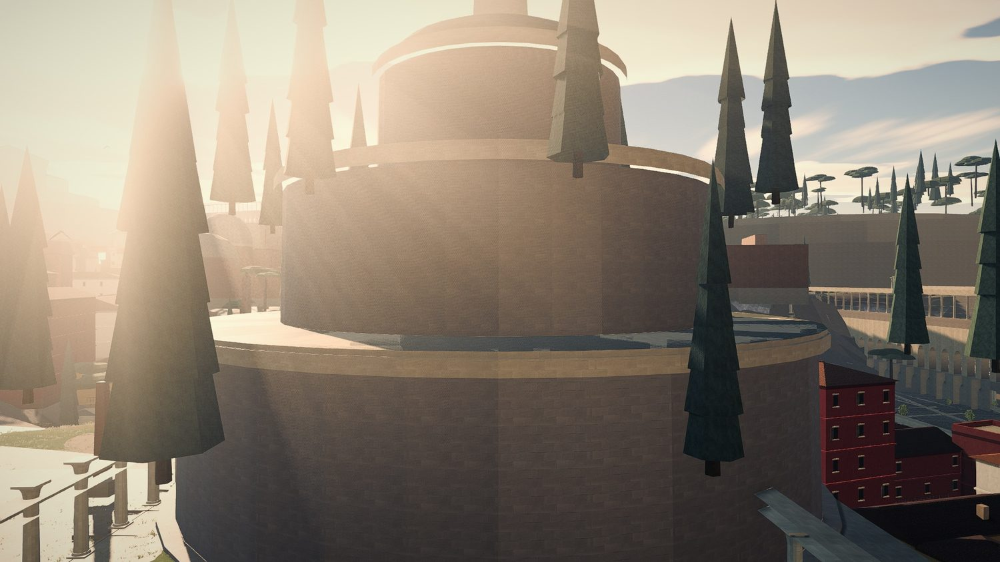

**The brief expected this section to argue for pushing the footprint floor up, and the evidence
does not say that.** At eye level Rome's monuments do not read small. The Mausoleum at 0.65 is
still an overwhelming object from sixty metres; the Colosseum's four arcaded storeys fill a
50° lens at ninety. What reads wrong is the **proportion**: a 45 m tumulus 57 m across is a
tower, and the eye reads proportion long before it reads size, because it has no ruler for size
and a very good one for shape.

**So the recommendation is not "raise the floor". It is "make the scale isotropic".** Wherever
`ROME-FABRIC.md` §4.5's per-monument authored footprint shrinks a building, it must shrink the
height by the same number and the survey row must carry **one** scale, not a plan scale and a
silent height of 1.0. A Colosseum at a uniform 0.8 — 151 × 125 × 38.8 m — still stands six times
the curtain beside it and still reads as the Flavian Amphitheatre. A Colosseum at 0.65 in plan
and 1.0 in height reads as a drum, and no footprint floor fixes that.

**The cost, stated, because `MAP-METHOD.md` §3 already priced it and it is real.** The
`--absorb` run recorded there reaches zero intersections at frozen positions *"only at a 0.36
floor and a 68 m Colosseum"*. Under isotropy a 0.36 Colosseum is also **17.5 m tall** — under
three times the curtain beside it, and no longer the object that ends the skyline. **I cannot
defend isotropy at 0.36 and I am not going to pretend otherwise.** What the eye-level evidence
does support is a hierarchy:

1. **Between "the same monument, smaller" and "a different monument, squashed", take smaller.**
   A person has no ruler for absolute size and an excellent one for proportion, especially with
   no familiar object beside it. A uniform 0.8 Colosseum reads as the Colosseum from ninety
   metres; a 0.65-plan / 1.0-height one reads as a drum. That much is safe down to roughly
   0.6–0.7 and it is where most of the survey already sits.
2. **Below about 0.6, stop shrinking and move something else.** A monument that has to go to 0.36
   to let a street past is not a scale problem, it is a placement problem, and `ROME-FABRIC.md`
   §4.5's five merges are the right instrument for it.
3. **And where nothing else will move, bend the street rather than squeeze the building** — see
   §4.5 below, which is the one place I would argue with the rebuild plan.

This is `MAP-METHOD.md` §1 rule 4 (*"positions compress, cross-sections do not"*) with the case
rule 4 does not cover: **a building's own plan is not a position.** Proposed as rule 14 in §8.

### G4b — the one place I would argue with `ROME-FABRIC.md`

§4.2 sets the rule: *"If a way runs through a monument, **the way wins and the monument's
authored footprint is the thing that changes** — because the way is a line the city was organised
around and the monument's footprint is a number in a table."* Read from the ground that is right
about `deflect()` and wrong about the general case, and the distinction is *when*:

- **Deflecting a street at build time around a solver-moved monument is indefensible** and
  deleting it is correct. That is today's `deflect()` and it is why 29 % of ranked way is inside
  masonry: the road is drawn against a position that is itself a fiction.
- **Authoring a street at survey time along the line it actually ran, around the building it
  actually ran around, is not deflection. It is drawing the street.** The Via Recta did not go
  through the Theatre of Pompey; nothing did. A hand-authored polyline in survey metres that
  bends where the real street bent is *more* faithful than a straight line plus a shrunken
  theatre, and at eye level a street that curves round a mass reads as an old city while a
  straight street through a shrunken one reads as a plan.

So: keep §4.2's rule for the *ranked* armature, where the line is the constraint — the Via Lata
from the Porta Flaminia to the Capitol is a straight line and the history says so. But for the
`local` and `vicus` ranks, let the survey polyline bend, and spend the monument's scale only when
the plate says the street really did run straight through where the building now stands.

### G5 — The porticoes are stage flats, and from any distance they read as slabs in the sky. **Severity: high — raised from medium-high after §5.1.**

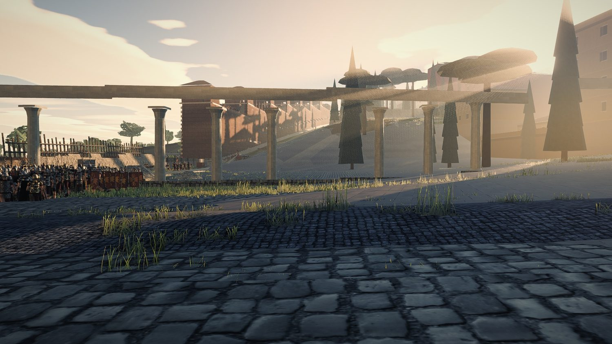

Freestanding rows of columns standing in grass, carrying a bare architrave, with **nothing behind
them** — you see through to open ground and then to the inner face of the curtain. Column spacing
measures roughly 12–15 m against a real intercolumniation of 3–4 m, the columns have no capitals
beyond a plain abacus and no bases beyond a flat plinth, and there is no roof. The Via Lata's
porticoes were the *fronts of continuous shop ranges*; drawn like this they are scenery.
This is the most conspicuous single object in the first frame the player sees after a breach.
And §5.1 found the second half of it: at any distance over about forty metres the thin, widely
spaced supports stop resolving and **the portico roof reads as a flat slab hanging in the air**.
One fix — more columns, closer together — answers both.

### G6 — Grass grows down the middle of the Via Flaminia. **Severity: medium-high, and the cheapest fix on this list.**

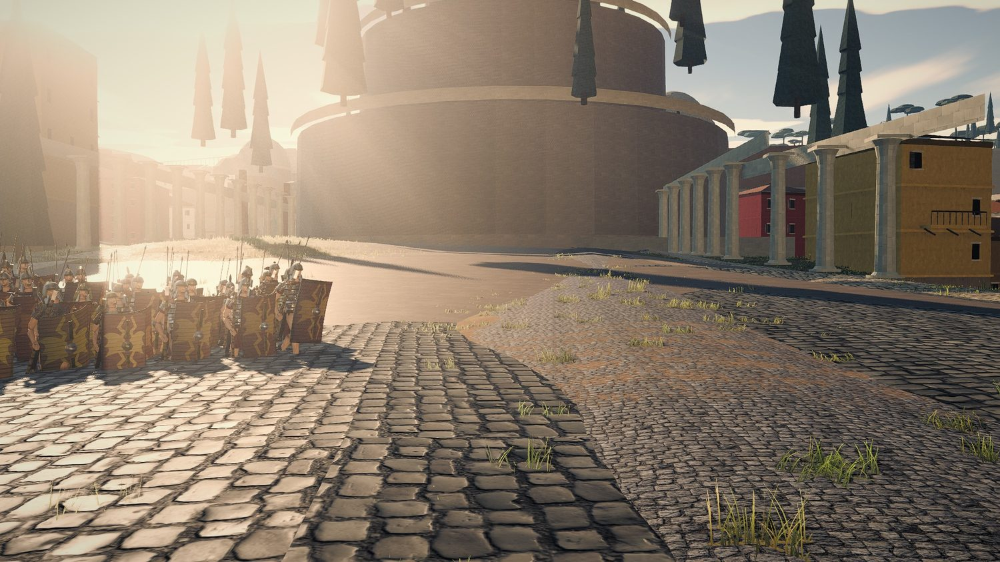

*The Via Lata, twenty metres inside the gate, with a legionary cohort at the left to size it.
The Mausoleum of Augustus closes the view; the painted insulae on the right are the only fabric
in frame; the left half of the picture is open ground.*

Visible here and in `pair-approach.jpg`, `rome-vialata-30m.jpg` and
`rome-portico-30m.jpg`: thick tufts through the entire carriageway of the busiest road in the
empire, at a gate under siege, plus bare dirt patches mid-road and two paving materials meeting
on a straight line with no kerb or gutter between them. The read is **abandoned**, and it fights
everything else in the frame. Grass in the cracks at the edges is right; grass down the crown of
a consular road is not. Carthage has the same fault on its avenue and in its lanes.

### G7 — Three insula faces in four are blank by construction. **Severity: medium.**

At 30–80 m from the eye no frontage in any Rome frame carries a door, a shopfront or a threshold.
Two reasons, both in the generator: `plot.frontSide` is `1 | -1`, so *tabernae* and balconies go
on **one** side of each insula only and the sides get `front = 0` (`fabric.ts:1061`,
`fabric.ts:1201`); and `detail === 0` returns a plain box (`fabric.ts:1025`). In a real Roman
block every face that met a street had shops on it. Per `VISUAL-RUBRIC.md` critic rule 5 this
scores on what is in the frame, and what is in the frame is painted blank wall — but the fix is
cheap and specific: give a plot a `front` per bounding street rather than one, which falls out of
`ROME-FABRIC.md` §4.3's "blocks are faces of the road graph" for free, since a face knows all its
edges.

### G8 — Nobody lives here. **Severity: medium, and the cheapest of all.**

Across the twenty-five eye-level frames I inspected, of two cities, there is not one cart,
stall, awning, amphora, altar, fountain, tethered animal, washing line or piece of rubbish. A city of a million people with
nothing in its streets reads as a model of a city. This is scatter geometry on a keep-out mask —
the same machinery the *horti* in `ROME-FABRIC.md` §5 Phase 6 already need — and it would do more for
"this is a place" per draw call than any other item on this list.

### G9 — Props and trees intersect masonry. **Severity: medium.**

- Cypresses pass through the Mausoleum of Augustus's drum faces and its cornice
  (`rome-mausoleum.jpg`, centre and right of centre).
- An umbrella pine stands on the Pantheon's portico steps, in front of the columns:

  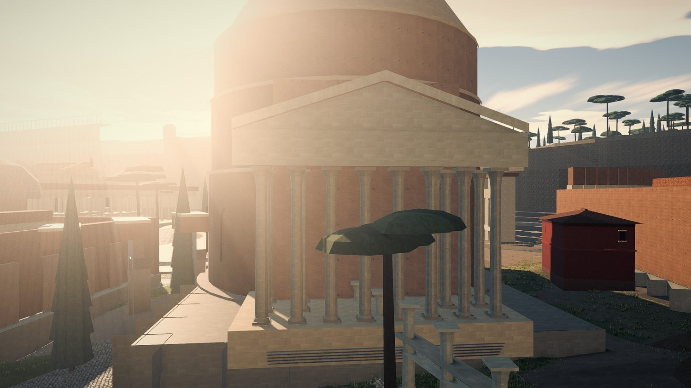

  *The drum, the dome and an octastyle portico all read, and the brick-and-travertine palette is
  right. The tree is standing on the steps. The dome has none of the seven stepped rings at its
  base, the tympanum is empty, and the drum carries neither of its two heavy cornices — so the
  building is recognisable in mass and not in silhouette, which is `VISUAL-RUBRIC.md` D3.*
- A shrub is embedded in a blank wall face at Carthage (`pair-narrowest-lane.jpg`, right half,
  upper left of the lane).
- In several Rome frames cypress canopies read as **floating**, with no trunk and no ground under
  them. Some are genuinely planted on the Mausoleum's terraces and the parapet hides the trunk,
  which is correct; from the ground the two cases are indistinguishable and both read as trees
  hanging in the air. Worth twenty minutes to make legible either way.

### G10 — The Temple of Jupiter Optimus Maximus reads as a warehouse with a gable. **Severity: medium-low — it is 500 m behind the gate.**

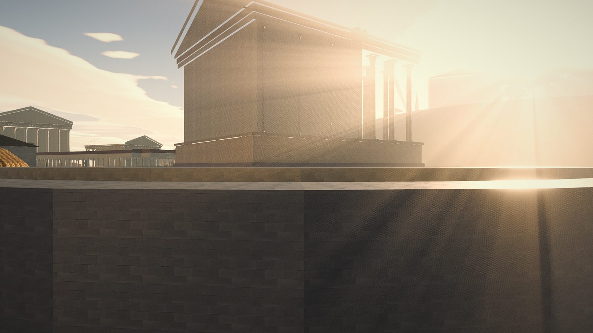

The cella is a plain prism; the flank colonnade is a short row of five columns that stops
half-way along it; there is no peristyle, no cornice, no roof tiles, no acroteria, no tympanum
sculpture and no cult group. The Tabularium's ashlar substructure below it is the best thing in
the frame. The most important temple in the Roman world is the least finished monument on the
map, and the same is true of the Pantheon's dome, which is a smooth shell with none of the seven
stepped rings that make it recognisable in silhouette.

---

## 5. Re-grading `bc2e0f2` — phase 1, measured from the ground

Same instrument, same camera, the builders' shared base.

| | `58bc584` | `bc2e0f2` | target |
|---|---:|---:|---|
| building solids | 789 | **1,150** | — |
| ranked-way samples in a monument | 302 / 1,040 = 29.0 % | **98 / 956 = 10.3 %** | ≤ 2 % (`ROME-FABRIC.md` §5 Phase 3) |
| gate axis inside a solid, first 700 m | 48 / 141 = 34 % | **26 / 141 = 18 %** | — |
| longest solid run on the axis | 105 m (Theatre of Pompey) | **105 m** at 215–320 m in | — |
| gap between frontages, p25 / median | 32 / 68 m | **9 / 52 m** | — |
| `H/W` median | 0.19 | **0.14** | 1.0–3.0 |
| distance to the nearest built thing, median / p90 | 7 / 48 m | **6 / 25 m** | — |

**Verdict on phase 1 from the ground: a real, visible improvement, and it does not touch the two
findings that matter most.** Density is up and the empty band behind the gate is gone —
`pair-kz-before-after.jpg` shows it without a table. But the axis still has 105 unbroken metres of
monument across it, ranked way inside a monument is still five times its own acceptance figure,
and the median `H/W` **fell**, because more buildings in the same space narrowed the p25 gap
without giving anything a taller frontage. Enclosure is not a by-product of density; it is a
by-product of blocks that address a line, and that is Phase 4.

**This is not a sign-off.** Per the brief: better than before is not the bar.

### 5.1 Four things visible only on `bc2e0f2`, from the same eye

Shot from the tree this document is committed on (`74e0841`, whose `src/` is `bc2e0f2`'s),
`hour` 8.2, cameras named in §2 of the shot script `tools/shots/judge-city-eye3.shot.mjs` and
`tools/shots/judge-float-verify.shot.mjs`.

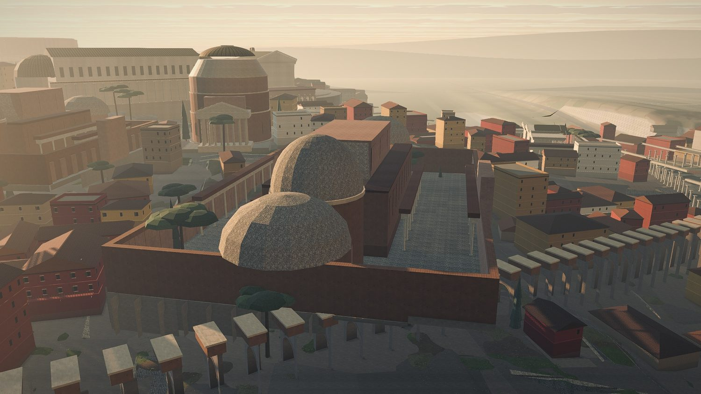

**First, credit where it is due: the right half of this frame is a city.** Three to five storeys,
painted, tiled, windowed, in continuous rows, with an aqueduct running out through it. Nothing on
`main` looks like this. The projection change bought it and it should be said plainly.

**Second, the grain fault is now the most visible thing in the frame** and it was not, before,
because there was not enough fabric to see it in. Follow any row of roofs from the middle of the
right-hand quarter outward and it turns — twice — with no street, contour or river at the turn.
`MAP-METHOD.md` §1 rule 9 from the air; §4.2's `H/W` is the same fault from the ground.

**Third — and this is the finding I nearly published wrong — the porticoes read as floating
slabs.** In `kz35-axis-180m.jpg` below, a row of flat roof plates hangs in the air over the
Campus Martius with nothing visibly under them, and my first reading was "a monument is
levitating". It is not: they are portico roofs whose columns are thin enough and far enough apart
(12–15 m against a real 3–4 m) that at any distance over about forty metres **the supports stop
resolving and the roof reads as a slab in the sky.** Verified with two extra cameras before
writing it down, which is the only reason this paragraph says what it says. G5 is therefore worse
than pass two graded it: the porticoes fail at eye level *and* from the air, and the fix —
more columns, closer together — is the same one.

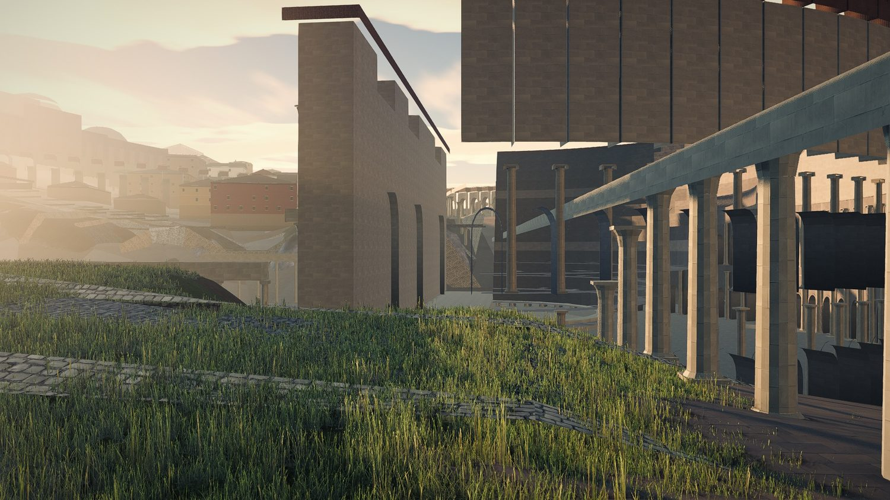

*Grass has swallowed the carriageway; the paving survives as ribbons in it. The slabs at
mid-right are portico roofs, not floating buildings.*

**Fourth, two material faults on the two biggest objects in the Campus Martius.**

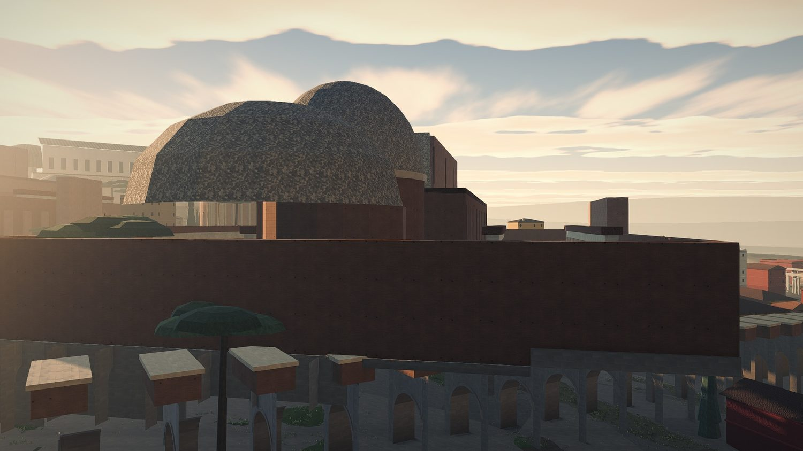

- **The domes are surfaced in a mottled grey-green speckle** that reads as lichen or granite
  chippings, on the largest curved surfaces on the map. A Roman dome of this date is tiled, or
  gilt bronze, or rendered *opus signinum*. This is the single most conspicuous material error at
  `bc2e0f2` and it is one texture.
- **The precinct wall is twenty metres of unarticulated brick across the whole frame** — no
  pilasters, no blind arcading, no cornice, no string course. The Aurelian Wall's *inner* face in
  `kz35-gate-from-inside.jpg` has blind arcading and looks far better for it; the same treatment
  on the bath precincts is nearly free.

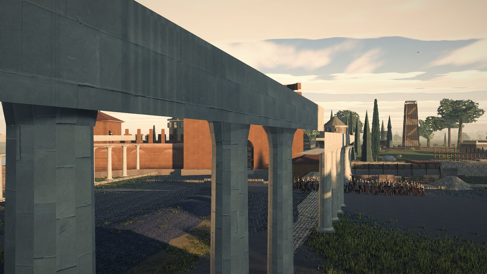

*The frame the player is looking at while the ram works, at `bc2e0f2`. The inner face of the
circuit and the aqueduct both carry real mass and this is the best interior frame either tree
produced. The aqueduct's piers have no imposts and its arches no mouldings, so it reads as a
concrete flyover rather than an Aqua; and the ground inside the gate is a shapeless apron of
grass and cobble with no kerb and no carriageway, which is G6 again.*

### 5.2 The landmark rework, graded before it lands — because the timing matters

**Nothing on `e/city/rome-landmarks` is committed yet.** So this section is not a re-grade of
landed work; it is a read of that branch's *uncommitted* diff, applied to a scratch checkout at
`bc2e0f2` and shot from the same eye, **so that one finding reaches the builder before the
survey rows are written rather than after.** Treat every judgement here as provisional: the tree
is mid-edit and everything in it may change, and one thing I saw in it (grey conical mounds with
paving draped over them, near the old Pantheon coordinates) I could not diagnose and am not
calling a fault.

**First, and it is the biggest single visible improvement of the day:**

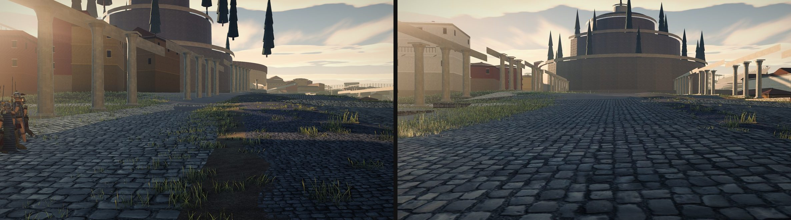

*Left `bc2e0f2`, right the landmark branch uncommitted. Same camera, same seed, same hour.* The
Via Lata now runs as a broad basalt carriageway **dead straight to a terminus**, porticoed both
sides, with painted insulae behind. That is H4 going from 1 to 3 in one branch, and it is the
frame the player sees first after a breach.

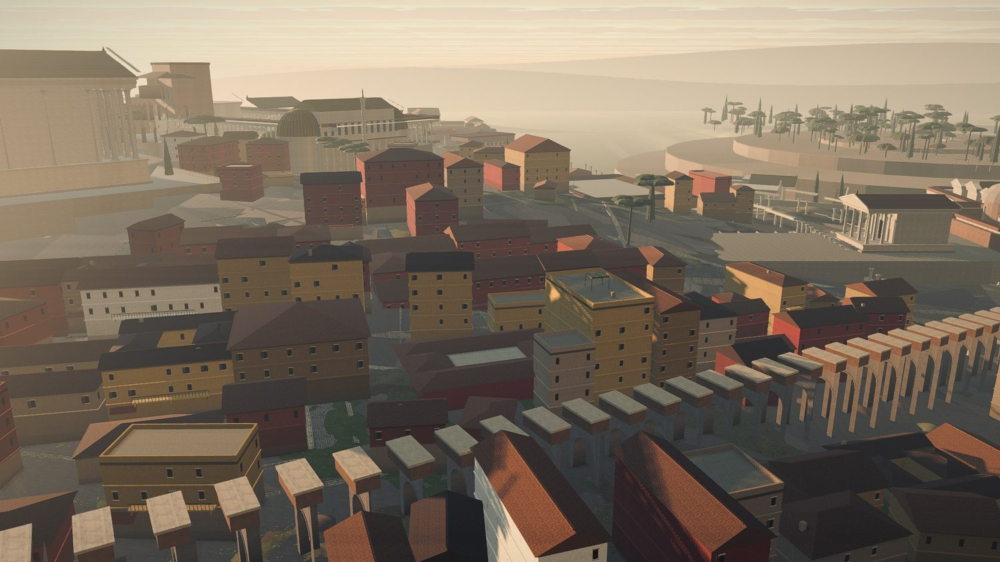

*And the quarter behind it is now three to five storeys of painted, tiled, windowed insulae in
continuous rows, with an aqueduct through them. This is the best picture of Rome's fabric this
project has produced.*

**Second — and this is the reason this section exists — the rework is about to make G4 worse for
the monuments that matter most, and it is one field away from fixing it instead.**

`PLAN_SCALE` is abolished, which `ROME-FABRIC.md` §4.5 asked for and which is right. In its place
`place()` reads `drawScaleOf(m) = m.draw ?? 1`, and 22 of the survey's rows now carry a `draw`.
**But the rule that heights are unscaled is not merely preserved, it is restated in the new
comment**: *"Monuments are authored at true scale and compressed **in plan only** by the
placement matrix: heights pass through at 1:1, so the Colosseum keeps its 48 m attic."* So the
anisotropy stops being one global constant and becomes twenty-two of them, each authored by hand
into a survey row — which is exactly the form that is hardest to reverse later.

The numbers, read off the branch's own `survey.ts` comments:

| monument | new `draw` | drawn plan | real height | h/w real | h/w drawn | anisotropy |
|---|---:|---|---:|---:|---:|---:|
| **Pantheon** | **0.445** | 37 × 26 m | c. 43 m | 0.74 | **1.65** | **2.25×** |
| **Temple of Jupiter OM** | **0.445** | 28 × 24 m | — | — | — | **2.25×** |
| **Theatre of Marcellus** | **0.445** | 58 × 51 m | 32.6 m façade | 0.25 | **0.56** | **2.25×** |
| Flavian Amphitheatre | 0.548 | 104 × 85 m | 48.5 m | 0.26 | **0.47** | 1.82× |
| Baths of Nero | 0.445 | 85 × 62 m | — | — | — | 2.25× |
| Trajan's Column | 0.445 | 8 × 8 m base | c. 30 m | — | — | 2.25× |
| **Mausoleum of Augustus** | *(none — 1.0)* | 87 × 87 m | c. 45 m | 0.52 | **0.52** | **1.00× ✓** |

Read the last two rows together, because they are the whole argument. **The Mausoleum, which no
longer carries a scale at all, is now drawn at true plan and true height and is therefore
*correct* — the rework has already fixed G4 for every monument it did not have to shrink.** The
twelve-odd rows with no `draw` are a real win and nobody should undo them. It is the twenty-two
with one that are the problem, and the floor has fallen from the old global 0.65 to **0.445**, so
for those the proportion error has gone from 1.54× to **2.25×**.

A 26-metre Pantheon at its full height is 1.65 times as tall as it is wide. The building whose
defining property is that its interior is a sphere becomes a chimney, and it is one of the three
silhouettes a person uses to recognise Rome without a caption (`VISUAL-RUBRIC.md` D3).

**The change I am asking for is one field and one multiply**, and it can be made before the
branch commits:

- add `drawY` alongside `draw` in `RomeMonument`, **defaulting to `draw` rather than to 1**, so
  that isotropy is what you get unless a row says otherwise;
- apply it in `buildLandmark`'s placement matrix, which already takes a non-uniform scale safely
  (its own comment says so — normals are recomputed from transformed edges in
  `GeoStream.prepare`);
- and where a row wants its full height anyway, it writes `drawY: 1` **with the reason beside
  it**, which is the same discipline the `draw` column already has and the reason that column is
  an improvement on `PLAN_SCALE`.

At `draw: 0.445` the Pantheon would then stand 19 m to its crown instead of 43. That is a real
loss and it is smaller than the one being taken: a 19 m Pantheon still reads as the Pantheon, and
a 26 m one at 43 m does not read as anything. **If a monument cannot survive its own scale in
three axes, the honest answer is that it should not be shrunk that far — which is a placement
question, and §4.5's merges and §G4b's bendable streets are where it should be answered.**

---

## 6. Scores, against `VISUAL-RUBRIC.md` §H

Harsh, as instructed. 0 = absent, 1 = attempted but wrong, 2 = acceptable, 3 = matches Rome II,
4 = exceeds it.

| | criterion | Rome `58bc584` | Carthage | note |
|---|---|:--:|:--:|---|
| H1 | Enclosure | **1** | **2** | Rome median `H/W` 0.19; Carthage 0.06 on the avenue but ~3.5 in its lanes, and it *has* lanes |
| H2 | Continuous frontage | **1** | **3** | Rome: free-standing blocks with grass on four sides. Carthage: a continuous mat |
| H3 | Nothing in the carriageway | **0** | **3** | 29.0 % against 0.6 % |
| H4 | The way goes somewhere | **1** | **3** | Rome's axis dies in three monuments; Carthage's runs to the Byrsa |
| H5 | One grain, locally | **1** | **3** | 9.17° median departure against 0.00°; Carthage's single global grain is its own error, hence 3 not 4 |
| H6 | Verticality | **1** | **3** | Rome's measured frontages are mostly 1–4 m; Carthage's 11–24 m |
| H7 | The ground floor is inhabited | **0** | **0** | Rome: three faces in four blank by construction. Carthage: no aperture anywhere |
| H8 | A man is the ruler | **1** | **1** | Rome: every monument 1.54× too tall for its width. Carthage: no plan scale at all, hand-typed half-extents, unfalsifiable |
| H9 | The floor of the city | **2** | **2** | Both: real paving with kerbs, both with grass down the crown and raw dirt patches |
| H10 | Somebody lives here | **0** | **0** | Zero props in 42 frames across both maps |
| | **mean** | **0.8** | **2.0** | |

**Rome: FAIL, mean 0.8, with H3, H7 and H10 at zero and six more below 2.**
**Carthage: FAIL, mean 2.0, with H7 and H10 at zero.**

The categories where Rome beats Carthage are all in `VISUAL-RUBRIC.md` D, not H: D2 material
honesty (Rome 3, Carthage 1), D1 mass and thickness at the wall (Rome 3, Carthage 2), D3 silhouette
recognition (Rome 3, Carthage 2). **Rome's problem is entirely in H and that is why five probes
and a plan diagnostic passed it.**

---

## 7. What would change my mind

Named so the findings are falsifiable rather than merely argued.

- **If the player never gets below about 20 m in practice**, the whole lens is mis-set and
  G5–G9 drop two ranks each. *The measurement that decides it:* instrument `RTSCamera.zoom` over
  a real played siege and publish the distribution of eye height. The evidence I have says the
  low camera is used — `--set=eyeline` exists precisely because the owner reported walking at a
  soldier's eye line — but I have not measured how long he spends there. **This is the single
  measurement that would most change the priority order of this document.**
- **If the frontage heights in G2 are an artefact of my raycast** — if the ray is hitting 1.2 m
  garden walls and calling them frontages while a four-storey insula stands ten metres behind —
  then H1 and H6 are wrong. I record what each ray hit and its height, and the low numbers are
  the finding rather than an error, but a builder who can show those are enclosure walls in front
  of real frontage has refuted G2. *The measurement:* re-cast ignoring solids under 4 m and see
  whether the gap distribution collapses.
- **If heights *are* plan-scaled somewhere I did not find**, G4 collapses entirely. Two
  independent things say they are not: `layout.ts:139`'s own words, and a measured Colosseum
  silhouette of 55.2 m against a plan-scaled 31.5 m. A single counter-example in
  `monuments.ts` where `planScale` reaches a y coordinate would settle it the other way.
- **If `PLAN_SCALE` is raised isotropically and the Campus Martius then cannot be laid out**,
  G4's recommendation is unaffordable and the right answer becomes "shrink isotropically to
  whatever fits, and accept a smaller Rome" rather than "keep the height". `ROME-FABRIC.md`
  §4.5's own table already prices this and the answer is not obviously bad: at a uniform 0.65 the
  monuments are *the same footprint they are today*, so the change costs nothing in ground and
  buys back every monument's proportion. **I can see no argument against it and I would like one.**
- **If the owner's objection is actually about the aerial read and not the ground read**, then
  §3's conclusion — keep Rome's architecture, take Carthage's urbanism — is the wrong emphasis
  and the fabric should simply be rebuilt on Carthage's lines. I do not think so: the fabric gate
  already measured the aerial grain and the owner looked at a *render*, not a plan.

---

## 8. Proposed additions to `MAP-METHOD.md` §1

Two rules, each traceable to this pass, written for whoever next edits that file. Appended to §3
as an entry in the same commit.

> **14. Compress a *position* anisotropically if you must; compress a *building* isotropically or
> not at all.** Rule 4 covers positions against cross-sections and does not cover the case that
> bit Rome: a building's own plan scaled without its own height. `PLAN_SCALE = 0.65` on the plan
> with height left at 1.0 multiplies the height-to-width ratio of all 31 masonry monuments by
> **1.54**, turning a 45 m tumulus 87 m across into a 45 m tower 57 m across. The eye has no ruler
> for size and an excellent one for shape, so this is the *first* thing wrong with a monument at
> eye level and the last thing a plan view can show. Hold one scale per monument, applied to all
> three axes, recorded in the survey row beside the real dimension it departs from.

> **15. Grade a map from 1.75 m before grading it from 150 m.** Every visual instrument this
> project had photographed the city from a tactical camera, and at that altitude a monument
> shrunk to fit, a street with a building standing in it and a quarter with no street at all all
> look acceptable. One shot script and one scene probe, at a standing man's eye, scored the
> shipped Rome **0.8 / 4** on maps that `probe-fabric`, the plan diagnostic,
> `assertNoFootprintOverlaps` and `assertNoFabricOverlaps` had all passed. **The altitude of the
> camera is part of the instrument, and nobody had written it down.**

---

## 9. What I would do next, in order

Not a plan — the builders own the plan — but the order the *ground* argues for, which is not the
same as the order the survey argues for.

1. **Phase 3 (roads before blocks) is worth more than Phase 2 (landmarks), from the ground.**
   G1 and G2 are the two highest-severity findings and both are road faults. Phase 2 fixes
   displacement, which the player cannot see; Phase 3 fixes what he walks into.
2. **Make the monument scale isotropic in Phase 2 anyway** — it is a one-line change to
   `place()` plus a survey column, and **at today's 0.65 it costs no ground at all**, because the
   footprints do not move: only the heights come down to match them. That single change fixes G4
   for all 31 monuments in one edit, and it can be done before anyone decides what the
   per-monument floors should be. If it turns out that a 0.65-height Colosseum is unacceptable —
   31.5 m against a 6.5 m curtain, still five times it — then the answer is to raise *both*
   numbers for that row, which is the conversation the survey column exists to have.
3. **Give a block a `front` per bounding street** when blocks become faces of the graph in
   Phase 4. That is G7 for free.
4. **Turn the grass off in the carriageway and put carts in it.** G6 and G8 are the two cheapest
   items on the list, neither needs the rebuild, and between them they are most of the difference
   between "a model of a city" and "a city".
