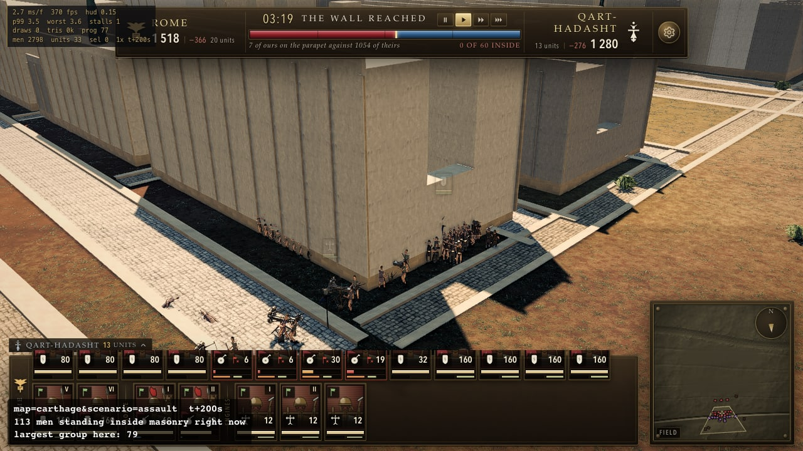
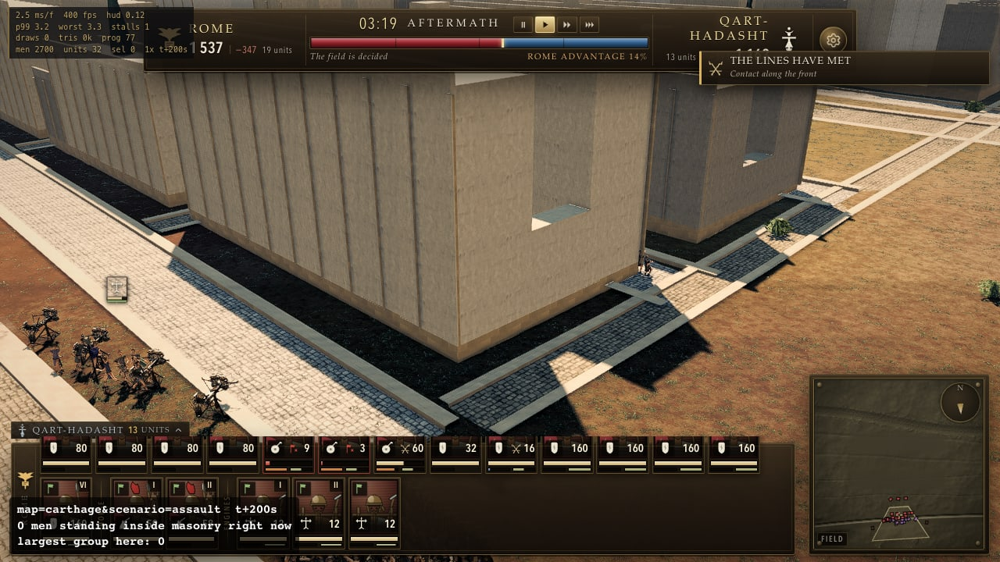

# Map method — what worked, what didn't, and what we would do differently

A running record of *how* we build a map, kept while building one rather than remembered afterwards.
Started 21 August 2026, at the moment the owner looked at Rome's city fabric and said: *"i think we
are better basically starting from scratch here… we should really follow the carthage method with the
grid system and planning everything out from top down, not trying to make something broken work."*

**This file is not a design document and not a status report.** `CARTHAGE.md` and `ROME.md` say what
to build. `HANDOFF.md` says where we are. `CHANGELOG.md` says what shipped. **This says what the
method cost and whether it paid** — so that the fourth map is built the way the second one was and
not the way the third one was.

## How to use it

- **Read §1 before starting any map work.** It is the distilled part. If it is wrong, fix it here.
- **Append to §3 as you go**, one entry per phase, while the phase is fresh. An entry written a week
  later is a memory; an entry written the same day is a measurement.
- Every entry needs **what we expected** as well as what happened. A log of outcomes without
  predictions cannot tell you whether the method is any good — only whether the result was.
- **Record the failures at least as carefully as the successes.** On this project the corrections
  have consistently been worth more than the original findings, and the same is true of methods.
- Every agent doing map work is expected to append. Say what you actually did, not what the brief
  told you to do.

---

## 1. Rules earned

Distilled from §3. Short, and each one traceable to an entry that paid for it.

1. **Plan top-down, in this order: water and terrain → the wall → landmarks → roads → a grid derived
   from the roads → ordinary buildings into the grid.** Nothing is placed before the thing that
   constrains it. Carthage did this. Rome did not, and Rome's fabric is being thrown away.
2. **The survey table is the source of truth, and every row cites a source.** Feature, real
   coordinates, engine coordinates, source. `CARTHAGE.md` §2.5 is the format. A number in prose
   without a source is a guess that will be treated as a measurement by the next reader.
3. **State the sanity checks that must hold *after* the build, in the design, before building.**
   Carthage's §2.5 ends with approach distance, city depth, wall length. They are how you find out
   the build went wrong while you can still cheaply fix it.
4. **Positions compress. Cross-sections do not.** And there is a third category: anything whose
   *slope* matters cannot take a compressed run against an uncompressed height. Name every override
   explicitly rather than bending the projection quietly. (`CARTHAGE.md` §2.4.)
5. **A layout must be correct by construction, not corrected afterwards.** A resolver that nudges
   overlapping buildings apart is evidence the layout step was wrong. It also hides the fault from
   whoever looks next. **And the sharper reason, measured: Rome's resolver *works*.** It takes 31
   intersecting pairs and 48,343 m² to **zero**, and its own assertion is honest about it. What it
   cannot do is hide the bill — a mean **65.3 m** and worst **167.7 m** of displacement off the
   surveyed position, which is then paid by the street network (26 of 31 monuments standing in a
   carriageway) and by the fabric (six quarters buried, 789 insulae). **A resolver converts one
   layout error you can see into two you cannot.**
   whoever looks next — **and hiding it is not the worst of it.** Measured on Rome: the shipped city
   has zero intersecting monument pairs and zero buildings inside a monument, and it buys that by
   displacing every monument a mean of 65 and a worst of 168 world metres from its own surveyed
   position. The resolver does not fail to fix the overlap; it fixes the overlap and *creates the
   fault the owner reported*. And it gets worse when you give it room: raising `KZ` from 0.222 to
   0.35 left it 13 conflicts to discharge instead of 22 and it moved everything **twice as far**
   (mean 142 m, worst 399 m). **A solver given more space does not do less work. It does more,
   further.**
6. **Every invariant needs an instrument, and the instrument must compare against something outside
   the thing being checked.** This project's most expensive recurring failure is a check that
   compares something against itself. Real published dimensions, a georeferenced plate, geometry read
   back from the scene — not the plan that generated the geometry.
7. **Verify a reference before you trust it.** Confirm it depicts the city you think it does, at the
   date you think it does, and that its licence permits use.
8. **A layout region must be a *partition*, not a set of rectangles.** Overlapping regions allocate
   ground by planning order rather than by plan, and planning order is invisible in the output. Rome's
   seventeen districts claimed **266 %** of the ground with 79 overlapping pairs, and the file's own
   comment justified it — *"a district costs nothing where it overlaps a neighbour."* It costs the
   whole fabric. Use a real administrative division, which tiles because that is what it is.
9. **Orientation must come from the streets, not from a hash.** A block's angle is a property of the
   lines that bound it. Rome seeded each district's rotation from `hash2(...)` at ±20°, so two blocks
   either side of an invisible boundary sit at different angles with a random offset. **That is the
   definition of a quilt**, and no amount of texture or massing hides it. Carthage's `CITY_BEARING = 0`
   plus a world-snapped lattice is the crude version of the same rule and it is why Carthage reads.
10. **Before choosing a projection, compute whether the module fits inside it.** Take the real
   spacing of the smallest repeated thing the map needs — an insula between two cross-streets, a
   tower interval, a plot frontage — project it, and check the uncompressed cross-section still fits
   in the projected gap. At Rome's `KZ` a true-scale insula did not fit between two projected
   cross-streets **at any point in the real range**, so the grid step was arithmetically impossible
   before anyone wrote a line of it. One division would have found this in 2019 as easily as in 2026.
11. **The footprint the game collides with and the stone the player sees are two objects, and one
   instrument has to compare them.** This is rule 6 applied to the one place both maps break it, and
   it is the fault that survives every fix to the projection. A monument publishes a rectangle to the
   keep-out map and the obstacle set; a geometry builder draws stone; nothing checks the second
   against the first. Measured: **Rome draws stone outside its own published footprint on 23 of 31
   structures, worst overhang 72.2 m per side** (Circus Maximus), and **1,153 sampled monument
   vertices stand inside 23 buildings** — on a city whose footprints are provably disjoint.
   **Carthage has the same defect, 2 of 10 structures, worst 14.85 m.** So both builds can report zero overlaps, correctly, while the picture shows a bath
   house standing in a terrace of houses. Derive the reserved rectangle *from* the geometry builder's
   own extents rather than typing it into a survey table, and gate it.
11. **Measure the complaint first, in the units of the complaint.** When somebody says the map is
   wrong, the first measurement of the pass is of *that*, on the unchanged tree, before anything is
   touched. Rome's fabric was diagnosed as an overlap problem and rebuilt on that basis; the shipped
   city has **zero** overlapping monuments, and what the owner was looking at was **displacement** —
   a solver moving surveyed monuments a mean of 65 and a worst of 168 world metres to make the
   overlaps go away. Both diagnoses point at the same fix, so nothing was wasted, but for two passes
   nobody could say how big the reported fault was.
12. **When a projection constant changes, grep every expression that multiplies by it and ask whether
   that expression meant it.** A district extent written `hn * KZ * 3.5`, a lookup table bounded by
   `HALF_EXTENT + 200`, a `clamp` to the map's south edge — none of those was *about* depth, and all
   three would have shipped as silent side effects of changing `KZ`. **A constant appearing in a
   formula is not the same as a constant the formula is about.**
13. **A check that goes dark is worse than a check that fails.** Removing five monuments from Rome's
   frame silently took `assertTopology` from 44 rules to 34 and `assertHillRing` from 8 members to 6,
   and it exposed a latent bug in the second that would have failed a correct build. Any check that
   can lose part of its population must separate "excluded by design" from "missing", count the
   exclusions, and print them by name.
14. **Compress a *position* anisotropically if you must; compress a *building* isotropically or not
   at all.** Rule 4 covers positions against cross-sections and misses the case that bit Rome: a
   building's own plan scaled without its own height. `PLAN_SCALE = 0.65` applied to the plan with
   height left at 1.0 multiplies the height-to-width ratio of **all 31** masonry monuments by
   **1.538** — a 45 m tumulus 87 m across becomes a 45 m tower 57 m across, and a 189 m
   amphitheatre becomes a 123 m one at its full 48.5 m. The eye has no ruler for absolute size and
   an excellent one for shape, so this is the *first* thing wrong with a monument at eye level and
   the last thing a plan view can show. Hold **one** scale per monument, applied to all three axes,
   recorded in the survey row beside the real dimension it departs from. Where isotropy is
   genuinely unaffordable, record the anisotropy as a named exception with the ratio printed —
   never as a global constant that nothing states.
15. **Grade a map from 1.75 m before grading it from 150 m.** Every visual instrument this project
   had photographs the city from a tactical camera 30–150 m up, and at that altitude a monument
   shrunk to fit, a street with a building standing in it and a quarter with no street at all all
   look acceptable. One shot script and one scene probe at a standing man's eye scored the shipped
   Rome **0.8 / 4** on the new `VISUAL-RUBRIC.md` §H, on a map that `probe-fabric`, the plan
   diagnostic, `assertNoFootprintOverlaps` and `assertNoFabricOverlaps` had all passed. **The
   altitude of the camera is part of the instrument and nobody had written it down.**
16. **Count and name every exclusion, and treat a check whose exclusion list is exactly the rows a
   mechanism touches as a measurement of that mechanism's absence.** Rule 13 covers a check that
   *loses* part of its population; this covers one that never had it. Rome's displacement
   assertion prints *"every monument centre at `worldOf(e, n)`: worst 0.0 m"* and skips `farBank`
   and `onRiver` rows — the two rows whose x is overridden by a placement rule rather than by the
   affine map, which is to say **exactly the rows that can be displaced.** The Janiculum Ridge
   stands **404 world metres** from its surveyed position and moved **715 m** between two phases
   under a headline of zero. An exclusion is a claim, so it needs a count, a list of names printed
   every run, and a gate on the count so that a sixth excluded row fails rather than joining a
   category.
17. **When you replace a constant with a table, write down what the constant was silently
   guaranteeing, and gate each guarantee separately.** A per-item authored departure must be graded
   on the **distribution** it produces and not only on each item. Rome replaced one `PLAN_SCALE` of
   0.65 with twenty-seven authored footprints; the cohort's median came out at **0.667** — the same
   number — with a **5.26× spread** around it, and **56 of 345 pairs of monuments had their size
   order reversed against the archaeology, against 0 of 345 before**, because a uniform scale
   preserves order by definition and a per-row scale has no reason to. That invariant was never
   written down, so nothing missed it, and the only instrument that could have caught it was the
   one the change asked to have retired for failing. **The list is short and it is always
   available: enumerate the invariants a scalar makes free.**
18. **When a check is wrong about the world, give it the missing relation — never an exemption.**
   `probe-fabric` G8 demanded 7 m of street between every pair of monuments, which is right about
   free-standing precincts and false about Rome, where the Basilica Ulpia stands *inside* Trajan's
   Forum. The obvious repair — read the build's own `complex` field and skip those pairs — removes
   the same 21 rows from **three** checks at once and leaves the licence enforced only by the
   offline script that granted it. The repair that is a correction rather than a relaxation adds
   the relation the gate lacked and makes it **cost something to invoke**: a declared complex must
   be *joined* (nested or abutting, never a 3 m no-man's-land), and the complex as a whole must be
   **connected** under that relation. **Test for the difference: the new class must be able to
   fail, and declaring it must take on an obligation rather than shed one.** Three of Rome's five
   declared complexes fail the connected test at any threshold under 20 m — the Theatre of Pompey
   stands 17.4 m from its own *porticus post scaenam* — which is exactly the kind of thing an
   exemption would have hidden for ever.
19. **A curve can pass through every one of its control points and still bend the wrong way, and a
   residual against those points cannot tell you.** Rome's Tiber was a cubic Hermite through twelve
   knots and its error was reported as **0.1 world metres**. The report was honest: it compared the
   transcribed table against `worldOf` of *the same twelve latitudes and longitudes*, which measures
   the projection's arithmetic. It cannot see the shape between two knots, and it cannot see whether
   a knot is in the river. Measured against the plate, **one of the twelve stood on water** and the
   median knot was 115 real metres from the channel. **Grade a shape against a source dense enough
   to have a shape**, and grade it with: lateral departure at fixed intervals, the *swing* across a
   named span, and the **sign of curvature** station by station. An inverted bend has a small mean
   error and cannot have the right sign.
20. **Sparse control interpolated into a shape is the same fault one level up, and it caught two
   instruments in one afternoon.** A sixteen-bridge river control graded the engine against the
   *chords* between bridges: over the 842 m band beside the assaulted front there are two bridges in
   the list, so the "plate" being compared to was a straight line across the very bend at issue. It
   reported a 75 m median departure and a 1.435 swing ratio on a channel within 2.4 m of a dense
   trace. And a by-northing comparison of an **east–west** reach is degenerate: one northing has
   several answers, and it inflated a **14.7 m** perpendicular error into **392 m**. Use a sparse
   control as a *point* control — perpendicular distance from each point to the curve — and use a
   dense one for shape.
21. **A representation that cannot express the thing will not be fixed by better data.** Rome's
   channel was `x = f(z)`, a single-valued function of northing. The Tiber turns, so where it ran at
   76° off the z axis the drawn river reached 385 world metres across a row against the 94 it
   declared, and the far side of the Campus Martius was reported as being *in the river*. No amount
   of digitising fixes that: feed a thousand points into `x = f(z)` and it reproduces the fault.
   **Change the representation first** — here, a polyline in the plane plus a signed distance field —
   and then the data means something. The same question is worth asking of every survey the project
   holds: can the type it is stored in say the thing it needs to say?
22. **A constant in world metres is a variable in real metres, whenever the projection is
   anisotropic.** `RIVER_HALF_WIDTH = 47` was a true-scale cross-section, which rule 4 endorses. At
   `KX` 0.443 and `KZ` 0.35 it drew a channel **212 real metres** wide where the Tiber runs
   north–south and **269** where it runs east–west — one number, two widths, against a plate whose
   channel is 100.8 m. Cross-sections in an anisotropic frame need a *rule*, not a constant: author
   in real metres, project, and name the scale. Rule 4's override is still available and is now one
   named number (`RIVER_WIDTH_SCALE`) rather than a figure nobody could convert.
23. **When a solver stands between your change and the output, your change is not what the gate
   measures.** Re-surveying the river moved two monuments that are placed *off* the river —
   `FAR_BANK` pins far-bank landmarks to the west bank and ignores their own surveyed easting — and
   `resolveOverlaps` cascaded that into every monument on the map. `probe-fabric` lost G9 (a
   monument-to-insula clearance of 1.34 m against a 1.5 m gate) and G15, both about monuments
   nowhere near the water. The same pass, by placing far-bank monuments from their own survey and
   only clamping them with the river, took the resolver's worst displacement from **690 m to 118 m**
   — better than the frame change that preceded it managed. **A gate downstream of a solver reports
   the solver.**
24. **A symmetric input hides an asymmetric bug, and replacing it is what reveals the bug.** Rome
   drew every quarter's rotation from a hash at ±20°. A symmetric random draw is its own mirror
   image, so two opposite-handed rotation conventions could disagree under it indefinitely — and
   they did: `makeRotationY(r)` points a box's long axis along **−r**, `DistrictSpec.rot` is a plan
   rotation, `wayBearingAt` returns a world bearing, and `rowRotOf` added a spine's slope where the
   geometry required it subtracted. Every terrace in Rome was built to the **reflection** of its own
   street, off by up to **14.6°**, since the lattice was written. Neither the fabric gate nor the
   Carthage control could see it, for the same reason: Carthage's blocks are axis-aligned, and an
   axis-aligned control is symmetric under reflection too. **When you replace a random or symmetric
   parameter with a meaningful one, expect the meaningful one to be blamed first, and suspect the
   consumer before the new value.**
25. **A measurement taken in a compressed frame needs both frames, or a sentence saying which one
   it is.** "Ranked street length inside a monument" was one number for three passes. It is two:
   **14.5 %** in world metres against the boxes the game collides with, **1.5 %** in survey metres
   against the published footprints. Positions compress by `KX` 0.443 and `KZ` 0.35, cross-sections
   do not (rule 4), so a street and a building **148 real metres apart** are **66 world metres**
   apart against a building still drawn **93 world metres** across. The two numbers have different
   owners: the survey figure grades whoever authored the line, the world figure grades the
   projection. Reported as one, it sends the wrong person to fix it — and it did, for a whole
   phase.
26. **A mechanism that guarantees a property destroys the ability to measure it.** Rome's `feeders`
   joined every loose way end to its nearest neighbour with a 42 m link, so *"the armature is one
   connected component"* was true by construction and a check on it could never have gone red.
   Rome's military road runs the length of the curtain 30 m inside it, so *"every gate's mouth is
   on a consular way"* passed four of four the moment it was written, for a road that leaves no
   gate. Deleting the mechanism is what makes the check worth having, and the test for whether you
   have written a real one is the same as rule 18's: **it must be able to fail, and you must be
   able to say what would make it.**
24. **An aperture is the *absence* of geometry, and a call that draws one is not evidence that one
   exists.** `VISUAL-RUBRIC.md` H7 scored **zero on both maps for two passes** while
   `CITY-GROUND-JUDGE.md` §3 truthfully recorded that *"the generator models arched tabernae"* —
   and both were right. `archPanel` was called on a wall box drawn solid on all four faces, so its
   0.55 m reveal opened onto that box's own painted face 40 mm behind it: **every taberna in Rome
   was blind arcading.** Carthage made the identical mistake independently — its street doors are
   0.28 m recesses whose outer face is drawn in the wall plane — and measures **0 openings per 10 m
   over 20,637 m of frontage, 100 % of faces blank.** Two generators, one fault, no instrument on
   either. So: grade an opening by scanning a face's own plane for **gaps**, never by counting
   calls to the thing meant to make them, and fix it by *ordering* rather than by geometry — work
   out which faces the street can see, omit them from the solid, and rebuild each as an elevation
   with holes in it. This generalises past apertures: **anything defined by what is missing needs
   an instrument that measures the missing thing** — a hole, a street, a gap between two buildings,
   a skyline.
25. **A survey station can only be graded where the frame can carry it, and that has to be a check
   that fails rather than an exclusion that explains.** At `KX` 0.443, Piazza di Spagna and Trinità
   dei Monti — 41 real metres apart with 31 m of height between them — project to **19.7 world
   metres at a gradient of 1.57**, against the engine's own `ROUGH_SLOPE_IMPASSABLE` of 0.625 and a
   heightfield sampled at 1.37 m. No terrain in this projection can put both where the sources put
   them; this is rule 21 asked of a landform instead of a river. The *form* of the answer is the
   rule: `probe-eye.mjs` E1d is a named check that computes the projected gradient between every
   pair of published stations and **fails** on the ones the frame cannot carry, and only then are
   those stations excluded, counted and printed. An exclusion that arrives before the check that
   justifies it is exemption-shopping; one that arrives after it is a measurement.
26. **A green gate on a tree with a large known fault in it is not evidence.** `probe-fabric` G12
   passed on `main` and fails here, on one row — and the row's *plan* is byte-identical. What moved
   is the drawn geometry: the Iseum's `drawnTopY` fell 32 m, `drawnVerts` 9,439 → 5,839, and the
   32 m is the hill that was under it. The check was measuring foundation spreading down a
   hillside a flood plain does not have, and reading it as monument. **A gate measuring the wrong
   thing can be green for the wrong reason, and the only way to find out is to fix the wrong thing
   and watch the gate move.** Corollary for anyone reading a scorecard: a check that changes state
   when you fix something it does not name is telling you what it was actually measuring.

27. **A gate on a distribution needs a floor on its population, and the floor belongs in the gate.**
   Rule 12 says a collapsed sample reports a confident number rather than an error; this says whose
   job it is to notice. `probe-fabric` G13b refuses below `SIZE_ORDER_MIN_PAIRS` and prints why.
   G20 and G21 have no such floor, and on the first build of Rome's grid they read **PASS, median
   0.00° over 6 blocks** and **PASS, median 0.00° over 2 pairs** on a city that had six houses in
   it. The population is something a check can compute about itself, so printing `n` and leaving
   the reader to spot it is not enough. **Corollary, and it is the half that saved that pass: keep
   one check whose only possible outcome is failure.** A self-report cannot prove a quarter is
   full, which is exactly why it is admissible; G17 was the only one of twenty-five checks that
   could see the empty city.
28. **A synthetic test case has to be degenerate in the way the real data is, not merely
   asymmetric.** Rule 24 says to grade a sign against a deliberately asymmetric case, and Rome's
   `assertBlockBearingSign` does — ±30°, ±12°, ±75° — and passed throughout the pass in which
   **82 % of the city's frontages were built ninety degrees off their own street**. The fault was
   that a planariser splits a block's sides at every node a *neighbouring* block puts on them, so
   a rectangle arrives with sixteen ring edges and "the longest edge" is a fragment of the short
   side. A four-vertex test ring cannot exhibit a sixteen-vertex ring's failure. **If the
   handwritten case is tidier than the production input, it is testing a different function.**
29. **Make it possible for an offline tool to import the module it grades, and treat a
   re-implementation in a scratch tool as a defect rather than as a convention.** Before Rome's
   grid pass, *no* offline tool in this repository could import anything under `src/city/rome`:
   one import of `HALF_EXTENT` from `TerrainSystem`, where it is re-exported, instead of from
   `topography`, where it is defined, closed a cycle that Vite's evaluation order tolerates and
   Node's does not. That single line is why `tools/scratch/free-land.mjs` carries its own copy of
   `districtMask` and why `rome-frame.mjs` re-derives the projection — and `probe-fabric`'s own
   header names that habit as the shape of this project's most expensive failures. Fixing it gave
   a harness that grades the shipped `cityPlan()` in **20 ms** against the probe's four minutes
   and one machine-wide browser slot, and it found three of that pass's four faults. The cost of
   the alternative is not the duplicated code: it is that the fast instrument and the slow one can
   disagree, and the fast one is the one people run.
30. **When a pass introduces a data structure, the invariants of the *structure* are cheaper
   checks than the invariants of the thing it is for.** A planar graph whose `edges < nodes`
   cannot be connected with cycles, and one with more than one outer face is in pieces. Neither
   is a threshold anybody has to choose, both are one line, and together they would have caught —
   at a glance — a one-metre gap between the wall line and the map frame that disconnected the
   frame, pruned the Tiber out of existence and took Rome from 354 blocks to 124.
31. **A constant lifted out of a two-sided thing keeps the side it was lifted from, and the
   other side then becomes impossible rather than merely wrong.** `riverProfile` builds two
   terraces — `WATER_LEVEL + 2.8` on the cut bank, `+ 0.8` on the point bar — and `inTheRiver`'s
   freeboard was **2.8**, with its own docstring naming it *"the cut bank's own terrace height"*.
   So a plot standing squarely on the point bar's finished terrace measured 5.8 against a bar of
   7.8 and was rejected as standing in the river: **every point bar on the map was unbuildable by
   construction**, and no setback, density or way could have changed it. The Tiber's curvature
   flips below the Ansa, so that is the whole of Transtiberim and the Campus Martius's own quay.
   Nothing could see it, because the counter is a *plot* count and the placer immediately refills
   the ground a rejection frees — the fault presents as a low coverage number with no cause
   attached. **Two tests: does the constant have a name that mentions one side of the thing it
   bounds; and can you state, in the units of the source, what the other side's value is?** If
   the second has an answer and the constant is not it, the constant is a copy and the copy is
   wrong for half the map. (Rule 11's "two producers, one constant" with the producers one file
   apart, and rule 4's "cross-sections do not compress" is the same shape one axis over.)

31. **A constant lifted out of a two-sided thing keeps the side it was lifted from, and the
   other side then becomes impossible rather than merely wrong.** `riverProfile` builds two
   terraces — `WATER_LEVEL + 2.8` on the cut bank, `+ 0.8` on the point bar — and `inTheRiver`'s
   freeboard was **2.8**. So a plot standing squarely on the point bar's finished terrace
   measured 5.8 against a bar of 7.8 and was rejected as standing in the river: **every point
   bar on the map was unbuildable by construction.** *Found and written up by
   `e/city/rome-transtiberim`, from the far bank; found independently by `e/city/rome-fill`,
   from the coverage figure, which is a fair test of whether a rule is real. That branch's
   number and derivation are the ones that shipped — the lower of the two terrace heights less
   a 0.2 m margin — and the entry below it is theirs. Placed here rather than renumbered
   because their branch numbered it first.*
32. **A coverage figure is a claim about responsibility, and the denominator is where the claim
   lives.** Rome's fabric was reported as covering **44 %** of the ground between street lines
   against an orthophoto's 60–70, and a whole phase was scoped to close the gap. Rasterised and
   asked *whose ground it is*, the denominator is **21 % monument precinct, 8 % Tiber, 3 %
   aqueduct corridor** — and the fabric already covered **67.6 %** of what was left. Before
   grading a generator on a ratio, subtract the ground it is not allowed to touch and **print
   the subtraction**. Publish the other readings beside it: what the source actually measured
   (an orthophoto counts the Baths of Caracalla as roof) and what the previous pass quoted, so
   the two can be compared at all.

33. **A mean over a city can be met with a third of it empty, so gate the distribution's floor
   as well as its middle — and ask the floor's question in the units of the thing being
   placed.** `probe-fabric` G24 asks, per block, whether *the smallest thing the generator
   builds* would have fitted in the ground left over after the monuments, the reservations and
   the water. Two drafts of it were wrong in instructive ways: a **total** of free ground says a
   block with 1,264 m² of it in slivers gave up, and a window one metre shorter than the
   minimum depth accuses six blocks of giving up on ground no house fits on. Size the test from
   the generator's own minimum and make it **sufficient rather than necessary** — a 7.5 × 9 plot
   has an 11.71 m diagonal, so a 12 m square holds it at any bearing — because a gate should
   fire only where the thing it grades provably could have done better.

34. **An arbitrary tie-break is a coin flip, and a coin flip at a boundary is a seam.** A block's
   grain was the *longest side* of its face. Of the 29 blocks producing a grain seam, 14 had a
   second side at a different bearing within 80 % of the longest and five within 95 %, so which
   street a block "fronted" was decided by five metres and its neighbour across the lane decided
   it the other way. Wherever a rule picks a winner by comparing two nearly equal quantities,
   **measure the margin distribution before believing the rule**. The repair — the mode over
   bearing classes rather than the max over sides — is one line and it is not the mean the
   original note rightly rejected, because a mode is always one of the block's own bearings.
   **Corollary: a repair aimed at one check that also improves a second, unmentioned check is
   evidence that it is a correction and not a tuning.** Moving the threshold would have moved
   nothing else; this took G20's p90 from 7.68° to 1.53° as well.

35. **When you find an all-or-nothing test, look for the same shape one level down before you
   believe you have fixed it.** *A feasibility test belongs at the granularity of the thing
   being placed* was earned at the block in phase 4 and shipped four more instances in the same
   file: the frontage took the depth of its narrowest sample, the plot was deleted rather than
   shortened when a precinct clipped it, the whole-block ring ended the fill, and a plot in the
   water was deleted after the fact instead of being routed around. Each is the same sentence at
   a smaller scale, each was worth one to five points of coverage, and the phase that fixed the
   first one wrote the diagnosis for the third down in a comment and left the behaviour alone.
36. **A sample lifted out of an extended thing keeps the point it was taken at, and the rest
   of the extent becomes invisible rather than merely approximate.** Rule 31's mirror, and the
   more expensive of the two, because a wrong constant is at least wrong everywhere while a
   wrong sample is right where you look. `probe-fabric` G22 asked *"does this structure stand
   under water"* of five points and gated on one of them, and answered **PASS, 0 of 1,106** on
   a Rome with the Mausoleum of Hadrian standing 1,932 m² — a quarter of its podium — under
   4.6 m of Tiber, because the centre of an 89 m box was on the bank. The same shape sat in the
   placement rule that put it there: `FAR_BANK` is a centre-to-bank clearance evaluated at the
   monument's own row, and over the podium's own hundred metres of z the channel swings 250 m
   west across it. **Test: name the extent of the thing and the extent of the sample, and if
   the first is bigger, the check is about a different object.** And the tell is loud when you
   look for it — a report that prints the fault beside the pass. This one had printed *"0 under
   water, same 3 wet corners"* for a week.

37. **A thing under test may declare its intentions; it may not grade them. A licence needs a
   second list and an envelope, or it is an exemption with a sentence attached.** Three
   structures on two maps genuinely stand over their own water — the Theatre of Marcellus on
   the Ripa, Rome's river-wall return three metres into the channel, Carthage's south anchor
   dying in the Lake of Tunis — and each was already argued for in `src/`, in writing, before
   any check could see it. (A declaration should also separate what is *sourced* from what is
   *decided*: the Theatre's position on the Ripa is Platner's, and the piles under it are ours.
   A row that blurs the two invites the next reader to argue with the archaeology.) The
   temptation is to let the plan say so and have the gate believe it, and that turns a check
   into a comment: the next row in the water writes the same sentence and the gate goes quiet. **Three parts, and all three are needed.** (1) The plan
   *declares*, by name, beside the thing. (2) Something outside it *agrees*, by name, and the
   two sets are compared **both ways** — a declaration nobody agreed to fails, and an agreement
   nobody declares fails, so writing a sentence in the source buys an argument with a human
   rather than silence. (3) The licence has an **envelope** with a physical meaning, so
   agreeing to a name does not agree to any amount of it: here, a licensed solid must still be
   *founded on the bank* — dry centre, under half its plan wet, no deeper than its substructure
   is drawn. The envelope is what the list is really for, and it earned itself immediately:
   Carthage's `quay-fort` would have passed the "over water, historically" argument on the
   nod, and it fails the depth limb by a factor of two, because seven and a half metres of
   open gulf under a third of a platform is not a quay. **Test: can the thing under test widen
   its own licence by editing itself? If yes, you have written a comment.**

39. **A predicate with a tolerance, and the repair that clears it, must be computed from the
   same shape — or the band between the two shapes is an absorbing state.** `ObstacleField`
   asks `solidAt(x, z, y, radius)`, which inflates every box by the man's own body; `escape`,
   whose whole job is to satisfy that predicate, measured the depth out of the **un-inflated**
   box. Between the two faces is a 0.42 m shell in which the test says *inside* and the repair
   computes a push of zero or of the wrong sign, and `resolve` then returns
   `blockedX = blockedZ = true`. A man who entered that shell could not be dug out of it, could
   not walk out of it — a tick's step is 0.05 m, so every destination he could reach was still
   inside the inflated box and `resolve` took the "already inside" branch before it ever
   considered a slide — and could not be shoved out of it, because both of `resolveCrowding`'s
   masonry guards decline a shove whose destination is `blocked`, which the whole shell is. All
   three mechanisms that can move a man agreed to leave him there. **And the repair was the
   trap's own supply:** `escape` deposited every man it dug out of a genuine penetration at
   0.05 m past the true face, which is inside the shell, so the one function that could rescue
   a man was also the only one reliably delivering men into the state it could not rescue them
   from. Measured before the fix: **168 men trapped across the two walled maps, of which 164
   were in the shell and 4 inside a true solid** — the fault was almost entirely this
   arithmetic and almost not at all penetration, which is why every previous instrument, all of
   which counted penetration, read near zero and was right. **Two tests, both cheap: does the
   acting function take the same tolerance argument the testing function took; and is there any
   input for which the test is true and the action is a no-op?** If the second has an answer,
   that value is a trap and something will find it.

40. **When a fault is permanent, an instantaneous census counts arrivals and not victims,
   because the qualifying predicate decays with the fault's own duration.** The first draft of
   `probe-stuck` sampled a two-second window at six checkpoints and reported **2 to 5** stuck
   men on Rome and **37 to 55** on Carthage. Run as an occupancy over the same 200 s — longest
   motionless-in-masonry run per man — the answers were **45** and **110**, with the median
   Carthaginian victim held for **199.7 s of a 200 s battle**. The gap is not noise and it is
   not the window length: the predicate requires the man's unit to hold a *movement order*, and
   a unit whose men are trapped is eventually wiped, re-tasked, or gives up and reverts to
   `Hold` — so the longer a man is trapped the more likely he is to have stopped qualifying.
   **The very persistence of the fault removes its victims from the denominator**, and the
   instantaneous number converges on the rate at which new men fall in rather than on how many
   are down there. Both readings are needed and they bracket the truth from opposite sides: the
   strict one has few false positives and cannot see the standing population, the loose one
   sees the population and admits every man who is merely standing still. So: **for anything
   that might be permanent, measure a hold time per subject and gate its distribution, not a
   count per tick.** A duration also distinguishes the trap from the jostle, which no
   instantaneous count can.

---

## 2. The priors going in

Written down now so that later we can check whether we were right, rather than reconstructing our
beliefs after the fact.

- **Carthage came out well and Rome came out badly, and both had good reference material.**
  `reference/rome-plans/` already held georeferenced Lanciani 1901 plates and SITAR vector data
  before any of this. So "we did not have references" is *not* the explanation, and any diagnosis
  that stops there is wrong.
- ~~**The leading hypothesis is arithmetic, not carelessness.**~~ **CONFIRMED, 21 Aug 2026, with one
  correction that changes what the fix looks like.** `docs/ROME-FABRIC.md` §2.2 settles it. The
  closed form is

  ```
  clear world ground = K·G − (PLAN_SCALE·PRECINCT − K)·(a + b) − STREET_GAP
  ```

  for two monuments with half-extents `a`, `b`, a real clear gap `G`, and an axis compression `K`.
  At `PLAN_SCALE = 0.65` that is negative unless `G > 0.570·(a+b) + 15.8 m` east–west and
  **`G > 2.133·(a+b) + 31.5 m` north–south.** Measured over the 465 pairs in Rome's survey: **34
  pairs are closer than the 7 m street the code itself demands, 31 interpenetrate, and 29 of the 34
  are separate in reality.** The Stadium of Domitian and the Theatre of Pompey are **273 real metres
  apart and overlap by 49.6 world metres** — a 323 m swing.

  **The correction: the fault is anisotropic, and it is 4.5× worse north–south than east–west,**
  because `KX` = 0.443 and `KZ` = 0.222. The prior stated it as a single ~10× areal figure. Any fix
  that treats it as one scalar will half-work, which is exactly what `PLAN_SCALE = 0.65` is: it was
  measured and tuned against a mean, so it is roughly right in x and hopeless in z.

- **And the confirmed fault is not what is on the screen, which took a second instrument to
  establish.** Everything above is measured at the *projected* positions, before
  `resolveOverlaps` runs. `tools/probe-fabric.mjs` measures the same city **after** it, with
  independent arithmetic, and finds **0 intersecting monument pairs and 0 buildings inside a
  monument**. The resolver discharges the whole 31 pairs / 48,343 m² / 64.69 m — at a cost of
  **mean 65.3 m and worst 167.7 m** of displacement off the surveyed position. So both statements
  are true and only together are they useful: **the arithmetic forces overlaps, the resolver removes
  them, and what the player sees is what removing them costs** — 60,932 m² of monument standing in a
  carriageway, six buried quarters, and hash-derived grain. Read §3's gate entry before concluding
  the shipped city interpenetrates; it does not.

- **And the hypothesis was *not the whole cause*, which is the more useful finding.** It explains the
  monuments. It does not explain the quilt. There is a **second, independent** fault of comparable
  size and it is nothing to do with `PLAN_SCALE`: Rome's seventeen fabric districts are inflated
  **7.17× over the honest projection** (`he·KX·2.05`, `hn·KZ·3.5`), claim **266 % of the available
  ground** in 79 overlapping pairs, and each lays its own lattice in its own hash-seeded frame at
  ±20°. `ROME-FABRIC.md` §2.3. **A diagnosis that had stopped at `PLAN_SCALE` would have fixed the
  monuments and shipped the same quilt.** New rules 8 and 9 above are what that cost.

- ~~**If the hypothesis holds, the frame itself has to change.**~~ **Half right, and the half that is
  wrong matters.** The frame does have to change — but it cannot change much, and changing it is not
  sufficient. Measured: **`KX` is within 5 % of a hard ceiling** (0.443 against 0.466, at which the
  circuit's east anchor lands exactly on the map edge), so east–west compression is not a lever at
  all. `KZ` can rise, but only by pushing the southern city off the +Z edge. And **no combination of
  `KX`, `KZ` and a single `PLAN_SCALE` gives zero overlaps**: even at `KZ` = 0.413, within 7 % of
  isotropic and with 14 of 34 monuments already off the +Z edge, three pairs still conflict at
  `PLAN_SCALE` 0.65. The largest uniform footprint scale with zero conflicts is **0.232**, which
  draws a 44 m Colosseum. The cause is monument *density in one band*, not overall coverage — twelve
  of the survey's monuments sit in the Campus Martius, and the projection allots it 454 world metres. So the answer is a frame change *plus*
  per-monument authored footprints *plus* merging the five complexes the survey wrongly models as
  free-standing boxes. `ROME-FABRIC.md` §4.5 recommends `KZ` = 0.35 and answers `ROME.md` §2.3's
  three arguments one at a time. Two of the three turn out to be preserved intact by the
  recommendation, and the third — that a player's distance intuition should transfer between Rome and
  Carthage — is the one genuine cost.

- **Prediction, confirmed in advance of the build and worth keeping:** the rebuild will succeed or
  fail on the *grid* step, not the landmark step. **I agree, and there is now evidence rather than
  intuition.** The grid step is exactly where the fabric died the first time: the districts, their
  overlap and their per-district rotation are the grid step, and they were never graded by anything.
  The landmark step, by contrast, already has the project's best artefact — a 34-row survey with
  real coordinates, real dimensions, measured bearings and a citation per row, several of which argue
  against their own earlier wrong values.

  **One refinement to the prediction.** The grid step's risk is not that it is hard to write; it is
  that **it has no natural instrument**, so it will be graded by screenshots. Non-intersection is
  easy to check and will pass on a quilt; a quilt is only detectable as a *distribution* — block
  orientation over patch size, against the orthophoto's 150–400 m / 15–40° grain.
  `ROME-FABRIC.md` §4.4 check 5 is the only check in the plan that can fail on a quilt and pass on a
  city, and it is the one most likely to be dropped as "nice to have". **If the rebuild goes wrong
  again, that is where, and the mechanism will be that check 5 was never written.**

---

## 3. The log

Newest last. One entry per phase. Format: **what we did · what we expected · what happened ·
verdict.**

### 21 Aug 2026 — Rome phase A and B, built the old way, before the decision to restart

**What we did.** Wrote `ROME.md` (2,764 lines, modelled on `CARTHAGE.md`), then built its §15 tasks 0
through 5: the map into its own module, the Tiber onto the survey, a graded bench under the wall, the
deployment ground, the circuit as a 36-bay survey polyline, the Muro Torto, and three gates plus a
postern.

**What we expected.** That following `ROME.md` task by task, each with its own acceptance
measurement, would produce a good map — the same way `CARTHAGE.md` had.

**What happened.** The *linear* work came out well and measures well: the Tiber's survey error went
775.8 m → 0.1 m, the worst bay step 28.39 m → 8.11 m → 5.23 m, reachable runs improved, zero
projectile rays pass through the circuit anywhere. Then the owner looked at the result and said the
buildings were "completely off" and the fabric should be rebuilt from scratch.

**Verdict — the method was right about the things it measured and silent about the thing that
mattered.** Every task in §15 had an acceptance measurement, and every one of those measurements was
about the wall, the ground or the survey. **Not one of them was about whether the city looked like
Rome.** The fabric had no acceptance measurement at all, so it was never graded, so it drifted — and
a 2,764-line design document did not save it, because the document inherited the same blind spot.

**What we would do differently:** give the *fabric* an acceptance measurement in the design, at the
same time as the wall gets one. If a thing has no instrument, it will be the thing that is wrong.

### 21 Aug 2026 — the reference material

**What we did.** The owner supplied six images and a saved web page. Before dispatching anyone to
use them, checked what they actually depict.

**What happened.** `rome city map 200 ad.jpg` is **Roman London** — Thames, Ludgate, Bishopsgate,
Southwark, Cripplegate. Nothing to do with Rome. The rest are sound, and one is very good: a
1:25,000 *"Plan of Imperial Rome, superimposed on a plan of the modern city, c. 350 AD"* carrying
every gate, all fourteen Augustan regions, the named roads, the aqueducts and every major monument,
**over the modern street grid with a scale bar** — which makes it georeferenceable rather than merely
illustrative.

**Verdict — cheap check, real save.** Two minutes of looking prevented at least one agent
georeferencing the wrong city, and that failure would have been slow to detect because a wrong plan
still produces a plausible-looking result. Rule 7.

---

### 21 Aug 2026 — the fabric diagnosis, and the decision to rebuild the layout layer

**What we did.** Read `CARTHAGE.md` end to end and reverse-engineered its method as a procedure from
the *code* as well as the document (`docs/ROME-FABRIC.md` §1). Then re-derived Rome's projection,
`place()` and `worldRot()` from scratch in a throwaway script rather than importing them, parsed the
34-row survey out of `survey.ts`, and measured every pair. Then priced every available lever —
`KX`, `KZ`, uniform `PLAN_SCALE`, anisotropic footprint scale, culling, and merging — against the
same measurement. Verified and catalogued four reference plates, rejected three.

**What we expected.** Honestly: that `PLAN_SCALE = 0.65` against a ~10× compressed plan would turn
out to be the cause, that the fix would be a smaller `PLAN_SCALE` or a re-fitted projection, and
that the diagnosis would take an afternoon and the recommendation would be one number.

**What happened.** Three surprises, in ascending order of how much they changed the plan.

1. **The `PLAN_SCALE` hypothesis was right and insufficient.** It is confirmed with a closed form
   and 34 measured conflicting pairs — but it explains the *monuments*, not the *quilt*. The quilt
   has a separate cause of comparable size: districts inflated 7.17× over the projection, claiming
   266 % of the ground in 79 overlapping pairs, each with its own hash-seeded rotation. Two faults,
   not one. **A diagnosis that had stopped at the confirmed hypothesis would have fixed the
   monuments and shipped the same city.**
2. **There is no single number that fixes it.** `KX` is already within 5 % of its hard ceiling. The
   largest uniform footprint scale with zero overlaps is 0.232 — a 44 m Colosseum. True footprints
   admit 11 monuments out of 25. Anisotropic footprints squash every round building 2:1. Twelve
   surveyed monuments share one 454-metre band, and no constant absorbs that.
3. **The strongest argument for the recommendation was not the one I went looking for.** I expected
   to argue about monument overlap. The decisive number turned out to be the *module*: at
   `KZ` = 0.222 a real 50–90 m cross-street pitch projects to 11–20 world metres, and a true-scale
   insula is 22 m deep — **so a grid derived from projected streets could not have worked at any
   point in the real range.** The grid step was arithmetically impossible before anyone wrote it.
   That is now rule 10.

**Verdict — the method's gap was not diagnosis, it was the *order* of diagnosis.** Reading
`CARTHAGE.md`'s §2.4 compression rule and then immediately dividing one real module by one
compression factor would have found the blocking constraint in a minute. Instead the project built
a 2,764-line design document, a survey, a projection, a circuit and a fabric generator on top of a
frame that could not host the fabric — and every acceptance measurement it wrote passed, because
every one of them was about the wall, the ground or the survey.

**One methodological thing that worked and should be repeated:** re-deriving the projection and the
placement arithmetic in a throwaway script instead of importing the module under test. It cost
twenty minutes and it is the only reason the numbers in `ROME-FABRIC.md` are evidence rather than an
echo — two existing tools in `tools/scratch/` grade the fabric by re-importing or re-implementing
the code that produced it, and one reports the resolver's distance from its own projection as its
error.

**What we would do differently.**

- **Do the module division before writing the design document, not after building it.** Rule 10.
- **Do not accept a tuned constant as a finding.** `PLAN_SCALE = 0.65` arrived with a five-row
  measured table showing that it reduced mean monument displacement from 174 m to 43 m, and that
  table is honest and correct. It was also read as a solution when it was a *symptom being
  minimised* — 43 metres of displacement is still a solver moving surveyed monuments. **A constant
  whose justification is "it makes the residual smaller" is a description of a fault, not a fix.**
- **Two minutes of looking at a reference is the highest-return work available.** One of six
  supplied plates was a different city with a live copyright notice on it. Rule 7 again.
- **Write the fabric's instrument in the same phase as the fabric's design.** `ROME-FABRIC.md` §5
  Phase 2 puts three of the six probe checks live before any block is generated, specifically so
  that the previous entry's verdict cannot repeat.

### 21 Aug 2026 — the fabric got a gate: `tools/probe-fabric.mjs`, and it runs on both maps

**What we did.** Turned the fabric's acceptance measurement into a **gate** rather than a report:
twenty-one checks over any candidate city, each with its threshold as a named constant and the
reasoning in a comment beside it, `PASS`/`FAIL` per check, an `n/21` verdict and a non-zero exit. Run
on Rome and on Carthage. It covers **both** faults `ROME-FABRIC.md` §2 establishes — G1–G3 and
G12–G16 for the monument arithmetic, **G18–G21 for the quilt** — because a gate that measured only
intersection would pass a quilt, and Rome proves that below.

Four rulers, all outside the thing being checked (rule 6): published dimensions typed into the tool
with a citation per figure, never read from `survey.ts`; the vertices that will actually be
rasterised, read off the baked `BufferGeometry` in the live scene; the probe's own polygon-clip and
SAT arithmetic, so it never calls `obbOverlap` or `assertNoFabricOverlaps`; and, for fidelity,
**aspect ratio**, which is invariant under uniform plan compression and so needs to know nothing
about the projection — with the absolute-scale test taking its reference from the **median of the
cohort's own ratios**, so it needs no repo constant either.

**What we expected.** Rome filthy and Carthage clean; the visible fault to be monuments intersecting
each other and intersecting houses; the quilt checks to be the hard ones to write.

**What happened. Rome 6/21, Carthage 12/21 — and the expected fault does not exist.**

- **Rome has zero intersecting monument footprints and zero buildings inside a monument, measured
  *after* the resolver.** `ROME-FABRIC.md` §2.2 measured the *projected* positions; this measures
  the same city after `resolveOverlaps` has run, with independent arithmetic, and finds **0 pairs
  and 0 m²** — the build's own assertion agrees. The two passes are consistent, and together they
  say what neither says alone: **the arithmetic fault is real, the resolver discharges it
  completely, and the thing the owner is looking at is therefore not residual intersection.**
  Re-measured here at the ideal positions: **31 pairs, 48,343 m², worst penetration 64.69 m → 0, 0,
  0**, at a cost of **mean 65.3 m, median 68.7 m, worst 167.7 m** of displacement off the surveyed
  position. That displacement is the bill, and the streets and the fabric pay it.
- **The streets pay first.** **60,932 m²** of monument footprint stands in a carriageway, over
  **121 street segments and 26 of the 31 monuments**, and **29,868 of 129,228 sampled drawn
  carriageway vertices — 23.1 % — are drawn underneath a monument.** Carthage on the same
  instrument: 3,918 m², 7 monuments, **0.56 %**. A 41× difference on the same measure.
- **The fabric pays second.** Six quarters print *"the quarter is buried"* at every boot —
  `velabrum` at **0 buildings from 260 candidate frontages** — and the whole walled city carries
  **789 insulae** against Carthage's 685 on a smaller circuit. Clearance across all 820 Roman
  structures: median **0.68 m**, p25 0.16 m, **543 of 820 inside the XII Tables' 1.48 m *ambitus***,
  7 negative, worst −3.54 m. Carthage's 727 structures: median **4.00 m**, **zero negative, zero
  under a metre**, worst +3.36 m.
- **A fifth fault, not in `ROME-FABRIC.md`, shared with Carthage, and probably the one the owner can
  actually see: the collision footprint and the drawn stone are two different objects and nothing
  compares them.** Rome draws stone outside its own published footprint on **23 of 31 structures,
  worst overhang 72.2 m per side** (Circus Maximus), and **1,153 sampled monument vertices stand
  inside 23 buildings** — on a city whose footprints are provably disjoint. Carthage: 2 of 10, worst
  14.85 m. That is now rule 11, and it is the fault that survives every change to the projection.
- **The grain check §2's prediction said would be dropped now exists, and it separates the two
  cities with an empty gap.** This is the result worth more than the rest of the entry, because the
  prediction was explicit: *"the only check in the plan that can fail on a quilt and pass on a city,
  and the one most likely to be dropped as nice-to-have. If the rebuild goes wrong again, that is
  where."*

  | grain measure | Rome | Carthage | a hash would give |
  |---|---:|---:|---:|
  | block orientation vs the nearest street, median | **9.17°** | **0.00°** | 22.5° |
  | same, p90 / max | 25.1° / 44.1° | 0.00° / 42.3° | — |
  | blocks more than 5° off their own street | **556 of 788** | **29 of 685** | — |
  | neighbouring blocks within 40 m, median difference | 4.27° | **0.00°** | 22.5° |
  | neighbour pairs rotating > 15° across a 40 m gap | **335 of 1,966 (17.0 %)** | **0 of 1,125** | — |

  Carthage's blocks are *exactly* parallel to their streets and to each other. Rome's are drawn from
  a distribution. **Neither city needed a screenshot for this.**
- **And the regions do not partition.** Rome's **17 districts** claim **1.33×** the 2,105,600 m² of
  land inside the circuit that is not already a monument's, over **75 overlapping pairs**, with
  **1,602,624 m² claimed more than once** — while **only 0.569× of that ground is covered at all.**
  Simultaneously over-claiming and under-covering: 43 % of the land inside the walls is in no
  district, and 1.6 km² is in two or more. (Their declared rectangles total **1.831×** the same
  denominator; `ROME-FABRIC.md` §2.3's 266 % is the same fault over a smaller denominator — that
  pass measured against 1.45 km² of walled ground and this one against 2.11 km² of non-monument land
  out to the heightfield edge. The numbers agree about the city and differ about the frame; use
  whichever, and say which.) Carthage: **16 quarters, 0.824× claimed, 21 overlapping pairs,
  174,080 m² double-claimed, 0.722× covered.** The same fault, an order of magnitude milder, and
  failing on the *under*-covering side.
- **Carthage is better exactly where rule 1 predicts and is NOT a clean city.** It wins on every
  fabric measure — 0 building-versus-building overlaps against Rome's 4, 0 monument stone in a
  building against Rome's 1,153 vertices, monument-to-fabric clearance 7.68 m against 1.02 m, no
  buried quarters, and both grain checks — and it still fails monument-in-a-carriageway,
  region partition, monument-to-monument clearance (**4.07 m** between the two harbours, under the
  7 m the rule asks for) and stone-outside-its-own-footprint. **Copy the method; do not assume the
  result it produced is passing.**

**The footprint-fidelity table, which is the artefact that outlives the probe.** The published
figures and their citations live in `PUBLISHED` at the top of `tools/probe-fabric.mjs`; rows that
could not be sourced are marked `unsourced` there and are never gated on. Measured plan compression
across the sourced cohort is **0.650** — so the projection arithmetic is uniform and honest, and
every exception below is a *modelling* error rather than a projection error.

| monument | published | modelled | modelled ÷ published | published aspect | modelled aspect | verdict |
|---|---|---|---:|---:|---:|---|
| Colosseum | 188 × 156 | 122.9 × 101.4 | 0.653 | 1.205 | 1.212 | ok |
| **Circus Maximus** | **621 × 118** | 403.7 × 123.5 | 0.650 | **5.263** | **3.268** | **wrong shape — built to its outer envelope, not its track** |
| **Baths of Caracalla** | **218 × 112** | 141.7 × 91.0 | 0.650 | **1.946** | **1.557** | **wrong shape — `survey.ts` says "218 × 112, the block is what is modelled" and models 218 × 140** |
| Pantheon | 84 × 58 *(derived)* | 54.6 × 37.7 | 0.650 | 1.448 | 1.448 | ok in plan; the *drawn* rotunda is 48.3 × 47.7, i.e. square |
| Castra Praetoria | 440 × 380 | 260.0 × 245.1 | 0.591 | 1.158 | 1.061 | small, and **documented** — at true size it is a tenth of the buildable city |
| Theatre of Marcellus | 129.8 × 115 | 84.5 × 74.8 | 0.651 | 1.129 | 1.130 | ok |
| Stadium of Domitian | 275 × 106 | 178.8 × 68.9 | 0.650 | 2.594 | 2.594 | ok |
| Mausoleum of Augustus | 87 × 87 | 56.6 × 56.6 | 0.650 | 1.000 | 1.000 | ok |
| Ara Pacis | 11.625 × 10.55 | 7.54 × 6.89 | 0.649 | 1.102 | 1.094 | ok |
| Porticus Octaviae | 132 × 119 | 85.8 × 77.4 | 0.650 | 1.109 | 1.109 | ok |
| Temple of Jupiter OM | 62.25 × 53.5 | 41.0 × 34.5 | 0.658 | 1.164 | 1.189 | ok |
| **Iseum Campense** | **200 × 50** | 45.5 × 22.1 | **0.228** | **4.000** | **2.059** | **wrong size AND shape — 2.85× too small, which is the measurement of `ROME.md` §6.3's "too small by a factor of three"** |
| Baths of Diocletian | 376 × 361 | *absent* | — | — | — | **correctly absent** — begun AD 298, 27 years after this map |

**Verdict — the two passes together are worth more than either, and the order mattered.** The
research pass proved the arithmetic *must* produce overlaps; this pass proves the shipped city *has
none*, and that every visible fault is downstream: displacement into the streets, starved quarters,
hash-derived grain, regions that do not tile, and stone drawn outside its own footprint. Had only
one of the two been done, the rebuild would have begun by changing `KX`/`KZ` and would have shipped
the same city with a different projection.

**What we would do differently.**

- **Write the gate before the thing it grades.** Every number above is one boot and ~1,400 lines.
- **Prefer the geometry read.** Five of the twenty-one checks found faults no plan-side test could
  ever find (G5, G7, G14–G16), and all five came from reading vertices. Three workstreams in a row
  now: the winding probe, `probe-solid`, and this.
- **A median cannot see a quilt, and this file nearly shipped a gate that proved it.** G21's first
  version gated on the median neighbour-orientation difference. Rome's is **4.27°** and it *passed*,
  because most neighbours sit inside one district and share its lattice — the quilt lives at the
  *boundaries*, where **17 % of pairs rotate more than 15° across a 40 m gap** against Carthage's
  **0 %**. A distribution's tail is the signal; its middle is the thing the fault hides behind.
  Same lesson as the HUD's median frame time, found again in a different file.
- **Instrument bugs are product bugs. This one had four.** (i) Nearest-*centre* attribution handed
  635 of the Theatre of Pompey's vertices to Tiber Island, whose centre was nearer than the
  theatre's own — fixed by normalising distance by each claimant's own reach. (ii) A composite
  decomposed into boxes reported its own joints as overlaps: the Cothon's 28-box quay ring produced
  **28 "monument overlaps" of 9.93 m² at 2.09 m each, identical to the centimetre**, and taking one
  of those 28 boxes as "the Cothon" reported the 325 m harbour at **0.098** of its published size —
  fixed by aggregating a composite before measuring it, and by discriminating a joint from a
  collision by depth, the two populations being three orders of magnitude apart. (iii) The partition
  denominator counted monument ground as a region's responsibility until it was subtracted.
  (iv) The median-versus-tail error above. **Grade the gate as a product.**
- **A bare `chromium.launch()` on this box rasterises in software, and it costs everything.** The
  GPU process came up `--use-angle=swiftshader-webgl`; boots took four to six minutes and every
  screenshot timed out, at 30 s and again at 180 s, on both maps — which reads as a hung page and is
  a missing flag. With `--use-angle=metal` (which `tools/shoot.mjs:1548` has carried since the shot
  harness was written) the same frames advance in **35–255 ms and capture in 149–247 ms**. Before
  believing any timing taken through Playwright here, check
  `ps -A -o command | grep 'type=gpu-process'`.
- **`page.screenshot` still cannot photograph this project even on Metal.** Playwright waits for the
  page to reach a stable state and a page driving a rAF loop over a 3.1 M-triangle scene never
  does. CDP `Page.captureScreenshot` returns in milliseconds.
- **Attribute a server by its `cwd` before killing it.** Chasing an orphaned vite on 5951 I killed a
  two-minute-old process on that port without checking whose it was; a later process on the same
  port turned out to belong to another agent's worktree. `lsof -a -p <pid> -d cwd` is one command.
  The other half of the same rule earned itself the first time it fired: **never reuse a server this
  process did not start.** A run that had reused the foreign 5951 would have graded another branch's
  modules, and it failed instead with `Failed to fetch dynamically imported module`, which reads as
  a code fault and is not one.
- **One check in `ROME-FABRIC.md` §4.4 could not be written, and it is not the one anybody would
  guess.** See the next entry.

### 21 Aug 2026 — a blind spot on the record: the plates are not a machine ruler

**What we did.** Tried to make the georeferenced plates the independent ruler for footprint
fidelity, as rule 6 asks and as `ROME-FABRIC.md` §4.4 check 3 specifies, rather than published
dimensions typed into a tool.

**What happened. Two facts, both worth writing down.**

- **A git worktree cannot see `reference/`.** It is gitignored local-only material, so it exists in
  the main checkout and in no worktree — `git worktree add` does not copy untracked files. An agent
  working in a worktree will look, find nothing, and conclude the plates do not exist. They do. This
  probe's first draft said so in its own header comment. Copy or symlink the directory in.
- **The only machine-readable plate carries no names.**
  `sitar-forma-urbis-severiana-vector-EPSG4326.geo.json` is 8,150 features whose entire property set
  is `{admapkey, layer, path}` — fragments and interior wall lines, with no monument identification
  at all. A probe cannot read "the Circus Maximus is 621 × 118" off it, and the Lanciani and AGEA
  rasters would each need digitising per monument. (`ROME.md` §6.4 records a related negative: the
  same file cannot recover the *pes monetalis* either, because the digitiser's own metre grid
  dominates the signal.)

**Verdict — a real limitation, stated rather than papered over.** `probe-fabric` can prove a
footprint is the wrong **size** and cannot prove it is in the wrong **place**, so
`ROME-FABRIC.md` §4.4's check 3 is **not implemented and cannot be as written.** Until somebody
digitises an outline per monument, the plates stay a *visual* comparator through
`src/city/overlay.ts`, and the position check is a human looking at one image.

**What we would do differently:** budget the digitising. Twenty monuments' corner coordinates read
off the georeferenced Lanciani raster, in a table shaped like `PUBLISHED`, turns the whole position
question into a gate — and the rebuild is placing every monument from those plates anyway, so
somebody will read those coordinates regardless. Write them into a file instead of into a commit
message.
### 21 Aug 2026 — Rome fabric phase 1: the projection change, and the survey re-laid on it

**What we did.** Raised `KZ` from 0.222 to 0.35 and left `KX` alone. Re-projected the Tiber's twelve
surveyed knots and re-derived its runout slope. The Aurelian circuit re-projected itself, because it
was already held in survey metres. Wrote `tools/scratch/rome-frame.mjs` — Phase 0's checked-in script
— which re-derives the projection from the two anchors instead of importing it and **parses**
`survey.ts` instead of restating it. Added `assertRomeFrame`, printing `ROME-FABRIC.md` §4.1's
whole-map sanity checks at every boot and publishing them on `CityChecks`. Built a control checkout
at the base commit on a second port and measured everything twice.

**What we expected.** That the wall would come through untouched (`KX` unchanged), that the
georeference would survive (it is upstream of `KZ`), that the Tiber would re-fit to the same 0.1 m,
and that the visible city would improve somewhat because the Campus Martius gets 58 % more depth.

**What happened.** The first three held exactly. The fourth was half right, and the half that was
wrong is the finding.

1. **Every invariant held by construction, and "by construction" is checkable.** 36 bays, west end
   x 2.006, east end x 1334.55, pitch 37.01511 m — byte-identical, because `x = X0 + KX·e` contains
   no `KZ` and `GATE_X`/`GATE_Z` are functions of x and z alone. The 725.7 m approach likewise.
   Tiber survey error 0.1 m → 0.1 m. Bench 266/266 stations ≥ 40 m. Worst walk step 5.23 → 5.50 m, and
   that one *had* to move because the wall line moved 5–60 world m south and stands on new ground.
   **A control checkout on a second port cost fifteen minutes and turned every one of those from an
   argument into a measurement.**
2. **The fabric got measurably better with no fabric work at all.** Buried quarters 6 → 2, and
   `via-lata` — the quarter behind the assaulted gate, the 2.9 % that is the headline symptom in the
   diagnosis — stopped being one of them. Solids the collision layer publishes 903 → 1,259, +39 %.
   Ranked-way samples inside a monument 302/1,040 → 98/956. `probe-fabric` 6/21 → 7/21, with G9 and
   G15 gained.
3. **And the fault the owner actually reported got worse.** `probe-fabric` had just established that
   nothing overlaps on the shipped city because `resolveOverlaps` displaces monuments — mean 65 m,
   worst 168 m — so *displacement* is what "everything is completely off" describes. At `KZ` 0.35 the
   resolver displaces **mean 142 m, worst 399 m**; in real metres, mean 226 → 351 and worst 672 →
   1,098. It has **fewer** conflicts to discharge (13 against 22) and it moves everything further,
   because a deeper band and five fewer southern monuments give it more room to push into and no
   reason not to use it. **A solver given more room does not do less work. It does more, further.**
4. **Four faults that predate this pass and that nothing had measured.** Insulae standing in the
   Tiber — 37 of 903 solids entirely under `WATER_LEVEL` at the base commit, 60 of 1,259 here, with
   `assertNoFabricOverlaps` and `probe-fabric` G1/G2 all reporting zero. `assertHillRing`'s
   cyclic-order test, which normalised each step to the shortest turn and therefore could not
   distinguish a legitimate 213° arc from a 147° inversion — latent until two ring members went off
   the map, at which point it failed a correct build. `place()`'s z clamp, which would have stacked
   five southern monuments on the single line z = 1374 instead of removing them, silently. And a
   district depth written as `hn * KZ * 3.5`, which would have inflated every district 57.7 % as a
   side effect of a projection change.

**Verdict — the frame is right, the frame was never the visible fault, and phase 1 has made the
visible fault worse on its way to fixing it.** Every number `ROME-FABRIC.md` §4.5 promised is
delivered and measured. None of them is what the owner was looking at. He was looking at
`resolveOverlaps`, which phase 2 deletes, and which this phase provoked. That is a real cost of
splitting the work across a review gate and it was accepted deliberately: the alternative was to ship
the frame change and the landmark rebuild together, which would have made it impossible for him to
tell which of the two he was approving, and would have wasted the landmark work if he had rejected
the frame.

**What we would do differently.**

- **Measure the thing the owner complained about, on the base commit, before changing anything.** The
  displacement figures took ten minutes and they reframed the whole phase. Had they been taken at the
  start, the brief would have said "phase 1 will make the visible fault worse, here is by how much,
  here is why that is still the right order" — instead of that being a finding at the end. **The
  first measurement of any pass should be of the complaint, in the units of the complaint.**
- **When a projection constant changes, grep for every expression that multiplies by it and ask
  whether each one meant it.** Three of the four faults in point 4 were things that read `KZ` (or a
  bound derived from the map) for reasons that had nothing to do with depth: a district extent, a
  lookup table's range, a clamp. Each would have shipped as a silent side effect. **A constant that
  appears in a formula is not the same as a constant the formula is about.**
- **A check that goes dark is worse than a check that fails.** Taking five monuments off the map
  silently reduced `assertTopology` from 44 rules to 34 and `assertHillRing` from 8 members to 6.
  Both now separate "the id is off this map" from "the id is a typo", count the skips and print them
  by name. A check count that quietly falls is the shape of the fault this whole file exists about.
- **`tools/qa-determinism.mjs` reuses whatever is already serving the port, with no ownership
  check, and that can silently record a pin from another agent's branch.** `probe-fabric.mjs` and
  `probe-seams.mjs` refuse a port they did not start — *"a reused port serves another branch's
  modules, and the probe then grades a tree it is not standing in"* — and `qa-determinism.mjs`
  does not. With six agents on the box and orphaned servers accumulating, that is one collision
  away from a determinism baseline recorded against somebody else's tree, which is the most
  expensive possible version of this project's recurring "the check compared the wrong thing"
  fault. **Before recording a pin, start your own server, confirm it serves your tree by fetching
  a file and grepping for the change you made, and pass that port.** Every arm in this pass was
  re-verified that way after the fact; all three were clean, and they were clean by luck rather
  than by construction.

- **`--absorb` should have been in the design document.** `ROME-FABRIC.md` §4.5 recommends
  per-monument authored footprints *"seeded at 0.65 and adjusted only where the probe says a pair
  conflicts"* without ever running that adjustment to see where it lands. Running it takes forty
  lines and it changes the recommendation's honesty: zero intersections at frozen positions is
  reachable, but only at a 0.36 floor and a 68 m Colosseum, and three pairs are unabsorbable at any
  floor because two of the three are east–west and `KX` cannot move. **A design that proposes an
  optimisation should run it once before recommending it.**

### 21 Aug 2026 — Rome fabric phase 2: the resolver is gone, and the survey was the bigger fault

**What we did.** Deleted `resolveOverlaps`, abolished the global `PLAN_SCALE`, replaced it with a
per-monument authored footprint beside the real published dimension, declared five complexes and
seven authored abutments, and froze every monument at `worldOf(e, n)`. `docs/ROME-FABRIC.md` §8.

**What happened, in the order it mattered.**

- **Displacement went from a mean of 142 world metres to zero, by construction**, and the
  eighteen inverted spatial relations the plan judge found went to **zero of 858**. The second
  number is the interesting one and it is a *proof* rather than a measurement: `worldOf` is
  strictly monotone in both axes, so with nothing moving after it, no relation can invert. All
  eighteen were the solver's.
- **The biggest single lever was not in the plan.** `ROME-FABRIC.md` §4.5 framed the problem as
  geometry — too much footprint in too little ground — and prescribed merging and shrinking.
  Both help. But **fourteen of thirty-five survey rows were in the wrong place**, five of them by
  more than 100 m, and no amount of merging or shrinking fixes a wrong coordinate. Two of the
  three "unabsorbable east–west pairs" §7.8 escalated to the owner as a taste decision turned out
  to be **measurement faults in the survey**, and they evaporated when the coordinates were
  corrected. *The rule this earns:* before optimising a layout, check that the layout's inputs are
  right. A solver's residual is only evidence about the solver if its inputs are.
- **A survey row has four independent things that can be wrong, and the fourth has no
  instrument.** The coordinate, the dimension, the bearing — and **which part of the building the
  coordinate refers to.** The Porticus Octaviae was cited at its *propylon*, which is the
  precinct's south edge, so a 132 × 119 m quadriportico centred on its own front door sat half
  inside the Theatre of Marcellus. The Theatre of Pompey was cited at its *cavea* and dimensioned
  as the *whole complex*. Both rows are internally consistent, both cite a real place, and both
  put a building 120 m from where it stands. Only a plate finds that.
- **`draw` was compressing two axes out of three, and nobody noticed for three passes.** The old
  `PLAN_SCALE` scaled plan and left height at 1:1, and the code said so as though it were a
  feature. A ground-level judge measured the result: Rome's monuments read **1.54× too tall for
  their width**. *The rule:* when a scale factor is applied to a subset of a thing's dimensions,
  say which subset in the constant's own name, and state the ratio it produces.

**What we would do differently.**

- **Digitise the plate before authoring against it, not after.** Nine of the fourteen corrections
  came from reading the georeferenced raster directly and five came from a control table another
  agent digitised mid-pass. The control table was worth more than everything this phase built for
  the purpose, and §3's own previous entry had already asked for it — *"budget the digitising"* —
  and it was not budgeted. It cost a pass.
- **Check an instrument against a hand-computed case before trusting it, especially when it
  agrees with you.** This phase's own `--realgaps` had a sign error in the bearing convention that
  mirrored every box in `n`. It is invisible on an axis-aligned building and inverts every rotated
  one, and it reproduced a figure the design document had computed independently — 49 real metres
  of Octavia–Marcellus overlap — closely enough to look like corroboration. It was wrong, and so
  was the document. Separately, the judge's own control table disclosed that nine of its sixteen
  rows restated `survey.ts` rather than reading the plate. **Two instruments built to enforce rule
  6 both broke rule 6 in the same day.** An instrument that agrees with the document it is
  checking is not thereby correct; it may only be inbred.
- **A plate is not one ruler, it is a ruler per zoom level.** The judge's contact sheet at
  1.0 m/px reported the Theatre of Marcellus at zero error; at 0.46 m/px the same reader measured
  39 m. This phase made the same mistake in the other direction, reading a 20 m Pantheon offset at
  zoom 4 that vanished at zoom 5. **Record the reading scale beside every plate-derived number**,
  and treat a reading taken at a coarser scale than the error being claimed as no reading at all.

**One thing that was kept against the plan, and the reason generalises.** §5 listed `TOPOLOGY` for
deletion with the resolver, because the solver used it as a constraint set. But it is also an
independently written statement of Rome's adjacency, and with positions frozen it becomes exactly
what rule 6 asks for: a check on the survey whose reference is outside the survey. It is the only
thing in the tree that would have caught this pass mistyping one of fourteen corrected
coordinates. **Deleting a check because a solver used to borrow it is the wrong reason to delete a
check.**

---

### 21 Aug 2026 — the city judged from a standing man's eye, on both maps

**What we did.** An independent judge, changing no source. Two shot scripts (42 eye-level cameras,
every Rome shot with a Carthage twin on identical rail numbers), one scene probe
(`tools/scratch/judge-fabric.mjs`, which reads `CitySystem.getObstacles()` and raycasts the built
scene graph and imports nothing from `src/city/**`), and a new `VISUAL-RUBRIC.md` §H of ten
criteria that only score on frames taken at 1.75 m with a near-level lens. Measured `58bc584`
(`main`) and `bc2e0f2` (the builders' base) and Carthage as the control. `docs/CITY-GROUND-JUDGE.md`.

**What we expected.** From the brief: that the monuments would read *small* next to a man, and
that the pass would end up arguing for a higher footprint floor.

**What happened.** Three things, and the first two were not on anyone's list.

1. **The monuments do not read small. They read 1.54× too tall for their width.** `place()` scales
   every masonry footprint by `PLAN_SCALE = 0.65` and `layout.ts:139` says in as many words that
   heights are not scaled; the plan diagnostic confirms 0.695 (0.65 × `PRECINCT`) for all 31 rows to
   three decimals. So the pass ended up arguing the *opposite* of what it was sent to argue: not
   "raise the floor" but "**use one scale for all three axes**". Rule 13.
2. **Carthage is better urbanism and worse architecture, and the rebuild must not copy it
   wholesale.** From the parapet, Rome is three painted blocks in a field and Carthage is an
   unbroken mat running to a citadel — but at eight metres Carthage's blocks are untextured prisms
   with no aperture of any kind, and Rome's have stucco, tile, windows, balconies and modelled
   *tabernae*. **Take Carthage's grain, continuity, module and terminus; keep Rome's buildings.**
3. **The two worst faults from the ground are both road faults, and both were already measured
   from above without anyone noticing what they meant at eye level.** 29.0 % of ranked way inside a
   monument means that a man walking in on the Porta Flaminia's own axis is **inside masonry for
   34 % of the first 700 m** — the Mausoleum of Augustus at 95, the Baths of Nero at 220, and 105
   unbroken metres of the Theatre of Pompey at 360. And a median `H/W` of **0.19** against an
   ancient street's 1.0–3.0 means Rome does not have streets at all; the narrowest long corridor in
   the whole walled city is 5 m wide, floored with turf, and stops after fifteen metres.

**Phase 1 re-graded from the ground.** Ranked way in a monument 29.0 % → **10.3 %**, axis blocked
34 % → **18 %**, p90 distance to the nearest built thing 48 m → **25 m**, buildings 789 → 1,150.
Real and visible, and `pair-kz-before-after.jpg` shows it without a table. But the axis still
carries 105 unbroken metres of monument, ranked way in a monument is still five times its own
Phase 3 acceptance, and median `H/W` **fell** from 0.19 to 0.14 — more buildings in the same space
narrowed the gaps without giving anything a taller frontage. **Enclosure is not a by-product of
density. It is a by-product of blocks that address a line.**

**Verdict — the altitude of the camera was the whole gap.** Nothing here needed a new idea; it
needed a camera 148 metres lower. Five instruments passed this city and a person did not, and the
difference was not rigour.

**What we would do differently.**

- **Write the camera height into the instrument.** `VISUAL-RUBRIC.md` A–G can all be scored from a
  tactical camera and every graded frame this project has is one. §H now says explicitly what
  height it scores at and refuses frames above it. An instrument that does not state where it
  stands is not reproducible.
- **Pair every finding with a control shot on the map that works.** Six of the ten findings only
  became arguable when the same camera was pointed at Carthage; two of them *reversed* when it was.
  Rome's `H/W` on the gate axis is 0.19 and Carthage's is 0.06 — Carthage is worse on that axis and
  better everywhere else, and a pass without the control would have published the wrong cause.
- **Aim eye-level cameras off a measured walk, not off round numbers.** Pass one parked the eye at
  20, 120, 250 and 400 m inside each gate and four of twelve interior frames came back inside
  masonry, partly because `stand` positions the *focus* and the eye sits `dist` further out. The
  fix was to walk the axis with the probe first and shoot only clear stations. **Half an hour of
  measurement bought back an hour of re-shooting, and the frames it threw away turned out to be
  the headline finding.**


---

### Phase 2 graded from the ground — the landmark rework, and three ways a good change hid its own cost

**What we expected.** The first ground pass (above) had argued for one thing: make the monument
scale isotropic. The branch did it — `RomeMonument.drawY` defaults to `draw` — so the expectation
going in was a re-score, a confirmation, and a short entry. The prediction was that the H8
criterion would move two ranks and nothing else would change much.

**What happened.** H8 moved one rank, three other criteria moved, and **two of the four things
this pass found were introduced by the change that was right.** Rome went 0.8 → 1.5 on
`VISUAL-RUBRIC.md` §H. The isotropy argument is upheld and turned out to rest on a different
foundation than either the plan or the first pass gave it. And the branch's own headline number
had a blind spot big enough to hide a 404-metre error.

**Four things worth the log.**

1. **The strongest argument for a change was found by re-using the previous pass's camera, not by
   arguing.** `docs/CITY-GROUND-JUDGE.md` §10.3 is one frame at pass one's exact rail — 90 m out,
   eye 1.75, `fov` 50 — and the finding is that at 48 m the Colosseum **does not fit in the
   frame**: no attic, no ends, no silhouette, unidentifiable. At 27 m it fits and it is
   unmistakable. Nobody had said that, because nobody had a *pair* of frames at one rail. The plan
   argued from the published ratio; the first ground pass argued that the eye reads proportion
   before size; **the thing that actually decides it is that recognition needs a silhouette and a
   silhouette needs the object to fit in the lens at a standoff a man can take.** That is now
   `VISUAL-RUBRIC.md` H8(c), and it cost one re-used camera and no new idea. **Re-use the rail.
   Move the focus, never the lens.**

2. **The pass's own headline number was wrong for two hours, and only a second method found it.**
   §10.4.1's first draft measured the median monument's proportion error at 2.37 → 2.22 — a 6 %
   gain against a claimed 35 % — reported nine rows getting *worse*, and built a mechanism on
   them: §8.5b (isotropy) and §8.5c (fit the stone to the box) pulling opposite ways. It was
   plausible, it was specific, and it was an artefact. The inherited instrument takes a monument's
   height as the maximum of an 11 × 11 grid of rays dropped from 260 m; over a 30 m box in a
   declared complex the grid hits whatever leans over it. A second method — the largest `y` among
   the monument's *own* vertices, no rays — gives **2.41 → 1.42, a 41 % gain, 22 of 25 rows
   improving**, agrees with the first to 3 % on the nine largest monuments and disagrees with it by
   up to **3.3×** on the small ones. **Pass one already knew this**: it recorded three answers for
   the Colosseum's height and refused to publish an absolute. What it did not do was extend the
   refusal to a *ratio*, which is where the same contamination hides. **Two methods, or no number.
   And prefer the method with fewer ways to be fooled: a vertex belongs to a building, a ray
   belongs to whatever it hits.**
3. **A change that is right can carry its cost in a relation nobody counted.** The branch's
   headline is *"0 of 860 spatial relations inverted"* — north-of, west-of, between — against 18 of
   184 on the shipped map. Real, and a proof rather than a measurement. Ask the same question about
   **size** and the answer is **56 of 345 pairs inverted, 16.2 %, against 0 of 345 under the global
   scale it replaced**, and a steady 10 % among pairs close enough to share a frame. The Castra
   Praetoria is drawn smaller than the Mausoleum of Augustus it is 4.6 times the length of. **A
   uniform constant is not just a compromise; it is silently guaranteeing invariants, and the
   moment you replace it with a per-item table you have to list what it was guaranteeing and gate
   each one.** Nobody did, and the instrument that would have caught it — `probe-fabric` G13 — was
   the check the branch asked to have retired. Proposed as rule 17.

4. **A check that was born blind to a mechanism is worse than a check that goes dark, because
   nothing marks the moment it stopped looking.** `assertRomeFrame` check 5 reports *"every
   monument centre at `worldOf(e, n)`: worst **0.0 m**"* and skips `farBank` and `onRiver` rows by
   construction. The Janiculum Ridge is `farBank`: a 520 × 240 m planted ridge with a 40 m mound,
   which `place()` puts at world **(−12.6, 1374)** while its own survey row projects to
   **(−416.2, 1381.6)**. It stands **404 world metres** from its surveyed position, clamped onto the
   last row of the heightfield in the middle of the map's southern edge, and it moved **715 m**
   between phase 1 and phase 2 — on the pass whose result is *"displacement is 0.0 m by
   construction"*. It is very probably also why about fifty umbrella pines are hanging in the air
   over the Campus Martius (`lm2-floating-grove.jpg`). Rule 13 covers a check that *loses* part of
   its population. This one never had it. Proposed as rule 16.

**Two more from the same afternoon, smaller and both about instruments.**

- **We reproduced the exact sign error the branch had already confessed to, in the same
  quantity.** `ROME-FABRIC.md` §8.8 records that its `--realgaps` built each oriented box with the
  bearing mirrored, which is invisible on an axis-aligned building and inverts every rotated one.
  This pass's own `judge-monuments.mjs` did the same thing and reported the Basilica Ulpia and
  Trajan's Column interpenetrating by **13.6 m** where the city's own assertion said 1.0 m. The
  recomputation using `probe-fabric`'s own `obPoly` then agreed with the city to **0.05 m**. A
  written-down failure mode is worth reading twice: **the second reader of a confession is the
  person most likely to repeat it, because they now think they understand it.**
- **Half the eye-level cameras aimed at a monument that has moved will end up inside masonry.**
  Three of twenty-five did here, one of them ninety metres from its subject. Pass one recorded the
  same thing and its own fix — walk the axis with the probe first, shoot only clear stations — was
  not applied to *monument* cameras because those are aimed at a coordinate rather than along a
  walk. **A camera aimed at a monument needs the same clearance test as one aimed down a street**,
  and it is one `solidAt(x, z)` call per rail before the browser starts.

**Verdict on the method, not the map.** The instrument that produced everything above already
existed: it is the first pass's own shot script and scene probe, run again on a different tree at
the same rail numbers. **The cost of a second opinion on this project is now about ninety minutes,
and it caught four things in a branch that had already been graded once by a plan judge, once by a
ground judge, and once by a twenty-one-check external gate.** That is the argument for the seat,
and it is an argument for making the *rails* a committed artefact rather than the frames.

---

### 21 Aug 2026 — the gate corrected against its own adjudication: 5/21 to 7/25, and every added check red

**What we did.** Implemented `docs/CITY-GROUND-JUDGE.md` §11 in `tools/probe-fabric.mjs` and
nothing else. No source under `src/` changed; the three pinned determinism hashes are unchanged at
8,632 / 3,074 / 3,440 soldiers, `tsc` is clean, `lint` is 2/2 and `qa-deploy` is 33/33. The work
was split off the build deliberately — a phase that edits its own gate cannot report a before and
an after — and the split is why there is a before column at all.

Six changes. G8 keeps its 7 m of street and loses the population its own comment was wrong
about. **G8c** and **G8d** are the price of that: a pair inside one declared `complex` must be
*joined*, and the complex as a whole must be *one connected piece*. **G13** is retired; **G13a**
(an absolute band against typed-in published dimensions) and **G13b** (no inverted size order)
replace it. **G11** gains an off-frame category gated on the five agreed names. **G22** is the
water check, shipped with the exclusion accounting the judge made a condition of endorsing it.

**What we expected.** The judge's table: 5/21 → 7/25, sixteen failing checks becoming eighteen,
every added check failing today.

**What happened.** Measured, both maps, and the control column is as informative as the subject's:

| | Rome before | Rome after | Carthage before | Carthage after |
|---|---|---|---|---|
| verdict | 5/21 | **7/25** | 12/21 | **13/22** (3 n/a) |
| failing | 16 | **18** | 9 | 9 |
| G8 street | FAIL 0.66 m | **PASS** — 0 of 310 cross-complex pairs short, closest legal 13.66 m | FAIL 4.07 m | FAIL 4.07 m, unchanged |
| G8c joined | — | **FAIL** — 3 of 41 in-complex pairs in the (2.5, 7) m no-man's-land | — | n/a, no complexes declared |
| G8d one piece | — | **FAIL** — 4 of 5 complexes are not one piece | — | n/a |
| G13a band | — | **FAIL** — 2 of 10 gated rows below the 0.45 floor | — | **PASS** — 0 of 2 |
| G13b order | — | **FAIL** — 10 of 43 asserting pairs inverted, 23 % | — | n/a, 0 asserting pairs |
| G15 trespass | FAIL 11 pairs | **FAIL 2 pairs** | FAIL 2 pairs | FAIL 2 pairs |
| G22 water | — | **FAIL** — 78 solids under a 5.0 m surface | — | **FAIL** — 1 solid under sea level |
| G11 present | FAIL | **PASS** | PASS | PASS |

**The headline number is exactly the prediction and its composition is not.** The judge's table
has G15 passing and does not score G11; the measurement has G11 passing and G15 failing. Two
pairs are declared one `complex` and stand 3.14 m and 3.17 m apart — inside G8c's own
no-man's-land — so the complex licenses nothing and G15's second condition refuses them. **The
predicted PASS does not survive the judge's own conjunction**, which is the more interesting
outcome: the three conditions were written down correctly and then scored as if the first one
implied the other two.

**Five things worth the log.**

- **The exemption hazard is now demonstrable in one run rather than arguable in prose.**
  `--inject=complex-invent` on Carthage declares the two closest monuments to be one complex.
  G8c and G8d go red, **and G8 goes green on the same run** — 1 of 45 pairs short becomes 0 of
  44. That is precisely what "treat a complex as one owner" would have done to all twenty-one
  rows, and it took four lines of injection to turn rule 18's argument into a table. **An
  argument about a check is worth much less than a run of the check with the fault in it.**
- **A third outcome was unavoidable, and the denominators now differ between maps.** G8c, G8d
  and G13b have no population on Carthage: it declares no complexes, and its two published
  monuments are 325 m and 320 m, which is 1.6 % apart and inside every citation's own error bar,
  so the pair asserts no size order at all. Counting those green would have put three checks that
  cannot fail into a passing score — the exact thing this project has shipped several times. They
  report `n/a` with the reason and the sample size and come out of that map's denominator, so
  Carthage is 13/**22** and Rome is 7/**25**. **A map is asked fewer questions because it makes
  fewer claims, and that is not a defect in the gate.** The candidate rule, offered to §1 rather
  than written into it: *a check whose population is empty must say so and leave the denominator;
  a vacuous pass is worse than a missing check because it is indistinguishable from a real one.*
- **The water check would have been wrong on the control map without its exclusion list, and
  that was measurable rather than hypothetical.** `--inject=water-no-exclusions` fails Carthage
  on **34** monument solids, of which **33 are the Cothon and the merchant basin** — 325 m and
  320 × 150 m *of water*, per Hurst 1994 and `CARTHAGE.md` §6.2. Rule 16 predicted this shape
  exactly ("a check born blind to a mechanism measures its absence") and the condition the judge
  attached to endorsing G22 was load-bearing, not procedural. With the list in place the check
  finds **one** thing on Carthage and it is real: **The Temple by the Sea, a 44 × 64 m
  `solid: true` monument standing entirely offshore with its centre 9.2 m below sea level**, three
  of four corners wet, photographed. Nothing in the tree had ever named it. On Rome it finds the
  Theatre of Marcellus at 1.52 m under a 5.0 m surface — the judge's own figure, to the
  centimetre, from an independent computation — and **77 insula solids standing in the Tiber**.
- **The external ruler is smaller than the internal one, and the size of that gap is the
  finding.** The judge measured 56 of 345 inverted size relations and 13 of 27 rows below a 0.45
  floor, both against the survey's own `len`. That is the right measurement for a judge and the
  wrong reference for a gate: `len` is an input to the build, and rule 6 forbids it. Against
  `PUBLISHED` — typed into the probe, one citation per figure — the population is **10 sourced
  rows and 43 asserting pairs**, and it fails at 10 of 43 (23 %) and 2 of 10. The direction, the
  magnitude and the worst offender all agree with the judge (the Castra Praetoria drawn 0.84x a
  Mausoleum of Augustus it is 5.06x the length of), so the small population is not hiding the
  fault. **What it cannot do is see the other seventeen monuments**, because `PUBLISHED` has no
  row for the Ludus Magnus, Trajan's Markets, the Baths of Titus or the Temple of Venus and
  Rome. Widening it is a literature task with a citation per figure, not a code task, and
  inventing the citations would be worse than the gap. The count over the wider *sourced*
  population is printed every run and not gated: 31 of 100.
- **One arithmetic correction to the adjudication, which changes nothing it concludes.** §11.1
  reports *"pairs inside one declared complex: 27"* and *"of the 27, fourteen stand 7 m or more
  apart, up to 59 m"*. Five complexes of 7, 5, 4, 3 and 2 rows have `21 + 10 + 6 + 3 + 1` = **41**
  pairs, which is forced, and **28** of them stand 7 m or more apart, **up to 165.13 m**
  (`temple-jupiter` / `trajan-market`, both filed `forum-valley`). The judge's enumeration was
  evidently bounded by a proximity query — its own maximum, 58.95 m, is the largest pair a
  neighbour search would return — so the two numbers are not comparable and the smaller one
  understates the case it is making. Every named pair and every conclusion in §11.1 survives.

- **Two of Rome's five complexes fail for opposite reasons and one number hides it.** At the
  2.5 m joint bound four of five are not one piece; at any threshold under 20 m, three are. The
  difference is `campus-medius`, which becomes one piece at **3.17 m** — the Stadium of Domitian
  is 67 cm outside the party-wall bound and 3.8 m inside the street bound, which is neither
  thing. `pompey` needs **17.36 m** (the judge measured 17.4 for the Theatre of Pompey against
  its own *porticus post scaenam*, from a different computation), `forum-valley` needs 23.72 m
  and `colosseum-valley` 27.58 m. So `connectAtM` — the longest edge in the complex's minimum
  spanning tree — is printed beside every complex, because "not one piece" is a verdict and "not
  one piece until 27.58 m" is an instruction.

**Two smaller ones, both about the instrument rather than the city.**

- **`Number('8c')` is `NaN`.** The check table sorted on `Number(id.slice(1))`, so the moment
  checks were named G8c, G8d, G13a and G13b the printed table would have come out in push order
  and read as scrambled. Found by reading the sort line before the first run, which is luck rather
  than method — no test in the tree looks at the order of a gate's own table. **A gate's own presentation
  layer is part of the gate**, and the first thing a new check id breaks is the ordering nobody
  thinks of as code.
- **The illustration budget was three frames and there are now ten fault classes.** The shot list
  ranks by area and takes one frame per class, so a class whose unit of harm is small in square
  metres can never be photographed while a larger class is unfixed: G8d's headline — a complex
  whose two halves stand 17.4 m apart — scored 301 m² against 5,688 m² of paving in the wrong
  forum and was fifth in a queue of three. Raised to five. **A gate that can fail for a reason it
  could not fail for before and cannot show that reason has only half shipped.**

**Verdict — the score fell and the instrument improved, and the only way to tell those apart is
the injection list.** Of the eight checks this pass touched, seven go red on live data — G8c,
G8d, G13a, G13b, G15 and G22 on Rome, G8 on Carthage — which proves those seven. G11 passes on
both maps, and a passing check proves nothing whatever about itself. So every limb that live data
cannot reach has a named `--inject` that breaks one of
the probe's own inputs — never the game, never `src/` — and states which check must go red:
G13a's upper band (nothing on either map exceeds it), G11's exclusion-membership limb, G22's
stale-licence limb, and G8c/G8d on a map with no complexes. All seven fired. An injected run
prints a banner, tags the checks it expects to flip, always exits non-zero, and exits **3** if a
check that was supposed to go red did not — which caught a real defect in the harness on its first
use, where `complex-invent`'s expectation string listed G8 as needing to go red when G8 going
*green* is the whole demonstration.

**What we would do differently.**

- **Type the published dimensions in before building the thing they grade, not after.**
  `PUBLISHED` has 26 rows for a city with 27 drawn monuments, and only 10 of them are both gated
  and present. Every gap in it is a monument the absolute band and the size order cannot see, and the
  gap was created by the build getting ahead of the literature rather than by anything hard.
- **Write down what a relation costs at the moment the relation is added.** `complex` was added
  to the survey with an argument, evidence per group, and a 2.4 m bound — and the bound lived in
  the offline script that granted the licence, so declaring a complex was free. The obligation
  had to be added by a separate agent two phases later, against an adjudication. **A licence and
  its price belong in the same commit.**
- **State the exclusion list's failure mode, not only its membership.** G22's first draft faulted
  Rome's `tiber-island` licence as stale, because the row is `soft` and publishes no collision
  solid at all — there was nothing to be wet. A licence can go unused two ways and only one of
  them means the list has rotted; conflating them made the probe report a fault in itself as a
  fault in the city, which is the most expensive kind of false positive a gate can produce.

### 21 Aug 2026 — the Tiber, re-surveyed off the plates, and the representation changed under it

**What we did.** Threw away the twelve-knot spline and re-digitised the Tiber: the centreline as a
least-cost path through gated water on the AGEA 2012 orthophoto, cross-checked against Lanciani's
inked channel; the width off Lanciani, binned and projected; the Tiber Island measured as the bar
between its two arms. 451 stations at 25 m of course length, held in **survey metres** in a new file
`src/terrain/tiberSurvey.ts` and projected by `topography.ts`. Replaced `riverCentreX`'s `x = f(z)`
distance model with a polyline plus a **signed distance field**. Fetched three orthophoto tiles from
the same WMS, layer, CRS and licence as `ASSETS.md` item 8 so the map's northern half stopped being
an extrapolation. Wrote `tools/probe-tiber.mjs`: departure, swing, the sign of curvature, the drawn
channel's width in *real* metres, and everything standing in water.

**What we expected.** That the river was sound and only its *shape between the control points* was
wrong — `ROME-FABRIC.md` §2.6 says *"The Tiber is sound… Keep the polyline"* — so a denser
digitisation through the same twelve points would fix it in an afternoon.

**What happened.** Four surprises, each bigger than the last.

1. **The control points were not on the river.** Measured against the plate, **one of the twelve
   stood on water**; the median knot was 115 real metres from the channel and the worst 1,166. The
   0.1 m residual that had blessed them compared the transcribed table against `worldOf` of the same
   twelve latitudes and longitudes. It was arithmetic, honestly reported, and it could not see the
   river. Rule 14.

2. **A denser table would not have fixed it, because the representation could not hold the answer.**
   `x = f(z)` cannot describe a channel that turns: at the Tiber Island the course runs 76° off the
   z axis, and the drawn river reached 385 world metres across a row against the 94 it declared. That
   is the mechanism behind buildings standing in water, and it is why the count kept moving depending
   on who measured it — 37, 60, 74, 71 — because the *declared* channel and the *drawn* channel
   differed by nearly 3×. Rule 16. A separate judge pass found the same thing independently the same
   afternoon and put it more sharply than we had: *"a denser table will not fix this."*

3. **The width was one number and two answers.** `RIVER_HALF_WIDTH = 47` world metres is 212 real
   metres of channel where the Tiber runs north–south and 269 where it runs east–west, against a
   plate whose channel is 100.8 m. Rule 17. **This bug caught the grading harness as well**, which
   compared 94 world metres against 100.8 real metres and reported agreement — so for one afternoon
   two independent instruments held the same wrong number for the same reason.

4. **The one thing we were told was out of scope turned out to be downstream of us.** `FAR_BANK`
   pins far-bank monuments to the river's west bank and discards their own surveyed easting, so
   moving the river moved them, and `resolveOverlaps` cascaded that into every monument on the map.
   `probe-fabric` went **7/21 → 5/21**, losing G9 and G15, both about monuments nowhere near water.
   Rule 18.

**The numbers, after.** Against the dense plate trace: departure median **2.4 m** (1.1 world m) over
the front, swing ratio **0.990**, **0 inverted curvature stations** on the front. Against the judge's
own harness: the channel is **102.1 real metres** wide against the plate's 100.8 (**ratio 1.01**, was
2.31); the bow turns at the same place (apex **−40 m** of northing, was −360); local curvature has
the plate's sign everywhere in the city; **0.00 %** of built footprint changes bank between the
plate's channel and the engine's. Water: **0 solids wholly submerged, 0 with their centre in water**,
from 41 and 62. Four solids keep an edge in the wetted band and all four are named and attributed.
Determinism re-recorded: 8,632 / **3,074** / 3,440 — Carthage byte-identical as the control.

**Verdict — the brief was right about the fault and wrong about the layer, and the correction cost
most of the pass.** We were sent to re-digitise a curve. The curve was the smallest of four faults,
and three of the other three were *type* errors rather than data errors: a function of one variable
standing in for a curve in the plane, a cross-section stored in the wrong frame, and a landmark rule
that read the river when it should have read its own survey. **Density was necessary and nowhere near
sufficient**, and the tell was available on day one: the thing being graded and the thing grading it
were the same twelve numbers.

**What we would do differently.**

- **Before digitising anything, check that the existing control points are on the feature.** It cost
  forty lines (`tools/scratch/tiber-knotcheck.mjs`) and it reframed the whole pass. Every survey in
  this repository should get the same treatment: `ROME_CIRCUIT_SURVEY`'s fourteen waypoints carry no
  citation at all, and a separate judge pass has since measured them 165–361 m off the inked wall.
- **Ask what type the survey is stored in before asking whether its numbers are right.** Rule 16.
  Three of this pass's four faults were visible from the type signature alone: `x = f(z)`,
  `RIVER_HALF_WIDTH: number` in an anisotropic frame, and `FAR_BANK(z, offset)` for a thing that has
  its own `e`.
- **Two instruments agreeing is not two instruments.** The grading harness and this pass made the
  identical world-versus-real-metres mistake within hours of each other, because both took the same
  constant at face value. Agreement between instruments that share an assumption measures the
  assumption.
- **When a solver stands between the change and the gate, measure the solver.** `resolveOverlaps`'
  worst displacement went 399 → 690 m when the river moved and 690 → 118 m when far-bank monuments
  were given their own survey back. None of that is fabric work and all of it shows up as fabric
  gates.
- **The one fabrication is named and drawn.** North of world z −300 the plate-true course turns east
  through the Pons Milvius reach, stops being a function of z at z −472, puts 0.76 km of channel
  inside the attacker's deployment box and fords the Via Flaminia unbridged. The map continues north
  on the measured local bearing instead, eased to due north — chosen over the *mean* bearing because
  that one reverses the sign of the curvature at the join, which is the fault this pass was called to
  fix, one level up, and which no residual would have shown.

### 21 Aug 2026 — Rome fabric phase 3: the frame decision, and four mechanisms that were never wired up

**What I did.** Took the ground judge's four-item list in its own priority order, on
`e/city/rome-landmarks-p3` off `e/city/rome-landmarks` at `6c975e8`. `docs/ROME-FABRIC.md` §9 is
the full write-up; this is what the method learned.

**What I expected.** That item 1 — *"`KZ` = 0.30, or the reason it is impossible in writing"* —
would be a half-day of sweeping and a judgement call about how much backdrop to trade for how
much depth.

**What happened.** `KZ` = 0.30 is *more* compression, not less. The judge's own diagnosis is
"the frame is too small for the survey", and 0.30 makes the frame smaller: anisotropy 1.27× →
1.48×, conflicting pairs 14 → 18, and a true-depth insula fits over **0 %** of the real
cross-street range instead of 11 %, which is precisely the arithmetic impossibility rule 10 was
written about and phase 1 existed to escape. Two independent readings of the same number reached
the same wrong sign — the judge's, and my own first reading of the brief — because "raise `KZ`"
and "raise compression" sound like the same direction and are opposites.

Then the sweep said something nobody had asked for: **the feasible window is
[0.3334, ~0.357] and it is 0.024 wide.** The floor is the insula module; the ceiling is the
Colosseum leaving the heightfield between 0.355 and 0.360. `KZ` was never a lever. It had one
notch of travel and phase 1 already used it.

**Verdict: right to demand the measurement, wrong to expect a decision. The measurement closed
the question instead of informing it, and that is the better outcome — four findings that were
all "spend a pass on `KZ`" are now one finding that says "spend it on `HALF_EXTENT` or on the
complexes".**

**What I would do differently.** Bracket the constraint *window* before pricing any single value
inside it. I swept the six points the tool shipped with, read the table, and only then thought to
ask where the walls were; had I bisected the ceiling first — two runs, four minutes — the whole
of item 1 would have been answered before I read the rest of the verdict, and it gates everything
else.

---

Four rules this pass paid for, offered for §1 in the numbering that follows the judge's 14–18.

> **19. A field that is declared, documented and never read is worse than a missing one, and the
> way to find them is to grep for readers rather than for writers.** Rome's Castra Praetoria is
> drawn at a fifth of its published plan because the camp stands 59 world metres inside a wall it
> needs 260 m of half-depth to sit behind. The survey has carried `atWall` — *"fraction of the
> footprint's depth that may sit north of the wall crest"* — for two phases, with a paragraph
> explaining it; `place()` copied it onto the placement and **nothing ever read it**. Nor
> `drawMax`, anywhere in `src/`. Nor `maxDrawAt`, which has no callers at all. Three mechanisms,
> all documented as constraints, all inert, and the constraint they describe enforced instead by a
> human transcribing an offline script's answer into a literal. Implementing one of them took the
> fortress from 76 × 72 m to 130 × 123 m and removed seven of nine size inversions. **A grep for
> the *definition* of a field finds it; only a grep for its *consumers* tells you whether the
> mechanism exists.**

> **20. A check whose failure sets its own "pending" cannot fail.** Rome's frame report filters
> faults with `!ok && pending === null` and one row set `pending` as `ok ? null : '…'` — non-null
> exactly when the check failed. So a genuine monument-in-a-street regression printed as PENDING
> and left the fault list empty. The generalisation is worth more than the bug: **an escape hatch
> whose condition is correlated with the failure it excuses is not an escape hatch, it is a
> deletion.** Same shape as rule 16's born-dark exclusion, one level up — there the population was
> chosen to exclude the fault, here the severity was.

> **21. Reproduce the other instrument's headline inside the tree before arguing with it, because
> the argument is usually about what was measured and not about the number.** A judge reported
> *"the road the assault arrives on is 32 % solid"*, walking the gate's own straight normal. The
> road is not straight — the layout has deflected ways round their monuments since phase 1 — and a
> column follows the way graph, so "the road" and "a straight line out of the gate" are two
> claims and only the second had ever been measured. Both now print at every boot, side by side,
> and the carriageway is 13 % where the axis is 20.6 %. **Neither number is wrong; the name was.** A
> claim in the record that no instrument in the tree can re-derive is a claim nobody can check,
> and the act of re-deriving it is what surfaces the definition.

> **22. When two independent agents make the same sign error in the same formula, the formula
> needs a comment more than the agents need care.** `rot = atan2(cos θ, sin θ)` in an
> `(x = e, z = −n)` frame: get the sign wrong and every box is mirrored about its own centre,
> which is **invisible on an axis-aligned building and silently inverts every rotated one**. It
> reported the Basilica Ulpia and Trajan's Column interpenetrating by 27.3 m, then 13.6 m, then
> made all five of Rome's declared complexes read as detached including the two that genuinely
> abut. Three independent occurrences: the offline allocator, a judge's own probe, and the first
> draft of the check written to catch it — each caught only by disagreeing with a hand-computed
> separation. **A geometric convention that fails silently on the symmetric case needs its
> failure mode written at the site, not its correctness asserted.**

### 22 Aug 2026 — four branches assembled into one Rome, and what a merge can delete without failing

**What I did.** Took `e/city/rome-fabric-p1`, `e/terrain/tiber-resurvey`, `e/city/rome-landmarks`
and `e/city/rome-landmarks-p3` — built in parallel against a moving base, none of them landed —
and assembled them on `e/city/rome-assembled`. Then re-measured with the judges' own instruments
and filmed the result, because the owner asked to *see* the city and not to read about it.

**What I expected.** A hard three-way merge in `layout.ts`, a stale determinism pin, and a
fabric score somewhere in the low teens. Two of three were right. I did not expect the merge to
be an ancestry problem before it was a content problem, and I did not expect it to silently
delete every street in the city.

**Surprise 1: two of the four branches were already ancestors of `main`, with none of their
content in it.** `bc2e0f2` (phase 1) and `6c975e8` (landmarks) both reached `main` through the
accidental `de43bed` merge and were then backed out by `44951ad`, which restored `src/` wholesale.
So `git merge e/city/rome-landmarks` is a **no-op that reports success**: git sees the commit in
the history and the revert as the later word. Nothing warns you. The only thing that restores the
content is `git revert` of the revert, and the check that it worked is not "the merge said OK" —
it is `git diff 6c975e8 -- src/city/rome` coming back empty, which I ran. **A branch being an
ancestor of `main` is not the same as its work being in `main`, and the distinction is invisible
to every command that would normally tell you.**

**Surprise 2: the merge deleted every district street in Rome and nothing failed.**
`e/terrain/tiber-resurvey` added `out.plots = dry;` inside `buildDistricts`, on the line
`for (const l of out.lanes) lanes.push(l);` occupied. Git took the deletion as a clean
non-conflicting hunk. The consequence: `lanes` stayed `[]`, so `nearLane` returned false for every
tree, `buildWays` was handed an empty list, and every quarter in the city lost its internal street
network. **`tsc` passed, `lint` passed, and the two water gates the very same commit introduced
passed too** — because a quarter with no streets in it is invisible to a gate that grades solids
against solids. I found it by diffing the branch against its own base and reading the hunk, not by
running anything. **This is rule 6 from the other end: the missing instrument is not always a
check that compares a thing against itself, it is sometimes a check that has no opinion about the
thing at all.** The proposed rule is at the bottom.

**Surprise 3: the two branches that had to fight had already agreed.** The one real content
conflict — `place()`'s `farBank` override — was written *the same way* by both branches from
opposite motives. The landmark branch reached `Math.min(w.x, FAR_BANK(z, 90))` because the old
`x = FAR_BANK(z, 90)` was deleting the Janiculum's survey row (404 m east, 715 m of movement
between two phases under a headline of "0.0 m by construction"). The Tiber branch reached
`Math.min(w.x, FAR_BANK(z, 100))` because the same rule was discarding the Mausoleum of Hadrian's
surveyed easting and coupling every far-bank monument to a channel that was being re-surveyed
underneath it. The landmark branch's comment names the other branch and says *"`100` against `90`
is the only thing left to reconcile."* **It was less than that: both are inert.** `assertRomeFrame`
check 5 prints `mausoleum-hadrian (farBank) dx 0 dz 0; janiculum (farBank) dx 0 dz -8` — dx 0 on
both rows, at either constant, because the re-surveyed west bank is more than 100 m east of both.
I kept 100, recorded the measurement at the site, and wrote down the condition that would make the
number matter again. **Resolving a conflict by measuring sometimes tells you the conflict was not
one; that is still the cheapest possible answer and you only get it by measuring.**

**Surprise 4: the control appeared to fail, and the instrument was wrong, not the subject.**
`qa-determinism` on Carthage — the control, the map none of this work touches — came back
**12 failing checks across 7 checkpoints**, drifting from t+30 onward. That is the alarm you least
want to be real, because a Rome change that moves Carthage means something shared moved and every
number on both maps is in question. It was not real. Runs A and B were identical to each other, so the sim was deterministic; the disagreement
was with the **pinned file**. Comparing that file against `main`'s: the assembled tree measures
`a4fa4050` at t+30 and **`main`'s pin is `a4fa4050`** — all seven checkpoints and all seven
survivor counts match `main` exactly. The pin that disagreed was the one this branch had
inherited from `e/terrain/tiber-resurvey`, whose Carthage entry reproduces on neither tree.
**Carthage is byte-identical across the whole assembly and the control holds**; what failed was a
baseline row that had been re-recorded when nothing had moved. The lesson is the one the file's
own header states and this pass nearly mis-read: *re-record only in the same commit as the change
that moved it* — a gratuitous re-record does not just add noise, it manufactures a failing control
and points it at innocent work.

The other two battles moved, and one of them moved further than either parent. **The field
battle's t+30 hash is `3a315656` on this tree, against `dc3fa068` pinned on `main` and `5903c5e0`
pinned on the Tiber branch** — a third value, not either input. The likely reading is that
`campus-martius` builds the city in *both* scenarios, so `default` sees the re-surveyed channel
**and** the landmark rework, and neither parent had both; but I did not run the experiment that
would establish it, so that is an inference and is marked as one. The **Rome assault** re-records
at **3,072 men in 32 units**. All three battles are now pinned to what this tree measures.

A trap worth naming for whoever reads these logs: **`--record` does not compare.** It writes and
prints `✓ deterministic and unchanged across 7 checkpoints`, and that sentence is about run A
versus run B and across the four quality tiers — *not* about the baseline, which it has just
overwritten. I nearly wrote "the field battle matched the Tiber pin" on the strength of it. If you
want to know whether a battle moved, you have to run it **without** `--record` first, which is why
the Carthage control above was run that way and why the finding exists at all.

**The numbers, before and after, on the same instrument.**

| | `main` 2409ed8 | assembled | Carthage control |
|---|---|---|---|
| `probe-fabric` | **5 / 23** (18 failing, 2 n/a) | **10 / 25** (15 failing, **0 n/a**) | 13/22 both, byte-identical verdict |
| solids under water | 78 (77 insulae + Theatre of Marcellus) | **0 of 1,207** centre-wet; 3 corner-wet, named | — |
| buried quarters | 6 | **1** (forum-boarium) | — |
| monument ambitus (G9) | 1.02 m | **3.18 m** | — |
| monument displacement | 65 / 168 m (142 / 399 m with phase 1 alone) | **0.0 mean, 0.0 worst** on 25 affine rows; 5 overrides printed by name | — |
| gate axis inside masonry | 32 % | **20.6 %** | — |

**Against the plate, which is the ruler that is not ours.** `tools/probe-plan.mjs` renders the
map into the georeferenced Lanciani frame and compares: **6/9, one skipped.** The result that
matters is **P3, monuments stand where the survey put them: mean 0 / worst 0 real metres** —
`ROME-PLAN-RUBRIC.md`'s single largest loss (P6, 0/20, median 227 m and worst 1,031 m) measured
to zero by an instrument that reads the plate and not our survey. The river takes five of six:
the bend goes the same way (−727 m against the plate's −732.4), turns in the same place (apex 40 m
apart), keeps the plate's curvature sign, moves **0.00 %** of built footprint across the channel,
and is **102.1 real metres wide against the plate's 100.8, a ratio of 1.01**. The three failures
are all named and all inherited: 2 of 1,124 solids on wet ground with **none fully submerged**;
544 solids in a carriageway of which **529 are district lanes** and 15 monuments; and 4 of 21
river bands over 47 m, the worst at n −100 inside the northern reach `tiberSurvey.ts` itself
declares a fabrication.

**The rest of the standing gate, on the assembled tree.** `tsc --noEmit` clean; `npm run lint`
**3/3** (and the browser-budget allowlist shrinks 92 → 91, because `probe-tiber.mjs` was written
before the cap landed on `main` and had to be converted); `qa-deploy` **33/33**; `probe-seams`
**PASS on both maps**; `probe-ground` clean — **0 deployment cells under water** on either side
(15,626 attacker, 11,791 defender), 0 men in the channel, 0 on the far bank, 0 trees inside the
wall keep-out; `probe-wall` **18/19**, every substantive wall assertion passing — continuity,
one polyline, the gate shut, the tunnel real, obstacles matching stone, stairs climbable, no
scaffolding on the field side — with the single failure a 404 for a static resource under the
probe's own `dist/` server, which is a serving artefact and not a wall fault. Note for the next
person: `probe-wall` serves `dist/` when no dev server answers its port, so it needs a build
first or it times out; that cost a run.

Checks gained: G9, G11, G12, G16, G22. **G8c and G8d went from `n/a` to FAIL**, which is the
point of them: `main` declares no complexes, so the two checks written to grade complexes were
vacuous there, and a vacuous pass is indistinguishable from a real one. The assembled tree can
now fail for reasons `main` could not.

**Two corrections to figures I was handed, both found by running the instrument rather than
quoting it.**

- **`probe-fabric` on `main` is 5/23, not 7/25.** 7/25 is the score on the *landmark* tree, where
  `complex` exists and G8c/G8d are applicable. On `main` those two rows are `n/a` and five checks
  pass, not seven. The brief's number was right about a tree that is not the one it named. Quoting
  a score without the tree it was measured on is quoting a number without its units.
- ~~**Rome's determinism headcount is 3,074, not 3,072.**~~ **I was wrong, and the way I was
  wrong is the point.** `qa-determinism.mjs`'s usage text and the pin I had inherited both say
  3,074, so I wrote the brief's 3,072 up as an error before measuring it. Then I ran the battle:
  **3,072 men in 32 units.** 3,074 is the phase-1 tree's headcount; the assembled tree is two men
  lighter, because the landmark rework changes the city and Rome's defender count is derived from
  the city's own garrison bays. **Two documents agreeing is not a measurement — they can share an
  ancestor.** The brief was right and both of my sources were stale, which is the same failure
  mode as the check that compares a thing against itself, one level up: I corroborated a number
  against a copy of itself.

**What I would do differently.**

- **Re-record the pin at the endpoint, and say so in every commit that moved geometry without
  re-recording it.** Three tree-moving steps in a row (revert-the-revert, two merges) would have
  cost nine `qa-determinism` runs to honour "re-record in the same commit that moved it"
  literally, and an intermediate merge state is not a tree anyone runs. I took the endpoint and
  wrote the departure into the first commit's message. It is still a departure, and the next
  person assembling branches should decide it deliberately at the start rather than at the second
  merge.
- **Look at the pictures before writing the second batch of cameras, not after.** Half my first
  film pass was unusable for reasons arithmetic would have predicted: `eye` is measured from the
  terrain **under the focus**, so a 1.75 m camera with a 70 m `dist` across ground that falls 8 m
  stands ten metres up; and a level lens needs `aim = eye + 1.55` exactly, which no shot in the
  repo had ever set — `pitch = atan2(eye - aim + 1.55, dist)`, so pass one's cameras came out
  5.6 and 7.1 degrees up and 9.9 down, all inside `VISUAL-RUBRIC` section H's 15-degree licence
  and none of them the level frame the rubric is describing. The judge's own eye-level stations were copied forward from a pass taken
  before `KZ` moved 0.222 → 0.35, so they no longer land on the street they were chosen for.
  **A camera position is a measurement against a frame, and it goes stale when the frame moves —
  exactly like a survey row, and nothing marks it.**
- **The plan view came back upside down** and I did not predict it. `yaw: 0` looks `+Z`, and `+Z`
  on this map is south, so a top-down at yaw 0 puts south at the top of the frame — unusable
  beside a north-up plate until you know to pass `yaw: PI`. `dist: 0` for a true plan works and
  had never been used in this repo.

**Proposed rule, earned by surprise 2.** *A merge can delete a mechanism without deleting a
symbol, and no gate in this project can see that.* The lanes deletion left `lanes` declared,
typed, passed to three consumers and returned — a live variable that is always empty. Every
instrument stayed green. The cheap general defence is not another probe: it is that **any
collection accumulated in a loop and consumed later should be gated on being non-empty at the
point of consumption when empty is not a legal state**, and that **a merge touching a file no
conflict was reported in still needs its own diff read**. The second half is the one that would
have caught this in ten seconds, and it is a habit rather than a tool.

### 22 Aug 2026 — Rome's roads, authored off the plates, and three sign errors nobody could have seen before

**What I did.** §5 phase 3 of the fabric rebuild, on `e/city/rome-roads` from `main` at `d1e85c0`.
Moved the way table out of `layout.ts` into `src/city/rome/ways.ts` — above the fabric rather than
below the monuments — re-authored all of it in survey metres against Shepherd pl. 22, the AGEA
orthophoto and the georectified Lanciani raster, and deleted `deflect`, `monumentRings` and
`feeders`. Wrote `assertWayGraph` and a survey-frame limb on `assertWaysClearOfMonuments`. Full
record in `docs/ROME-FABRIC.md` §10.

**What I expected.** That the Mausoleum of Augustus really was standing on the Via Lata and I
would have to choose between the monument and the street, as the brief and §9.6 both framed it.
That the road work would move `probe-fabric` G20 and G21 a long way, because the doc names
`hash2` as the cause of the quilt and I was replacing it. That the biggest risk was breaking
Carthage.

**All three were wrong, and the first two are the entry.**

**1. The conflict was a survey error in the road, not a conflict.** Three independent sources —
the modern Corso on the georectified orthophoto, Shepherd's own labelled "Via Lata (Broad Way)"
through an affine I fitted to the monument survey, and the straight line between the two termini
as coordinates — agree within **5 metres** that the street passes `e −338` at the tomb's northing.
The tomb is at `e −481`. **148 metres apart, and 53 metres of clear ground between masonry and
kerb.** The old armature ran 100–150 m west of the real street, straight through a building that
stands beside it, and §9.6's bend was a 360-metre fix for a fault that did not exist. The lesson is
not about Rome: **when a monument and a street collide, measure the street's own position before
accepting that the collision is real.** The monument had been re-surveyed to zero displacement two
phases earlier and the road had never been surveyed at all, so the road was overwhelmingly the more
likely of the two to be wrong — and nobody had asked, because the monument was the thing that had
just been worked on.

**2. Making the grain mean something exposed three sign errors, two of which predate this pass.**
Rome's block rotation came from a hash. A hash is symmetric, so **a mirrored rotation is
indistinguishable from a correct one**, and two conventions had been quietly disagreeing under it
for as long as the lattice has existed:

- `makeRotationY(r)` points a box's long axis along **−r**. `CitySystem`'s `occRot` is the only
  place in the tree that says so, and it says so at the obstacle boundary. Setting
  `DistrictSpec.rot = wayBearingAt(...)` — a world bearing — pointed every quarter at the *mirror*
  of its street.
- `rowRotOf` added the spine's slope where the geometry required it subtracted, so every terrace
  in Rome has been built to the reflection of its own street, off by `2·atan(slope)` — up to
  **14.6°**. This is a large part of what `probe-fabric` G20 has been reporting since it was
  written, and the record read all of it as evidence for the hash.
- and my own first draft of the gate-mouth check folded angles modulo 90° when the question needed
  180°, so a road crossing the curtain at 70° read as 20° and all four gates failed.

**The rule this earns: a symmetric input hides an asymmetric bug, and replacing the symmetric input
is what reveals it.** Randomness, ±20° of it, is symmetric under reflection. So is an axis-aligned
control — which is exactly why Carthage scores 0.00° on G20 and cannot distinguish the two
conventions either. Two instruments and a control, all blind to the same fault, for the same
reason. **Before replacing a random or symmetric parameter with a meaningful one, expect the
meaningful one to fail first, and suspect the consumer rather than the new value.** I spent four
probe runs assuming my field was wrong.

**3. One number needed to be two, and neither was wrong.** "Ranked street length inside a
monument" has been quoted as a single figure since `ROME.md` §6.2 (24 %). It cannot be. Measured
in **world** metres, against the boxes the game collides with, it is **14.5 %**; measured in
**survey** metres, against each monument's own published footprint, it is **1.5 %**. Both are
correct and they measure different things, because positions compress by `KX` 0.443 / `KZ` 0.35
and cross-sections do not (rule 4). The Via Lata and the Mausoleum are 148 real metres apart and
19 world metres overlapping. The survey number is what the road survey is responsible for; the
world number is the frame's, and three of its four largest entries are unfixable by any road:

> the Stadium of Domitian is 275 real metres long, is drawn 247 world metres long, and 275 real
> metres of northing projects to 96 — so the drawn Stadium occupies **706 real metres of northing**
> and there is no line along its north side that clears it. The Colosseum valley has **no ranked
> corridor east of the amphitheatre at all**: four drawn monuments occupy a continuous 200 world
> metres of a gap that is 140 wide.

**The rule: report a compressed-frame measurement in both frames, or say which one you mean.** A
single percentage for "is the road in the right place" conflates a survey question with a
projection question, and the two have different owners and different fixes.

**4. Connectivity that is manufactured cannot be checked.** `feeders` joined every loose way end to
its nearest neighbour with a 42 m link, so "the armature is one connected component" was true by
construction and a check on it would never have gone red. With `feeders` deleted the property is
real: it fails immediately if the Clivus Argentarius is removed, which is the way that closes the
350 metres between the Via Lata's southern end and the Forum. Same shape as the gate-mouth check,
which passed four of four the moment I wrote it — because the military road runs the length of the
curtain 30 m inside it and covers every mouth by construction. **A mechanism that guarantees a
property also destroys the ability to measure it; deleting the mechanism is what makes the check
worth having.**

**What it cost, honestly.** `probe-fabric` Rome is **10/25 before and after**. G4 improves
(15,107 → 12,731 m², 53 → 24 segments, 19 → 10 monuments), G20 9.17° → 7.78°, G21 20.9 % → 13.6 %
of neighbour pairs seaming — and **G5 gets worse** (1,207 → 3,478 street vertices under a
monument) because `onMonument` tests the paving once per way *segment* at its midpoint, which was
fine when `deflect` resampled every way to 30 m and is not fine on a straight authored way with
400 m segments. That is a four-line fix in `buildWays` and it is named rather than done, because
this branch is already the largest change to the road plan the project has had. **G17 also gains a
buried quarter** for a reason phase 4 deletes outright. Carthage is **13/22, every check
identical**, and bit-identical on the determinism gate at 3,440 men; the field battle at 8,632 did
not move either; the Rome siege arm at 3,072 was re-recorded in the commit that moved it, with t+0
byte-identical and survivors at t+400 going 2,284 → 2,291.

**And the thing I did not manage.** G20 and G21 pull against each other and phase 3 cannot close
either. Swept on this tree: at zero per-row correction G20 is 6.86° and G21 seams 24.5 %; at 12°
G20 is 7.78° and G21 seams 13.6 %. The reason is structural — a block's nearest street is its own
quarter's lane, so turning the block toward the network turns it away from the thing the check
measures it against, and two blocks either side of a quarter boundary have nothing pulling them
together unless it does. **Both are satisfied only when the lanes turn too, which is a block being
a face of the road graph rather than a rib of a lattice.** Even at zero the floor is 6.86°, because
the seventeen quarters overlap and claim 1.46× the ground: a block in one is routinely nearest
another's lane. **G20 cannot pass while the regions do not partition**, which makes G18/G19 the
binding item and not the grain.

**Instruments.** `tools/scratch/rome-roads.mjs` fits Shepherd to the survey frame (RMS 28.5 real
m, worst 56.7) and draws the authored table back onto the plate it came off, **parsing
`ways.ts` rather than restating it**. `tools/scratch/rome-wayscan.mjs` runs the tree's own
assertions over the tree's own modules with no browser, in about eight seconds — it bundles
through Vite rather than re-implementing anything, and its first output was checked line for line
against the boot log before it was used for anything. One alias is declared in it and is an
identity: `survey.ts` reads `HALF_EXTENT` from `TerrainSystem`, which imports every map and closes
a cycle a bundle cannot evaluate, and `TerrainSystem` gets that constant from `topography` on its
own line 14.

**Frames.** `tools/shots/rome-roads.shot.mjs`, twelve cameras, every coordinate in the file:
`vialata-length` (249, 1000) dist 420 yaw 0.362; `vialata-length-low` (100, 606) dist 400 yaw
3.5036; `vialata-oblique` (150, 800) eye 260 dist 480 yaw 3.5036; `gate-axis-tomb` (79, 720) dist
165 yaw 0; `mausoleum-kerb` (60, 720) dist 85 yaw 4.7124; `junction-recta` (222, 929) dist 60 yaw
3.927; `junction-recta-above` (222, 929) eye 130 dist 150 yaw 3.6; `junction-capitol` (292, 1117)
eye 90 dist 170 yaw 5.5; `network-plan` (450, 950) eye 2400 dist 0 yaw π, 1 px = 1.617 world m;
`network-plan-campus` (100, 950) eye 900, 1 px = 0.606 m; `network-plan-east` (700, 1000) eye 1100,
1 px = 0.741 m; `network-approach` on the gate anchor, stand −200, eye 25, dist 420.

**One camera lesson worth the line.** `dist` puts the eye *behind* the focus along the view
direction, so `stand: -200, dist: 420, yaw: 'in'` on the gate anchor is a focus 200 m inside the
wall and an eye **220 m outside it**. Half my first take was photographing the approach when it
meant to be photographing the street. The approach frame turned out to be one of the two best in
the set, because the Via Flaminia outside the gate had never been drawn before — every way node
was clamped to 18 world metres outside the curtain — so **the ground the assault forms up on has a
road on it for the first time.**
### 22 Aug 2026 — Rome from 1.75 m: the ground under the city, and the first three metres above it

**What we did.** Took the brief *"from 150–400 m, yes; from 1.75 m, not yet"* and worked the three
faults it named, in the order it named them: terrain relief in a flood plain, blank ground floors,
grass at the street edge. Built `tools/probe-eye.mjs`, which is the first instrument in the project
that grades §H of `VISUAL-RUBRIC.md` — nine checks over the landform under the fabric and the
bottom three metres of the frontage. Branch `e/city/rome-eye-level`, three commits.

**What we expected.** That the flood-plain relief would be one wrong constant, that the ground
floors would need new geometry, and that the grass would need a city mask. Two of those three were
right, and the third — the ground floors — was not new geometry at all.

**What happened.**

| | `ef8b5c7` (main) | `17e885c` | ruler |
|---|---|---|---|
| flood-plain relief, median over a 120 m window | **33.69 m** | **9.26 m** | published spot heights, 2.5 m target |
| flood-plain relief, worst | 40.18 m | 9.95 m | |
| flood plain against its published height, worst station | **22.7 m** (Piazza del Popolo) | **5.0 m** (the Trevi) | 4 m target |
| the plain's implied datum against sea level | **+21.9 m** | **−1.7 m** | m a.s.l. |
| Quirinal summit against its published rise | 0.59× (FAIL) | **0.97×** (PASS) | 61 m a.s.l. |
| terrain fall across a building's own footprint, median | 2.18 m | **1.78 m** | 1.0 m target |
| street gradient, median | 5.38 % | **2.73 %** | Clivus Capitolinus 17 % |
| **openings per 10 m of street frontage at 1.6 m** | **0.26** | **0.74** | Ostia's Via di Diana ≈ 2.5 |
| street faces with no opening at all | **54.6 %** | **23.6 %** | 35 % target |
| frontage the instrument could resolve | 1,971 m / 97 faces | **6,098 m / 382 faces** | |
| vegetation pixels in `eye-quarter-east`, whole frame | **12.6 %** | **0.0 %** | the frame itself |
| `probe-fabric` | 10/25 | **9/25** | |
| draw calls / triangles, worst of nine cameras | 174 / 6.63 M | **174 / 6.83 M** | cap 220 |

**Four things worth keeping, and the last one is the useful one.**

**1. The flood plain had a 45 m hill in it, and the mask that let it in was named for the right
thing.** `baseHeight`'s upland terms are gated on `onHill = sstep(toe − 40, toe + RISE_RUN, z)`,
which is a function of *northing against the hill's toe* and nothing else. It saturates to 1
behind the crest at **every x on the map**, so the Tiber flood plain — where `riseAmplitude`
publishes exactly zero rise, and where `topography.ts`'s own header says the ground is *"dead
flat"* — took +13 m of "behind the crest" lift and up to ±27.5 m of ridged multifractal. The
Pantheon stood on a 37.8 m hill. **The comment above the line claimed the opposite**: *"`onHill`
also gates the hill relief so the flood plain never inherits upland structure."* This is rule 12
with a name attached: a constant appearing in a formula is not the same as a constant the formula
is about, and *a variable named for a place is not a mask of that place*.

**2. Two more of the same fault fell out of the instrument once it existed, and neither was
visible by reading.** The Muro Torto's cityward terrace is authored `terrace: 120, backslope: 150`
in **world** metres; they are northings, so at `KZ` 0.35 they reach **903 real metres** of Pincian
garden inside the curtain and put Piazza di Spagna 23.7 m up a hill. Rule 22, in a place nobody
had looked. And `riseAmplitude(x)` — §3.5's published seven-band staircase, which describes the
ground **at the curtain** — was added at full strength 900 m south of it, putting 21.7 m of
Pincian shoulder under the Fontana di Trevi. Both were found by a probe failing, not by reading
the code: each is individually plausible and only a number outside the tree can say they are wrong.

**3. The instrument caught its own author twice, and that is the argument for building it first.**
The toe polyline's segment search was written `if (n > b[0]) continue` where the table descends in
`n`, so every query fell through to the first segment and the whole line came out 200 real metres
west. Reading it did not catch it; E1c's *"median 15.3 m of relief on a plain that should carry 2"*
did. Then E1c itself was wrong — it sampled a bounding **box** around nine points scattered across
a river bend, whose north-east corner is the Pincian — and the fix is the same one `probe-fabric`
uses for clearances: a window statistic needs its window inside the region, so the hull is eroded
by the window radius. **Both corrections made the number worse before they made it better**, which
is what an instrument is for.

**4. The ground floor was already modelled and was never drawn, and this is the finding.**
`CITY-GROUND-JUDGE.md` §3 says, correctly, *"the generator models arched tabernae
(`fabric.ts:1200`)"*, and H7 has scored **zero on both maps for two passes** anyway. Both are
true: `archPanel` was called on a wall box drawn solid on all four faces, so its 0.55 m reveal
opened onto that box's own painted face 40 mm behind. **Every taberna in Rome was blind arcading**
— an arched niche in a solid wall. The fallback door was worse: a dark box standing 20 mm *proud*
of the render, which is a rectangle painted on a façade. The repair is not more geometry, it is
**an ordering**: work out which faces the street can see, omit them from the box, and rebuild each
one as an elevation with real holes in it.

And the same is true of the control. `probe-eye` E5 on Carthage: **0 openings per 10 m over
20,637 m of frontage on 896 faces, 100 % of them blank** — on a map whose fabric generator also
cuts street doors, as 0.28 m recesses whose outer face is drawn in the wall plane. Two independent
generators, the same mistake, and no instrument on either until now.

**What would have changed my mind, and did not.** That the terrain fix would cost the frame
budget: it does not, and neither does the ground floor — **draw calls 174 → 174** on the worst of
nine cameras, because every triangle added lands in the `stucco` and `stone` streams the fabric
already submits. Triangles +3.0 %.

**One number went the wrong way and it is not a regression in the world.** `probe-fabric` 10/25 →
9/25, one row: G12's drawn aspect for the Iseum Campense, 3.487 → 2.456 against a published 4. Its
*plan* is byte-identical. What moved is the drawn geometry: `drawnLong` 90.46 → 59.63,
`drawnTopY` 57.81 → 25.71, `drawnVerts` 9,439 → 5,839, and the 32 m the top lost is the height of
the hill that was under it. G13a's below-the-floor list grows from 3 to 5 with the two Campus
Martius rows that stood on that hill. **The best reading is that the drawn extents were inflated
by foundation spreading down a hillside a flood plain does not have, and that with it gone the
monument measures its own stone — which is 0.298 of published, the "0.339 floor" §10.7.3 already
names.** I did not isolate it to the line and am not calling it proven: the measurement that
settles it is one run with `buildSubstructure` disabled, comparing `drawnVerts`.

**What we would do differently.**

- **Build the §H instrument before the §H pass, not during it.** Every one of the four findings
  above came out of `probe-eye` inside ninety minutes of it running, and two of them are in files
  four people have read this week. The pass spent its first third reading code and its second
  third writing an instrument; the second third found more.
- **Do not trust a green check on a tree with a large known fault in it.** G12 passed on `main`
  *because* of the hill. A gate that is measuring the wrong thing can be green for the wrong
  reason, and the only way to find out is to fix the wrong thing and watch the gate move.
- **Grade the control with the same instrument in the same run.** Carthage's 100 % blank frontage
  is the single most useful number this pass produced and it cost one extra command.

**Proposed rule, earned by finding 4.** *An aperture is the absence of geometry, and a call that
draws one is not evidence that one exists.* Grade an opening by scanning a face's own plane for
gaps, never by counting calls to the thing that is supposed to make them. This is
`VISUAL-RUBRIC.md`'s critic instruction 5 — *"if code exists for an effect but the effect is not
visible in the frame, it scores 0"* — promoted from a rule about frames to a rule about
instruments, because the frame said so for two passes and nobody could act on it. It generalises
past apertures: **any feature defined by what is missing needs an instrument that measures the
missing thing.** A hole, a street, a gap between two buildings, a skyline.

**Proposed rule, earned by E1d.** *A camera or a survey station can only be graded where the frame
can carry it.* `KX` = 0.443 puts Piazza di Spagna and Trinità dei Monti — 41 real metres and 31 m
of height apart — **19.7 world metres apart at a gradient of 1.57**, against the engine's own
`ROUGH_SLOPE_IMPASSABLE` of 0.625. No heightfield in this projection can put both where the
sources put them. That is rule 21 asked of a landform, and the useful part is the form of the
answer: the pair is reported as a **named check that can fail** with its computed gradient, and
*then* both members are excluded and counted — never excluded first and explained afterwards.

**Where the cameras were.** `tools/shots/rome-eye-level.shot.mjs` carries all thirteen as data,
which is the answer to the previous entry's complaint that a camera station goes stale and nothing
marks it: the stations are now in the tree, in the format `film.mjs --check` validates, rather than
in a table in a document. Ten are the previous pass's rails unchanged; `r-eye-tabernae` is new and
is marked as new. Three Carthage stations are shot in the same run, at the pairings
`CITY-GROUND-JUDGE.md` §2 used, so "Rome improved" can be read against something that did not.

### 22 August 2026 — Rome phase 4: the grid, and four instruments that lied in four different ways

**What we expected.** `ROME-FABRIC.md` §4.3 had already done the design work and §10.5 had already
proved the negative: the seventeen district rectangles overlapped, so a block's nearest street was
routinely another quarter's lane, and a sweep of the lattice's only tuning constant found a **floor
of 6.86°** on `probe-fabric` G20 against a 5° gate. The prediction going in was therefore narrow
and confident: replace the rectangles with a partition, take blocks as faces of the road graph, and
G18, G19, G20 and G21 all close at once because they are four readings of one fault. That is what
happened — Rome **9/25 → 16/25**, seven checks green, G20's median 7.78° → 0.00° and G21's seam
fraction 13.6 % → 0.8 %, with Carthage unchanged at 13/22.

**What we did not expect is that every one of the four faults on the way was an instrument
problem rather than a geometry problem**, and each was a different one. They are worth the space
because three of the four are new shapes.

**1. The gate passed on a sample of six, and rule 12 is not enough on its own.** The first run of
the new tree read **G20 PASS, median 0.00° over 6 blocks; G21 PASS, median 0.00° over 2 pairs** —
and the city had six buildings in it. Rule 12 already says a collapsed sample reports a confident
number rather than an error, and `probe-fabric` G13b already *refuses* below
`SIZE_ORDER_MIN_PAIRS`. G20 and G21 have no such floor and they went green on a city with no
houses. The check that caught it was **G17**, which reads the generator's own self-report and
fired on nine *regiones* at once.

> **Rule, earned: a gate on a distribution needs a floor on its population, and the floor belongs
> in the gate rather than in the reader.** G13b has one and refuses; G20 and G21 do not and passed.
> The population is a property the check can compute about itself, so there is no excuse for
> printing `n` and leaving the reader to notice. And the corollary that actually saved this pass:
> **keep one check whose only possible outcome is failure.** A self-report cannot prove a quarter
> is full, which is why G17 is admissible at all, and it is the only thing in twenty-five checks
> that could see six buildings.

**2. One metre of gap deleted the city, and nothing measured the graph itself.** A planar-graph
face extractor has to prune degree-1 chains, because a way that ends inside a block turns the face
around it into a zero-area slit. Pruning is iterative, so a chain that crosses nothing is eaten
whole. The wall line was authored to `HALF_EXTENT − 3` and the battlefield frame to
`HALF_EXTENT − 2`: they never touched, the frame was disconnected from everything, and it came
back as **one four-edged face covering all 7.8 km²**. Blocks fell from 354 to 124 and four
*regiones* got none.

> **Rule, earned: publish the topology, not just the output.** `planarise` now returns
> `{ inputSegments, intersections, nodes, edges, prunedStubs, outerFaces, degenerateFaces }` and
> the two numbers that would have caught this in one glance are **`edges < nodes`** — impossible
> for a connected planar graph with cycles — and **`outerFaces > 1`**. Neither is a threshold
> anybody has to choose. When a pass introduces a data structure, the invariants of the
> *structure* are cheaper checks than the invariants of the thing it is for.

**3. The longest edge is not the longest side, and a symmetric test could not tell.** A block's
grain is meant to be the bearing of the street that bounds it, so the code took the longest edge of
the face's ring. But a planariser splits an edge at every node on it — including nodes a
*neighbouring* block's cross-lanes put there — so a plain rectangular block 84 × 59 m comes back
with **sixteen** ring edges, and the longest single one can be a 30 m fragment of the short side.
The block then turns ninety degrees, the terrace turns with it, and every frontage's "depth"
becomes the block's length: **82 % of frontages took the shallow single-row branch** and the city
covered 26 % of its own block faces. The deliberately asymmetric sign case rule 24 asks for
(`assertBlockBearingSign`, +30° and −30° and their mirrors) **passed throughout**, correctly: it
tests a four-vertex rectangle, and the fault needs sixteen.

> **Rule, earned: a synthetic test case has to be degenerate in the way the real data is.** Rule
> 24 says to check a sign against an asymmetric case; this adds that the case must also be
> *complex* enough. A four-vertex ring cannot exhibit a sixteen-vertex ring's failure, and a
> handwritten test that is tidier than the production input is testing the wrong function.

**4. A guard placed one level too high abandoned every converging block.** `terrace` began by
asking whether the block was at least `MIN_DEPTH` deep *at its narrowest point over its whole
length*. A face bounded by two converging streets comes to a point, so its narrowest point is
nought — and the whole block, including the eighty metres of it that were forty metres deep, was
thrown away. What a converging block loses is its last frontage, not itself. Generic and worth
saying once: **a feasibility test belongs at the granularity of the thing being placed.**

**The method note that mattered most, and it is about tooling rather than about maps.** Three of
those four were found in **twenty milliseconds** by an offline harness that imports the shipped
`cityPlan()` and prints the face-area distribution, the reject reasons and a plan-side G20/G21.
The probe takes four minutes, one browser slot of a machine-wide four, and grades a boot. Before
this pass **no offline tool in this repository could import anything under `src/city/rome`**: a
single import of `HALF_EXTENT` from `TerrainSystem`, where it is re-exported, rather than from
`topography`, where it is defined, closed a cycle
`survey → TerrainSystem → maps → city/rome/fabric → city/rome/layout → survey` that Vite's
evaluation order tolerates and Node's does not. That one line is why `tools/scratch/free-land.mjs`
carries its own copy of `districtMask` and why `rome-frame.mjs` re-derives the projection — and
`probe-fabric`'s own header names that habit as the shape of this project's most expensive
failures.

> **Rule, earned: make it possible for an offline tool to import the module it grades, and treat
> a re-implementation in a scratch tool as a defect rather than as a convention.** The cost of the
> alternative is not the duplicated code; it is that the fast instrument and the slow instrument
> can disagree, and the fast one is the one people run.

**Two changes to `probe-fabric` that generalised it, with the control's answer.** A *regio* is a
polygon, and two of the probe's helpers were only correct for convex ones: `inPoly` is an
all-left test, and `clipArea` is Sutherland–Hodgman, which needs a convex *clip*. Both are
replaced — a crossing number and a triangulated intersection — and both reduce to the old path on
a rectangle. Carthage, the control, moved by **one statistic**: G19's claimed area 0.824 → 0.822
and covered 0.722 → 0.721, 3,520 m² in 1,705,280, all of it grid cells landing exactly on a
quarter's edge where the old inclusive test counted them in and the new half-open one does not. Its
overlap areas and every other check are identical. **A generalisation that is not a relaxation
moves the control by an amount you can name and in the direction the more correct test predicts.**

**And one honest number, because the pass gave something up.** Buildings fell from 1,173 to 944
and their footprint from 489,618 m² to 308,643 m², which is 44 % of the ground between street
lines against the AGEA orthophoto's 60–70 %. Measured with the keep-out map switched off entirely
the same generator reaches **60.9 %**, so the seventeen-point gap is Rome's monuments, its named
streets' setbacks, its fourteen plazas and its aqueducts — not the grid. Phase 5 owns roof
coverage and now owns a decomposition of it as well.

### 22 August 2026 — Trans Tiberim: four ways off the plates, and the far bank could not have been built on

**What we expected.** Phase 3's own note named the hole and the fix in one sentence: *"the Via
Aurelia and the Via Portuensis are not in `ROME_WAYS`… two or three authored ways would fix it,
and that is phase 3's module."* So the plan was to read the far bank's streets off Shepherd, put
them in `ways.ts`, and let the machinery that already turns streets into blocks and blocks into
buildings do the rest. The prediction was that Regio XIV — **47.2 % of the map's city ground and
12.7 % of it under fabric** — would come up to something like the left bank's 40–52 %.

**What happened.** The ways went in and they are right: four rows, each cited, and the overlay of
the parsed table on the plate sits on the ink. The far bank went from 53 blocks to 98 and from
13.82 to 26.57 hectares of ground between street lines. And it built **41 buildings**, against 76
before. Everything downstream of the streets was broken, in three separate ways, and none of the
three had anything to do with roads.

**1. Three quarters of the far bank was never Transtiberim, and the frame is why.** Measured band
by band before anything was authored (`tools/scratch/rome-farbank.mjs`), Regio XIV's 108.9 ha
divides into four almost equal pieces, and only the southernmost is the quarter:

| survey n | world z | ha | what the plates put there |
|---|---|---:|---|
| −367 … 300 | 1245–1374 | 35.5 | Transtiberim, the *Ripa*, the Janiculum's east foot |
| 300 … 900 | 1030–1245 | 22.9 | the Prata Quinctia and the Horti Agrippinae — meadow |
| 900 … 1400 | 755–1030 | 22.0 | the Gardens of Domitia, the Mausoleum of Hadrian |
| 1400 … 2006 | 543–755 | 28.5 | the Ager Vaticanus — the Circus of Nero, tombs, gardens |

`CITY_Z_MAX` is survey northing **−367**, and S. Maria in Trastevere is at **−445**. The middle of
the real quarter is off the +Z edge for the same reason four whole *regiones* are. So the honest
target for this ground was never 46 %: it is a dense lip on the water and *horti* behind it, and
Regio XIV took `hortiNorthOf: 120` — the Porta Septimiana's own northing — to say so. That is
**78 % of the region's buildable ground** declared garden.

> **What we would do differently:** measure the *bands* of a region before deciding what it should
> look like. The brief, the phase-3 note and this pass's own first plan all assumed "the far bank"
> was one thing. It is four, and three of them are correct as country.

**2. The first version of the answer was the fault the brief warned about, and the instrument
could not see it.** With a `via-cornelia` running 2.3 km west to the frame, the Ager Vaticanus
came back **46.7 % inside a block** and the generated cross-lane total went **42.5 km → 59.9 km**:
seventeen kilometres of new lane at a 59 m pitch over the imperial gardens. `crossLanesFor`'s
`emit` already refuses to lattice open country, and it did not refuse here because **the road made
the country urban** — `urbanWeight` is a distance to the armature and it does not know what the
road was for. The road west to the circus is now a deletion with its coordinates in the comment,
and the Vatican gets a corridor 365 m either side of one line, which is the shape a street of
tombs actually has.

Worse, the first coverage instrument could not have told the two apart: it counted *cells inside a
block* and reported the Ager Vaticanus at 46.7 % against Transtiberim's 25 %, which says the
imperial gardens are twice as built as the quarter. A *horti* block is 8 % roof and an insula
block is 60–72 %; an instrument that adds them up is measuring the wrong thing (rule 6). It now
splits them, and so does the boot log.

**3. `probe-fabric` G17 went red on the quarter that had just been made correct.** *"No quarter
reports itself unable to build"* is a coverage floor of a flat 15 %, and `HORTI_COVERAGE` is 8 % by
design — so a regio that is 78 % garden **cannot** reach the floor and the check was reporting the
design as a failure. It had been green on the far bank only because the far bank was wrongly
insulae. Rule 26's corollary, exactly: *a check that changes state when you fix something it does
not name is telling you what it was actually measuring.* Repaired the way rule 18 asks — the
missing relation, not an exemption: the floor is now a fixed fraction of the coverage the region's
own block mix predicts, so an all-insula regio keeps 15 % to the digit, an all-horti regio is asked
for 1.85 %, and **both can still fail**.

**4. The Janiculum's keep-out was a circle, and it was standing on Transtiberim.**
`src/terrain/topography.ts` has named this for two passes — *"a circle of radius 234.6 m standing
for a hill whose semi-minor axis is 96.4 m… a radius cannot say what a length and a width say"* —
and it cost nothing until the far bank had a quarter to lose. `monuments.ts` already **draws** the
mound elliptical, `hw · k` by `hd · k`; `plan.ts` reserved a circle of its circumradius. The
difference is 6.9 hectares of Transtiberim and it was all of it: the region's non-*horti* ground
came back at **0 % roof over 5.8 ha**, with `reserved` as the reason. The reservation is now the
same ellipse the builder draws, which is rule 11 in its own words — *derive the reserved rectangle
from the geometry builder's own extents* — applied to a mound. It bought 41 → 63 buildings.

**5. And the one that mattered: the far bank could not be built on at all.** With the ways in, the
keep-out fixed and the character right, Regio XIV's insula ground still read **11 %**. The cause
was two files and one number apart. `riverProfile` builds two terraces — `WATER_LEVEL + 2.8` on the
cut bank, `+ 0.8` on the point bar — and `inTheRiver`'s freeboard was **2.8**, with its own
docstring naming it *"the cut bank's own terrace height"*. The Tiber's curvature flips below the
Ansa, so the right bank at Transtiberim is the **point bar**: the *Ripa* runs 24 world metres
inland of ground the terrain finishes at **5.6–5.8 m** against a bar of **7.8**. Every plot on it
was rejected as standing in the river — not on the bank slope, not in the channel, on the terrace
the terrain draws for it. At 0.6 (the lower terrace less a 0.2 m margin, so both terraces build and
the slope does not):

| | before | after |
|---|---:|---:|
| Regio XIV buildings / insula coverage | 63 / 11 % | **92 / 20 %** |
| Regio IX (the Campus Martius quay) | 142 / 31 % | **175 / 38 %** |
| city insulae | 944 | **982** |
| `why.wet` | 102 | **33** |
| `probe-fabric` Rome | 16/25 | **16/25**, all twenty-five in the same state |
| G22, nothing under water | 0 of 1054, 3 wet corners | **0 of 1092, the same 3 corners** |

**The gate, before and after, on both maps.** Rome `probe-fabric` **16/25 → 16/25** with no check
changing state; Carthage, the control, **13/22 → 13/22** at 188 draws and 0.79 M triangles, digit
for digit. `probe-seams` PASS both maps, `probe-wall` 19/19, `probe-ground` clean, `qa-deploy`
33/33, `tsc` clean, `lint` 3/3. Headcounts held at **8632 / 3072 / 3440**; the Rome assault's
checkpoint hashes moved because the far bank now carries obstacles the pathing can see, and were
re-recorded in the same commit. **The draw budget did not move: 96 calls of 220 whole-frame, before
and after.** Triangles 3.418 M → 3.559 M, visible 2.26 → 2.34 M — 4 %, for a quarter of the map.

**Verdict — the ways were the easy half.** Four rows off a plate took an afternoon and are
verifiable against the ink. The other four faults were all *downstream* of the streets, all in
code that had shipped green for passes, and every one of them was a number that was right about
one case and silently impossible for another: a circle for a ridge, a flat floor for a garden, a
cut bank's freeboard for a point bar, a block count for two kinds of block. **The brief's
prediction that authored ways would fix the far bank was correct about the cause and wrong about
the work: four ways, four instrument repairs.**

**What is still owed, with numbers, because none of it is this module's.**

- **Transtiberim builds 20 % of its insula ground against the core's 60–70 %.** What is left is
  the Janiculum's *footprint*, which is 556 × 257 **world** metres for a ridge authored 520 × 240
  **real** — monument footprints are held at true scale (rule 4) and a landform's plan is ground,
  not a cross-section. Projected through the frame at its own 12° bearing the ridge is **184 × 105
  world m**; it is drawn **2.8× too wide in x** and it covers 8 of the quarter's 29 blocks. That
  is rule 4's third category and it belongs to whoever owns the survey.
- **The Janiculum renders as a tiered pale cake**, 40 m in 96 of half-width, with a stepped
  revetment visible from the city bank at 1.75 m. `screenshots/rome-transtiberim/film2/` has it
  from three cameras.
- **No bridge is authored anywhere on this map.** All four Trans Tiberim rows are `local` and not
  `secondary` for that reason: `buildWays` drapes a carriageway on `heightAt`, so a way across the
  channel dives into the river bed, and a `secondary` on the right bank puts `assertWayGraph`'s
  ranked armature in two pieces — correctly. The debt is five decks (Aelius, Neronianus, Aurelius,
  Aemilius, Sublicius) with their survey coordinates in `tools/scratch/tiber-bridges.json`.
- **`via-portuensis` is not authored and the measurement is the reason**: the Porta Portuensis is
  at survey n −1057, which is 690 m past the last northing `CITY_Z_MAX` can draw. Its coordinates
  are in the table's comment for the day the +Z cap moves.
- **`tools/scratch/rome-wayscan.mjs` had thrown on every invocation** since the phase-4 grid pass
  deleted `layout.ts`'s `DISTRICTS`, and **`rome-roads.mjs`'s `RANK_COLOUR`** was keyed on rank
  names the table does not carry, so `artery` and `secondary` drew the same red. Both repaired.
  Rule 29's point again, sharper: an instrument that cannot be run is not a slow instrument.
### 22 August 2026 — Rome phase 5: filling the city, and a denominator that was asking the insulae to build the Baths of Trajan

**What we expected.** Phase 4 handed this pass a decomposition and it was a good one: roof
coverage 44 % against the orthophoto's 60–70 %, the same generator reaching **60.9 %** with the
keep-out map switched off, and *"51 of 299 blocks build nothing, each with a named cause"*. It
also named the shape to look for — an all-or-nothing test where a partial answer was available,
of which it had found and fixed one. The prediction going in was that there would be two or
three more of those and that closing them would be most of the seventeen points.

Half right, and wrong about the arithmetic in a way worth writing down. There were four more
all-or-nothing tests and they are real; but of the seventeen points, **eleven were never the
generator's to build** — the denominator counts monument precinct, river and aqueduct corridor
as ground the insulae were failing to cover — and of the five that were, **four and a half
belong to a constant a sibling branch found the same afternoon.** This branch's own share of the
coverage number is four tenths of a point. Its share of the *abandonment* is 1.34 hectares to
0.11, which is the part of the brief that turned out to be the real one.

**1. The denominator was the biggest single finding and it is not a bug in any file.** "Roof
coverage between street lines" was measured as roof over every square metre of a block's inset
polygon. Rasterised at 2 m and asked *whose ground it is*, that polygon comes apart:

| the ground between street lines | 70.0 ha | |
|---|---|---|
| a monument precinct | 14.7 ha | **21.0 %** |
| the Tiber | 5.9 ha | 8.4 % |
| an aqueduct corridor | 1.9 ha | 2.7 % |
| a way's own reservation past the inset | 1.5 ha | 2.1 % |
| a square | 0.3 ha | 0.5 % |
| **free for fabric** | **45.7 ha** | **65.2 %** |

The fabric covered **67.6 %** of that free ground on the tree phase 4 shipped. It was never
seventeen points short of anything; it was **inside the band already**, against a ruler that
included the Circus Maximus in the ground the insulae were failing to build on. Phase 4's own
sentence — *"the seventeen-point gap is Rome's monuments, its named streets' setbacks, its
fourteen plazas and its aqueducts, not the grid"* — is exactly right and was read by everyone,
including this pass's brief, as a list of things to fix rather than as a list of things that
are supposed to be there.

> **Rule, earned: a coverage figure is a claim about responsibility, and the denominator is
> where the claim lives.** Before grading a generator on a ratio, subtract the ground it is not
> allowed to touch, and *print the subtraction*. `probe-fabric` G23 publishes three numbers off
> one raster — fabric over the ground it is allowed, every roof over every square metre between
> kerbs (what an orthophoto actually measures), and fabric over all the ground (what phase 4
> quoted) — because each answers a different question and only the first grades the generator.

**2. The river's freeboard was the cut bank's, applied to both banks — and this pass does not
own the finding.** `riverProfile` models a meander asymmetrically, as a river is:

```
const terraceH = WATER_LEVEL + (onCutBank ? 2.8 : 0.8) - ford * 0.55;
```

`inTheRiver` required **2.8 m** of freeboard everywhere, which is the outside of the bend's
number. So every point bar in Rome was reported as water by a constant taken from the opposite
bank: **52.9 % of Regio XIV's ground between street lines and 19.6 % of Regio IX's** stood
under the threshold. The distribution has no gradient in it at all — 12.7 % of the city's block
ground sits between 0 and 1 m over the water and **1.0 %** between 1 and 2.8 — because the
ground being condemned *is* the modelled terrace, flat, at +0.8.

**`e/city/rome-transtiberim` found the same fault on the same afternoon, from the other end**:
that pass authored the far bank's streets, got correct blocks that built nothing, and traced it
to the constant. It is worth recording as a fact about method rather than as a coincidence —
**two agents looking at different symptoms of one fault, one at a coverage percentage and one
at an empty quarter, converged on the same line of code**, which is about as good a test as
this project gets of whether a diagnosis is real. That branch wrote it up and rule 31 is theirs.

**Their constant is the one that shipped, and it is better than this branch's.** This branch had
0.45 — a number under 0.8. Theirs is **0.6**, derived: *the lower of the terrain's two terrace
heights (0.8) less a 0.2 m margin, so that a plot standing on either terrace builds and a plot
on the bank slope or in the channel does not.* That is a rule and it can be argued with. It is
adopted here so that two branches cannot land two answers to one question, and it is the
stricter of the two, which is the safe direction for G22. What this branch adds beside it is
that **being inside the channel is now a geometric fact** asked of `riverHalfWidthAt` rather
than a consequence of a height threshold, so a future terrain edit that raises the channel floor
cannot quietly make the river buildable.

**So the coverage attribution has to be taken in two steps, and it was re-measured to do that.**
Against the phase-4 tree with *only* the freeboard changed, coverage is already **48.6 %**; this
branch's own work takes it to **49.0 %**. Four tenths of a point. The honest reading of this
pass is therefore **not** that it closed the coverage gap — the freeboard did most of what was
closable, and the denominator accounts for nearly all the rest — but that it closed the
*abandonment*: blocks with no roof on them **63 → 49**, and blocks that had somewhere to put a
house and did not **18 → 4** by the offline measure, **0** by the gate's own stricter one.

**3. Three more all-or-nothing tests, one per level of granularity.** Phase 4 moved a
feasibility test from the block to the frontage. The frontage had the same fault, and so did
the plot, and so did the ring:

- **`spanOver(pa, pb)` is the intersection of three crossings**, so a 16 m frontage 40 m deep at
  one end and 12 m at the other was built 12 deep along its whole length — and where the shallow
  end fell under `MIN_DEPTH` the frontage went entirely, 157 of 1,075. Each plot now takes the
  span over *its own* `u` interval and sits against its own street line, so a terrace on a
  bending street steps, which is what a terrace on a bending street does.
- **The depth ladder.** The greedy packer laddered in width only, so a plot a precinct clipped
  was deleted rather than shortened. It now gives up its back and keeps its frontage.
- **The ring ended the fill.** *"`fill` stops as soon as this returns true, so nothing ever comes
  back for the rest"* was written in phase 4 as a diagnosis and left standing as behaviour, on
  39 blocks.
- **And the river was a delete rather than a reservation.** One wet corner of a 74 × 46 m
  courtyard range took 3,400 m² of dry ground with it, and because a dropped plot keeps its
  ground in the plot grid — deliberately, so the river cannot be filled in — nothing came back.
  Asked inside `buildable` instead, the water is just another thing in the way and the placer
  steps round it.

> **Rule, earned: when you find an all-or-nothing test, look for the same shape one level down
> before and one level up after.** Every one of these is the same sentence — *a feasibility test
> belongs at the granularity of the thing being placed* — and phase 4 fixed it once at the block
> and shipped four instances of it at the frontage, the plot, the ring and the river.

**4. The seam was a coin flip, and the fix improved the check it was not about.** Filling the
acute corners of blocks took `probe-fabric` G21 — neighbouring blocks more than 15° apart within
40 m — from 0.77 % to **1.74 %** against a 1 % gate. The obvious reading is that a real city
does rotate its grain at a junction and the threshold is too tight; the threshold's own note
says as much. It was wrong. Of the **29 blocks** involved in a seam, **14 had a second side at a
different bearing within 80 % of the longest and five within 95 %** — block 95 in Regio IX is
93.7 m one way and 88.6 m the other, nineteen degrees apart. Which of the two streets that block
"fronts" was being decided by five metres, and the block across the lane decided the same
question the other way. `faceBearing` now takes the **mode over bearing classes** rather than the
max over sides: sum every side within a degree of each other — for a rectangle, the front *and*
the back — and take the class with the most street on it, then return the longest single side in
that class so the answer is still a line the city has. G21 fell to **0.9 %** and, unasked, G20's
p90 fell **7.68° → 1.53°** and its out-of-tolerance count 141 → 89.

> **Rule, earned: an arbitrary tie-break is a coin flip, and a coin flip at a boundary is a
> seam.** Wherever a rule picks a winner by comparing two nearly equal quantities, measure the
> margin distribution before believing the rule. And the corollary that made this one safe to
> ship: **a repair aimed at one check that also improves a second, unmentioned check is
> evidence it is a correction rather than a tuning.** Moving G21's threshold would have moved
> nothing else.

**Two instrument faults, both in checks that were green.**

- **`tools/scratch/rome-blockcheck.mjs` was grading a different city.** Phase 4 introduced it as
  the fast harness that imports the shipped `cityPlan()` — rule 29's whole point — and it built
  its own `KeepOut` beside a comment claiming it was *"the same `KeepOut` `src/city/plan.ts`
  assembles"*. It was not: monuments with no `MON_AMBITUS`, and `STREETS` at a flat 2.5 m margin
  instead of `WAYS` at `WAY_FRONTAGE` by rank. It measured 964 buildings against the engine's
  944. **One week after rule 29 was written, in the tool the rule was written about.** There is
  now one `romeKeepOut()` and both callers use it.
- **`terrain.heightAt(x, z) < 0.2  // water` has never fired on Rome.** `heightAt` is metres
  above datum and Rome's `WATER_LEVEL` is 5.0, so G19's water exclusion was being tested 4.6 m
  below the Tiber's own thalweg and **6.2 hectares of river counted as available ground**. Each
  map publishes `terrain.waterLevel`; it is read from there now. Rome's available ground
  2,213,248 → 2,151,232 m². **Carthage's went up**, 1,705,280 → 1,709,376, because its sea is at
  0 and the old test was excluding a 0.2 m fringe of land — a control that moves by an amount
  you can name, in the direction the more correct test predicts.

**Two checks added, and the second one is the one that was missing.** G23 is coverage. G24 is
*no block builds nothing while it still has room for a house*, and it exists because a mean can
be met with a third of the city bare and the rest solid. It took two corrections of its own:
a **total** of free ground is the wrong test (a block 60 % under a precinct can hold 1,264 m² of
it with no two adjacent square metres), and an 8 m window is 1 m shorter than `MIN_DEPTH` in its
own units. It is a **12 m** window, because the smallest plot is 7.5 × 9 with an 11.71 m
diagonal and a 12 m square therefore contains it at whatever bearing the block has — sufficient
rather than necessary, which is the right polarity for a gate. Rome reads **0**, with three
*horti* blocks as the only exclusion — and the exclusion **costs something**, which is rule 18's
test for whether a class is a correction or an exemption: a garden block is excused the
per-block question and in exchange **the garden ground as a whole is graded on the 8 % it
declares** (11.8 % over 2.61 ha, band 4–16). Declare a quarter *horti* and empty it and G24 goes
red; declare it *horti* and build it like a quarter and G24 goes red. The first draft of that
limb was an absolute count of empty garden blocks, which does not survive
`e/city/rome-transtiberim` declaring 20.8 of Regio XIV's 26.6 hectares *horti* — a count that
depends on somebody else's data volume is not a threshold, it is a coincidence.

**The numbers, in three steps, because two branches were working on one number.** All three
measured with `tools/scratch/fill-audit.mjs` against the shipped `cityPlan()`. **B** is the
phase-4 generator with `RIVER_FREEBOARD` set to 0.6 and nothing else changed — the other
branch's contribution, isolated.

| | A: phase 4 | B: + the freeboard | C: + this branch |
|---|---|---|---|
| buildings | 944 | 1,031 | **1,015** |
| footprint | 308,800 m² | 340,100 m² | **342,600 m²** |
| fabric over all the ground (phase 4's number) | 44.1 % | 48.6 % | **49.0 %** |
| fabric over the ground it is allowed | 67.6 % | 69.0 % | **69.5 %** |
| blocks with no roof on them | 85 | 63 | **49** |
| …with 200 m² of free ground and no house | 25 (1.77 ha) | 18 (1.34 ha) | **4 (0.11 ha)** |
| …by the gate's own 12 m-window test | — | — | **0** |
| the generator's own account of the empty ones | 51 of 85 | 51 of 63 | **49 of 49** |

Read the first three rows and this branch did four tenths of a point. Read the last four and it
took the ground the city had given up on from **1.34 ha to 0.11**, and closed the gap between
what the generator reported and what it did. Both readings are true and the second is the one
the brief asked for.

Measured from the built scene by `probe-fabric` G23 rather than from the plan: **68.5 %** of the
ground the fabric is allowed, **58.0 %** counting every roof over every square metre between
kerbs (what an orthophoto measures) and **48.9 %** on phase 4's denominator. By *regio*, fabric
over allowed: IV 88, V 75, XIV 73, VI 71, VII 66, VIII 62, **IX 59 — the Campus Martius**, III
48. And the state of the gate: **Rome 16/25 → 18/27, Carthage 13/22 → 13/22** with G23 and G24
not applicable and the reason named. G20's p90 off the street **7.68° → 1.53°**; G21's seam
fraction 0.8 % → **0.9 %** against a 1 % gate; G3 and G10 both still zero.

**The frame cost, at the standard cameras, ultra, 1920 × 1080, in the same three steps.** Draws
are unchanged at every camera except `raking` (128 → 130), and that +2 belongs to the freeboard
rather than to this branch — the insulae are merged into per-chunk batches, so more buildings
buy triangles and not draw calls.

| camera | A | B | C |
|---|---|---|---|
| assault | 183 / 6.94 M | 183 / 7.17 M | **183 / 7.19 M** |
| city | 176 / 4.77 M | 176 / 5.00 M | **176 / 5.02 M** |
| wall | 158 / 4.00 M | 158 / 4.23 M | **158 / 4.24 M** |
| raking | 128 / 2.94 M | 130 / 3.10 M | **130 / 3.09 M** |
| clash, melee, wide, romanline, terrain | unchanged to the draw and within 0.03 M | | |

So the whole of phase 5 costs **+3.6 % of triangles at the assault camera and no draw calls**,
and **this branch's share of that is +0.3 %**. `probe-frametime` over 2,963 frames of a played
Rome assault: `engine.frame()` p50 **1.8–2.2 ms** by phase, p99 4.0–6.8, max 8.0, and **zero
frames over 20 ms**. The density is free.

**What is still open, with the measurement attached rather than a guess.**

- **The aqueduct corridor is 1.9 ha of block ground for a 2.1–2.5 m arcade** — `addPath(path, 8)`
  is a 16 m reservation for a structure a tenth as wide, worth about 2.7 points of coverage. It
  is left alone because nothing says whether the 8 m is architecture or a manoeuvre corridor,
  and narrowing a corridor to gain fabric is the wrong trade to make blind.
- **The right bank is a mudflat.** Four Transtiberim blocks stand on ground 0.02–0.25 m above
  the drawn water and are refused by the quay freeboard. The fix is to raise the terrace in
  `terrain/topography.ts`, not to lower the freeboard, and that is the terrain's branch.
- **47 blocks still have no roof and 44 of them have nowhere to put one**, which means the block
  plan is cutting faces *across* monuments rather than around them. `lastResort` — one house
  swept into a block that would otherwise be bare — is counted for exactly that reason: it is a
  symptom, not a feature, and if it ever places more than a handful the graph is wrong.
- **G23 measures footprint, not roof.** A courtyard insula's footprint is the whole block and
  its roof is the ring, so the number reads high against a photograph by an amount nothing here
  has measured. `MAP-METHOD.md` rule 11 one level down, and the honest reading of a pass is the
  change rather than the level.

### 23 August 2026 — "there are some big buildings still in the river", and the gate that said there were none

**The report, verbatim.** *"there are some big buildings still in the river."* And
`probe-fabric` G22, on the same tree: **`PASS — no structure stands below the water surface`,
0 of 1,106 solids.** One of the two was wrong and finding out which was the whole brief.

**What we expected.** Four hypotheses were handed over in priority order: the gate tests the
wrong point; monuments are not in its population; the drawn water is wider than the modelled
channel; the terrace is right and the ground under it is not. The first was expected to be the
answer and it was — but the *reason* it was the answer is a different and worse thing than
"corners are not gated", and two of the other three turned out to be measurably false in ways
worth writing down.

**Measure the complaint first, in the units of the complaint** (rule 11). Before touching
source: `tools/shots/tiber-solids.shot.mjs`, five cameras on the water, none above 62 m.
`screenshots/rome-river-solids/01` is the frame. The Mausoleum of Hadrian's podium wall goes
into the Tiber; `02`, at 1.75 m on the bank, shows the same wall **hanging in the air over the
water** with daylight under it, because monument prisms are drawn from one ground sample at the
centre with `bottom: false`; `03` is the same podium from the north-east, bone dry. The fault is
one-sided, which is the first clue about why a centre test could not see it.

#### The cause: a sample lifted out of an extended thing

G22 sampled five points — the centre and the four corners of the oriented box — and gated on the
centre. Rasterising the whole footprint at 2 m against the same `terrain.heightAt` it already
used:

| row | wet plan | of | % | worst ground | centre datum | old G22 |
|---|---|---|---|---|---|---|
| `mausoleum-hadrian` | 1,932 m² | 9,069 | 24 % | **0.40 m** | 7.80 m | pass |
| `theatre-marcellus` | 435 m² | 2,476 | 18 % | 1.32 m | 7.80 m | pass |
| `wall#33` | 14 m² | 67 | 21 % | 1.68 m | 9.22 m | pass |

Water is drawn at 5.0 m, so 0.40 m of ground is **four and a half metres under the surface**,
over a fifth of an 89 m podium, and the check that owns the question answered *pass* because the
one point it looked at was on the bank.

**This is rule 31's mirror, one level up.** Rule 31 is a week old — *a constant lifted out of a
two-sided thing keeps the side it was lifted from, and the other side then becomes impossible
rather than merely wrong.* Here: **a sample lifted out of an extended thing keeps the point it
was taken at, and the rest of the extent becomes invisible rather than merely approximate.** A
centre is not a footprint, and the difference is not a tolerance — it is a different question.

**And the evidence was already written down, twice, by the people who wrote the check.** The
Transtiberim pass recorded *"0 under water, same 3 wet corners"* — a check reporting the fault
in the same sentence as the pass. And `probe-fabric`'s own `WATER_EXPECTED` comment asserted, in
prose, *"So G22 fails on it"* about the Theatre of Marcellus, on a tree where it did not. **A
comment claiming a check fails is not the check failing**, and it is more dangerous than no
comment, because the next reader budgets for a known failure that is not being detected.

#### Why the footprint does not fit: the projection folds the meander onto the building

The deeper cause is not the check. Measured against the survey rather than the model
(`tools/scratch/riverfit.mjs`):

| | real clearance to the channel edge | projected | own half-reach, world m |
|---|---|---|---|
| `mausoleum-hadrian` | 77 real m | 34 (`KX`) / **27** (`KZ`) | **48** |
| `theatre-marcellus` | 60 real m | 26 / **21** | **28** |

**The building is nearly twice as wide as the gap it has**, and it is wide because its plan is
held in *world* metres while the gap is a *projected* distance. That is rule 22 applied to a
footprint instead of a cross-section — *a constant in world metres is a variable in real metres
whenever the projection is anisotropic* — and rule 10 one level up: **compute whether the module
fits inside the projection before choosing it.** Nobody had asked the question of a monument,
only of an insula between two cross-streets.

`layout.ts` had already written the prediction and then reasoned past it. `FAR_BANK(z, 100)` is
a centre-to-bank clearance and its own comment says: *"a 100 m centre clearance is not 100 m of
clearance for an 89 m podium."* It then concludes the override is **inert**, and it is — *at the
monument's own row*, where the bank stands 146 m west. Over the podium's own 101 m of z the
Tiber swings 250 world metres west across it, and at z 867 the box's east edge is **71 m east of
the west bank**, i.e. in the channel. A clearance evaluated at one row of a footprint that spans
many rows of a bending river is the same fault as the centre test, in the placement rule instead
of the gate.

#### Two hypotheses measured and closed

- **"The drawn water is wider than the modelled channel" — no, and it is worth knowing.**
  `WaterSurface`'s fragment shader discards where `vWater.y - bedHeight(vWater.xz) <= 0`, reading
  the *same* baked height texture `terrain.heightAt` reads, with `uSurge` 0 on Rome. So in the
  near field the water is drawn exactly where `heightAt < waterLevel`, and G22's ruler is the
  drawn waterline rather than a model of it. The one real divergence is at range: the water's
  bed is sampled at screen-derivative mip while the ground mesh is sampled at clipmap LOD, so a
  distant shoreline drifts laterally by metres. **Not the fault here, and the right thing for the
  gate to keep using.**
- **"Monuments are not in the population" — half true, and the half that is true is the
  interesting one.** G22 walks `getObstacles()`, which does contain monuments. What it does not
  contain is `soft` rows, and those left the denominator *silently* — rule 13's check going dark.
  On Rome that is three (`tiber-island`, `janiculum`, `gardens-sallust`), on Carthage two
  (`tophet`, `forum`, both `solid: false`).

  **And not walking them is a measurement, not laziness.** The Janiculum's reserved box has a
  south-east corner on ground at 0.40 m — under water — and the ridge is *drawn* as a mound of
  radius 230 whose nearest stone is **281 m from that corner**. Grading the box would report a
  landform standing in a river it is not in. That is the same shape as the keep-out circle drawn
  for an elliptical mound one file over: **a landform's plan is ground, not a cross-section, and
  the reserved rectangle is not the drawn shape.** So the rows are named, counted and gated on
  membership instead, and `--inject=water-population-drop` proves the gate.

#### What the gate does now, and that it can fail

G22 rasterises each solid's own oriented rectangle at `WATER_SAMPLE_M` = 2 m — the terrain
field's own 1.367 m spacing rounded up, so the pitch cannot step across a 28 m channel — and
grades the wet **area** against `WATER_FOOT_TOL_M2` = 4 m². **The tolerance is one sample cell
and nothing was fitted to the data**: rule 12 says a test tangent to its own threshold answers by
rounding, so the tolerance absorbs the one arbitrary thing, which is where the raster's cells
fall against a continuous waterline. The populations are two orders of magnitude either side of
it on both maps — 1,932 / 435 / 14 m² against a field of zeroes on Rome.

| | before | after |
|---|---|---|
| Rome | 15/27, 12 failing | **14/27, 13 failing** |
| Carthage | 13/22, 9 failing | **13/22, 9 failing** |

**The control does not move and it finds four faults instead of one**: `temple-sea` (2,732 m²,
97 % of plan, 9.7 m under, which the centre test already had), plus `quay-fort` at 360 m² and
two curtain segments, which it did not. **Three of Rome's three and three of Carthage's four
have a dry centre**, and the run prints that integer every time, because it is the whole argument
for the change in one number.

**Three injections, all shown red.** `water-in-the-channel` puts a 40 × 30 m solid at the deepest
water *found by search against the live terrain*, so it cannot go stale when the channel moves.
`water-population-drop` drops a row from the no-solid list. And the one that matters:
**`water-straddle-the-bank`** puts a 60 × 40 m solid on **dry ground** whose plan reaches into
the water — the Mausoleum's shape, synthesised. On Rome it lands at (−416, 8) with a centre
datum of **7.80 m, above the surface**, and 500 m² of wet plan. The form this replaces passes it
by construction; the area form cannot. **That is the difference between the two checks, isolated
in one run**, and it is rule 18's test for a repair: the new class must be able to fail.

#### What is NOT fixed, and why it is the owner's call and not this branch's

**Rome's G22 is red on this branch and the buildings are still in the river.** Every fix
available spends fidelity on an axis the survey exists to protect, and the numbers are:

| option | what it costs | does it clear the water? |
|---|---|---|
| give `mausoleum-hadrian` the `draw` it is missing | it is drawn at **1.058** of its published plan against a cohort median of **0.59** — the largest ratio on the map, and one of only two masonry rows with no `draw` at all. At 0.5 it is out of the channel (155 m² of bank left); at **0.35** it is dry | yes, at 0.35 — which is `KZ`, and that is not a coincidence: the binding perpendicular on an east–west reach is compressed by `KZ`, so a plan compressed by the same factor keeps its real clearance ratio |
| make `FAR_BANK` footprint-aware | the direct repair of the mirror above — evaluate the bank over the footprint's whole z-span and subtract its half-width. Moves the Mausoleum **102 m west** of a survey row the judge called *"the best-placed monument on the map"*, 8 m from the inked mausoleum on the plate | yes, and 102 m is inside the declared 120 m override bound |
| leave it and stop drawing it | the `offMapSouth` treatment, name printed at boot | yes |


**And a fourth, found by sweeping instead of arguing, which is much the cheapest**
(`tools/scratch/riverbudge.mjs` sweeps plan scale, northing and easting against the same wet-area
measure G22 gates on):

| | to clear the 4 m² gate | wet plan at that setting |
|---|---|---|
| `mausoleum-hadrian`, shrink the plan | `draw` **0.35** | 0 m², worst ground 5.97 |
| `mausoleum-hadrian`, move west | **−120 m** | 0 m², worst 7.48 |
| `mausoleum-hadrian`, move **north** | **−30 m in z** | **0 m², worst 5.08** |
| `theatre-marcellus`, shrink the plan | does not clear at any scale down to 0.30 | 95 m² at 0.30 |
| `theatre-marcellus`, move west | **gets worse**, 407 → 2,003 m² by −80 m | — |
| `theatre-marcellus`, move **north** | **−20 m in z** | **2 m², worst 4.75** |

Thirty world metres and twenty. Every other axis costs three to six times as much or does not
converge at all, and moving the Theatre west makes it five times worse — which is worth knowing
before anyone reasons about it from a plan view, because west *looks* like the way out of a
river that runs north–south and this reach does not.

**It is still not free and it is still not this branch's call.** 30 world metres of z is
**86 real metres** of northing on a row the judge's plate control placed to 8 m, and 20 is 57
real metres on a row that was moved 39 m *to* a plate control this month with a stated error of
30. And it would break `assertRomeFrame`'s z-clamp check, which gates at 10 m over 28 rows and
currently reads 7.6.

**The deeper reading, which is why none of these is obviously right.** The channel is digitised
from 451 stations and agrees with a second independent survey to 1.1 world metres. The monument
is on a plate control to 8 m. **Both data are good and they still overlap**, which means the
overlap is manufactured by the projection rather than by either datum: at `KZ` 0.35 the Vatican
meander is folded onto a building whose plan did not compress with it. So the repair that is a
correction rather than a nudge is the plan (rule 22 applied to a footprint), and its cost is
that `drawHeightOf` defaults to `draw`, so `draw: 0.35` also makes Castel Sant'Angelo **11 m
tall**. Rule 14 permits the escape — a named anisotropy with the ratio printed — and it was
earned against exactly this, so invoking it deliberately for one row is a decision and not an
oversight. That is the shape of the question, and it is the owner's.

And the Theatre of Marcellus is harder than any of them: it is *already* the smallest ratio on
the map (0.252) and at 0.3 it is still 95 m² wet. Its real clearance is 60 m. **It stood on the
Ripa, and Rome genuinely built out over that water.** So "should Rome have structures on piles
over the Tiber at all" is a design question with a real historical answer on both sides, and it
went to the owner rather than being decided in a probe branch.

**The methodological point, which is the reusable part**: the gate change and the city change
are separable, and the gate change is worth shipping on its own even though it makes the score
go down and fixes nothing the player can see. It converts a fault the owner could see and the
project could not measure into one that is measured, named, counted and printed every run. The
city change then has a target and a receipt. Shipping them together would have hidden which of
the two did the work.

**One thing reported and deliberately not gated, and it is still live.** **Eight** solids on
Rome and four on Carthage are dry but stand within 0.6 m of the surface — the city's own
`QUAY_FREEBOARD`, quoted rather than chosen. That is `e/city/rome-fill`'s open item
(*"four Transtiberim blocks stand on ground 0.02–0.25 m over the water, and the fix is to raise
the terrace in `topography.ts`, not to lower the freeboard"*) made visible without being made a
fault, so a reader can see whether it is still live without opening a branch. It is: eight, not
four, and every one of them becomes a G22 fault the day the terrace moves the wrong way. A
number printed beside a gate is how an open item stops being folklore.

### 23 August 2026 — the owner's ruling on the buildings in the river: shrink one, move two, declare three

The pass above measured the fault and costed three repairs, and said the choice between them
was the owner's. It was, and he made it: **shrink the plan and pin the height where the
position is good; move it where the position is simply wrong; declare it where the building
genuinely belonged over the water — and keep the gate a gate while doing so.**

| | before this entry | after |
|---|---|---|
| Rome | 14/27, 13 failing | **15/27, 12 failing** |
| Carthage | 13/22, 9 failing | **14/22, 8 failing** |

G22 is green on both maps with **0 m² of unlicensed masonry under water**, against 2,382 m²
on Rome and 3,122 m² on Carthage an hour earlier. Nothing else moved: the check-by-check diff
between the two runs is one line on each map.

#### The Mausoleum of Hadrian: `draw` 0.35, `drawY` 1, and the position does not move

`survey.ts` now carries both numbers on the row, with the arithmetic beside them. The plan
comes down from the full published 89 m to 31 m — which clears the channel, the worst ground
under the footprint going from **0.40 m to 5.97 m** against a 5.0 m surface — and the height is
**pinned at 1**, so the drum keeps its 21 m and the statue its 41.

**That is rule 14's anisotropy used on purpose, and it is named where it is authored.**
`drawHeightOf` defaults to `draw` for a reason that is right for every other row on the map — a
monument should be a smaller model of itself, not a squashed one, and a ground judge measured
Rome's monuments 1.54× too tall for their width before that default existed. At 0.35 the
default gives Castel Sant'Angelo an **11-metre drum**, which is not a smaller mausoleum, it is
a garden folly. The cost of the override is stated on the row rather than discovered later:
**the drum reads narrow for its height from close up**, 22 m across under a 47 m total where
the real building is 64 across and 48 tall.

The alternative was 30 world metres of z, which is **86 real metres of northing on a row a
plate control placed to 8 m**, and it breaks `assertRomeFrame`'s z-clamp gate. The owner took
the narrow drum. `drawY`'s own docstring had asked that any row setting 1 say why on the row
and expect to be argued with; this is the first row to do it, and the argument is there.

#### The Theatre of Marcellus: declared, and the piles are drawn

No plan scale takes the Theatre out of the channel — 95 m² still wet at `draw` 0.30, against a
4 m² gate — and moving west makes it five times worse. It is the one row where *"it belongs
over the water"* is an answer rather than an excuse: the theatre stands on the **Ripa** with
its stage flank toward the Tiber, which is Platner (*"the stage is toward the river"*) and is
already in the row's own citation. **Carrying that flank on piles is a modelling decision, not
a second citation, and the row says so** — it is the only treatment that keeps the position the
plate control gave it without standing masonry in open channel, and stating it as a decision is
how the next reader knows to argue with us rather than with Platner.

So the row declares `overWater` with its reason, and **`monuments.ts:buildRipaPiles` draws the
substructure**: a pile field under the wet part of the plan — travertine footing driven into
the bed, timber pile up to the floor plate, a capping beam every other row — and the wet
perimeter bays are built as **open piers instead of a battered wall**, so from the water you
can see under the building. That last part is the point. `buildSubstructure` already ran a
solid plinth down into the Tiber, and a solid plinth standing in a river is exactly the picture
the owner reported. Piers on piles is the Ripa; a wall is a flood.

#### The two Carthage rows that were simply in the wrong place

The control moved, and it moved because the check can now see two faults that were real and
old, not because anything was loosened:

- **The Temple by the Sea** stood **9.69 m under the sea across 97 % of its plan, with a wet
  centre.** It had no cite when it was written and none now. Moved 107 m onto the land, to
  (100, 1150). The seat is chosen by a rule and swept in `tools/scratch/seasolids.mjs`: of the
  dry seats that also keep every way's reserved belt and every monument's clearance, take the
  least **relief** under the plan inside 120 m. The *nearest* dry seat is 89 m away and worse —
  this coast is a 28–36 % bluff, so a 64 m plan on it crosses 23 m of ground and the builder
  seats the monument on `heightAt(centre)`, floating the seaward end 13 m in the air. At the
  chosen seat it crosses 16.7 m, which is inside this map's own range (the forum sits on
  12.5 m, the merchant harbour on 25.0, the Byrsa on 31.7). **Levelling ground under a
  Carthaginian monument the way Rome's `buildSubstructure` does is a real gap, and it is named
  here rather than fixed here.**
- **The Roman quay-fort** hung 30 % of its platform over **7.57 m** of open gulf with a dry
  centre — invisible to the five-point form. §6.4 puts it *on* the captured quay, and a quay is
  land. Moved 27 m landward to z 1093, where the whole plan stands at 0.77 m or better, 61 m
  clear of the nearest way's belt and 17 m clear of `stoa-seaward`.

**Neither was written into the licence list, and the envelope is why that was not a judgement
call.** The Temple fails all three limbs; the quay-fort passes the fraction limb and fails the
depth limb by nearly a factor of two.

#### The licence, and the four things that stop it being a hole

Rule 37 above is the general form. Concretely: each plan publishes `OVER_WATER_DECLARED` — a
list of **oriented rectangles on the ground**, each with an id and a reason — and
`probe-fabric` publishes `OVER_WATER_AGREED` with a citation per row. G22 compares the two sets
both ways, licenses only their intersection, and refuses the licence anyway unless the solid is
dry-centred, under `OVER_WATER_MAX_WET_FRAC` = 0.5 of its plan wet, and no deeper than
`OVER_WATER_MAX_DEPTH_M` = 4.0 m, the depth the substructure is actually drawn to. A
declaration that licenses nothing is **stale** and fails, exactly as an unused
`WATER_EXPECTED` row does.

**A rectangle rather than an id, and that is not a detail.** Two of the three declared rows are
*curtain bays*, and a curtain bay's identity in every consumer here is positional — `wall#33` —
and changes the moment a gate opens or a ram brings a bay down. A licence keyed on that name
would evaporate on the first breach. A rectangle on the ground does not.

**And the rectangle licenses only what it CONTAINS, every corner.** The first draft matched on
the solid's *centre*, which is rule 36 living inside the fix for rule 36: a 300 m insula whose
centre happened to fall inside a 36 m river-wall envelope would have been absolved by it.
Containment cannot do that, because nothing bigger than the declaration can be inside it — and
that is also why the envelopes in `src/` are drawn **loosely** rather than shaved to the
masonry. With containment doing the discrimination a loose envelope costs nothing, while a
tight one only makes the licence go stale the first time a bay pitch moves by a metre.

**Containment then found a real thing, immediately, and it is worth the paragraph.** Turning
the test on made Rome go red with the Theatre faulted *and* its own declaration reported
**stale** — the declaration was written for that row and did not contain it. The reason is
`CitySystem:occRot`, which **negates plan rotation at the sim boundary** because `Obstacles.ts`
measures yaw the other way round and the fix was a negation there rather than a change to
everyone's axes. So the rectangle `layout.ts` calls the Theatre and the rectangle the collision
surface calls the Theatre are **mirror images** at any non-zero bearing, and the Theatre's is
−0.513 rad. A gate that compares plan data against the sim's collision set has to cross that
boundary, and nothing had ever needed to before: every other check reads one side or the other.

The repair is not to negate a rotation in one more place. It is to publish the declaration as
the plan rectangle's **axis-aligned bounding box**, which is *invariant* under the mirroring —
flipping the sign of `rot` leaves `|cos|` and `|sin|` alone — so the envelope is the same
envelope in both conventions and cannot rot the day somebody changes one of them. **General
form: when two subsystems disagree about a sign, do not translate between them at a third
site; find the quantity that does not care.**

What each licence actually covers, printed every run:

| map | declaration | solids | wet plan | deepest | source |
|---|---|---|---|---|---|
| Rome | `theatre-marcellus` | 1 | 434.8 m² (17.6 %) | 1.32 m | the cavea on the Ripa |
| Rome | `river-wall-return` | 1 | 14.4 m² (21.4 %) | 1.68 m | `works.ts` runs it 3 m past the bank on purpose |
| Carthage | `south-anchor` | 2 | 30.2 m² (40 %, 33 %) | −0.71 m | `CARTHAGE_WALL_LINE`: the wall dies in the lagoon |

**Every one of those three was already written down in `src/` before the check could see it**,
which is the uncomfortable part and the same shape as the pass above: the river wall's own
builder says *"into the channel by a couple of metres… a wall that stops at the waterline
leaves a cell of dry bank the raster can round"*, and `CARTHAGE_WALL_LINE` says *"both anchors
die on water and the south one dies* in *it"* and measures the 12 m. Three deliberate design
statements sat in three files, and the first instrument able to read them was the one that
failed them.

Three injections, all shown red: `over-water-drop` (the plan declares a row this file no longer
agrees to — **and the masonry it covered comes straight back as a fault**), `over-water-phantom`
(a licence held against masonry no plan claims), and `over-water-shallow` (the envelope refusing
a row that is declared, agreed and dry-centred). And **`water-straddle-the-bank` is untouched
and still red**, because an undeclared solid on dry ground reaching into the channel is
precisely what the owner saw.

#### The eight, decided: named, not gated, and they are two different repairs

The pass above reported eight Rome solids within 0.6 m of the surface and left them ungated.
They are now **printed by id, kind and freeboard on every run**, and with the names in front of
you the decision is easy, because the count was hiding the fact that they are not one
population:

```
  2 monument   stadium-domitian   +0.03 m     mausoleum-augustus +0.05 m
  6 building   insula#806 +0.16   #810 +0.25  #811 +0.31  #812 +0.37
               insula#338 +0.42   #340 +0.55
```

**Not a check, and 0.6 m is the reason rather than the excuse.** `QUAY_FREEBOARD` = 0.6 m is
the city's own *buildability* rule — the clearance a house floor needs over the quay — and it
is applied by `inTheRiverAt` when the generator chooses a plot. The six insulae are exactly the
population it is for, standing at 0.16–0.55 m, i.e. *inside the generator's own freeboard*;
that is `e/city/rome-fill`'s open terrace item, whose own words are *"the fix is to raise the
terrace in `topography.ts`, not to lower the freeboard"*. It is the right fix and it is still
live. Turning 0.6 m into a G22 limb would fail those six for a defect that is one branch over
and already understood, and would fail Carthage's four for the same reason.

The other two are **monuments**, and for a monument the freeboard rule is the wrong instrument
twice over: a monument is not placed by the plot generator at all — it is projected from the
survey — and it stands on a substructure that `buildSubstructure` foots **1.1 m below the
lowest ground under it**, so the Stadium of Domitian's *masonry* goes under the waterline
whether or not its *ground* does. Grading a monument on the freeboard its neighbours' plots
need would report a fault about the wrong object, which is rule 11 exactly: the footprint and
the stone are two objects. **What those two want is a different check — does a monument's drawn
substructure stand in the water? — and that check does not exist.** Naming the gap is this
pass's answer; building it is not, because it needs the drawn vertices rather than the plan,
and that is G14's machinery rather than G22's.

### 1 September 2026 — the nine monument failures: six were the instrument, three were the city

Rome's fabric gate read **15/27** on `main` and nine of its twelve failures were the monuments:
G4, G5, G8c, G8d, G12, G13a, G13b, G14, G15. This pass closed eight of the nine and left G4 open
with its cause named. Carthage, the control, did not move: **14/22 before and after, the same
eight failing checks**, which is the tell the brief asked for — a change that moves one map and
not the other is a finding about that map, or about a limb only that map exercises.

| | before | after |
|---|---|---|
| Rome | 15/27, 12 failing | **23/27, 4 failing** |
| Carthage | 14/22, 8 failing | **14/22, 8 failing** |

**Six of the nine were wrong about the world in the instrument, not in the city**, and that ratio
is the entry. The city's own faults were three: ten rows declared into complexes they were never
part of, one theatre standing 17 m off its own porticus, and a cohort of authored `draw` scales
whose size order did not match the archaeology.

#### The two conventions, one negation apart, and how believing the wrong one cost half a day

`src/city/layout.ts:axisU` sends a plan box's local +X to `(cos r, −sin r)`.
`CitySystem:occRot` is literally `(planRot) => -planRot`, and `getObstacles()` publishes the
negated yaw. **Both conventions are correct and they are not interchangeable**, and this
repository has now made the same mistake four times: `rome-landmarks.mjs`, a judge's own probe,
`assertions.ts` (caught and written up there) and — found here — `tools/scratch/mon-extents.mjs`,
which reads `LANDMARKS` (plan yaw) with the obstacle map.

The symptom is loud once you know its shape. A `W × D` rectangle read at `2θ` off its own axis
has an axis-aligned extent of `W|cos 2θ| + D|sin 2θ|` by `W|sin 2θ| + D|cos 2θ|`, so every
rotated monument comes out **larger and more nearly square than it is, tending to its own
circumradius**. The tool read the Colosseum's drawn stone as 130.6 × 128.6 world metres against a
100.7 × 83.1 box — a circle of radius 65.4, which is exactly `hypot(50.4, 41.6)` and is not a
building. It reported **eleven G14 failures and three G13a failures that did not exist**.

**The expensive part is what happened next: the mirrored tool was believed over the gate.**
`probe-fabric` had the right convention for its own boxes all along. The first repair of this
pass changed the *gate* to match the *tool*, in four places, and promptly failed G22 on a
monument that was fine. Rule 29 warns that the fast instrument and the slow one can disagree and
that the fast one is the one people run. **This is the other half of that warning: when they
disagree it is also the one you believe, and it is the one with no scene, no second producer and
no browser behind it.** The repair that stuck was a named `toLocal`/`toWorld` pair in the gate
with the sign of the yaw stated, plus two assertions — that they are inverses, and that `toWorld`
agrees with `obPoly`, the corner helper the file already had — and `--inject=obb-mirror`, which
restores the wrong sign and must go red.

#### A percentile over vertices measures tessellation, not stone

G12 and G13a take the 0.5/99.5 percentile of a monument's vertices rather than min/max, so that
one stray vertex cannot set a dimension. That is right about a stray and wrong about a **plate**.
The Iseum Campense stands on a 200 × 50 m floor slab carrying about two dozen vertices, under a
temple carrying several thousand; the count percentile discarded the slab and read a 200 m
building as **59.6 m** and its aspect as **2.46 against a published 4.0** — G13a's worst row on
Rome and G12's only Rome failure, on a monument drawn at exactly its published size.

The repair is one word: weight the percentile by **triangle area**. A sliver carries nothing, a
slab carries ten thousand square metres on eight corners. Full 3D area rather than the plan
projection, because a vertical wall projects to a line and a building made of walls would then
weigh nothing at all. `--inject=stone-count-weighted` restores the rank order and both gates go
red.

**The general form, and it is rule 36 one level in: a robust estimator has a weight, and the
weight is a claim about what the sample is a sample of.** "One vertex in a thousand" claims that
vertices are spread evenly over the thing being measured. Geometry is not: tessellation density
is a function of curvature and detail level, and has nothing to do with extent.

#### G15 could not tell whose stone it was, so the scene now says

G15 asks whether one monument's drawn stone stands inside another's footprint. Carthage gives
every monument its own chunk and the probe attributes by mesh name; Rome merges its monuments
into three depth bands for the draw budget, so the baked scene has no call boundaries left and
the probe attributed each vertex to **the nearest centre normalised by reach**. That rule hands a
small monument's stone to a large neighbour: the Stadium of Domitian's reach is 211 m and the
Baths of Nero's is 66, so a bath vertex on the side facing the stadium scores better against the
stadium than against the building it belongs to.

`tools/scratch/mon-trespass.mjs` measures the gap with the `setUvOrigin` watermark for exact
attribution: **5,821 of Rome's 597,320 monument vertices — 1.0 % — would be credited to a
monument that did not emit them**, and it was enough for G15 to report *"stadium-domitian into
baths-nero, 12.07 m deep"* about a stadium whose stone never leaves its own box by more than
0.23 m. Four faults, none of them real; the exact reading is three trespassing pairs and all
three are inside declared complexes.

`Batch.setProvenance` now records which builder emitted which vertex range and `toMeshes` puts it
on the mesh. **That is a declaration of WHO and never of whether** — rule 37's line — and the
gate checks it before believing it: the ranges must be ascending and inside the buffer, and every
label must name a structure the gate already knows. Either failing drops the whole mesh back to
nearest-centre *and prints that it did*, because a check that goes quiet is worse than one that
fails. Rome now attributes **100 %** of monument vertices exactly and its trespass list matches
the offline instrument's name for name. `--inject=provenance-blind` puts the guessing back and
G15 goes red.

#### A hill is not a temple, and the code had said so for two phases

G14 and G13a both failed the Temple of Jupiter Optimus Maximus, which is drawn at exactly its own
collision box. What overhangs is the **Area Capitolina** — `mound: 20, moundRadius: 96` — and
`monuments.ts` carried a docstring saying in as many words that *"the residual over G14's 1.15 is
a fact about the survey and not about this builder"*. Rule 36's tell exactly: the fault printed
beside the pass, for two phases, and nothing could act on it because no instrument could separate
the hill from the temple.

`setProvenance(id + '#mound')` around the `buildMound` call separates them, and then both
questions get asked instead of neither: the temple is graded against its published podium, and
the platform against `moundRadius / clear`, the same `k` the geometry builder uses. **Declaring a
mound takes on an obligation rather than shedding one** — a row that declares one and draws none
fails, a platform wider than its own published radius fails, and the two sets are compared both
ways against `MOUND_AGREED`. The temple reads 0.63 of published and the platform 1.06 of its
declared radius, both inside.

#### Three of Rome's five complexes were districts wearing a complex's name

`assertComplexJoined` had failed at every boot for two phases with the repair recorded as owed,
and `survey.ts` named its price: narrowing a complex makes its former members owe each other a
7 m projected street, which re-opens the `draw` allocation. `tools/scratch/mon-joins.mjs` reads
that bill in a second, in **both frames at once** — the published plans in real metres, which is
the archaeology, and the world boxes the plan publishes, which is the ground the game collides
with.

Exactly **six** pairs in Rome's survey are joined at a 12 m real street, and the five declarations
held twenty-one rows. `campus-medius`, `forum-valley` and `colosseum-valley` grouped ten rows
around those six joints on no evidence but a shared valley. The complexes are now the connected
components of that relation and nothing else, so the declaration and the archaeology are the same
set **in both directions**: a pair Rome joins that nobody declares fails, and a pair declared that
Rome does not join fails.

The bill came to four pairs, 3.8 to 4.7 world metres each, and **who pays is not who is bigger**.
Ground compresses at `KX` 0.443 east–west and `KZ` 0.35 north–south; a plan compresses at
`PRECINCT × draw`; **a row whose rate exceeds the frame's along the line to its neighbour is
eating that neighbour's street by arithmetic**. The Stadium of Domitian was spending 2.03× the
frame, the Fora 1.37×, the Colosseum 1.38×, the Baths of Trajan 1.31×. Those four gave the metres
back. `forum-romanum` came down with `imperial-fora` because `assertSizeOrder` pins them together
— the Fora are 1.25× the piazza in the literature and may not be drawn smaller — which is the
constraint set doing its job unprompted.

#### The Theatre of Pompey stood 17.36 m from its own porticus and nothing was in the wrong place

Its published plan **overlaps** the Porticus Pompei by 1.21 real metres. Both centres are at
`worldOf(e, n)` on the plate. Both rows drew at 0.339, so their plans shrank at 0.363 while the
ground between them shrank at 0.443, and **the projection pulled a party wall into a street** —
the two frames disagreeing by 18.6 m on one joint. Reported as one number it sends somebody to
move a monument that is already right; reported as two it says which lever to pull. The lever is
`draw`, because a centre is a plate control and a scale is an authored departure. At 0.55 the
theatre's scaena lands on its porticus at 0.48 m, which is a party wall. Rule 25, on a joint.

#### A row with no authored `draw` is not a neutral choice in a cohort that has one

G13b counts pairs whose size order is inverted against the archaeology. The Mausoleum of Augustus
carried **no `draw` at all**, so it stood at its full 87 m in a cohort drawn at 0.33 to 0.62 —
and was therefore modelled *larger* than the Theatre of Marcellus (129.8 m published) and the
Porticus Octaviae (132 m). Rule 17 says a per-item authored departure has to be graded on the
distribution it produces; this is the corollary and it is not obvious from that sentence. **The
absence of a departure is a departure.** A row that abstains from a cohort-wide convention is
making the loudest statement in the cohort.

Five inversions, closed with five numbers: the stadium to 0.465, the Colosseum to 0.475, the
Mausoleum to 0.52, the Capitoline temple to 0.55, the Theatre of Marcellus held at 0.407 — and
the drawn order is now monotone against the published order over all ten gated rows, 0 of 43.

#### Two rows the frame cannot carry, and the exclusion arrives after the check that justifies it

`probe-eye` E1d's rule, applied to a footprint: **an exclusion that arrives before the check that
justifies it is exemption-shopping; one that arrives after it is a measurement.** Two rows cannot
reach G13a's 0.45 floor at all.

- **Castra Praetoria**, capped by the +Z edge of the heightfield. `layout.ts:maxDrawAt` computes
  the largest footprint that still stands *on* the ground at that position and bearing, and
  `survey.ts` records `drawMax: 0.326` with the arithmetic.
- **Theatre of Marcellus**, capped by the Tiber, and this one had to be measured rather than
  derived. Its own over-water licence carries an envelope limb of *no deeper than its
  substructure is drawn* — 4 m of piles. Three runs of the gate, same terrain:

  ```
  draw 0.407    1.32 m under, 434.8 m² wet    GRANTED
  draw 0.44     4.09 m under, 582.9 m² wet    REFUSED
  draw 0.46     4.28 m under, 665.1 m² wet    REFUSED
  ```

  **A two-point estimate of that curve is wrong, and it cost a run.** Interpolating 1.32 to 4.28
  gives 55.8 m of depth per unit of `draw` and puts the boundary above 0.45; the boundary is in
  fact below 0.44, because the corner that goes under does not wade in gradually — it crosses the
  bank into the channel, where the bed drops away. **A quantity that depends on where a corner
  sits relative to a terrain feature is not linear in anything, and a straight line through two
  points on it will return whichever answer you were hoping for.**

The licence is `FRAME_CAPPED_AGREED`: the plan publishes the cap, the gate agrees by name in both
directions, and **the row is still gated on being drawn AT its cap**, so a row capped at 0.326 and
authored at 0.30 fails exactly as it did before. The licence forgives the frame and forgives
nothing else. `--inject=frame-cap-invent` proves the membership limb.

#### G4 is still red, and it is a road survey rather than an instrument

11,566 m² of monument inside a carriageway, which is **1.98 % of Rome's carriageway area**, over
ten monuments. `tools/scratch/mon-corridor.mjs` asks the question in the units of the harm
instead — `WAY_WIDTH`'s own comment says what each rank's width is *for*, so what matters is how
much clear corridor is left, station by station — and the answer is **197 m of 13,750 severed**
(no clear lane at any width) over six named ways, down from 294 m over seven before this pass's
`draw` re-allocation. Rule 34's corollary again: a repair aimed at G8 that also improves an
unmentioned G4 is evidence that it was a correction and not a tuning.

The severed metres name their causes and they are not one kind of fault:

- **Forum Romanum, 2,776 m², 61.7 % of its own footprint**, across the Via Sacra, the Argiletum
  and the Clivus Argentarius. **The check is wrong about the world here.** The Via Sacra ran
  *through* the Forum; the Forum is an open square, and `probe-fabric`'s own `PUBLISHED` row says
  so — *"the Forum is not one building"*. Carthage already models this: its `forum` and `tophet`
  carry `solid: false` and are named in `NO_SOLID_AGREED`. Rome has no such field, so its Forum is
  a solid obstacle a cohort cannot walk across, which is a movement fault as much as a fabric one.
  **Not taken in this pass**, because it changes what units may walk on and wants the movement
  probes run beside it rather than the fabric gate alone.
- **Mausoleum of Augustus 425 m² and Ara Pacis 86 m²**, both on the Via Lata, and both are the
  road: three independent sources put that street **148 m** from the Mausoleum.
- **Temple of Serapis 2,615 m², Castra Praetoria 2,020 m², Stadium of Domitian 1,962 m²,
  Colosseum 1,488 m²** — each one way crossing one enormous precinct, and each a question for
  that way's own survey rather than for the monument, whose centre is on the plate.

The standing rule is that a way is never deflected, and that rule points at the way's own
coordinates. **The instrument to argue with them is now in the tree; the argument itself is a
literature task, and it is the same one as the seventeen monuments with no published row.**

#### What this pass would do differently

1. **When two instruments disagree about a sign, write the convention down before choosing a
   side.** Half a day went into changing the gate to match a tool that was wrong. The thing that
   would have prevented it — an assertion that the new helper agrees with the corner helper the
   file already had — is four lines, and it was written afterwards.
2. **Ask what a robust estimator is weighted by.** A percentile is a rank over a sample, and it is
   only as good as the claim that the sample is uniform over the thing being measured.
3. **When a merge destroys information a check needs, put the information back rather than
   improving the guess.** Three better proximity rules were considered before `setProvenance`, and
   every one of them traded a false positive for a false negative.
4. **An assertion that guards a convention will kill the injection that breaks that convention,
   and a run which dies before grading proves nothing.** `--inject=obb-mirror` flips the local
   frame; the assertion that `toWorld` agrees with `obPoly` threw on the first line and the run
   ended with no verdict at all — which reads exactly like a crash. The repair is to assert on
   the TRUE convention with the injection forced off, plus a third limb that the shipped pair
   equals the asserted pair whenever nothing is injected. **An injection has to make a check go
   red; if it can make the instrument go dark instead, it is not a proof.**

#### The proofs, on one run

```
--inject=obb-mirror,stone-count-weighted,provenance-blind,mound-invent,frame-cap-invent
  expected red: [G12, G13a, G14, G15]
  actually red: [G4, G12, G13a, G13b, G14, G15, G21, G22, G23, G24]
  — every injected check went red
```

Each of the five breaks one input to the gate and never `src/`: the sign of a yaw, the weight in
a percentile, the provenance the scene carries, and the two membership lists. G13b and G22 going
red beside them is the mirror injection reaching further than its own `hits` claims, which is
worth knowing and is why the banner prints both lists.

### 2 September 2026 — "units getting stuck into the walls": 168 men, four lines of arithmetic, and a detector that had to be caught lying twice

Two owner reports a minute apart, from real play, neither of them a measurement:

> *"a lot of units getting stuck into the walls or buildings. typically happens during navigation
> but they get trapped"*
> *"lots of issues with soldiers walking up stairs to get onto and off of the walls."*

**What we expected.** The brief's prior, and mine on reading the code, was that the fault would be
*penetration* — men pushed inside colliders by neighbours, or pathing into them — and that the work
would be choosing between four or five plausible mechanisms. Every existing instrument in the tree
measures penetration: `probe-nav`'s headline is *"man-ticks spent inside masonry"*, and
`Obstacles.ts`'s own header opens with 165,909 of them.

**The prior was wrong, and its wrongness is why the bug survived.** Of the 168 men found trapped
across the two walled maps, **4 were inside a solid and 164 were not.** They stood in the 0.42 m
shell *outside* the stone, where `solidAt` answers "inside" because it inflates every box by the
man's radius. Every instrument that counted penetration was reporting a true number and missing the
whole fault. `manTicksInSolid` on Carthage is **326 before the fix and 326 after** — untouched,
because penetration was never the problem.

#### The mechanism

`resolve` asks `solidAt(ox, oz, y, radius)`. `escape`, whose only job is to satisfy that predicate,
measured the depth out of the **un-inflated** box. For a man in the shell `du = hw − |u|` is
*negative*, so the push is toward the stone and lands him at `hw + 0.05`; next tick `du + 0.05` is
exactly zero and the push is nothing. `resolve` returns `blockedX = blockedZ = true` with the step
discarded, so:

- he cannot be dug out — the digger computes zero;
- he cannot walk out — a tick is 0.05 m at a walk, so every destination he can reach is still inside
  the inflated box, and `resolve` takes the "already inside" branch before it ever considers a slide;
- he cannot be shoved out — both masonry guards in `resolveCrowding` decline a shove whose
  destination is `blocked`, and the whole shell is.

All three mechanisms that can move a man agreed to leave him there. **And the repair was the trap's
own supply:** `escape` deposits every man it digs out of a genuine penetration at 0.05 m past the
true face, which is inside the shell. The one function that could free a man was the only one
reliably delivering men into the state it could not free them from. That is now §1 rule 39.

The fix is four lines: `escape` takes `radius`, and measures `hw + radius` / `hd + radius`. Added to
**both** axes before the comparison, so which face a man leaves by is unchanged for anyone genuinely
inside; only the distance grows, by exactly his own body.

#### The numbers — `tools/probe-stuck.mjs`, 200 s, unattended, before → after

| | field battle | Rome | Carthage |
|---|---|---|---|
| men frozen in masonry ≥ 5 s | 0 → 0 | **48 → 0** | **112 → 0** |
| ≥ 30 s | 0 → 0 | **45 → 0** | **110 → 0** |
| ≥ 120 s | 0 → 0 | **15 → 0** | **73 → 0** |
| median hold | – | 67.6 s | **199.7 s of a 200 s battle** |
| man-ticks in the shell | 0 → 0 | 113,706 → **27** | 529,803 → **411** |
| man-ticks inside a true solid | 0 → 0 | 0 → 0 | 326 → 326 |




*Carthage, same camera, same tick (t+200), before and after. A file of men standing inside the
wall of a harbour warehouse; then none. `docs/images/stuck/` also holds the Rome pair, and the
JSON behind every figure here is in `screenshots/stuck/`.*

Carthage is **2.4× worse by count and 3× worse by duration** than Rome, and is the only map with men
inside true solids. The coordinator's prior — Rome's fabric was rebuilt recently, Carthage's was not,
so a difference is evidence — held. It is also concentrated: **79 of Carthage's 113 trapped men stood
in one 20 m circle**, against a warehouse block in the harbour quarter, and `byKind` is 93 building /
14 wall / 5 tower. It is the *fabric*, not the curtain.

#### Two defects in the detector, both found by its own controls

This is the part worth the next person's time. The controls are six injections on the real battle:
the harness teleports 24 real men once, and never touches the probe's thresholds or reference data.

1. **`shell` reported 0 of 24, all falling out at `closing`.** The predicate excused a man whose
   distance to his goal had fallen by 0.3 m even when he had not moved a centimetre — and his goal is
   his slot in a formation that is still marching, so **when the cohort walks past a trapped man the
   goal closes on him.** That is precisely the owner's case, and the exclusion silenced it. A man who
   has not moved has not progressed, whatever the goal did.
2. **`wedge` and `shell` reported 1 of 24, 23 falling out at `queued`.** The injection dropped 24 men
   into a 0.6 m circle, so each had 23 friendlies inside the 1 m queue radius and the arm measured the
   queue exclusion instead of the trap. Men wedged against a wall are strung out along it; the control
   has to be too. Rule 28 — a handwritten case tidier than the production input is testing a different
   function — arriving in the *injection* rather than in the code under test.

Both read as "no fault found" and both were the instrument. A third, milder one: writing `u.order = 1`
to make a unit "commanded" is overwritten by `updateUnitOrder` on the next tick, so every arm fell out
at `notCommanded`; an order has to be *issued* on the bus the player's mouse uses.

After the repairs: `wedge` 24/24 and `shell` 24/24 FIRE; `null`, `displace`, `melee`, `hold` 0/24. And
`wedge`'s men are reported **in the shell**, not in the solid they were placed in — the mechanism
demonstrating itself in one line of output. **The same controls grade the fix:** after the change,
`wedge` 0/24 and `shell` 0/24, all 24 falling out at `moving`.

#### The count that must not be instantaneous — §1 rule 40

The first draft sampled a 2 s window at six checkpoints: **2–5** stuck on Rome, **37–55** on Carthage.
The occupancy measure over the same 200 s: **45** and **110**. The gap is not the window. The predicate
requires a *movement order*, and a unit whose men are trapped is eventually wiped, re-tasked, or reverts
to `Hold` — so the longer a man is trapped the less likely he is to still qualify. **The persistence of
the fault removes its victims from the denominator.** Both readings shipped; they bracket the truth from
opposite sides.

#### Determinism — the onset of the drift is the proof the diff is confined

`default` runs on the campus-martius map and therefore *has* 1,121 solids, so "the field battle has no
city" is not the argument. The argument is measured: its men accumulate **0 man-ticks in masonry over
200 s**, so `escape` is never reached — and its **21 hashes are unchanged at all seven checkpoints,
including t+400**. Rome first touches stone between t+30 and t+90 and is **unchanged at t+0 and t+30**,
drifting from t+90. Carthage has 37 men in the shell by t+30 and drifts there on `uf64` **with `uctl`
byte-identical** — positions moved, no control-flow decision changed yet — then on control flow from
t+90.

Each map drifts exactly when its own men first reach stone, and each onset was predicted from an
independent measurement *before* the gate was run. `same default / CHANGED campus-martius / CHANGED
carthage`, verified by comparing the parsed baseline blocks rather than by reading a diff. A-vs-B replay
identical and all four tiers identical on all three battles.

#### The stairs, counted separately — and the fix reached them

Getting **onto** a wall and getting **off** it were counted separately. The instrument had to be repaired
twice again first: aiming at "the nearest station" picked run 0 on Rome, which has no flight, so the arm
reported a refusal true of one station rather than of the manoeuvre; and "the biggest unit standing on
grass" picked a *besieger*, whom `interceptOrders` correctly routes to `escalade` rather than to the
defenders' stairs. Both produced `started=0, plan=null` — the least informative output possible, because
it cannot distinguish a broken staircase from a probe that never gave an order. Listening for
`orderRefused` is what turned "nothing happened" into a reason.

The stable number is **reachability**, a property of the map rather than of the destination the probe
chose. `sendToWall` refuses when no flight's head can walk to the destination run, and `sendToGround`
consults the same function from the other end — so a run with no flight is a stretch of parapet that can
neither be manned nor left. It did not move across the fix, as expected:

| | Rome | Carthage |
|---|---|---|
| flights published by the city / accepted by `Siege` | 14 / 14 | 13 / 13 |
| runs, and runs no flight can reach | 34, **1** | 40, **3** |
| stations that can neither be reached nor left | 20 of 1,035 (1.9 %) | **90 of 1,830 (4.9 %)** |
| flight head vs the walkway it serves, > 0.5 m out | 0 of 14 | 0 of 13 |

**Descent works on both maps, before and after: 100 % of the cohort on the ground inside 105 s.** The
ascent was the broken half, and the shell trap turns out to be a large part of it — the flights are
registered as their own `kind: 'wall'` boxes, so men queueing at the foot of a staircase were being
pinned in that box's own shell. Rome is a like-for-like comparison (same plan `Ascend`, same stair 30,
same destination station 20 both runs): **men on the parapet at 300 s went 70 of 145 to 92 of 147, and
men who ever set foot on a flight 82 to 102.**

**Carthage's ascent is not comparable across the fix and the honest answer is to say so.** The battle
diverged, and on the after run the cohort the probe's predicate selected was routed through a *breach*
(`plan.goal = Storm`, `stair = −1`) rather than up a flight, so the 1-of-65 before and 50-of-51 after
are two different manoeuvres and the pair means nothing. What can be said is that the static
reachability census above did not move, and that the before figure — 31 men set foot on a flight and 30
came off it again without arriving — is a real 3 % completion rate that nobody has yet explained.

#### Found and not fixed

- **Carthage's ascent completion rate**, above, and the 3 runs / 90 stations on Carthage that no flight
  can reach in either direction. Not diagnosed further: it is a separate mechanism in `Siege`'s crossing
  queue, and this pass had already moved the simulation once.
- **A "stuck but nowhere near masonry" population with nothing to do with this bug.** The detector's
  `clear` bucket reads up to 196 men on the *field battle*, which has zero masonry contact, so it is
  pre-existing and independent — cavalry and other cohorts holding an `AttackUnit` order with a goal
  543 m away and an anchor that has not moved at all. Its count moved on Carthage (2 → 61 at t+200)
  because the battle diverged, not because of anything in `escape`. This pass neither caused it nor
  fixed it; it is now visible and separable for the first time.
- **`solidDisagree`**: the oriented-box set and `CitySystem.blocksMovement` disagree about where a stuck
  man is standing on up to 10 men per checkpoint on Carthage and 0 on Rome. Small, but it is rule 11's
  two producers, and it is now counted on every run.
- **`Siege` emits repeated `descend/noStair` refusals for the same unit every few ticks** on Rome (units
  12 and 13), which is the re-planning loop `WallDoctrine`'s own comment predicts. Untouched.
- **The separation solver's sub-centimetre hole.** `resolveCrowding` applies any shove under 0.01 m
  without consulting the masonry at all, so a man in a dense crowd can be walked into a solid a
  millimetre at a time by eight neighbours. That is how men entered the shell in the first place. It is
  now harmless, because `escape` gets them out again on the next tick, so it was left alone rather than
  spending a second behaviour change on the same pass — but it is still a hole and it is still there.

<!-- Append new entries above this line. -->

38. **A cleanup that matches nothing may not have run at all, and the shell will not say so.**
   An agent finished a branch, ran an `rm` with a glob to sweep its scratch files, and only
   noticed at a final audit that a throwaway patch script was still on disk. The glob had
   matched nothing, and `zsh` aborts the *entire* command when a glob matches no files — so
   the `rm` never executed, exited without complaint, and the sweep reported success by
   reporting nothing. This is rule 12 wearing different clothes: a degenerate case returning
   a confident answer rather than an error. The general shape is worse than the shell detail,
   because it is the same shape as every dead check in this document — **an operation whose
   no-op and whose success are indistinguishable from the outside.** The instrument is not a
   better glob; it is to *count what you removed and assert the count*, or to list the
   directory afterwards and assert it is empty. A sweep that cannot report how much it swept
   is a sweep you have not verified, and the failure is silent by construction: the files it
   was supposed to delete are exactly the evidence nobody goes looking for.
