# Contact, weight and the repeated board

Three blind rubric passes graded the testudo against `docs/VISUAL-RUBRIC.md` and scored
**2.00, 1.93, 2.07 — all FAIL**. The third was asked to classify each sub-2 criterion as
specific to that formation or as a property of any frame this project produces, and it put
three of them in the second bucket:

| criterion | its verdict |
|---|---|
| **A7 ambient occlusion** | project-wide — no contact darkening under feet, none under shield rims, and a crushed black interior that is an absent ambient bounce |
| **C6 weight in motion** | project-wide — no dust, lean or ground deformation under any moving unit anywhere in eighteen frames |
| **C1 individual variation** | project-wide — one scutum device with a colour rotation; the *before* frames fail identically |

This file is what was measured, what changed, and what is still wrong. The short version is
that **all three systems already existed and all three were invisible**, and that the source
could not have told anybody which.

---

## 0. The instrument, before anything else

`tools/probe-contact.mjs`. It stands at the nine stations of `tools/probe-testudo.mjs` —
verbatim, so a number here is comparable with a plate there — plus three of its own, and it
does the one thing this class of question needs: it **redraws the same instant** rather than
shooting twice.

That is not a detail. The first version of this probe called `advance(0.05)` between arms so
the change would take effect, which stepped the simulation a tenth of a second per arm. At
`roof-close`, where a shield fills 300 px, two frames a tenth of a second apart differ in
every pixel the animation touched, and the measured "AO contribution" was mostly leg
movement. It reported a **negative** mean darkening — the occlusion-on frame brighter than
the occlusion-off one — which is not a thing an occlusion term can do, and that was the tell.
`renderOverride` is the whole of `PostFXSystem.render`, and everything upstream of it is left
as the last real frame left it, so calling it twice is the same world drawn twice.

The second thing it does is photograph **the occlusion buffer** rather than the graded frame.
A graded frame is the worst possible place to read an occlusion term off: AgX, bloom, SMAA
and a contrast-adaptive sharpen all sit between the buffer and the pixel, and the sharpen
alone makes about 30 % of the pixels in a crowded frame *brighter* when the occlusion is
switched on, because an unsharp mask turns a darkened crevice into a brightened ridge beside
it. `PostFXSystem.debugView` exists for that and is set only from a probe.

---

## 1. Ambient occlusion — it was running and it was white

`src/render/PostFX.ts` has carried an HBAO pass and a screen-space contact-shadow pass for a
long time, both gated on `quality.ssao`, both on at `high` and `ultra`. Somebody reading the
source and somebody looking at a frame would have given opposite answers about A7.

The buffer settles it. `--arms=view` at `roof-close`, 320 shields filling the frame:

| | before | after |
|---|---|---|
| the combined occlusion buffer | 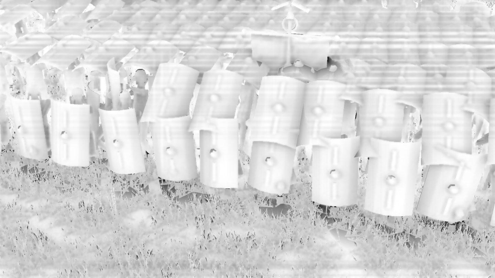 | 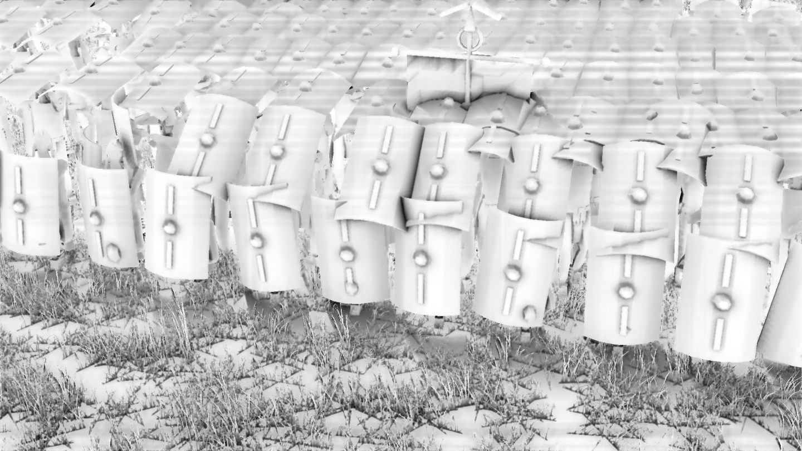 |

The left-hand plate is white from edge to edge. Measured on the buffer itself
(`--arms=sweep`, which reports its percentiles):

| contact strength | 5th pct | median | share under 0.7 |
|---|---|---|---|
| **0** — the pipeline as it stood | **0.70** | 0.85 | 5.0 % |
| 2.2 | 0.65 | 0.85 | 8.2 % |
| **5.0** — shipped | **0.44** | 0.84 | 25 % |
| 7.0 | 0.31 | 0.82 | 29 % |

The critics were right and the source reader would have been wrong.

### Why it was white, and it is two separate structural reasons

1. **Resolution.** The join A7 is scored on — boot against grass, rim against rim, wall base
   against paving — is three to eight pixels wide at the station §H grades from. The HBAO
   buffer is half resolution and its blur is seven taps at one half-res texel, so the join is
   two texels wide inside a filter six wide, and the composite's bilateral upsample softens
   it again. Worse, the blur is *depth-aware*, and two surfaces that touch are at the same
   depth by definition: the edge-stopping term cannot protect the one edge that matters.
2. **Direction.** The contact-shadow pass returns white outright for any surface with
   `N·L <= 0.05`. That is correct for a shadow — a surface already turned away from the sun
   is dark by Lambert and shading it twice puts a grey rim round every silhouette — and it is
   exactly the set of surfaces A7 is graded on: the inside of a rank, the underside of a
   rim, the shaded face of a wall.

A metre-scale gather cannot be tuned out of the first problem either. At 1.1 m the horizon a
centimetre either side of a join is nearly the same, so there is no edge in the signal to
preserve.

### What was built

**The near-field term moved into the full-resolution pass.** `mContact` now computes two
things and takes the darker: the sun march it always had, and a **12-sample cosine-weighted
disc at 0.30 m** on a golden-angle spiral, dithered by the same interleaved gradient the
march uses and cleaned by the same one-texel blur — a blur whose own comment already said why
it is one texel and not more. Samples are placed at *linear* radius fraction rather than the
square root that gives a uniform disc, because the density should be biased toward the centre
of a contact term. Summed rather than max'd, unlike the horizon search: a horizon is the
right estimator over a metre, and at a hand's breadth what is wanted is how much of the
neighbourhood is solid.

The pass is **no longer gated on the sun being up**. `uParams.w` is zeroed instead, which
tells the shader to skip the march, so the sunless case costs eight taps less rather than a
branch the compiler cannot see.

The half-resolution HBAO keeps its 1.1 m gather and is now honestly labelled the *ambient*
scale. Its four steps became log-spaced — 10 %, 26 %, 55 %, 100 % — at the same tap count, so
its nearest tap is 0.11 m instead of 0.14 m and it hands over to the contact term without a
seam.

### The floor is a colour now, and that is what let the occlusion be strong enough to see

The composite used to apply `col *= max( occ, 0.34 )`. The 0.34 was measured — 0.324 of the
lit luminance survives in the deepest 5 % of a soldier's own cast shadow at the midcrowd
camera, 0.375 at the wide one — so it was the right number in the wrong shape. A clamp puts a
hard edge into the image where it bites, and it makes every occluded pixel **neutral**: the
surface keeps its hue and simply loses energy, so a crevice goes toward black rather than
toward the colour of the light that still reaches it.

That is the same defect a critic named as *"the crushed black interior is an absent ambient
bounce in the lighting rig"*, and it is why the occlusion could not be turned up. Measured: at
contact strength 7 **against the clamp**, the shields read correctly and the grass went to a
black mat, because grass is a field of thin blades every one of which occludes its neighbours
and the term had nowhere to put the light it removed.

So the light that survives total occlusion is stated as a colour:

```
col *= uAoFill + ( 1.0 - uAoFill ) * occ;
```

`uAoFill` is the chromaticity of `LightingSystem.fill` — two thirds sky, one third the warm
ground bounce — normalised to unit luminance and scaled by `AO_FILL = 0.30`. The rig already
does the hard part: `fill.color` carries the sky's chromaticity stretched about its luminance
by `FILL_CHROMA_GAIN`, which is the term that makes this project's shadows blue-grey instead
of grey. The response is linear in `occ` with no clamp anywhere, and because it multiplies
rather than replaces, a green tunic stays green in the crevice and a red shield stays red.

Splitting it this way also means the *amount* of light that survives occlusion is one number
in `PostFX.ts` and the *colour* of it belongs to the lighting rig, so tuning either cannot
silently change the other.

---

## 2. Weight in motion

### Dust: the per-man emitter is correct and cannot reach a marching formation

`DustEmitter.emitForUnit` is per man and scales as `speed^1.5`. On a 320-man cohort at a
1.4 m/s walk, `want` is 530, the coefficient is 0.075, and the unit emits **40 puffs a
second** — about sixty mid-sized ones alive at a time over a 25 m frontage, an optical depth
near 0.2. `--arms=dust` ablates the particle layer at a frozen instant, and the difference
behind a marching line was **5 to 20 parts in 255**: visible in a diff amplified twelve
times, invisible in the frame.

Raising the per-man coefficient is the wrong lever twice. It scales with **men**, so it
saturates the optical governor on a 9,000-man approach march long before it makes one cohort
read; and it emits *under each man*, so what it thickens is the block rather than the ground
behind it.

`emitMarchWake` is the right model. A formation is a plough: what it displaces scales with
**frontage times speed**, and what it leaves is a sheet behind its rear rank.

- The rate is `frontage x speed`, in square metres of ground disturbed per second, so a
  40-man skirmisher screen and a 480-man phalanx of the same frontage raise the same dust.
- It is gated on the **anchor** moving, not on the men moving. A melee — two thousand men
  shuffling at 0.2 m/s with still anchors — raises none of it, and the contact emitter keeps
  that case exactly as it was. Measured at the melee camera after the change: **veil 0.16 %**.
- The anchor's velocity is differenced from `u.x, u.z` between frames, in the emitter, and
  the bookkeeping runs *before* the distance cull — otherwise a unit that walks out of range
  and back differences two positions a hundred frames apart and reads as travelling at
  40 m/s. `wakeSeen` covers the spawn frame for the same reason.
- The puffs are born on a line across the rear of the block, spread over the full frontage
  and a little wider, so the shape in the frame is a band the width of the unit.
- They are large, slow, low and long-lived, because optical depth is alpha times overlap and
  overlap is what a small number of wide four-to-eight-second puffs buys cheaply.

The alpha is about twice the per-man haze tier's, and that is where the effect actually came
from: the same fragments are blended either way, so alpha is the free lever and overlap is
the paid one.

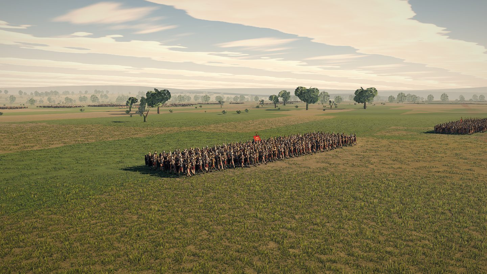

Measured at the two wake stations, in-session ablation, 1920x1080:

| station | cover (>2/255) | veil (>12/255) | mean dLum |
|---|---|---|---|
| `wake-quarter` — 52 m, quarter rear | 38.9 % | 17.9 % | 7.8/255 |
| `wake-rear` — 30 m, dead astern | 45.3 % | 27.0 % | 13.8/255 |

The owner's standing complaint about dust is *"it is like making things just plain hard to
see"*, and it is about the melee. This term is deliberately the opposite case: it fires only
behind a formation that is moving, over ground the unit has already crossed, so what it
obscures is grass. `veil` is the number that has to stay small where the fighting is, and it
is 0.16 % there.

### Lean: the simulation carries a speed term, and a speed term never tips

`BattleSystem.integrate` writes `pool.lean[i] = damp( lean, clamp( speed * 0.055, 0, 0.16 ),
6, dt )`. That is a function of **speed**, not of its derivative, and the difference is the
whole of C6's second clause. A man walking at a constant 1.4 m/s carries a constant 4.1° for
as long as he walks; a man who breaks into a run arrives at 9.2° and stays there. Nothing in
the frame ever *tips*, and the rubric's tell is "lean into acceleration" — a lean that is a
function of speed alone is precisely a lean that is absent at the moment it should be
largest.

`pool.lean` cannot be touched. It is a pool field written by the same function that writes
`x` and `z`, and twenty-one checkpoints across three battles are pinned. So the acceleration
is differenced from `pool.vx/vz` on the **render** side, into three arrays
`UnitRenderSystem` owns, and added to the drawn lean. Nothing the simulation runs reads any
of it.

The coefficient is not a taste constant: a body that accelerates at `a` must lean by
`atan( a / g )` or it falls over, so it is `1/9.81` rad per m/s², clamped at 0.30 rad. The
velocity is low-passed hard before differencing, because `pool.vx/vz` carries the crowd
solver's separation impulses — up to 0.22 m a tick — and differencing raw velocity gives a
signal whose noise is many times the signal.

`--lean` reads the ladder over one cohort's own men. Radians:

| moment | mean abs | min | max |
|---|---|---|---|
| halted and settled | 0 | 0 | 0 |
| **0.30 s after the order to advance** | **0.139** | 0.021 | **0.219** |
| steady march, 5 s later | 0 | 0 | 0.0003 |
| **0.30 s after the order to stand** | **0.118** | **−0.194** | −0.017 |
| `pool.lean` over the same men | 0.071 | 0.071 | 0.071 |

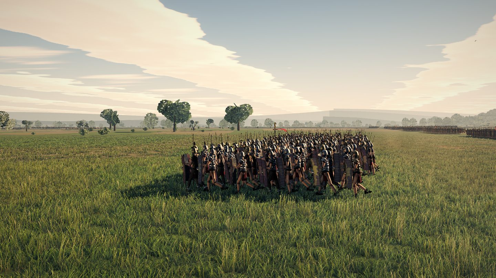

**The spread is the second half of it.** The first build had all 320 men agreeing to five
decimal places, which is criterion C2's synchronised-breathing tell wearing a different hat.
Whole units do start together, so the *event* is shared; how fast a given man's weight follows
it is not. Per-man gain and lag come off the same `variant` hash the gait does, scaled by the
roster's own `variance`, so a drilled cohort's spread is narrower than a warband's for the
same reason its breathing is.

**Not fixed:** `pushImpostor` writes lean 0 unconditionally, so any man past the impostor edge
— roughly 500 m at 1080p — is a billboard that does not lean. `pushHorse` and the elephant
tiers are hard-zeroed too, and the rider's lean is carried separately.

---

## 3. The repeated board

The placement jitter a critic asked for was already there: rotation, scale, offset, all per
man off the stored hash. The **wear** was there too, and it was a *scalar* — so two boards at
the same wear were the same picture at two exposures, which a grader counting repeats sees
straight through, and one did.

So the wear becomes a field. `vSoldierEmblem` gains a fourth component carrying a per-man
seed, and the fragment stage evaluates a two-octave value noise on the atlas coordinate —
which inside a cell **is** the panel's own UV — to decide *where* the paint has gone rather
than only how much. One board is scuffed across the top arm of the bolt, the next along its
left edge. The threshold is driven by the man's own wear, so a fresh board loses nothing and a
campaign board loses about a quarter of its device.

Four texel-free hashes and two lerps. No atlas space, which matters: the emblem grid is 8x2
and 14 of its 16 cells are used.

This is deliberately **not** a different device per man. A legion's shields did carry one, and
so do Rome II's; what varies between two boards of one cohort is the painter's hand and what
the campaign has done since. Whether a grader accepts that argument is the open question — one
already did not.

Second change, one line, and it is the sort of thing that only shows up in an inventory: the
scutum's two spina bars were `Tint.Atlas`, which means untinted, which means **every scutum in
the game carried the identical bronze** on the second-largest metal object on a board a critic
spends a whole frame looking at. `Tint.Metal` is already per man — iron, bronze, blackened or
tinned, with a polish draw — and the umbo three lines above already used it, so a scutum had a
per-man boss bolted to a universal reinforcement.

### What is still uniform at close range

An inventory, because the next pass should not have to rediscover it. Everything routed
through a tint slot already varies per man; everything left on `Tint.Atlas` is bit-identical
across the whole army.

| still identical on every man in the game | where |
|---|---|
| **the face** — one procedurally drawn tile, all factions; only its overall tone is recoloured | `atlas.ts` face generator, `soldierMesh.ts` `Piece.Head` |
| boots | `soldierMesh.ts`, `Tint.Atlas` |
| sword scabbard (the drawn blade does vary) | `soldierMesh.ts`, `Tint.Atlas` |
| spear, pilum and javelin shafts (heads vary) | `soldierMesh.ts`, `Tint.Atlas` |
| bow, quiver, sling pouch | `soldierMesh.ts`, `Tint.Atlas` |
| the umbo's *shape* (its metal varies) | `soldierMesh.ts` `bossWarp` |

The face is the largest of these by a distance and the most expensive to fix: it is baked
vector artwork sampled by tile index, so recolouring alone cannot introduce design variety
and a second generator would be needed.

---

## 4. Before and after, same stations

Every pair below was shot by `tools/probe-testudo.mjs` at a **bit-identical world eye and aim
position** — the two `cameras.json` agree to the centimetre on all nine.

| | before | after |
|---|---|---|
| eye level, 13 m out (§H) | 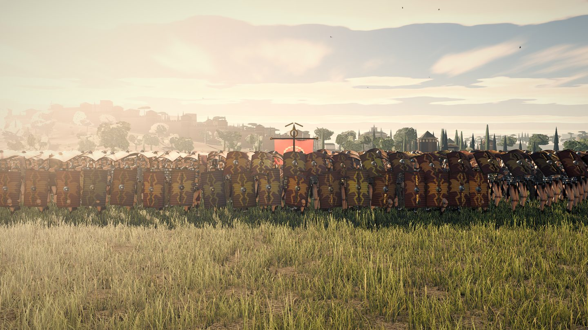 | 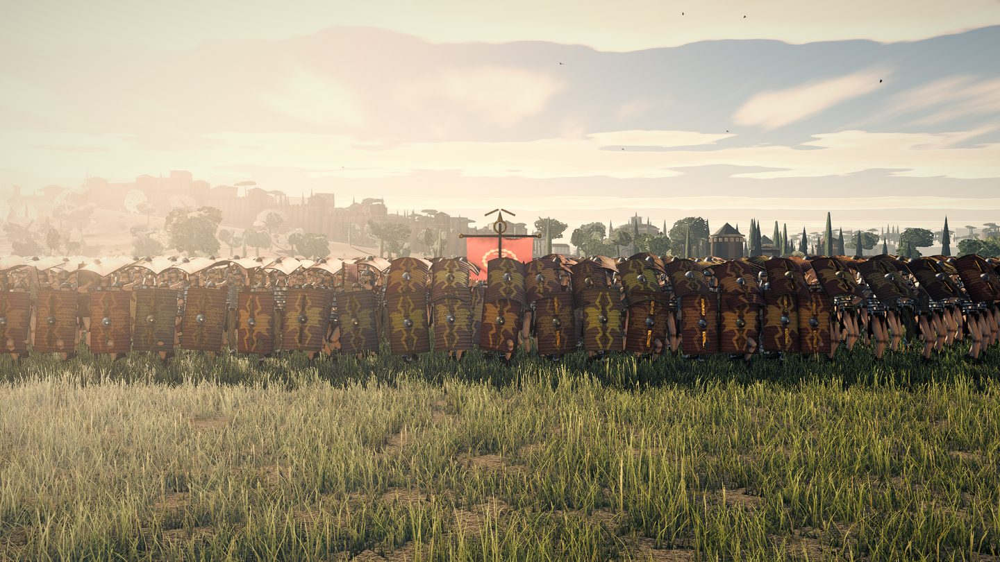 |
| one board magnified | 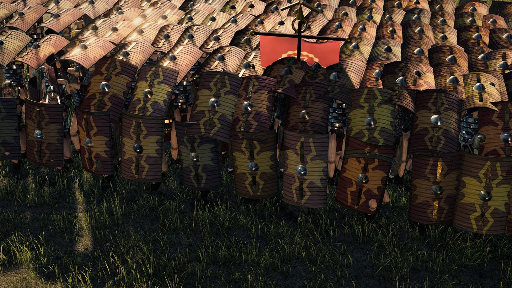 | 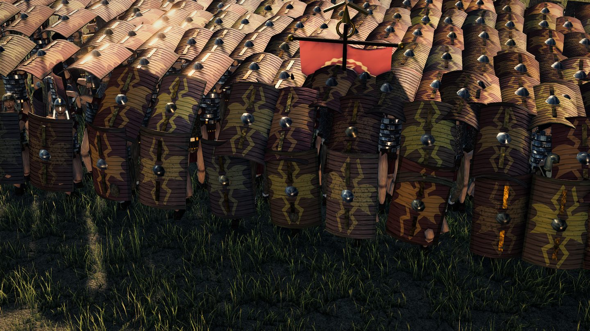 |
| the corner, 1.6 m | 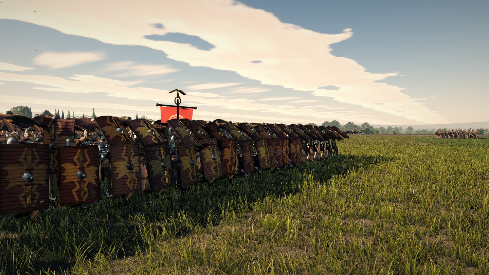 | 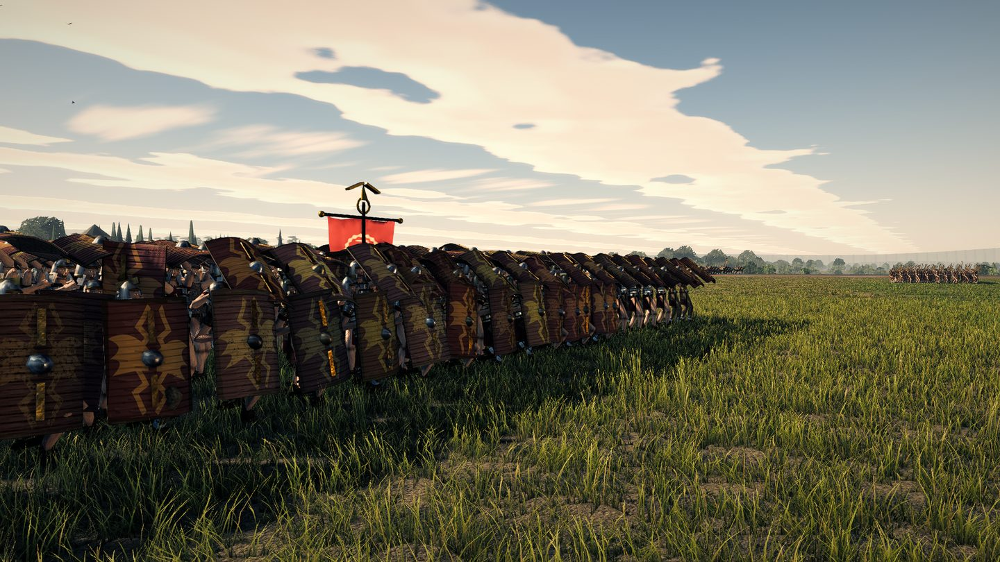 |
| broadside, eye level | 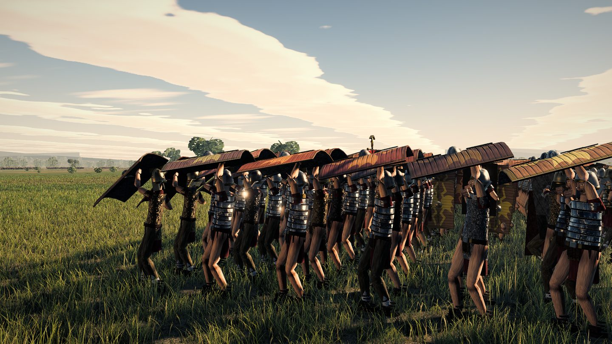 | 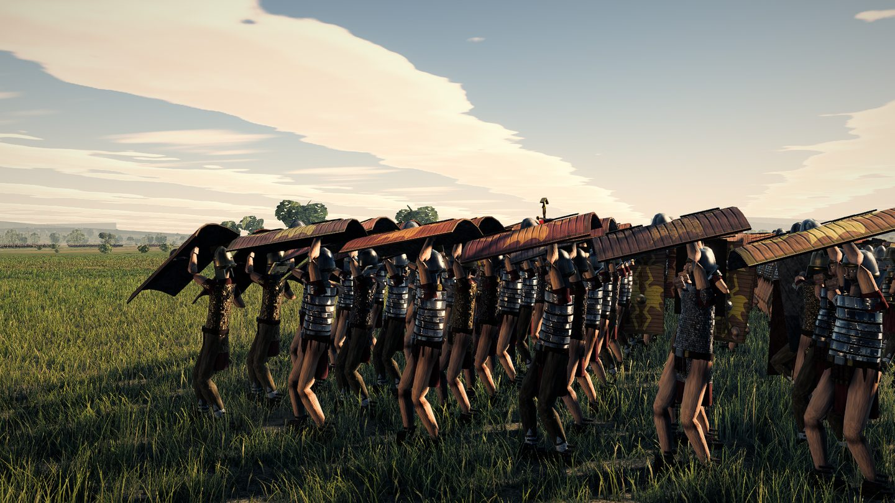 |
| 34 m up | 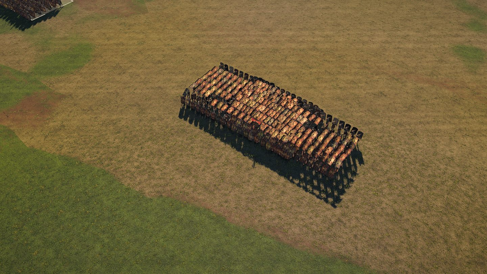 | 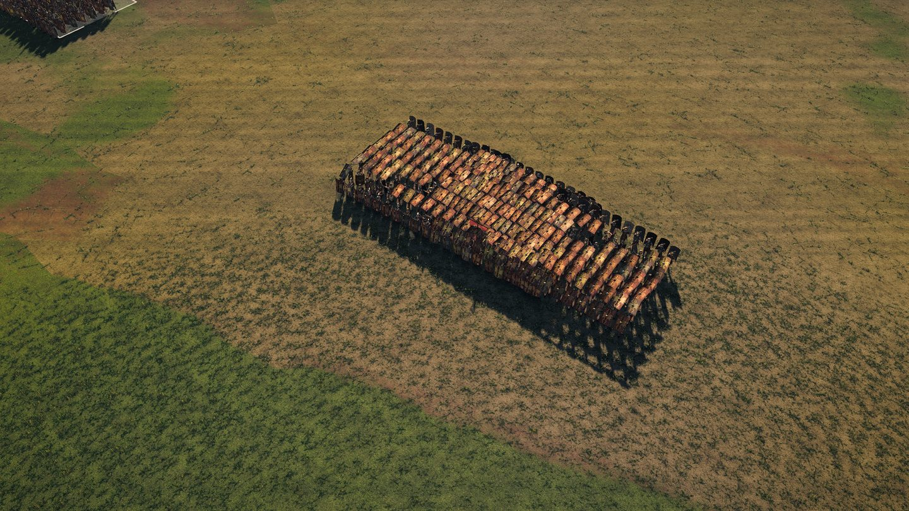 |

### And in the cities, which is the point of the whole exercise

The premise of this pass is that A7 is **project-wide**, so a fix that only worked on a
formation would be worthless. `tools/film.mjs tools/shots/judge-city-eye2.shot.mjs --stills`
shoots §H's own reference camera set at 1.75 m with a level lens, and the pairs below are the
same station, same hour, same everything, with `src/` swapped:

| | before | after |
|---|---|---|
| Rome, standing in a street | 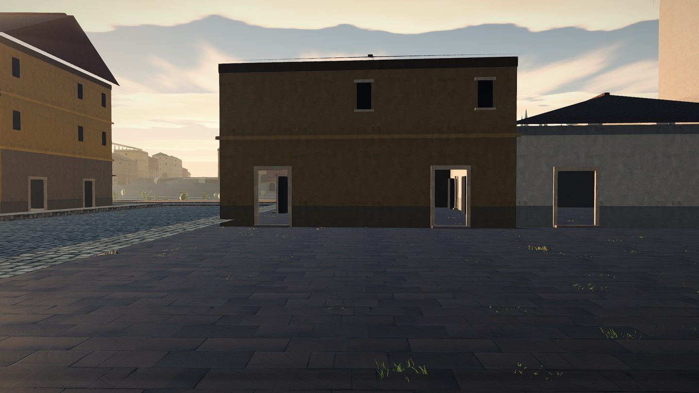 | 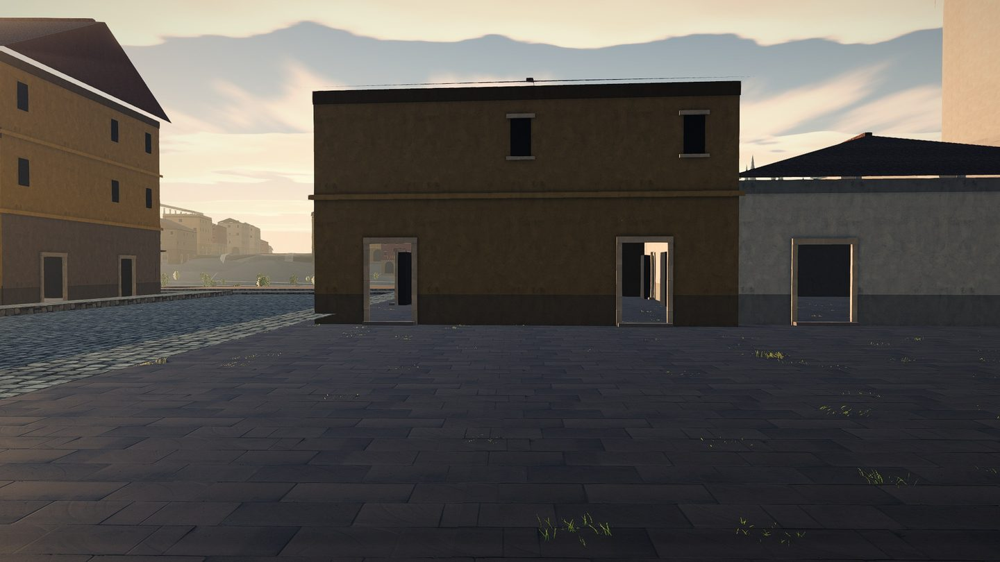 |
| Carthage, 90 m inside the gate | 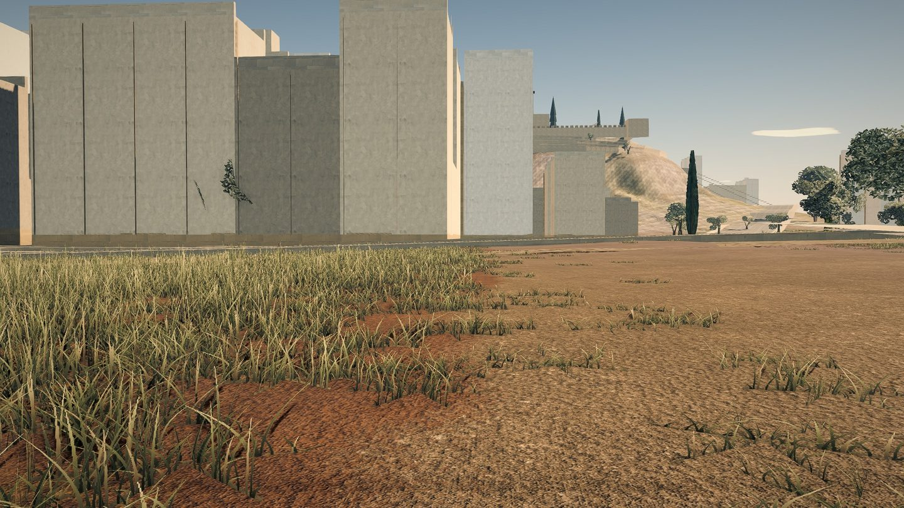 | 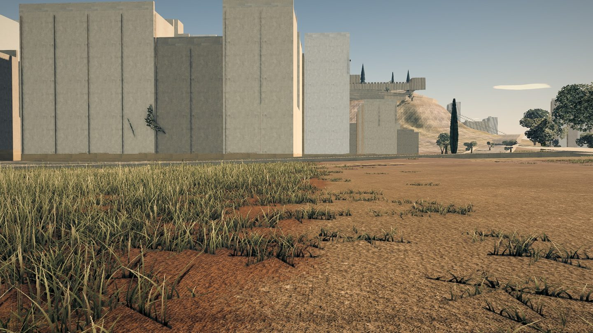 |

What to look at in the Rome pair is **the line where the frontage meets the paving**. Before,
the insula in the middle of the frame and the one on the left both stand on the pavement with
no darkening at all at the junction — the buildings are composited onto the street rather than
resting on it, which is the exact sentence A7 exists to catch. After, there is a soft dark
band along the base of every frontage in the frame, the door reveals have depth, and the
paving immediately in front of each wall is darker than the paving in the middle of the way.
Nothing else in the frame moved.

**One caveat on the testudo pairs, and it is a property of the probe rather than of this work.**
`probe-testudo` boots the page and lets the live rAF loop run until `ready`, so how many
frames of battle elapse before the fast-forward depends on the wall clock. The two runs
therefore photograph the same cohort in the same formation at the same camera, but with the
men a few centimetres apart: measured, the block is 24.95 x 8.59 m before and 25.10 x 8.59 m
after, and the median nearest-neighbour distance moves 0.570 to 0.604 m. The pairs are a
before and after; they are not pixel-registered. Everything in this file that *is* a
measurement comes from the in-session ablation instead, which is.

---

## 5. What it costs

### Draw calls and triangles — nothing moved

`renderer.info` after a real frame. The nine `probe-budget` cameras at `ultra`, `--at=30`,
measured on this tree with the change and with `src/` restored to `main`:

| camera | draws | Mtri |
|---|---|---|
| `assault` | 181 → 181 | 5.54 → 5.54 |
| `clash` | 130 → 130 | 2.77 → 2.77 |
| `melee` | 126 → 126 | 2.72 → 2.72 |
| `wide` | 120 → 120 | 3.06 → 3.06 |
| `romanline` | 130 → 130 | 3.03 → 3.03 |
| `raking` | 133 → 133 | 3.34 → 3.34 |
| `terrain` | 153 → 153 | 4.00 → 4.00 |
| `city` | 176 → 176 | 4.94 → 4.94 |
| `wall` | 157 → 157 | 4.12 → 4.12 |

The nine testudo stations are identical too, before and after, on both counts. Nothing here
adds a pass or a mesh: the near-field term is more taps inside a pass that already ran, the
lean is a different number in a lane that already existed, the paint loss is arithmetic in a
shader that already ran, and the wake spawns into a particle system that was already
submitting one instanced draw.

The whole-frame ceiling is 220 draws; the worst camera is `assault` at 181, with 39 spare.

### Milliseconds

`--time=25` with `Engine.drainAfterFrame` on, which is the only barrier that works on
ANGLE-on-Metal, interleaved in one browser session against the same machine load. The pair is
the whole occlusion group — HBAO, the full-resolution contact pass, four blurs, six draws —
against the same frame with `ssao` off.

| station | ssao on | ssao off | the group |
|---|---|---|---|
| `front-eye` | 9.3 | 8.4 | 0.9 |
| `roof-rake` | 9.7 | 9.0 | 0.7 |
| `flank-halt` | 11.0 | 10.1 | 0.9 |
| `corner` | 9.0 | 8.3 | 0.7 |
| `tactical` | 8.2 | 7.4 | 0.8 |
| `roof-close` | 8.0 | 7.1 | 0.9 |
| `rear` | 10.7 | 9.8 | 0.9 |
| `far120` | 6.8 | 6.0 | 0.8 |
| `flank-march` | 10.2 | 9.2 | 1.0 |

The same measurement before the change put the group at 0.7–0.8 ms, so **the near-field
contact term is 0.1–0.2 ms**. Twelve full-resolution taps are that cheap because they are
tightly clustered: at the shipped radius the whole disc fits inside a few dozen pixels and
every tap after the first is a cache hit. Note the absolute numbers are only comparable
*within* a session — two workstreams have measured the same camera at 21.78 ms and 9.14 ms in
consecutive runs on this machine under contention.

The wake and the lean cost CPU, not GPU: one extra pass over `battle.units` a frame for the
anchor velocity, a bounded spawn loop, and three float writes per drawn man.

---

## 6. The pins, and a finding that is not this branch's

**No pinned hash moved, and the proof is stronger than "the gate is green" — because the gate
is not green, and it was not green before this branch existed.**

All three arms of `tools/qa-determinism.mjs` were run twice from this worktree: once with the
branch, and once with the five touched files under `src/` replaced by `main`'s copies and
nothing else changed. **The two runs agree on every bit at all twenty-one checkpoints, on
`hash`, on `uf64` and on `uctl`**, and both fail against `tools/determinism-baseline.json` in
exactly the same way:

| arm | headcount | checks failing, this branch | checks failing, `main`'s sources |
|---|---|---|---|
| `default` (Campus Martius field) | 8,632 | 11 | 11 |
| `map=campus-martius&scenario=assault` | 3,072 | 14 | 14 |
| `map=carthage&scenario=assault` | 3,440 | 12 | 12 |

The drift, identical on both arms of the control:

```
default    t+  0  4c88901a  UNCHANGED
           t+ 30  aad68478 -> 0ab3d928   uf64/uctl UNCHANGED
           t+ 90  e7583ac8 -> d8edb985   alive 8252 -> 8195
           t+150  9e0a5eff -> 8c47a0c8   alive 7160 -> 7438
           t+200  672df53c -> 9c2d74f8   alive 6304 -> 6981
           t+250  50a38688 -> 8ecb3dbc   alive 5648 -> 6562
           t+400  5f594cf4 -> ce190944   alive 4973 -> 5864

rome       t+  0  d9f2d78e -> e4f847a8   uctl UNCHANGED (7c45e360), uf64 drifted
           t+400  9953397c -> ffa366a0   alive 2272 -> 2250

carthage   t+  0  aadd5ef2  UNCHANGED
           t+400  80fce118 -> 659863d0   alive 2330 -> 2265
```

**It has not been re-recorded, and it must not be re-recorded by whoever reads this next
without first finding out which commit moved it.** Re-recording is how a real regression
becomes the new truth. The shape of the drift is informative and someone should follow it:
`default` is unchanged at t+0 on all three marks and first moves at t+30 on the pool hash
alone with both unit hashes still clean, which is the signature of a change that perturbs
continuous per-soldier state without reaching a discrete decision; Rome's assault moves at
t+0 on `uf64` with `uctl` clean, which is the same signature at boot. Carthage is clean at
t+0 outright.

The useful thing this branch can say about it is the negative one, and it is measured rather
than argued: **whatever moved it, it was not presentation.** Five files were swapped and
twenty-one checkpoints did not move by a bit.

### Ruling out the obvious worry

The wake reads `pool.vx/vz/x/z/state` and writes only to the particle system and the ground
damage buffer. The lean reads `pool.vx/vz` and writes only to three `Float32Array`s
`UnitRenderSystem` owns. Neither is read by anything the simulation runs. `npm run lint`'s
`check-determinism` arm — which bans wall-clock and global-random calls in `src/sim`,
`src/ai` and `src/units` — passes 3/3, and `src/units/UnitRenderSystem.ts` is inside its
scope.

---

## 7. The gate

| check | result |
|---|---|
| `tsc --noEmit` | clean |
| `npm run lint` | 3/3 PASS |
| `node tools/qa-deploy.mjs` | 33/33 |
| `node tools/probe-seams.mjs` | PASS, both maps, 23 seams each, 0 faults |
| `node tools/qa-determinism.mjs`, three arms | red against the baseline; **bit-identical to the same tree with `main`'s sources**, see §6 |

### The GL feedback loop, diagnosed and not fixed

`tools/probe-adaptive.mjs` reports `GL_INVALID_OPERATION: glDrawElements: Feedback loop formed
between Framebuffer and active Texture` on both city maps. It is pre-existing — measured on
this tree with `main`'s sources: **rome 10 errors, carthage 10, pydna 0, FAIL (2)**; with this
branch: **rome 9, carthage 10, pydna 0, FAIL (2)**. The count wobbles because it is a per-frame
warning stream; the maps and the verdict are identical.

The cause is now known, and Pydna is the clue. `PostFXSystem.depthTexture` is the depth
attachment of `sceneRT`, and `src/terrain/WaterSurface.ts` binds it as `uSceneDepth`
(`refreshSeams`, and `USE_SCENE_DEPTH`) on a mesh that is drawn **into** `sceneRT`. A texture
bound for sampling that is also an attachment of the bound framebuffer is a feedback loop by
definition. Rome has the Tiber and Carthage has the harbour; Pydna has neither, and Pydna is
the only map with zero errors. `src/vfx/VFXSystem.ts`'s soft-particle depth fade reads the
same texture and has the same exposure.

Neither of the two fixes is small. A resolved copy of the depth costs a full-resolution blit
and a decode change at both consumers; ping-ponging two scene targets so the water samples the
previous frame's depth costs another full-resolution HDR target with a depth attachment
(~25 MB at 1080p) and a frame of latency in the soft fade — which is probably acceptable and
is the one I would try first. Neither belongs in a pass about occlusion, so this is a
diagnosis and a handover, not a fix.

---

## 8. What is still wrong

- **The grass takes the contact term hardest, and the obvious guard does not work.** A field
  of thin blades occludes itself everywhere, so the near-field disc finds solid matter at the
  base of every blade. It is physically right and it is the single artefact I would look at
  next: at strength 7 with the old clamp it was a black mat, and the coloured fill is what
  makes 5.0 survivable rather than what makes it correct.

  A **coherence** guard was built and measured and then taken out. The idea is that a genuine
  junction has its occluders all on one side of the tangent plane, so the signed sum of the
  elevations and the sum of their magnitudes agree, while a thicket has them on both sides at
  pixel scale and the ratio collapses — two extra adds, no extra taps. On the buffer at
  `roof-close`, 5th percentile:

  | | with the guard | without |
  |---|---|---|
  | every sample votes | 0.663 | **0.439** |
  | only samples clearing the tangent bias vote | 0.655 | **0.439** |

  It attenuates the corners as hard as the grass, and gating the vote on the bias — which
  should have removed exactly the near-tangent samples that cancel each other — moved it by
  0.008. The reason is that the normal is reconstructed from depth, so on any real surface a
  good fraction of the disc reads as slightly *behind* the plane and votes against; the sign
  distribution at a junction is not clean enough to measure without a real normal buffer,
  which is the geometry pass this whole chain exists to avoid. A knob that halves the effect
  is worse than a known limitation, so it is a comment in `nearContact` and not a uniform.
- **Half-resolution AO still cannot produce a join** and now does not have to. But that also
  means the ambient term and the contact term have different resolutions and therefore
  different silhouettes, and at very long range — past `far120` — the contact term's disc is
  a couple of pixels wide and it fades out rather than resolving. It is the right failure
  direction and it is a limit.
- **`atan(a/g)` is the lean of a rigid body, and a man is not one.** A real runner leads with
  the hips and the torso lags; this bends the whole figure about `SOLDIER_LEAN_H`. It reads
  correctly at the start of a march and it would not survive a slow-motion close-up.
- **No lateral bank.** A man turning at speed should bank into the turn, and the instance
  layout has no free lane for a second lean axis — every float in all nine attributes is
  assigned. The forward axis was the affordable one.
- **No lean on the impostor tier**, so the bulk of a 9,000-man field at strategic zoom does
  not lean. `pushImpostor` zeroes the lane.
- **One device on every board still, by choice.** The wear is now per man and no two boards
  are the same image, but a grader who wants different iconography will still mark C1 down.
  There are exactly two free cells in the emblem atlas and a third row costs 2048x256x4 bytes
  three times over.
- **One face on every soldier in the game.** The largest remaining C1 item and untouched here.
- **The wake does not deform the ground.** `DustEmitter.trample` already stamps the damage
  buffer for moving units, and a marching formation should leave a visibly churned band
  behind it as well as an airborne one. Not attempted.
- **No ground deformation, dust or lean under an *elephant*,** which is the heaviest thing on
  the field and the one where weight should be most obvious. `pushElephant` zeroes the lean
  lane deliberately — "no lean on an animal that weighs four tonnes" — which is right for
  bank and wrong for a four-tonne animal breaking into a charge.
