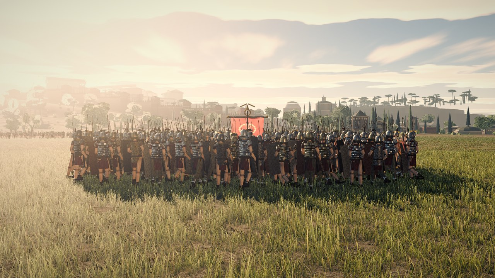
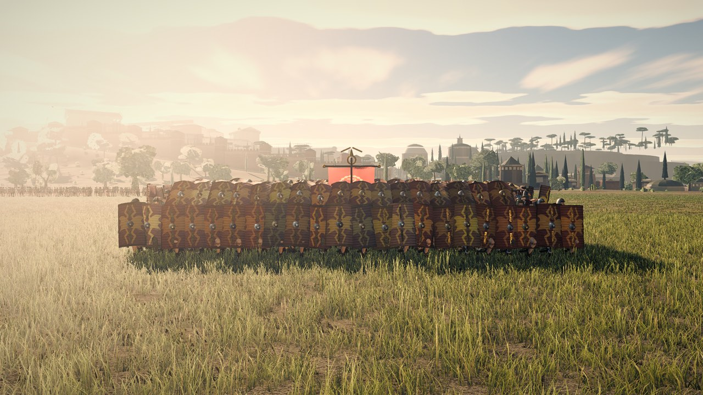
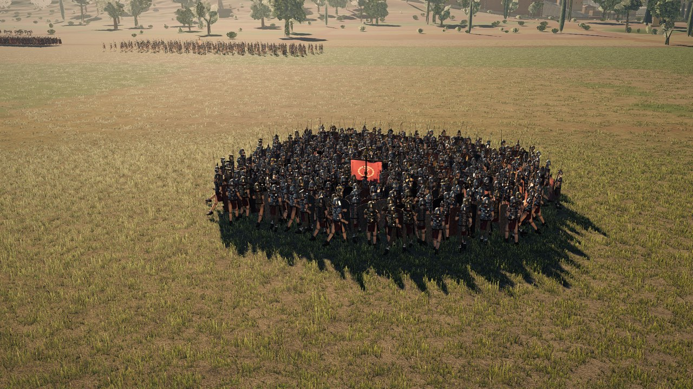
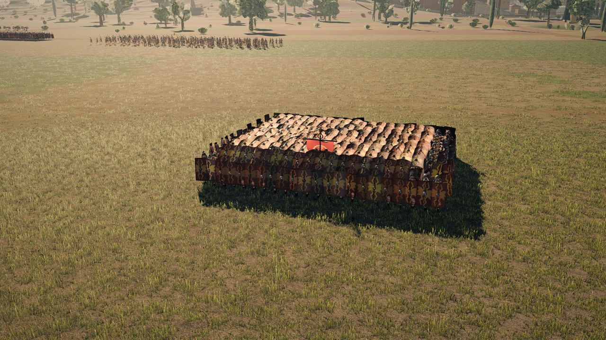
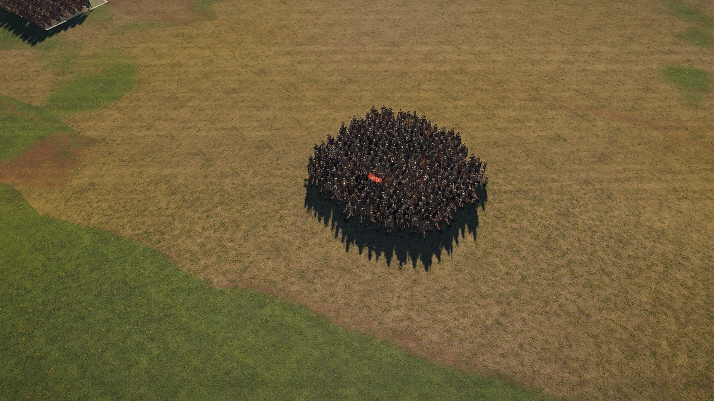
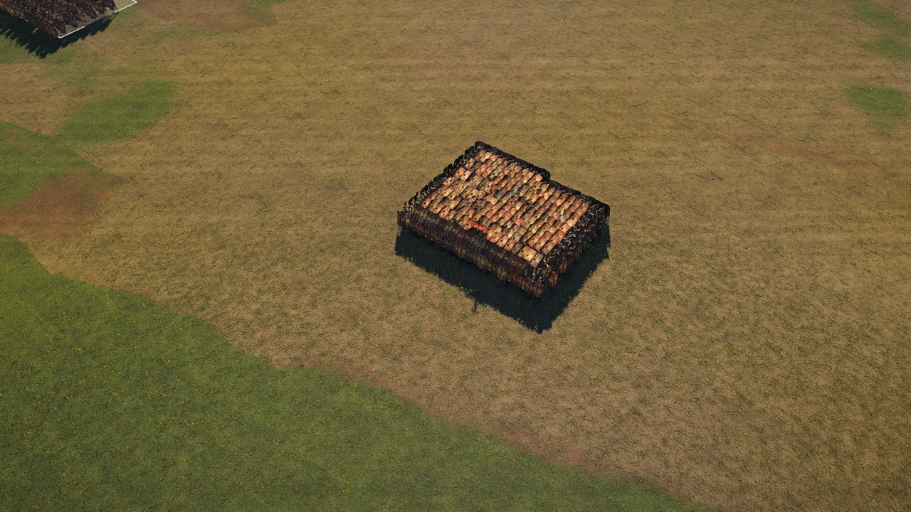
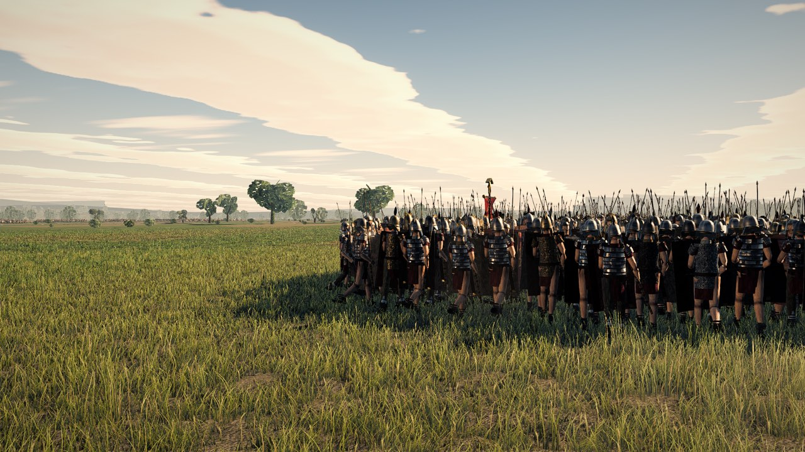
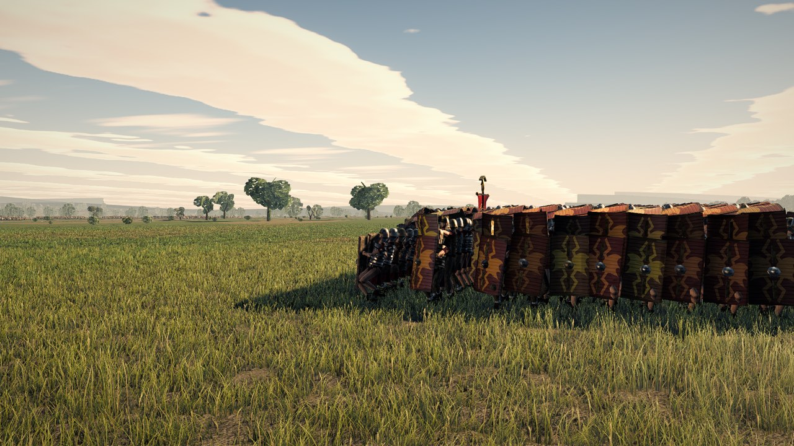
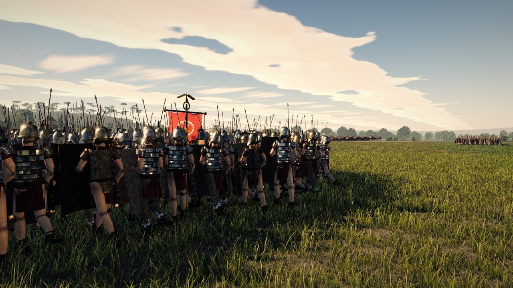
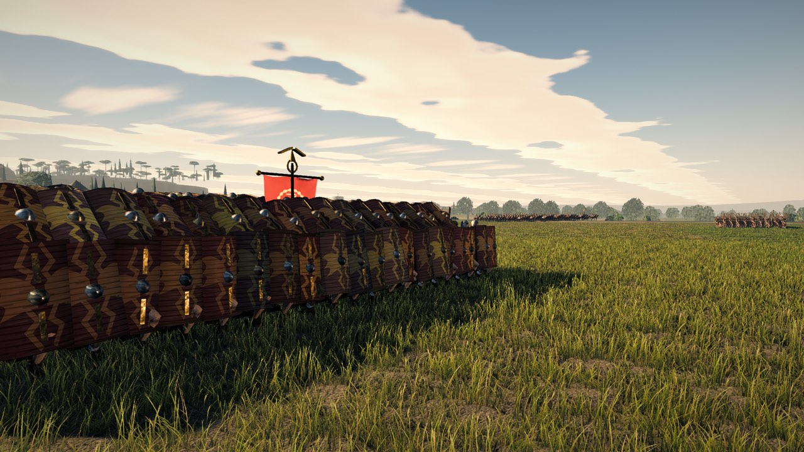

# The testudo

A testudo is the only formation in this game whose quality is a **surface**. Every other one
can be graded from a tactical camera — is it dense, are the ranks legible, is the frontage
right — and this one cannot, because the four ways it fails are gaps between shields,
inconsistent angles, a roof that undulates with each man's stature, and men standing upright
inside a formation whose whole point is that they are not. All four are invisible from 60 m up
and unmissable from 12 m out at eye level.

This file is what was measured, what was changed, and where to stand to check it.

---

## 1. What it was

`FORMATIONS.testudo` carried `idlePose: 'brace'` and nothing else, so every man in a testudo
played `idleBrace` — *"knees bent with the weight low over the front foot, shield rim at eye
level"*. That is a good pose for receiving a charge. Two hundred of them is two hundred men
holding shields in front of themselves, with the sky between them, a shouldered pilum on every
right shoulder and no roof anywhere.

Underneath the pose there was a second and larger fault, and it is the one that made the pose
unfixable. Measured on the shipped field battle with one 320-man legionary cohort ordered into
testudo and left to settle for 30 simulated seconds (`tools/probe-testudo.mjs`):

| | before | asked for |
|---|---|---|
| block | **14.39 m × 13.47 m** | 10.80 m × 8.85 m |
| ground per man | **0.606 m²** | 0.284 m² |
| median man's distance from his own slot | **2.00 m** | — |
| worst | **11.80 m** | — |

`BattleSystem.resolveCrowding` separates every man to a fixed 0.84 m centre to centre.
`testudo` asks for 0.516 m between files and `shieldwall` for 0.636 m, and **neither multiplier
had ever done anything at all**: the solver moves a man up to 0.22 m a tick and the steering
term that pulls him back to his slot manages millimetres, so both formations expanded until
every man stood 0.84 m from his neighbour — exactly the ground a `line` of the same strength
stands on. A 0.66 m scutum cannot close a rank whose men are 0.84 m apart, however it is held,
so no amount of work on the poses could have produced a roof.

---

## 2. The five boards

The shell is five poses, chosen by **where a man is standing in it** rather than by what the
simulation has him doing. That distinction is why they live in their own table
(`TESTUDO_CLIP_MAP` in `src/anim/clips.ts`) instead of in `Clip`: which board a man holds is a
rendering fact derived from `pool.slot` and the unit's live width, and routing it through the
simulation would mean five new states the simulation has no use for and that `stateHash.ts`
would then have to have an opinion about.

| role | rank / file | the board covers | what it closes |
|---|---|---|---|
| `Face` | rank 0; **and** the outer file and rearmost man of every file, turned outward | 0.30–1.35 m, upright, rim in the grass | the lower course of all four walls |
| `Flank` | the **second** file in, and the man one rank forward of the rearmost, turned outward | 0.74–1.79 m, upright, rim on the roof line | the upper course of the flanks and the back |
| `Nose` | rank 1 | 1.16–1.81 m, 52° back-slope reaching 0.85 m forward | the upper course of the front — the band at head height |
| `RoofA` | interior, even ranks | 1.66–1.81 m, 8° nose-down | the roof, course one |
| `RoofB` | interior, odd ranks | 1.63–1.85 m, 12° nose-down | the roof, course two |

At the 0.632 m rank interval the formation asks for, each roof board laps the one in front by
**0.43 m** — which is what leaves no hole when a man is 0.1 m out of his place. The face's top
at 1.35 m stands above the nose's bottom at 1.19 m, so no horizontal ray at any height between
the grass and the roof reaches a man.

`Nose` is the piece that is easy to leave out and impossible to unsee once it is missing. A
testudo with a vertical front rank and a level roof has an open band across its face at head
height, and that band is exactly what makes the formation read as a crowd wearing hats.

### Two tile courses, and why neither of them is level

`RoofA` and `RoofB` alternate by rank and differ by 4° and 10 mm. One roof clip gives a single
printed plane; two courses give a surface with a grain.

**Both were level in the first build and that was the second-worst thing in it.** A critic
scored the roof two to three stops brighter than the *same asset* on the wall and called it "a
flat pink quilt with no occlusion at any overlap" — and both halves of that are the same cause.
A horizontal board sees the whole sky hemisphere and takes about twice the ambient a vertical
one does; and two coplanar boards cannot shade each other however good the ambient occlusion
term is. Tipping the courses 8° and 12° nose-down costs 2% of the fore-and-aft coverage, takes
the normal off the zenith, and puts a real 0.15 m step at every lap, so the roof shades itself
with *shadow*. It is also the right way round — the leading edge is the low one, so each board
sheds over the one behind it, which is how tiles are laid and why the surface reads as laid
rather than printed.

### Two courses on every wall

**A man holds one 1.06 m board and stands 1.75 m, so a single course cannot reach from the
grass to above his helmet.** Three passes were spent proving it. The flanks began at
0.74–1.79 m so the rim stood on the roof line and no horizontal ray got in; that left 0.74 m
of bare leg along both flanks and the whole back, and a critic named it in five of nine
frames as the highest-leverage fault in the build. Dropped to 0.42–1.47 m, the other end
opened and the next critic counted twenty-six exposed helmets, faces and raised forearms in
one band across the back. Split at 0.55–1.60 m it hides the head from a *level* ray — but an
eye at 1.75 m is above any rim below 1.75 m, so at the height the rubric grades from it did
not help.

Both critics converged independently on the answer the front of the formation had used all
along: **two courses.** The outer file plants `Face` low, rim in the grass; the file behind
it stands `Flank` on the roof line. Between them the wall is closed from the turf to 1.79 m,
which is exactly what `Face` and `Nose` do at the front — and the front was the frame both
critics called the strongest while calling the flanks the weakest. It costs two files of
roof on each side, 40 men of 320.

### The corners

A man who is both the end of a rank and the end of a flank has to face the diagonal, or the
join between the two walls is a hole with a man standing in it — a critic counted four or five
fully exposed men at each front corner. The flank men in the first four ranks turn 50° instead
of a right angle and the two rear corner men turn 144° instead of 180°.

---

## 3. The arm angles were solved, not authored

`tools/scratch/testudo-solve.mjs` inverts the socket chain in closed form. All of it is already
in `src/`:

- the scutum is skinned rigidly to `lowerArmL` through `socket('march', 0, …)` in
  `soldierMesh.ts`, so its world transform is `worldPose(lowerArmL) · L`, where
  `L = poseM(march@0, lowerArmL)⁻¹ · desired(march@0)` and nothing else;
- an `absTr` track sets that bone's world orientation outright to `delta ⊗ restQ` (`pose.ts`,
  the `tr.abs` branch), so the board's attitude is **exactly** solvable:
  `delta = Qboard · R12⁻¹ · Qmarch · restQ⁻¹`;
- the board's *position* is `pos(lowerArmL) + Qforearm · (Qmarch⁻¹ · offset)`, and
  `pos(lowerArmL) = pos(upperArmL) + Qupper · localT(lowerArmL)` — a point on a sphere of the
  upper arm's own length about a shoulder the arm tracks cannot move. Two useful degrees of
  freedom against a three-degree target: pick the direction, accept the radius, iterate the
  aim to a fixed point.

Hand-keying five poses to a tenth of a degree is not a thing an eye can do, and the eye is very
good indeed at seeing a roof that is *nearly* level.

### The reach is what shaped the design

The socket sits 0.285 m from the elbow and the upper arm is 0.30 m, so the board's centre can
only ever be within **0.585 m of the shoulder**. Crouch a man to a 1.24 m shoulder and his
board will not go above 1.70 m — below the crown of a standing man's own helmet; the roof would
have to be built through the heads holding it up. So **the interior of this testudo is hunched
and not crouched**: knees soft, back rounded, head pulled in, shoulder at 1.32 m, roof at
1.74 m with 0.11 m of clearance over the helmet.

The same arithmetic runs the other way for the front rank. At a 1.20 m shoulder the face board
bottoms out at 0.42 m and the frame is a rank of shields standing on a rank of bare legs. The
front rank's stance was deepened until the shoulder reached 1.10 m, which puts the rim at
0.30 m and the man's own head at 1.33 m — 20 mm under the top of his own board.

### The marching halves

Five more clips are built on `march`. The legs keep the base clip's stride and take a constant
flexion on top, with the root dropped to match so the feet stay on the ground: the lowest
either foot reaches is 0.069 m against the base march clip's 0.075 m. The arm tracks are
**shared** with the halted poses, so the stances were tuned until the shoulder landed within
19 mm (hunch) and 60 mm (deep) of the halted one — a shoulder that moved would step the whole
roof the instant a cohort came to a stop.

The shoulder's own bob over the march cycle is 33 mm, so the roof breathes by that much while
the cohort advances, per man, at each man's own phase. That is deliberate and it is what stops
a moving roof looking like a moving plate.

---

## 4. The one gameplay change

`FormationDef.packRadius` gives `shieldwall` and `testudo` their own body radius in
`resolveCrowding`: 0.31 m and 0.25 m against the default 0.42 m, each a little under half the
formation's own file spacing so a man is never pushed out of the slot it gives him.

**This is a balance change and it is stated as one.** A testudo that can actually close up
presents about half the frontage it used to, so it takes fewer missiles for the same shield
modifier, fits through gaps it could not fit through, and stands on a third of the ground.

The broadphase still queries at the widest body on the field; only the *test* is the sum of the
two men's own radii. Two defaults sum to `radius + radius`, which is bit-identical to the
`radius * 2` it replaces because doubling is exact in binary floating point, so a field with no
shieldwall and no testudo on it does not move by a ULP.

Measured, same cohort, same 30 s:

| | before | after | asked for |
|---|---|---|---|
| block | 14.39 × 13.47 m | **11.06 × 8.91 m** | 10.80 × 8.85 m |
| ground per man | 0.606 m² | **0.308 m²** | 0.284 m² |
| median off-slot | 2.00 m | **0.052 m** | — |
| p90 off-slot | 8.76 m | **1.18 m** | — |
| median nearest neighbour | 0.707 m | **0.500 m** | — |

---

## 5. Everything else is presentation

None of the following writes anything `stateHash.poolHash` covers — `x`, `z`, `state`, `hp` —
so it cannot move a pinned hash, and that is the proof it is presentation.

- **Dressed to the unit's front.** A man's drawn facing carries whatever the integrator last
  left him turned to; two hundred boards can only be one surface if they are parallel.
- **The ragged slot stand-off is replaced by a bounded pull *onto* the slot.** `SLOT_LATERAL`
  and friends add up to 0.11 m of lateral and 0.43 m of longitudinal scatter to every drawn
  man, because a rank on a perfect grid reads as a spreadsheet. A testudo is the one formation
  where that is exactly wrong. `TESTUDO_DRESS` is 0.30 m in the other direction, which is a
  smaller intervention than the one it replaces.
- **No lean.** A lean is acceleration made visible and it tips the board with the man.
- **Stature is pulled 78% toward the unit's nominal height** while the roof is up. `pool.scale`
  and `heightMul` spread a man ±7%, which is right and which criterion C1 demands — but the
  board is at arm's length above the head, so ±7% of stature is ±0.14 m of *roof height*, and
  0.28 m of peak-to-peak ripple across a surface that is meant to read as one plane is the
  first thing an eye finds. The residual is about ±0.03 m: enough that the boards are not
  machined to a jig, little enough that the plane reads.
- **The pilum is stowed and the scabbard worn** (`TESTUDO_STOW_HI`). A shouldered pilum on a
  man whose shield is over his head stands 2 m straight through the roof, and two hundred of
  them turn an armoured shell back into a crowd in about a second of looking.
- **No man in a testudo reaches the impostor tier.** The billboard atlas is a standing man with
  his shield across his body, so a cohort crossing that edge would stop being a tortoise at one
  distance. Held at LOD2, which is 313 triangles a man.

---

## 6. Where to stand

`node tools/probe-testudo.mjs --label=<name>` puts the largest Roman cohort that has a testudo
in its book into one, lets it dress, and shoots the cameras below. It writes `cameras.json`
beside the frames with every resolved eye and aim position in world metres, because a
ground-level finding is only checkable if the reader can stand in the same place.

Cameras are named in the **unit's own frame**: `ahead` is metres out along the way it faces from
the centre of its front rank, `right` is metres to its own right. `eye` and `aim` are metres
above the terrain under the aim point, `fov` is the vertical field of view.

| camera | ahead | right | eye | aim | fov | for |
|---|---|---|---|---|---|---|
| `front-eye` | 13 | 0 | 1.75 | 1.55 | 42° | the rubric's §H camera: a man's eye height, a level lens, at the distance the man who has to attack it stands |
| `roof-rake` | 20 | 6 | 8.0 | 1.7 | 38° | ~17° of depression, the shallowest angle at which the roof reads as a plane |
| `flank-march` | −4.5 | 17 | 1.75 | 1.55 | 40° | a true broadside while it advances |
| `flank-halt` | −4.5 | 17 | 1.75 | 1.55 | 40° | the same, halted |
| `corner` | 6 | −6 | 1.6 | 1.45 | 50° | where the face, the flank and the roof meet |
| `roof-close` | 7 | 1.5 | 4.6 | 1.74 | 30° | close enough to read one board: painted face or hide back, umbo on top, do the courses lap |
| `rear` | −22 | 4 | 6.5 | 1.6 | 40° | the back of the shell |
| `tactical` | 26 | 18 | 34 | 1.5 | 40° | a player's own camera, so the ground shots cannot be bought with something that only works at eye level |
| `far120` | 90 | 55 | 42 | 1.5 | 24° | 120 m out, past the impostor edge — does it still read as a tortoise |

The frames themselves are under `screenshots/testudo/<label>/`, which is `.gitignore`d; the
whole directory sits under `screenshots/.metadata_never_index`. The plates below are the same
frames re-encoded by `tools/scratch/testudo-plates.mjs`, because `docs/images/` is where a
frame that has to survive in the repository goes.

**`flank-march` is shot last, and that is not cosmetic.** A camera with `march: true` orders the
cohort forward and lets it walk for 2.2 s before the shutter, and a simulation cannot be
rewound: every camera after it photographs a block that has moved. The first pass had
`tactical` before the marching shot in one arm and after it in the other, so the two frames
differed by 1.79 m of world position and the pair was not a comparison at all.

---

## 6.1 Before and after, same stations

Every one of these nine pairs was shot at a **bit-identical world eye and aim position** — the
`cameras.json` in the two directories agree to the centimetre on all nine, which is the only
reason the pairs mean anything.

| | before | after |
|---|---|---|
| eye level, 13 m out |  |  |
| 8 m up, 17° |  |  |
| 34 m up |  |  |
| broadside, eye level |  |  |
| the corner, 1.6 m |  |  |

After only: [`roof-close`](../images/testudo/after-roof-close.jpg) — one board magnified, which
is where the umbo on the *front* face of every roof tile settles the question of which way up
the boards are; [`rear`](../images/testudo/after-rear.jpg);
[`far120`](../images/testudo/after-far120.jpg);
[`flank-march`](../images/testudo/after-flank-march.jpg).

## 6.2 What it costs

`renderer.info` after a real frame, same nine cameras, same tree except for this work.

| camera | draws before | draws after | Mtri before | Mtri after |
|---|---|---|---|---|
| `front-eye` | 148 | 148 | 9.56 | 9.56 |
| `roof-rake` | 151 | 151 | 9.96 | 9.96 |
| `flank-halt` | 112 | 112 | 14.04 | 14.03 |
| `corner` | 140 | 140 | 10.69 | 10.69 |
| `tactical` | 130 | 130 | 8.96 | 9.02 |
| `roof-close` | 137 | **136** | 8.92 | **7.25** |
| `rear` | 99 | 99 | 10.38 | 10.38 |
| `far120` | 142 | 142 | 6.42 | 6.42 |
| `flank-march` | 112 | 112 | 14.04 | 14.04 |

Draw calls are unchanged at eight of nine and one lower at the ninth. No geometry was added:
the ten new clips are rows in the animation texture (about 250 rows of 48 half-float RGBA
texels, ~77 KB) and the poses are chosen from an existing instanced draw. The one real
movement is `roof-close` at **−18.7% triangles**, and it is in the helpful direction — a block
that stands on a third of the ground occludes and frustum-culls more of itself.

The per-frame CPU is `resolveTestudo`: one pass over the units, one pass over the members of
the units actually in testudo, and one pass over the pool to advance the form-up ramp. The last
of those is skipped entirely — including the fill — on any frame where no cohort is in one and
none was on the previous frame.

---

## 6.3 Forming up

`--settle=0.5` and `--settle=1.5` photograph the order being obeyed rather than the formation
being held, which is the case a still frame is worst at catching and the one a glitch would
live in. Half a second after the order the boards are already up and the roof already reads,
on a block that is still 33.5 m wide because it has not closed yet; at 1.5 s the front rank is
locked and the roof is going up behind it. The blend is `TESTUDO_FORM` = 0.55 s and it carries
the flank men's ninety-degree turn, the dressing, the stature evening and the lean, so nothing
in the change is instantaneous except the kit swap — which happens at the halfway point, when
the arms are already most of the way to the roof and it is least visible.

---

## 7. What is still wrong

- **The rear seen from above.** The roof's rearmost board belongs to the third rank from the
  back, so the two rear wall courses have no roof over them — as a real testudo's rear rank
  does not. From an elevated camera behind the formation you therefore look into that pocket
  and see a course of helmets between the wall and the roof. From eye level, which is the
  height §H grades at, you do not.
- **Nothing here fixes the shield *surface*.** Two critics independently marked the board
  down for having no rim, no edge thickness, a plank-corrugated face where painted plywood
  belongs, and a device that is pixel-identical on all 320 boards with no wear or placement
  jitter. All four are properties of `shieldPanel` and the atlas and they affect every shield
  in the game; a testudo is simply the frame that puts 320 of them in front of you at once.
- **No geometry anti-aliasing**, measured by a critic at one clean pixel step on every shield
  edge against sky, and an exposure that clips 13% of the eye-level frame above 90% luminance
  against Rome II's 0.24%. Both are whole-frame, not testudo.
- **The rank-0 man of an outer file takes `Face`**, so the front rank runs unbroken across the
  full width and the chamfer starts at rank 1. From directly in front the outermost boards are
  still seen at 50°, which is darker than the rest of the face.
- **A testudo advances at 0.36 × walk**, so the flank and rear men, who are turned outward,
  side-step and walk backwards. At about 0.5 m/s the foot slide is small, but it is there.
- **One device on 320 shields.** Deliberate — a Roman cohort carried an issued board and the
  per-man variation is in the field colour and the hide backing — but a critic scored C1 = 1
  on it, and 320 of them in one frame is the hardest test that decision will ever get.
- **No dust.** A moving testudo trails none, and criterion E1 is Rome II's most recognisable
  effect.
